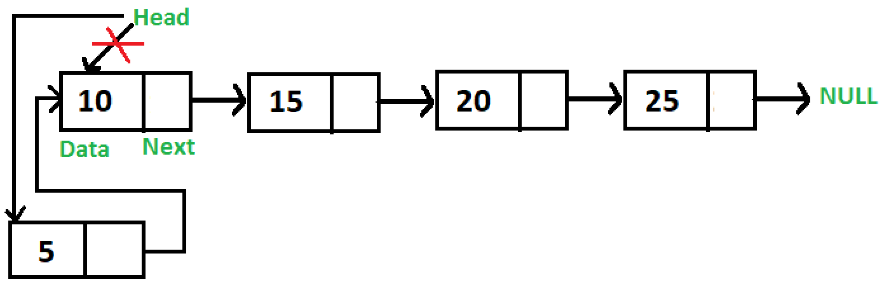
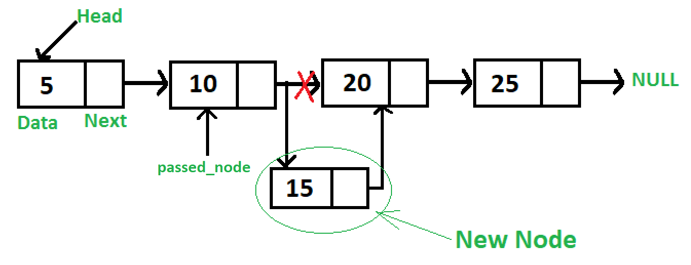
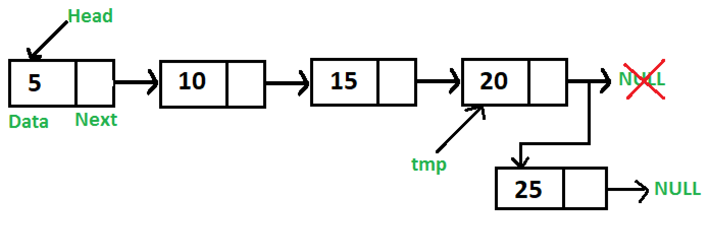
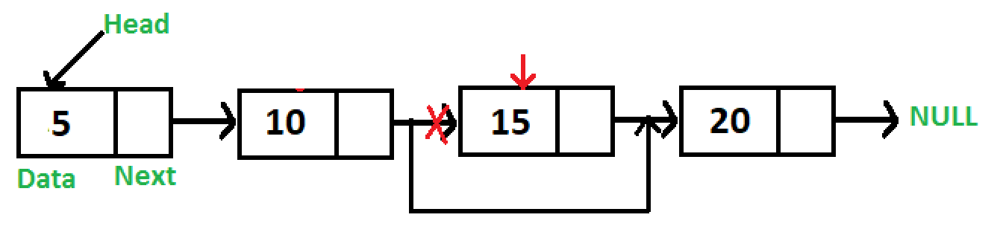

# Linked List

## Contents

 - **Singly Linked List:**
   - ["Node" class representation for a Singly Linked List](#node-class-for-sll)
   - ["SinglyLinkedList" class representation](#ll-class-for-sll)
   - **Inserting Nodes manually (without functions):**
     - [Creating and Linking Nodes manually using only "Node" class (Using pointers)](#calnmuonc)
     - [Creating Nodes using "SinglyLinkedList" class (Using "head.next" reference/pointer)](#cnulcuhnrp)
   - **Inserting Nodes (Using functions):**
       - [Add a new Node at the front (push)](#inserting-push-sll)
       - [Add a new Node after a given Node "n" (insertAfterNodeN)](#inserting-insertafternoden-sll)
       - [Add a new Node at the end (append)](#inserting-append-sll)
   - **Deleting a Node in a Singly Linked List:**
       - [Delete a Singly Linked List node at a given position](#delete-node-given-position)
   - **Traversing:**
     - [Traversing in SinglyLinkedList from the Head until Tail](#traversing-sll-from-the-head)
   - **Singly Linked List Standard Template Library (STL):**
 - **Doubly Linked List:**
 - **Circular Linked List:**
 - **Tips & Tricks:**
   - [Linked List: Advantages and Disadvantages](#advantages-disadvantages)
 - [**REFERENCES**](#ref)

<!--- ( Singly Linked List/General ) --->

---

<div id="node-class-for-sll"></div>

## "Node" class representation for a Singly Linked List

> A **Linked List** is composed of connected **"Nodes"**, where each **"Node"** has:

 - A **"data"** stored.
 - And a pointer **"next"** to the next *Node*.

  

For example, see how represents a "Node" Data Structure in **C++**:

**C++:** [Node.h](src/cpp/singly-linked-list/Node.h)
```cpp
#ifndef NODE_H_
#define NODE_H_

class Node
{
public:
    int data;
    Node *next;

    Node(int data = 0); // Constructor prototype.
};

#endif // NODE_H_
```

**C++:** [Node.cpp](src/cpp/singly-linked-list/Node.cpp)
```cpp
#include "Node.h"

// Constructor implementation (definition).
Node::Node(int data)
{
    this->data = data;
    this->next = nullptr;
}
```

**NOTE:**  
Now, let's see how represents a "Node" Data Structure in **Python**:

**Python:** [Node.py](src/python/singly-linked-list/Node.py)
```python
class Node:

    # Constructor to initialize the node object.
    def __init__(self, data=0):
        self.data = data
        self.next = None  # Initialize "next" reference (pointer).
```

---

<div id="ll-class-for-sll"></div>

## "SinglyLinkedList" class representation

> How we know a **Linked List** is composed of connected **"Nodes"**.

  

Now, let's see how to implement a **Singly Linked List** *class* in **C++** in the practice:

**C++:** [SinglyLinkedList.h](src/cpp/singly-linked-list/SinglyLinkedList.h)
```cpp
#ifndef LINKEDLIST_H_
#define LINKEDLIST_H_

#include "Node.h"

class SinglyLinkedList
{
public:
    Node *head;

    SinglyLinkedList(); // Constructor prototype.
};

#endif // LINKEDLIST_H_
```

**C++:** [SinglyLinkedList.cpp](src/cpp/singly-linked-list/SinglyLinkedList.cpp)
```cpp
#include "SinglyLinkedList.h"

// Constructor implementation (definition).
SinglyLinkedList::SinglyLinkedList()
{
    this->head = nullptr;
}
```

Now, let's see how implement a **Singly Linked List** *class* in **Python**:

**Python:** [SinglyLinkedList.py](src/python/singly-linked-list/SinglyLinkedList.py)
```python
from Node import Node

class SinglyLinkedList:

    # Constructor to initialize the Node head.
    def __init__(self):
        self.head = None
```

**NOTE:**  
See that, we need to import the Node class to assign values to newly (recem) created Nodes.


<!--- ( Singly Linked List/Inserting Nodes manually (without functions) ) --->

---

<div id="calnmuonc"></div>

## Creating and Linking Nodes manually using only "Node" class (Using pointers)

> One approach to create a Nodes is create a pointer to each new Node and link them manually.

**Using this approach first, we need to create a pointer for each new Node:**

**C++:**
```cpp
// Node pointers
Node *head   = nullptr;
Node *second = nullptr;
Node *third  = nullptr;
```

**Python:**
```python
# Node pointers
head   = None
second = None
third  = None
```

**Allocate Nodes in the Heap. That's, allocate the memory to the new Nodes:**

   - We can use the constructor of the Node to assign the data here:
     - For example: `head = new Node(10);`
   - Or assign data next using *"->"* operator:
     - For example: `head->data = 10;`,

**C++:**
```cpp
// Assign data using constructor.
head   = new Node(10);
second = new Node(20);
third  = new Node(30);

// Assign data using "->" operator.
head->data   = 10;
second->data = 20;
third->data  = 30;
```

**Python:**
```python
# Assign data using constructor.
head   = Node(10)
second = Node(20)
third  = Node(30)

# Assign data using "." operator.
head.data   = 10
second.data = 20
third.data  = 30
```

**Finally, we need to link the Nodes:**

 - The current Node pointer must have (deve ter) the memory address of the next Node saved in your "next" pointer.
 - The last Node (tail) must have (deve ter) "next" pointer as NULL (nullptr).

**C++:**
```cpp
head->next   = second;  // Link first (head) node with second.
second->next = third;   // Link second node with the third.
third->next  = nullptr; // Set last Node (tail) as NULL.
```

**Python:**
```python
head.next   = second   # Link first (head) node with second.
second.next = third    # Link second node with the third.
third.next  = None     # Set last Node (tail) as NULL.
```

**NOTE:**  
See the complete codes in **C++** and **Python** below:

**C++:**
[driver_insert_using_node_class.cpp](src/cpp/singly-linked-list/driver_insert_using_node_class.cpp)
```cpp
#include "Node.h"
#include <iostream>

int main()
{
    // Node pointers
    Node *head   = nullptr;
    Node *second = nullptr;
    Node *third  = nullptr;

    // Assign data using constructor.
    head   = new Node(10);
    second = new Node(20);
    third  = new Node(30);

    // Assign data using "->" operator.
    // head->data   = 10;
    // second->data = 20;
    // third->data  = 30;

    head->next   = second;  // Link first (head) node with second.
    second->next = third;   // Link second node with the third.
    third->next  = nullptr; // Set last Node (tail) as NULL.

    std::cout << "Value in the First Node (head): " << head->data << "\n";
    std::cout << "Value in the Second Node: " << second->data << "\n";
    std::cout << "Value in the Third Node (tail): " << third->data << "\n";

    return 0;
}

```

**COMPILATION AND RUN:**
```bash
g++ Node.cpp driver_insert_using_node_class.cpp -o test.out && ./test.out
```

**OUTPUT:**  
```bash
Value in the First Node (head): 10
Value in the Second Node: 20
Value in the Third Node (tail): 30
```

**Python:**
[driver_insert_using_node_class.py](src/python/singly-linked-list/driver_insert_using_node_class.py)
```bash
from Node import Node

# Node pointers
head   = None
second = None
third  = None

# Assign data using constructor.
head = Node(10)
second = Node(20)
third = Node(30)

# Assign data using "." operator.
# head.data   = 10
# second.data = 20
# third.data  = 30

head.next   = second   # Link first (head) node with second.
second.next = third    # Link second node with the third.
third.next  = None     # Set last Node (tail) as NULL.

print(f"Value in the First Node (head): {head.data}")
print(f"Value in the Second Node: {second.data}")
print(f"Value in the Third Node (tail): {third.data}")
```

**INPUT:**  
```bash
python driver_insert_using_node_class.py 
```

**OUTPUT:**  
```bash
Value in the First Node (head): 10
Value in the Second Node: 20
Value in the Third Node (tail): 30
```

---

<div id="cnulcuhnrp"></div>

## Creating Nodes using "SinglyLinkedList" class (Using "head.next" reference/pointer)

> An approach to create a new "Nodes" is use "next" reference (pointer) of the **"head Node"** of **SinglyLinkedList** class to create other Nodes.

**First, we need to create an instance (reference) of the SinglyLinkedList class:**

**C++:**
```cpp
SinglyLinkedList sll;
```

**Python:**
```python
sll = SinglyLinkedList()
```

**Now, we can use the "head Node" (Initialized as NULL by default in the constructor) to create other Nodes:**

   - We can use the constructor of the Node to assign the data here:
     - For example: `sll.head = new Node(10);`.
   - Or assign data next using *"->"* operator:
     - For example: `sll.head->data = 10;`.

**C++:**
```cpp
// Assign data using constructor.
sll.head = new Node(10);             // 10
sll.head->next = new Node(20);       // 10->20
sll.head->next->next = new Node(30); // 10->20->30

// Assign data using "->" operator.
sll.head->data              = 10; // 10
sll.head->next->data        = 20; // 10->20
sll.head->next->next->data  = 30; // 10->20->30
```

**Python:**
```python
# Assign data using constructor.
sll.head = Node(10)            # 10
sll.head.next = Node(20)       # 10->20
sll.head.next.next = Node(30)  # 10->20->30

# Assign data using "." operator.
sll.head.data = 1            # 10
sll.head.next.data = 2       # 10->20
sll.head.next.next.data = 3  # 10->20->30
```

**NOTE:**  
See the complete codes in **C++** and **Python** below:

**C++:** [driver_insert_using_SinglyLinkedList_class.cpp](src/cpp/singly-linked-list/driver_insert_using_SinglyLinkedList_class.cpp)
```cpp
#include "SinglyLinkedList.h"
#include <iostream>

int main()
{
    SinglyLinkedList sll;

    // Assign data using constructor.
    sll.head = new Node(10);
    sll.head->next = new Node(20);
    sll.head->next->next = new Node(30);

    // Assign data using "->" operator.
    // sll.head->data              = 10;
    // sll.head->next->data        = 20;
    // sll.head->next->next->data  = 30;

    std::cout << "Value in the First Node (head): " << sll.head->data << "\n";
    std::cout << "Value in the Second Node: " << sll.head->next->data << "\n";
    std::cout << "Value in the Third Node (tail): " << sll.head->next->next->data << "\n";

    return 0;
}
```

**COMPILATION AND RUN:**
```bash
g++ Node.cpp SinglyLinkedList.cpp driver_insert_using_SinglyLinkedList_class.cpp -o test.out && ./test.out
```

**OUTPUT:**  
```bash
Value in the First Node (head): 10
Value in the Second Node: 20
Value in the Third Node (tail): 30
```

**Python:** [driver_insert_using_SinglyLinkedList_class.py](src/python/singly-linked-list/driver_insert_using_SinglyLinkedList_class.py)
```python
from SinglyLinkedList import SinglyLinkedList
from Node import Node

sll = SinglyLinkedList()

# Assign data using constructor.
sll.head = Node(10)
sll.head.next = Node(20)
sll.head.next.next = Node(30)

# Assign data using "." operator.
# sll.head.data = 1
# sll.head.next.data = 2
# sll.head.next.next.data = 3

print("Value in the First Node (head):", sll.head.data)
print("Value in the Second Node:", sll.head.next.data)
print("Value in the Third Node (tail):", sll.head.next.next.data)
```

> **NOTE:**  
> - However, here we need to use the Node() class to reference a Node in a SinglyLinkedList class.
> - This is because we don't have a function to do it.

**INTPUT:**  
```bash
python driver_insert_using_SinglyLinkedList_class.py
```

**OUTPUT:**  
```bash
Value in the First Node (head): 10
Value in the Second Node: 20
Value in the Third Node (tail): 30
```


<!--- ( Singly Linked List/Inserting Nodes (Using functions) ) --->

---

<div id="inserting-push-sll"></div>

## Add a new Node at the front (push)

> Now let's, see how to insert a new Node in the **front of a Singly Linked List (Also called push)**.

For example, imagine we have the following **Singly Linked List**:

```
10->15->20->25
```

If we add item (element) **5** at the *front*, then the **Singly Linked List** becomes:

```
5->10->15->20->25
```

To understand more easily see the image below:

  

See that:

 - We set the "next" pointer of the new Node to point to the old first Node (head).
 - Then, we set the new Node to be the head. That's, the first node.

> **NOTE:**  
> Let us call the function that adds at the front of the list **push()**.

**C++:** [SinglyLinkedList.cpp](src/cpp/singly-linked-list/SinglyLinkedList.cpp)
```cpp
void SinglyLinkedList::push(int data)
{
    Node *new_node = new Node(data); // Allocate a new Node + put data.
    new_node->next = (this->head);   // Make "next" of the "new_node" point to head (old first Node).
    this->head     = new_node;       // Move the head to point to the new node.
}
```

**Python:** [SinglyLinkedList.py](src/python/singly-linked-list/SinglyLinkedList.py)
```python
def push(self, data):
    new_node = Node(data)      # Allocate a new Node + put data.
    new_node.next = self.head  # Make "next" of the "new_node" point to head (old first Node).
    self.head     = new_node   # Move the head to point to the new node.
```

The **Time** and **Space complexity** of the **push()** function is:

 - **[Worst Case] - Big O(O):**
   - **Time Complexity:**
     - **O(1):** The time complexity in the *worst case* for this function is **O(1)**, which means it is constant. This is because, regardless of the size of the list, the execution time will always be the same. The new node is added directly at the beginning of the list without the need to traverse all the elements.
   - **Space Complexity:**
     - **O(1):** The space complexity in the *worst case* for this function is **O(1)**, which means it is constant. This is because the space used by the function is always the same, regardless of the size of the list. The function creates only one new node and adjusts the necessary pointers, without requiring additional space proportional to the size of the list.


   - **[Worst Case] - Big O(O):**
     - **O(?):** Qual o pior caso de tempo e espaço do algoritmo abaixo? Explique em português e depois em inglês:
   - **[Best Case] - Omega (Ω):**
     - **Ω(?):** Qual o melhor caso de tempo e espaço do algoritmo abaixo? Explique em português e depois em inglês:
   - **[Average Case] - Theta (Θ):**
     - **Θ(?):** Qual o caso médio de tempo e espaço do algoritmo abaixo? Explique em português e depois em inglês:


> **Is this function work in an Empty List?**  
> Yes!

**NOTE:**  
See the complete codes to test the functions in **C++** and **Python** below:

**C++:** [driver_push.cpp](src/cpp/singly-linked-list/driver_push.cpp)
```cpp
#include "SinglyLinkedList.h"
#include <iostream>

int main()
{
    SinglyLinkedList sll;

    /**
     * Remember, we are using the push() approach, that's,
     * the new Node is added in the front of the Singly Linked List.
    */
    sll.push(25); // 25(head)
    sll.push(20); // 20(head)->25
    sll.push(15); // 15(head)->20->25
    sll.push(10); // 10(head)->15->20->25
    sll.push(5);  // 5 (head)->10->15->20->25

    std::cout << "Data in the first (head) Node: " << sll.head->data << "\n";
    std::cout << "Data in the second Node: " << sll.head->next->data << "\n";
    std::cout << "Data in the third Node: " << sll.head->next->next->data << "\n";
    std::cout << "Data in the four Node: " << sll.head->next->next->next->data << "\n";
    std::cout << "Data in the fifth Node: " << sll.head->next->next->next->next->data << "\n";

    return 0;
}
```

**COMPILATION AND RUN:**
```bash
g++ Node.cpp SinglyLinkedList.cpp driver_push.cpp -o test.out && ./test.out
```

**OUTPUT:**  
```bash
Data in the first (head) Node: 5
Data in the second Node: 10
Data in the third Node: 15
Data in the four Node: 20
Data in the fifth Node: 25
```

**Python:** [driver_push.py](src/python/singly-linked-list/driver_push.py)
```python
from SinglyLinkedList import SinglyLinkedList

sll = SinglyLinkedList()

# Remember, we are using the push() approach, that's,
# the new Node is added in the front of the Singly Linked List.
sll.push(25); # 25(head)
sll.push(20); # 20(head)->25
sll.push(15); # 15(head)->20->25
sll.push(10); # 10(head)->15->20->25
sll.push(5);  # 5 (head)->10->15->20->25

print("Data in the first (head) Node:", sll.head.data)
print("Data in the second Node:", sll.head.next.data)
print("Data in the third Node:", sll.head.next.next.data)
print("Data in the four Node:", sll.head.next.next.next.data)
print("Data in the fifth Node:", sll.head.next.next.next.next.data)
```

**INTPUT:**  
```bash
python driver_push.py
```

**OUTPUT:**  
```bash
Data in the first (head) Node: 5
Data in the second Node: 10
Data in the third Node: 15
Data in the four Node: 20
Data in the fifth Node: 25
```

---

<div id="inserting-insertafternoden-sll"></div>

## Add a new Node after a given Node "n" (insertAfterNodeN)

> Now let's, see how to insert a new Node after a determined Node **"n"** in a **Singly Linked List**.

For example, see the image below:

  

Looking at the image above, we can see that to insert a new Node we need:

 - The *previous Node (pointer)*, that's, the Node **"n"**.
 - Data to insert in the new Node.

Now, let's see how implement the **insertAfterNodeN()** functions in **C++** and **Python**:

**C++:** [SinglyLinkedList.cpp](src/cpp/singly-linked-list/SinglyLinkedList.cpp)
```cpp
void SinglyLinkedList::insertAfterNodeN(Node *prev_node, int data)
{
    if (this->head == nullptr)
    {
        std::cout << "List is empty!\n";
        return; // Stop the method.
    }
    else if (prev_node == NULL)
    {
        std::cout << "The given previous Node cannot be NULL!";
        return; // Stop the method.
    }
    else
    {
        Node *new_node  = new Node(data);  // Allocate a new Node.
        new_node->next  = prev_node->next; // Make "next" of the "new_node" point to "next" of the "prev_node".
        prev_node->next = new_node;        // Make the "next" of "prev_node" point to the "new_node".
    }
}
```

**Python:** [SinglyLinkedList.py](src/python/singly-linked-list/SinglyLinkedList.py)
```python
def insertAfterNodeN(self, prev_node, data):
    if self.head is None:
        print("List is empty!")
        return # Stop the method.
    elif prev_node is None:
        print("The given previous Node cannot be NULL!")
        return # Stop the method.
    else:
        new_node       = Node(data)      # Allocate a new Node.
        new_node.next  = prev_node.next  # Make "next" of the "new_node" point to "next" of the "prev_node".
        prev_node.next = new_node        # Make the "next" of "prev_node" point to the "new_node".
```

The **Time** and **Space complexity** of the **insertAfterNodeN()** function is:

 - **Best Case: O(?)**
   - **Time Complexity:**
     - x
   - **Space Complexity:**
     - x
 - **Worst Case: O(?)**
   - **Time Complexity:**
     - x
   - **Space Complexity:**
     - x
 - **Average Case: O(?)**
   - **Time Complexity:**
     - x
   - **Space Complexity:**
     - x


 - **Time Complexity:**
   - **O(1):** That's, constant complexity.
 - **Space Complexity:**
   - **O(1):** That's, constant complexity.

**NOTE:**  
See the complete codes to test the functions in **C++** and **Python** below:

**C++:** [driver_insertAfterNodeN.cpp](src/cpp/singly-linked-list/driver_insertAfterNodeN.cpp)
```cpp
#include "SinglyLinkedList.h"
#include <iostream>

int main()
{
    SinglyLinkedList sll;

    sll.head = new Node(5);                    // 5(head)
    sll.head->next = new Node(10);             // 5(head)->10
    sll.head->next->next = new Node(20);       // 5(head)->10->20
    sll.head->next->next->next = new Node(25); // 5(head)->10->20->25

    std::cout << "Singlye Linked List before insert the new Node:" << "\n";
    std::cout << "Data in the first (head) Node: " << sll.head->data << "\n";
    std::cout << "Data in the second Node: " << sll.head->next->data << "\n";
    std::cout << "Data in the third Node: " << sll.head->next->next->data << "\n";
    std::cout << "Data in the four Node: " << sll.head->next->next->next->data << "\n";

    sll.insertAfterNodeN(sll.head->next, 15); // 5(head)->10(prev_node)->new_node(15)->20->25

    std::cout << "\nSinglye Linked List after insert the new Node:" << "\n";
    std::cout << "Data in the first (head) Node: " << sll.head->data << "\n";
    std::cout << "Data in the second Node: " << sll.head->next->data << "\n";
    std::cout << "Data in the third Node: " << sll.head->next->next->data << "\n";
    std::cout << "Data in the four Node: " << sll.head->next->next->next->data << "\n";
    std::cout << "Data in the fifth Node: " << sll.head->next->next->next->next->data << "\n";

    return 0;
}
```

**COMPILATION AND RUN:**
```bash
g++ Node.cpp SinglyLinkedList.cpp driver_insertAfterNodeN.cpp -o test.out && ./test.out
```

**OUTPUT:**  
```bash
Singlye Linked List before insert the new Node:
Data in the first (head) Node: 5
Data in the second Node: 10
Data in the third Node: 20
Data in the four Node: 25

Singlye Linked List after insert the new Node:
Data in the first (head) Node: 5
Data in the second Node: 10
Data in the third Node: 15
Data in the four Node: 20
Data in the fifth Node: 25
```

**Python:** [driver_insertAfterNodeN.py](src/python/singly-linked-list/driver_insertAfterNodeN.py)
```python
from SinglyLinkedList import SinglyLinkedList
from Node import Node

sll = SinglyLinkedList()

sll.head = Node(5)                  # 5(head)
sll.head.next = Node(10)            # 5(head)->10
sll.head.next.next = Node(20)       # 5(head)->10->20
sll.head.next.next.next = Node(25)  # 5(head)->10->20->25

print("Singlye Linked List before insert the new Node:")
print("Data in the first (head) Node:", sll.head.data)
print("Data in the second Node:", sll.head.next.data)
print("Data in the third Node:", sll.head.next.next.data)
print("Data in the four Node:", sll.head.next.next.next.data)

sll.insertAfterNodeN(sll.head.next, 15)  # 5(head)->10(prev_node)->new_node(15)->20->25

print("\nSinglye Linked List after insert the new Node:")
print("Data in the first (head) Node:", sll.head.data)
print("Data in the second Node:", sll.head.next.data)
print("Data in the third Node:", sll.head.next.next.data)
print("Data in the four Node:", sll.head.next.next.next.data)
print("Data in the fifth Node:", sll.head.next.next.next.next.data)
```

**INPUT:**  
```bash
python driver_insertAfterNodeN.py 
```

**OUTPUT:**  
```bash
Singlye Linked List before insert the new Node:
Data in the first (head) Node: 5
Data in the second Node: 10
Data in the third Node: 20
Data in the four Node: 25

Singlye Linked List after insert the new Node:
Data in the first (head) Node: 5
Data in the second Node: 10
Data in the third Node: 15
Data in the four Node: 20
Data in the fifth Node: 25
```

---

<div id="inserting-append-sll"></div>

## Add a new Node at the end (append)

> Now let's, see how to inser a new Node **at the end given Singly Linked List (Also called append)**.

For example, imagine we have the following **Singly Linked List**:

```
5->10->15->20
```

And we add item (element) **25** at the end, then the **Singly Linked List** becomes:

```
5->10->15->20->25
```

See the image below to understand more easily:

  

Looking at the image above, we can see that to insert a new Node we need to:

 - Data to insert in the new Node.
 - Allocate memory to the "new_node".
 - Check if the list is empty:
   - If the list was empty set new_node as head:
     - `this->head = new_node;`
     - `self.head = new_node`
 - Create a temporary Node (*temp_node) with the memory of the head Node:
   - This temporary Node (*temp_node) will loop to all Nodes until "next" pointer be NULL.
   - That's, "temp_node" has the memory address of the last Node.
 - Finally, we need to set the "next" point of the temporary Node (last node address now) point to the "new_node". That's, now we have a new last node.

Now, let's see how implement the **append()** functions in **C++** and **Python**:

**C++:** [SinglyLinkedList.cpp](src/cpp/singly-linked-list/SinglyLinkedList.cpp)
```cpp
void SinglyLinkedList::append(int data)
{
    Node *new_node  = new Node(data); // Allocate a new Node.
    new_node->next  = NULL;           // Set "next" of new Node as NULL.

    // If the Linked List is empty, then make the "new_node" as head
    // and stop the method (return).
    if (this->head == NULL)
    {
        this->head = new_node;
        return; // Stop the method.
    }
    else
    {
        /**
         * "temp_node" Node was inited with memory address of head Node,
         * now let's loop to change it to be last Node.
        */
        Node *temp_node = this->head;
        while (temp_node->next != NULL)
        {
            temp_node = temp_node->next;
        }

        /**
         * Make "next" pointer of "temp_node" Node point to "new_node".
         * That's, "new_node" will be last node.
        */
        temp_node->next = new_node;
        return; // Stop the method.
    }
}
```

**Python:** [SinglyLinkedList.py](src/python/singly-linked-list/SinglyLinkedList.py)
```python
def append(self, data):
    new_node = Node(data)  # Allocate a new Node.
    temp     = self.head   # Creates a Node "last" starting from the head.

    # If the Linked List is empty, then make the "new_node" as head and stop the method (return).
    if self.head is None:
        self.head = new_node
        return
    else:
        # "Last" Node was initialized as head, now let's change it to be the last Node.
        while temp.next is not None:
            temp = temp.next

        # Make "next" pointer of "temp_node" Node point to "new_node".
        # That's, "new_node" will be last node.
        temp.next = new_node
        return # Stop the method.
```

The **Time** and **Space complexity** of the **foo()** function is:

 - **Best Case: O(?)**
   - **Time Complexity:**
     - x
   - **Space Complexity:**
     - x
 - **Worst Case: O(?)**
   - **Time Complexity:**
     - x
   - **Space Complexity:**
     - x
 - **Average Case: O(?)**
   - **Time Complexity:**
     - x
   - **Space Complexity:**
     - x


 - **Time Complexity:**
   - **Best case: O(1)**
     - If the linked list is empty (i.e., head is NULL), a new node is assigned as the head, and the function returns. This operation takes constant time, **O(1)**.
   - **Worst case: O(n)**
     - Otherwise (caso contrário), the function traverses the linked list until the last node. The complexity of this operation is proportional to the number of nodes in the linked list, so it is **O(n)**, where **"n"** is the number of nodes in the linked list.
 - **Space Complexity:**
   - **O(1):** The function allocates memory space for a new node, which takes constant space, **O(1)**.

**NOTE:**  
See the complete codes to test the functions in **C++** and **Python** below:

**C++:** [driver_append.cpp](src/cpp/singly-linked-list/driver_append.cpp)
```cpp
#include "SinglyLinkedList.h"
#include <iostream>

int main()
{

    std::cout << "List1 = 5->10->15->20->25 + append(30):\n";
    SinglyLinkedList list1;
    list1.head = new Node(5);
    list1.head->next = new Node(10);
    list1.head->next->next = new Node(15);
    list1.head->next->next->next = new Node(20);
    list1.head->next->next->next->next = new Node(25);
    list1.append(30);
    list1.printListFromHead(); // Print new Node value.

    std::cout << "\nList2 = append(30): \n";
    SinglyLinkedList list2;
    list2.append(30);
    list2.printListFromHead(); // Print new Node value.

    std::cout << "\nList3 = append(1) + append(2) + append(3): \n";
    SinglyLinkedList list3;
    list3.append(1);
    list3.append(2);
    list3.append(3);
    list3.printListFromHead();

    return 0;
}
```

**COMPILATION AND RUN:**
```bash
g++ Node.cpp SinglyLinkedList.cpp driver_append.cpp -o test.out && ./test.out
```

**OUTPUT:**  
```bash
List1 = 5->10->15->20->25 + append(30):
5 10 15 20 25 30

List2 = append(30): 
30

List3 = append(1) + append(2) + append(3): 
1 2 3
```

**Python:** [driver_append.py](src/python/singly-linked-list/driver_append.py)
```python
from SinglyLinkedList import SinglyLinkedList
from Node import Node

print("List1 = 5->10->15->20->25 + append(30):")
List1 = SinglyLinkedList()
List1.head = Node(5)
List1.head.next = Node(10)
List1.head.next.next = Node(15)
List1.head.next.next.next = Node(20)
List1.head.next.next.next.next = Node(25)
List1.append(30)
List1.printListFromHead()

print("\nList2 = append(30):")
List2 = SinglyLinkedList()
List2.append(30)
List2.printListFromHead()

print("\nList3 = append(1) + append(2) + append(3):")
list3 = SinglyLinkedList()
list3.append(1)
list3.append(2)
list3.append(3)
list3.printListFromHead()

```

**OUTPUT:**  
```bash
python driver_append.py
```

**OUTPUT:**  
```bash
List1 = 5->10->15->20->25 + append(30):
5 10 15 20 25 30 

List2 = append(30):
30 

List3 = append(1) + append(2) + append(3):
1 2 3 
```


<!--- ( Singly Linked List/Deleting a Node in a Singly Linked List ) --->

---

<div id="delete-node-given-position"></div>

## Delete a Singly Linked List node at a given position

Here, let's see how to delete a Node in a **Singly Linked List** given position. For example, imagine we have the following **Singly Linked List**:

```
5->10->15->20
```

Now, suppose we need delete the Node in **posiiton 2**:

```
5->10->20
```

> **NOTE:**  
> Like Arrays, Linked Lists same start from the index 0. That's why (por isso) Node(3) was deleted.

For example, see the image below to understand more easily:



Looking at the image above, we can see that to insert a new Node we need:

**First, we need check if the Singly Linked List is empty:** If the Singly Linked List is empty stop the function.

**C++:**
```cpp
if (this->head == nullptr)
{
    std::cout << "List is empty!\n";
    return; // Stop the method.
}
```

**Python:**
```python
if self.head is None:
    print("List is empty!")
    return
```

**Next, we need to create a "temp_node" (useful Node) to loop by the Nodes:**

**C++:**
```cpp
Node *temp_node = this->head;
```

**Python:**
```python
temp = self.head
```

**If the position (n) is zero (0), then the head will be deleted:**

 - But, before we need to do the second Node as the new head:
   - `this->head = temp_node->next;`.
   - `self.head = temp.next`.
 - Now, we can dele the old head:
   - `free(temp_node); `.
   - `del temp`.

**C++:**
```cpp
// If position=0, then remove the "head".
if (position == 0)
{
    this->head = temp_node->next; // Change second Node to be the new "head".
    free(temp_node);              // Free old head.
    return;                       // Stop the method.
}
```

**Python:**
```python
if position == 0:
    self.head = temp.next
    del temp
    return
```

**Now, let's make "temp_node" point to the previous Node that will be deleted (To understand how to do that, see the example below):**

```cpp
/**
 * [Finds the "Node" before the "Node" (position) to be deleted]
 * Check in all iterations if the de Node (starting from temp=head)
 * is NULL and "i < position -1", that's, the Node before the "Node"
 * (position) to be deleted.
 *
 * For example, imagine we have the following list: 8->2->3->1->7->NULL
 * - temp = head (zero 0) = [8]->2->3->1->7->NULL
 * - Imagine that passed position was: 4
 *
 * First iteration: i=0 < (position=4 - 1) = 3 | YES!
 * Pass (loop) to the next node (temp = temp->next) = 8->[2]->3->1->7->NULL
 *
 * Second iteration: i++, i=1 < (position=4 - 1) = 3 | YES!
 * Pass (loop) to the next node (temp = temp->next) = 8->2->[3]->1->7->NULL
 *
 * Third iteration: i++, i=2 < (position=4 - 1) = 3 | YES!
 * Pass (loop) to the next node (temp = temp->next) =  8->2->3->[1]->7->NULL
 *
 * Fourth iteration: i++, i=3 < (position=4 - 1) = 3 | NO!
 * Now, the internal statements in the loop "for" not is executed!
 *
 * Ok, we have the "Node" before the "Node" that will be deleted
 * saved in the "temp_node" pointer: 8->2->3->[1]->7->NULL
 *
 * [Another example was if the "position" was 1:]
 * First iteration: i=0 < (position=1 - 1) = 0 | NO!
 * That's, temp = [8]->2->3->1->7->NULL, a "Node" before the
 * Node" that will be deleted saved in the "temp" pointer.
 */
```

**The loop to make it:**

**C++:**
```cpp
// Finds the "Node" before the "Node" (position) to be deleted.
for (int i = 0; temp_node != NULL && i < position - 1; i++)
    temp_node = temp_node->next;
```

**Python:**
```python
# Finds the "Node" before the "Node" (position) to be deleted.
for i in range(position - 1):
    if temp_node is None:
        break
    temp_node = temp_node.next
```

**However, we need to check if position is more than number of nodes:**

**C++:**
```cpp
// Check if position is more than number of nodes.
if (temp_node == NULL || temp_node->next == NULL)
{
    std::cout << "The Node position exceeded!\n";
    return; // Stop the method.
}
```

**Python:**
```python
# Check if position is more than number of nodes.
if temp_node is None or temp_node.next is None:
    print("The Node position exceeded!")
    return
```

**Now, we need to save the "next (memory address of the next node)" of the Node will be deleted (To understand how to do that, see the example below):**

```cpp
/**
 * As the "temp->next" is the Node that will be deleted, we need to save
 * the "next" of the Node that will be deleted in some pointer (next).
 *
 * For example, position=1:
 *
 *  next   =   temp -> next -> next
 *              [8] ->  2   ->   3   ->1->7->NULL
 *                      |        |
 *                      |        ---(Node will be save in "next" pointer)
 *                      |
 *            (Node will be deleted)
 */
```

**The code to make it:**

**C++:**
```cpp
Node *next = temp_node->next->next; // Save "next" of the Node will be deleted.
```

**Python:**
```python
next = temp_node.next.next # Save "next" of the Node will be deleted.
```

**Now, let's delete the Node in the position (Free memory) passed:**

**Example:**
```cpp
/**
 * Delete the Node in the position passed, "temp->next":
 *
 *  next   =   temp ->        -> next
 *              [8] ->        ->   3   ->1->7->NULL
 *                                 |
 *                                 ---(Node will be save in "next" pointer)
 */
```

**The code to make it:**

**C++:**
```cpp
free(temp_node->next); // Delete the Node in the position passed, "temp_node->next".
```

**Python:**
```python
del temp_node.next # Delete the Node in the position passed, "temp_node->next".
```

**Finally, let's link the unlinked Nodes (To understand how to do that, see the example below):**

```cpp
/**
 * Make the "Node" before the "Node" that was deleted point
 * to the "Node" after the "Node" that was deleted.
 *
 *    [8]->3->1->7->NULL
 *     |   |
 *     |   ---------
 *     |           |
 * temp->next = next
 */
```

**The code to make it:**

**C++:**
```cpp

```

**Python:**
```python
temp_node.next = next # Link the nodes.
```

Now, let's see the complete **deleteNodeN()** functions in **C++** and **Python**:

**C++:** [SinglyLinkedList.cpp](src/cpp/singly-linked-list/SinglyLinkedList.cpp)
```cpp
// Method to delete a Node "n" by position.
void SinglyLinkedList::deleteNodeN(int position)
{
    if (this->head == nullptr)
    {
        std::cout << "List is empty!\n";
        return; // Stop the method.
    }

    Node *temp_node = this->head;

    // If position=0, then remove the "head".
    if (position == 0)
    {
        this->head = temp_node->next; // Change second Node to be the new "head".
        free(temp_node);              // Free old head.
        return;                       // Stop the method.
    }

    // Finds the "Node" before the "Node" (position) to be deleted.
    for (int i = 0; temp_node != NULL && i < position - 1; i++)
        temp_node = temp_node->next;

    // Check if position is more than number of nodes.
    if (temp_node == NULL || temp_node->next == NULL)
    {
        std::cout << "The Node position exceeded!\n";
        return; // Stop the method.
    }

    Node *next = temp_node->next->next; // Save "next" of the Node will be deleted.
    free(temp_node->next);              // Delete the Node in the position passed, "temp_node->next".
    temp_node->next = next;             //  # Link the nodes.
}
```

**Python:** [SinglyLinkedList.py](src/python/singly-linked-list/SinglyLinkedList.py)
```python
# Method to delete a Node "n" by position.
def deleteNodeN(self, position):
    if self.head is None:
        print("List is empty!")
        return

    temp_node = self.head

    if position == 0:
        self.head = temp_node.next
        del temp_node
        return

    # Finds the "Node" before the "Node" (position) to be deleted.
    for i in range(position - 1):
        if temp_node is None:
            break
        temp_node = temp_node.next

    # Check if position is more than number of nodes.
    if temp_node is None or temp_node.next is None:
        print("The Node position exceeded!")
        return

    next = temp_node.next.next # Save "next" of the Node will be deleted.
    del temp_node.next         # Delete the Node in the position passed, "temp_node->next".
    temp_node.next = next      # Link the nodes.
```

The **Time** and **Space complexity** of the **foo()** function is:

 - **Best Case: O(?)**
   - **Time Complexity:**
     - x
   - **Space Complexity:**
     - x
 - **Worst Case: O(?)**
   - **Time Complexity:**
     - x
   - **Space Complexity:**
     - x
 - **Average Case: O(?)**
   - **Time Complexity:**
     - x
   - **Space Complexity:**
     - x


 - **Time Complexity:**
   - **Best case: O(1)**
     - If the position is *0* (first node), the method runs in constant time, **O(1)**, as only a few assignments and memory deallocations are required.
   - **Worst case: O(n)**
     - If the position is greater than *0*, the method needs to traverse the list to find the node before the node to be deleted. The time complexity will be **O(n)**, where **"n"** is the number of nodes in the linked list. This is because the method uses a loop to iterate through the nodes until it reaches the desired position.
 - **Space Complexity:**
   - **O(1):**
     - **EN -** The *Space Complexity* of this function is constant, **O(1)**, as it does not use additional data structures that grow with the size of the list. It only uses a few auxiliary variables to perform the necessary operations.
     - **PT -** A *Complexidade de Spaço* dessa função é constante, **O(1)**, pois não utiliza estruturas de dados adicionais que cresçam com o tamanho da lista. Ela apenas utiliza algumas variáveis auxiliares para realizar as operações necessárias.

**NOTE:**  
Finally, let's test the functions in **C++** and **Python** in the practice:

**C++:** [driver_deleteNodeN.cpp](src/cpp/singly-linked-list/driver_deleteNodeN.cpp)
```cpp
#include "SinglyLinkedList.h"
#include <iostream>

int main()
{
    SinglyLinkedList list;

    std::cout << "Try delete a Node 'n' in an Empty List:\n";
    list.deleteNodeN(0);

    std::cout << "\nList = 8->2->3->1->7:\n";
    list.append(8);
    list.append(2);
    list.append(3);
    list.append(1);
    list.append(7);
    list.printListFromHead(); // Print Nodes values.

    std::cout << "\nList = (8->2->3->1->7) + deleteNodeN(4):\n";
    list.deleteNodeN(4);
    list.printListFromHead(); // Print Nodes values after delete Node position 1.

    std::cout << "\nTry to delete a Node 'n' that position is more than the number of nodes:\n";
    list.deleteNodeN(4);

    return 0;
}
```

**COMPILATION AND RUN:**
```bash
g++ Node.cpp SinglyLinkedList.cpp driver_deleteNodeN.cpp -o test.out && ./test.out
```

**OUTPUT:**  
```bash
Try delete a Node 'n' in an Empty List:
List is empty!

List = 8->2->3->1->7:
8 2 3 1 7 

List = (8->2->3->1->7) + deleteNodeN(1):
8 2 3 1 

Try to delete a Node 'n' that position is more than the number of nodes:
The Node position exceeded!
```

**Python:** [driver_deleteNodeN.py](src/python/singly-linked-list/driver_deleteNodeN.py)
```python
from SinglyLinkedList import SinglyLinkedList

if __name__ == '__main__':
    list = SinglyLinkedList()

    print("Try delete a Node 'n' in an Empty List:")
    list.deleteNodeN(0)

    print("\nList = 8->2->3->1->7:")
    list.append(8)
    list.append(2)
    list.append(3)
    list.append(1)
    list.append(7)
    list.printListFromHead() # Print Nodes values.

    print("\nList = (8->2->3->1->7) + deleteNodeN(4):")
    list.deleteNodeN(4)
    list.printListFromHead() # Print Nodes values after delete Node position 1.

    print("\nTry to delete a Node 'n' that position is more than the number of nodes:")
    list.deleteNodeN(4)
```

**INTPUT:**  
```bash
python driver_deleteNodeN.py
```

**OUTPUT:**  
```bash
Try delete a Node 'n' in an Empty List:
List is empty!

List = 8->2->3->1->7:
8 2 3 1 7 

List = (8->2->3->1->7) + deleteNodeN(4):
8 2 3 1 

Try to delete a Node 'n' that position is more than the number of nodes:
The Node position exceeded!
```


<!--- ( Singly Linked List/Traversing ) --->

---

<div id="traversing-sll-from-the-head"></div>

## Traversing in SinglyLinkedList from the Head until Tail

> An approach to **traverse a Singly Linked List** is to start from the Head until the last Node (Tail).

Now, let's see how implement the **printListFromTheHead()** functions in **C++** and **Python**:

**C++:**
```cpp
void SinglyLinkedList::printListFromHead()
{
    if (this->head == nullptr)
    {
        std::cout << "List is empty!\n";
        return; // Stop the method.
    }
    else
    {
        Node *current_node = this->head;
        while (current_node != NULL)
        {
            std::cout << current_node->data << " ";
            current_node = current_node->next;
        }
        std::cout << "\n";
    }
}
```

**Python:**
```python
def printListFromHead(self):
    if self.head is None:
        print("List is empty!")
        return
    else:
        current_node = self.head
        while current_node is not None:
            print(current_node.data, end=" ")
            current_node = current_node.next
        print()
```

The **Time** and **Space complexity** of the **printListFromHead()** function is:

 - **Best Case: O(?)**
   - **Time Complexity:**
     - x
   - **Space Complexity:**
     - x
 - **Worst Case: O(?)**
   - **Time Complexity:**
     - x
   - **Space Complexity:**
     - x
 - **Average Case: O(?)**
   - **Time Complexity:**
     - x
   - **Space Complexity:**
     - x


 - **Time Complexity:**
   - **Best cases: O(1)**
     - In the best case, the list is empty, so the execution time is constant since we only need to print a message *("List is empty!")*. Therefore, the Best-Case of Time Complexity is **O(1)**.
     - When there is only **1 element (Node)** in the list, the best case scenario occurs. In this case, the function will traverse the single node and print its value. Since there is only one node, the traversal will occur once, resulting in a time complexity of **O(1)**. 
   - **Worst case: O(n)**
     -  In the worst case, the list contains **"n"** Nodes. In this case, the function traverses all the nodes of the list to print them. This requires a time proportional to the number of nodes, resulting in a worst-case time complexity of **O(n)**.
 - **Space Complexity:**
    - **O(1):** Regarding the *Space Complexity*, the function uses a constant amount of additional space for local variables, regardless of the size of the list. Therefore, the space complexity is **O(1)** both in the best and worst cases.

**NOTE:**  
See the complete codes to test the functions in **C++** and **Python** below:

**C++:** [driver_printListFromHead.cpp](src/cpp/singly-linked-list/driver_printListFromHead.cpp)
```cpp
#include "SinglyLinkedList.h"
#include <iostream>

int main()
{
    SinglyLinkedList list;
    list.printListFromHead();

    list.head = new Node(10);
    list.printListFromHead();

    list.head->next = new Node(20);
    list.printListFromHead();

    list.head->next->next = new Node(30);
    list.printListFromHead();

    return 0;
}
```

**COMPILATION AND RUN:**
```bash
g++ Node.cpp SinglyLinkedList.cpp driver_printListFromHead.cpp -o test.out && ./test.out
```

**OUTPUT:**  
```bash
List is empty!
10 
10 20 
10 20 30
```

**Python:** [driver_printListFromHead.py](src/python/singly-linked-list/driver_printListFromHead.py)
```python
from SinglyLinkedList import SinglyLinkedList
from Node import Node

print("####### ( Print values from the 'head' until 'tail' ) ######")

sll = SinglyLinkedList()

sll.printListFromHead()

sll.head = Node(40)
sll.printListFromHead()

sll.head.next = Node(50)
sll.printListFromHead()

sll.head.next.next = Node(60)
sll.printListFromHead()
```

**INPUT:** 
```bash
python driver_printListFromHead.py 
```

**OUTPUT:** 
```bash
####### ( Print Node values from the 'head' until 'tail' ) ######
List is empty!
40 
40 50 
40 50 60
```

---

<div id=""></div>

## Traversing in SinglyLinkedList from Node "n" until the last Node (tail)

> An approach to **traverse a Singly Linked List** is to start from Node **"n"** until the last Node (tail).

Now, let's see how implement the **printListFromNodeN()** functions in **C++** and **Python**:

**C++:**
```cpp
void SinglyLinkedList::printListFromNodeN(Node *n)
{
    if (n == nullptr)
    {
        std::cout << "Node is empty!\n";
        return; // Stop the method.
    }
    else
    {
        Node *current_node = n;
        while (current_node != NULL)
        {
            std::cout << current_node->data << " ";
            current_node = current_node->next;
        }
        std::cout << "\n";
        return; // Stop the method.
    }
}
```

**Python:**
```python
def printListFromNodeN(self, n):
    if n is None:
        print("Node is empty!")
    else:
        current_node = n
        while current_node is not None:
            print(current_node.data, end=" ")
            current_node = current_node.next
        print()
```

The **Time** and **Space complexity** of the **printListFromNodeN()** function is:

 - **Best Case: O(?)**
   - **Time Complexity:**
     - x
   - **Space Complexity:**
     - x
 - **Worst Case: O(?)**
   - **Time Complexity:**
     - x
   - **Space Complexity:**
     - x
 - **Average Case: O(?)**
   - **Time Complexity:**
     - x
   - **Space Complexity:**
     - x


 - **Best Case: O(?)**
   - **Time Complexity:**
     - x
   - **Space Complexity:**
     - x
 - **Worst Case: O(?)**
   - **Time Complexity:**
     - x
   - **Space Complexity:**
     - x
 - **Average Case: O(?)**
   - **Time Complexity:**
     - x
   - **Space Complexity:**
     - x

**NOTE:**  
See the complete codes to test the functions in **C++** and **Python** below:

[driver_printListFromNodeN.cpp](src/cpp/singly-linked-list/driver_printListFromNodeN.cpp)
```cpp
#include "SinglyLinkedList.h"
#include <iostream>

int main()
{
    SinglyLinkedList list;

    list.printListFromNodeN(list.head);

    list.head = new Node(10);
    list.head->next = new Node(20);
    list.head->next->next = new Node(30);

    list.printListFromNodeN(list.head);
    list.printListFromNodeN(list.head->next);
    list.printListFromNodeN(list.head->next->next);

    return 0;
}
```

**COMPILATION AND RUN:**
```bash
g++ Node.cpp SinglyLinkedList.cpp driver_printListFromNodeN.cpp -o test.out && ./test.out
```

**OUTPUT:**  
```bash
Node is empty!
10 20 30 
20 30 
30 
```

**Python:** [driver_printListFromNodeN.py](src/python/singly-linked-list/driver_printListFromNodeN.py)
```python
from SinglyLinkedList import SinglyLinkedList
from Node import Node

print("########## ( Print values from Node 'n' ) ##########")

list = SinglyLinkedList()

list.printListFromNodeN(list.head)

list.head = Node(10)
list.head.next = Node(20)
list.head.next.next = Node(30)

list.printListFromNodeN(list.head)
list.printListFromNodeN(list.head.next)
list.printListFromNodeN(list.head.next.next)
```

**INPUT:**
```bash
python driver_printListFromNodeN.py
```

**OUTPUT:**
```bash
########## ( Print values from Node 'n' ) ##########
Node is empty!
10 20 30 
20 30 
30
```


<!--- ( Tips & Tricks ) --->

---

<div id="advantages-disadvantages"></div>

## Linked List: Advantages and Disadvantages

 - **Advantages:**
   - Dynamic Array.
   - Ease of Insertion/Deletion.
   - Insertion at the beginning is a constant time operation and takes O(1) time:
     - As compared to arrays where inserting an element at the beginning takes **O(n)** time, where **"n"** is the number of elements in the array.
 - **Disadvantages (Drawbacks):**
   - Random access is not allowed. We have to access elements sequentially starting from the first node (head node):
     - So we cannot do a binary search with Linked Lists efficiently with its default implementation. 
   - Extra memory space for a *pointer* is required with each element of the list.
   - Not cache-friendly (Não compatível com cache):
     - Since array elements are contiguous locations, there is the locality of reference which is not there in the case of linked lists.
   - It takes a lot of time in traversing and changing the pointers.
   - Reverse traversing is not possible in singly linked lists.
   - It will be confusing when we work with pointers.
   - Direct access to an element is not possible in a linked list as in an array by index.
   - Searching for an element is costly and requires O(n) time complexity.
   - Sorting of linked lists is very complex and costly.
   - Appending an element to a linked list is a costly operation, and takes **O(n)** time, where **"n"** is the number of elements in the linked list:
     - As compared to arrays that take **O(1)** time.


<!--- ( REFERENCES ) --->

---

<div id="ref"></div>

## REFERENCES

 - [What is Linked List](https://www.geeksforgeeks.org/what-is-linked-list//)
 - [Insertion in Linked List](https://www.geeksforgeeks.org/insertion-in-linked-list/)
 - [Delete a Linked List node at a given position](https://www.geeksforgeeks.org/delete-a-linked-list-node-at-a-given-position/)
---

Ro**drigo** **L**eite da **S**ilva - **drigols**
