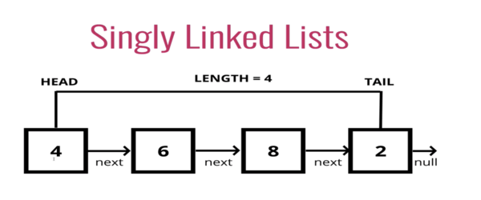

# Linked List

## Contents

 - **Singly Linked List:**
   - ["Node" class representation for Singly a Linked List](#node-class-for-sll)
   - ["Linked List" class representation for a Singly Linked List](#ll-class-for-sll)
   - Singly Linked List Operations:
     - [Traversing in Singly Linked List (printListFromNodeN vs. printListFromHead)](#traversing-sll)
     - Inserting a new Node in a Singly Linked List:
       - [Add a new Node at the front (push)](#inserting-push-sll)
       - [Add a new Node after a given node (insertAfterNodeN)](#inserting-insertafternoden-sll)
       - [Add a new Node at the end (append)](#inserting-append-sll)
     - Deleting a Node in a Singly Linked List:
       - [Delete a Singly Linked List node at a given position](#delete-node-given-position)
   - Singly Linked List Standard Template Library (STL):
   - [Singly Linked List: Advantages and Disadvantages](#singly-adv-disadv)
   - [Singly Linked List Real Examples](#singly-examples)
 - **Doubly Linked List:**
   - Doubly Linked List Operations:
   - Doubly Linked List Standard Template Library (STL):
   - [Doubly Linked List: Advantages and Disadvantages](#doubly-adv-disadv)
   - [Doubly Linked List Real Examples](#doubly-examples)
 - **Circular Linked List:**
   - Circular Linked List Operations:
   - Circular Linked List Standard Template Library (STL):
   - [Circular Linked List: Advantages and Disadvantages](#circular-adv-disadv)
   - [Circular Linked List Real Examples](#circular-examples)
 - **General:**
   - [Linked List: Advantages and Disadvantages](#adv-disadv)

<!--- ( SINGLY LINKED LIST SECTION ) --->

---

<div id="node-class-for-sll"></div>

## "Node" class representation for a Singly Linked List

How we know a **Linked List** is composed of connected **"Nodes"**, where each **"Node"** has:

 - A **"data"** stored.
 - And a pointer **"next"** to the next *Node*.

  

For example, see how represents a "Node" Data Structure in **C++**:

[Node.h](src/cpp/singly-linked-list/Node.h)
```cpp
#ifndef NODE_H_
#define NODE_H_

class Node
{
public:
    int data;
    Node *next;

    Node(int data = 0); // Constructor prototype.
};

#endif // NODE_H_
```

[Node.cpp](src/cpp/singly-linked-list/Node.cpp)
```cpp
#include "Node.h"

// Constructor implementation (definition).
Node::Node(int data)
{
    this->data = data;
    this->next = nullptr;
}
```

---

Now, let's see how represents a "Node" Data Structure in **Python**:

[Node.py](src/python/singly-linked-list/Node.py)
```python
class Node:

    # Constructor to initialize the node object.
    def __init__(self, data=0):
        self.data = data
        self.next = None  # Initialize "next" reference (pointer).
```

---

<div id="ll-class-for-sll"></div>

## "Linked List" class representation for a Singly Linked List

> How we know a **Linked List** is composed of connected **"Nodes"**.

  

Now, let's see how to implement a **Singly Linked List** in **C++** in practice:

[SinglyLinkedList.h](src/cpp/singly-linked-list/SinglyLinkedList.h)
```cpp
#ifndef LINKEDLIST_H_
#define LINKEDLIST_H_

#include "Node.h"

class SinglyLinkedList
{
public:
    Node *head;

    SinglyLinkedList(); // Constructor prototype.
};

#endif // LINKEDLIST_H_
```

[SinglyLinkedList.cpp](src/cpp/singly-linked-list/SinglyLinkedList.cpp)
```cpp
#include "SinglyLinkedList.h"

// Constructor implementation (definition).
SinglyLinkedList::SinglyLinkedList()
{
    this->head = nullptr;
}
```

To test our example, let's use a driver file:

[driver_sinly_linked_list.cpp](src/cpp/singly-linked-list/driver_sinly_linked_list.cpp)
```cpp
#include "SinglyLinkedList.h"
#include <iostream>

int main()
{
    // Node pointers
    Node *head   = nullptr;
    Node *second = nullptr;
    Node *third  = nullptr;

    // Allocate 3 Nodes in the Heap.
    head   = new Node(10); // Assigns data from the constructor.
    second = new Node(20); // Assigns data from the constructor.
    third  = new Node(30); // Assigns data from the constructor.

    // Assign data manually to the Nodes.
    // head->data   = 10;  // assign data in first node.
    // second->data = 20;  // assign data to second node.
    // third->data  = 30;  // assign data to third node

    head->next   = second;  // Link first node with second
    second->next = third;   // Link second node with the first.
    third->next  = nullptr; // Set last Node (tail) as NULL.

    std::cout << "Value in the First Node (head): " << head->data << "\n";
    std::cout << "Value in the Second Node: " << second->data << "\n";
    std::cout << "Value in the Third Node (tail): " << third->data << "\n";

    return 0;
}
```

**COMPILATION AND RUN:**
```cpp
g++ Node.cpp SinglyLinkedList.cpp driver_sinly_linked_list.cpp -o test.out && ./test.out
```

**OUTPUT:**  
```cpp
Value in the First Node (head): 10
Value in the Second Node: 20
Value in the Third Node (tail): 30
```

See that we use two approaches to init data in the "Nodes":

 - Using the constructor of "Node".
 - Set manually.

**NOTE:**  
Another approach to create new "Nodes" is use "next" reference (pointer) in the **Singly Linked List**. For example:

[driver_next_sinly_linked_list.cpp](src/cpp/singly-linked-list/driver_next_sinly_linked_list.cpp)
```cpp
#include "SinglyLinkedList.h"
#include <iostream>

int main()
{
    SinglyLinkedList list;
    list.head = new Node(10);
    list.head->next = new Node(20);
    list.head->next->next = new Node(30);

    // Assign data manually to the Nodes.
    // list.head->data              = 1;  // assign data in first node.
    // list.head->next->data        = 2;  // assign data to second node.
    // list.head->next->next->data  = 3;  // assign data to third node

    std::cout << "Value in the First Node (head): " << list.head->data << "\n";
    std::cout << "Value in the Second Node: " << list.head->next->data << "\n";
    std::cout << "Value in the Third Node (tail): " << list.head->next->next->data << "\n";

    return 0;
}
```

**COMPILATION AND RUN:**
```cpp
g++ Node.cpp SinglyLinkedList.cpp driver_next_sinly_linked_list.cpp -o test.out && ./test.out
```

**OUTPUT:**  
```cpp
Value in the First Node (head): 10
Value in the Second Node: 20
Value in the Third Node (tail): 30
```

---

Now, let's see how implement a **Singly Linked List** in Python:

[SinglyLinkedList.py](src/python/singly-linked-list/SinglyLinkedList.py)
```python
from Node import Node

class SinglyLinkedList:

    # Constructor to initialize the Node head.
    def __init__(self):
        self.head = None
```

Now, let's test in a drive file:

[driver_sinly_linked_list.py](src/python/singly-linked-list/driver_sinly_linked_list.py)
```python
from SinglyLinkedList import SinglyLinkedList
from Node import Node

# Node pointers
head = None
second = None
third = None

# Allocate 3 Nodes in the Heap.
head = Node(10)  # Assigns data from the constructor.
second = Node(20)  # Assigns data from the constructor.
third = Node(30)  # Assigns data from the constructor.

# Assign data manually to the Nodes.
# head.data = 10  # assign data in first node.
# second.data = 20  # assign data to second node.
# third.data = 30  # assign data to third node

head.next = second  # Link first node with second
second.next = third  # Link second node with the first.
third.next = None  # Set last Node (tail) as NULL.

print(f"Value in the First Node (head): {head.data}")
print(f"Value in the Second Node: {second.data}")
print(f"Value in the Third Node (tail): {third.data}")
```

**OUTPUT:**  
```
Value in the First Node (head): 10
Value in the Second Node: 20
Value in the Third Node (tail): 30
```

**NOTE:**  
Now, let's use "next" reference (pointer) in the **Singly Linked List** to create new "Nodes". For example:

[driver_next_sinly_linked_list.py](src/python/singly-linked-list/driver_next_sinly_linked_list.py)
```python
from SinglyLinkedList import SinglyLinkedList
from Node import Node

list = SinglyLinkedList()
list.head = Node(10)
list.head.next = Node(20)
list.head.next.next = Node(30)

# Assign data manually to the Nodes.
# list.head.data = 1  # assign data in first node.
# list.head.next.data = 2  # assign data to second node.
# list.head.next.next.data = 3  # assign data to third node

print("Value in the First Node (head):", list.head.data)
print("Value in the Second Node:", list.head.next.data)
print("Value in the Third Node (tail):", list.head.next.next.data)
```

**OUTPUT:**  
```
Value in the First Node (head): 10
Value in the Second Node: 20
Value in the Third Node (tail): 30
```

---

<div id="traversing-sll"></div>

## Traversing in Singly Linked List (printListFromNodeN vs. printListFromHead)

> Now, let's see how to **traverse a Singly Linked List**.

First, let's create a method (or function) to **traverse a Singly Linked List** *printing* all elements in each node in C++:

[SinglyLinkedList.h](src/cpp/singly-linked-list/SinglyLinkedList.h)
```cpp
class SinglyLinkedList
{
public:

  //...

    void printListFromNodeN(Node* n); // Method prototype.

  //...
};
```

[SinglyLinkedList.cpp](src/cpp/singly-linked-list/SinglyLinkedList.cpp)
```cpp
//...

void SinglyLinkedList::printListFromNodeN(Node *n)
{
    if (n == nullptr)
    {
        std::cout << "Node is empty!\n";
        return;
    }
    else
    {
        Node *current_node = n;
        while (current_node != NULL)
        {
            std::cout << current_node->data << " ";
            current_node = current_node->next;
        }
        std::cout << "\n";
    }
}

//...
```

[driver_printListFromNodeN.cpp](src/cpp/singly-linked-list/driver_printListFromNodeN.cpp)
```cpp
#include "SinglyLinkedList.h"
#include <iostream>

int main()
{
    SinglyLinkedList list;

    list.printListFromNodeN(list.head);

    list.head = new Node(10);
    list.head->next = new Node(20);
    list.head->next->next = new Node(30);

    list.printListFromNodeN(list.head);
    list.printListFromNodeN(list.head->next);
    list.printListFromNodeN(list.head->next->next);
    list.printListFromNodeN(list.head->next->next->next);

    return 0;
}
```

**COMPILATION AND RUN:**
```cpp
g++ Node.cpp SinglyLinkedList.cpp driver_printListFromNodeN.cpp -o test.out && ./test.out
```

**OUTPUT:**  
```cpp
Node is empty!
10 20 30 
20 30 
30 
Node is empty!
```

**NOTE:**  
See that we are *print* the list from (a partir) the Node **"n"**:

 - **First, we try to print the list without init a Node "head":**
   - That's, we have a NULL pointer in the *head*.
   - The return was *"Node is empty!"*.
 - **Next, we inited value to three Nodes.**
 - **Next, we try print the values from (a partir) the "head" Node:**
   - The return was *"10 20 30"*.
 - **Next, we try to print the values from (a partir) Node after the "head" Node:**
   - The return was *"20 30"*.
 - **Next, we try to print the values from  (a partir) de last Node:**
   - The return was *"30"*.
 - **Finally, we try to print the value from a NULL Node, that's, next=nullptr:**
   - The return was *"Node is empty!"*.

> **Ok, but how do I print always the Node elements from (a partir) de "head" Node?**

For it, let's create a method (function) **printListFromHead()**:

[SinglyLinkedList.h](src/cpp/singly-linked-list/SinglyLinkedList.h)
```cpp
class SinglyLinkedList
{
public:

  //...

    void printListFromHead(); // Method prototype.

  //...
};
```

[SinglyLinkedList.cpp](src/cpp/singly-linked-list/SinglyLinkedList.cpp)
```cpp
//...

void SinglyLinkedList::printListFromHead()
{
    if (this->head == nullptr)
    {
        std::cout << "List is empty!\n";
        return;
    }
    else
    {
        Node *current_node = this->head;
        while (current_node != NULL)
        {
            std::cout << current_node->data << " ";
            current_node = current_node->next;
        }
        std::cout << "\n";
    }
}

//...
```

[driver_printListFromHead.cpp](src/cpp/singly-linked-list/driver_printListFromHead.cpp)
```cpp
#include "SinglyLinkedList.h"
#include <iostream>

int main()
{
    SinglyLinkedList list;
    list.printListFromHead();

    list.head = new Node(10);
    list.printListFromHead();

    list.head->next = new Node(20);
    list.printListFromHead();

    list.head->next->next = new Node(30);
    list.printListFromHead();

    return 0;
}
```

**COMPILATION AND RUN:**
```cpp
g++ Node.cpp SinglyLinkedList.cpp driver_printListFromHead.cpp -o test.out && ./test.out
```

**OUTPUT:**  
```cpp
List is empty!
10 
10 20 
10 20 30
```

**NOTE:**  
See that now we always pass a **Singly Linked List** object and the method prints all Node values from (a partir) the **"head"** node.

---

Now, let's see how to **traverse a Singly Linked List** in Python.

[SinglyLinkedList.py](src/python/singly-linked-list/SinglyLinkedList.py)
```python
#...

# Method to print the Linked List starting from a given node.
def printListFromNodeN(self, n):
    if n is None:
        print("Node is empty!")
    else:
        current_node = n
        while current_node is not None:
            print(current_node.data, end=" ")
            current_node = current_node.next
        print()

# Method to print the entire Linked List starting from the "head".
def printListFromHead(self):
    if self.head is None:
        print("List is empty!")
    else:
        current_node = self.head
        while current_node is not None:
            print(current_node.data, end=" ")
            current_node = current_node.next
        print()

#...
```

[driver_traversing_in_singly_linked_list.py](src/python/singly-linked-list/driver_traversing_in_singly_linked_list.py)
```python
from SinglyLinkedList import SinglyLinkedList
from Node import Node

print("########## (Print values from Node 'n') ##########")

list = SinglyLinkedList()

list.printListFromNodeN(list.head)

list.head = Node(10)
list.head.next = Node(20)
list.head.next.next = Node(30)

list.printListFromNodeN(list.head)
list.printListFromNodeN(list.head.next)
list.printListFromNodeN(list.head.next.next)
list.printListFromNodeN(list.head.next.next.next)

print("\n####### (Print values from the 'head' Node) ######")

list = SinglyLinkedList()

list.printListFromHead()

list.head = Node(40)
list.printListFromHead()

list.head.next = Node(50)
list.printListFromHead()

list.head.next.next = Node(60)
list.printListFromHead()
```

**OUTPUT:**  
```
########## (Print values from Node 'n') ##########
Node is empty!
10 20 30 
20 30 
30 
Node is empty!

####### (Print values from the 'head' Node) ######
List is empty!
40
40 50
40 50 60
```

---

<div id="inserting-push-sll"></div>

## Add a new Node at the front (push)

Now, we let's use the approach to insert a new node in the front of a **Singly Linked List**. For example, if the given Linked List is:

```
10->15->20->25
```

And we add an item **5** at the front, then the **Singly Linked List** becomes:

```
5->10->15->20->25
```

To understand more easily see the image below:

  

See that:

 - We set the "next" pointer to point to the old first Node (head).
 - Then, we set the new Node to be the head. That's, the first node.

> **NOTE:**  
> Let us call the function that adds at the front of the list is **push()**.

Let's, get started implementing this approach in **C++**:

[SinglyLinkedList.h](src/cpp/singly-linked-list/SinglyLinkedList.h)
```cpp
//...

class SinglyLinkedList
{
public:

    void push(int data); // Method prototype.
};

//...
```

[SinglyLinkedList.cpp](src/cpp/singly-linked-list/SinglyLinkedList.cpp)
```cpp
//...

void SinglyLinkedList::push(int data)
{
    // Allocate a new Node.
    Node *new_node = new Node();

    new_node->data = data;         // Put data in the new Node.
    new_node->next = (this->head); // Make "next" of the "new_node" point to head (old first Node).
    this->head     = new_node;     // Move the head to point to the new node.
}

//...
```

[driver_push.cpp](src/cpp/singly-linked-list/driver_push.cpp)
```cpp
#include "SinglyLinkedList.h"
#include <iostream>

int main()
{
    SinglyLinkedList list;
    list.head = new Node(10);
    list.head->next = new Node(15);
    list.head->next->next = new Node(20);
    list.head->next->next->next = new Node(25);
    list.printListFromHead(); // Print Nodes values.

    list.push(5);
    list.printListFromHead(); // Print new Node value.

    return 0;
}
```

**COMPILATION AND RUN:**
```cpp
g++ Node.cpp SinglyLinkedList.cpp driver_push.cpp -o test.out && ./test.out
```

**OUTPUT:**  
```cpp
10 15 20 25 
5 10 15 20 25 
```

> **Is this function work in an Empty List?**  
> Yes!

For example:

[driver_push.cpp](src/cpp/singly-linked-list/driver_push.cpp)
```cpp
#include "SinglyLinkedList.h"
#include <iostream>

int main()
{
    SinglyLinkedList list;
    // list.head = new Node(10);
    // list.head->next = new Node(15);
    // list.head->next->next = new Node(20);
    // list.head->next->next->next = new Node(25);
    list.printListFromHead(); // Print Nodes values.

    list.push(5);
    list.printListFromHead(); // Print new Node value.

    return 0;
}


```

**COMPILATION AND RUN:**
```cpp
g++ Node.cpp SinglyLinkedList.cpp driver_push.cpp -o test.out && ./test.out
```

**OUTPUT:**  
```cpp
List is empty!
5 
```

**NOTE:**  
See that, before we had an Empty List, and after we add a new Node with element **5**.

---

Now, let's implement the same approach in **Python**:

[SinglyLinkedList.py](src/python/singly-linked-list/SinglyLinkedList.py)
```python
#...

# Method to insert a new Node at front.
def push(self, data):

    new_node = Node() # Allocate a new Node.

    new_node.data = data      # Put data in the new Node.
    new_node.next = self.head # Make "next" of the "new_node" point to head (old first Node).
    self.head     = new_node  # Move the head to point to the new node.

#...
```

[driver_push.py](src/python/singly-linked-list/driver_push.py)
```python
from SinglyLinkedList import SinglyLinkedList
from Node import Node

list = SinglyLinkedList()
list.head = Node(10)
list.head.next = Node(15)
list.head.next.next = Node(20)
list.head.next.next.next = Node(25)
list.printListFromHead() # Print Nodes values.

list.push(5)
list.printListFromHead() # Print new Node value.
```

**OUTPUT:**  
```cpp
10 15 20 25 
5 10 15 20 25 
```

---

<div id="inserting-insertafternoden-sll"></div>

## Add a new Node after a given node (insertAfterNodeN)

An approach to insert a new Node is insert after a determined Node "n". For example, see the image below:

  

Let's see how to implement this approach in **C++**:

[SinglyLinkedList.h](src/cpp/singly-linked-list/SinglyLinkedList.h)
```cpp
//...

class SinglyLinkedList
{
public:


    void insertAfterNodeN(Node *prev_node, int data); // Method prototype.
};

//...
```

[SinglyLinkedList.cpp](src/cpp/singly-linked-list/SinglyLinkedList.cpp)
```cpp
//...

void SinglyLinkedList::insertAfterNodeN(Node *prev_node, int data)
{
    if (this->head == nullptr)
    {
        std::cout << "List is empty!\n";
        return;
    }
    else if (prev_node == NULL)
    {
        std::cout << "The given previous Node cannot be NULL!";
        return;
    }
    else
    {
        // Allocate a new Node.
        Node *new_node = new Node();

        new_node->data  = data; // Put data in the new Node.
        new_node->next  = prev_node->next; // Make "next" of the "new_node" point to "next" of the "prev_node".
        prev_node->next = new_node; // Move the "next" of "prev_node" as "new_node".
    }
}

//...
```

[driver_insertAfterNodeN.cpp](src/cpp/singly-linked-list/driver_insertAfterNodeN.cpp)
```cpp
#include "SinglyLinkedList.h"
#include <iostream>

int main()
{
    SinglyLinkedList list;
    list.head = new Node(10);
    list.head->next = new Node(20);
    list.head->next->next = new Node(30);
    list.head->next->next->next = new Node(50);
    list.printListFromHead(); // Print Node values.

    list.insertAfterNodeN(list.head->next->next, 40);
    list.printListFromHead(); // Print new Node values.

    return 0;
}
```

**COMPILATION AND RUN:**
```cpp
g++ Node.cpp SinglyLinkedList.cpp driver_insertAfterNodeN.cpp -o test.out && ./test.out
```

**OUTPUT:**  
```cpp
10 20 30 50 
10 20 30 40 50 
```

---

Ok, now let's see how to implement this same approach in **Python**:

[SinglyLinkedList.py](src/python/singly-linked-list/SinglyLinkedList.py)
```python
#...

# Method to insert a new Node after determined Node "n".
def insertAfterNodeN(self, prev_node, data):
    if self.head is None:
        print("List is empty!")
    elif prev_node is None:
        print("The given previous Node cannot be NULL!")
    else:
        # Allocate a new Node.
        new_node = Node()

        new_node.data  = data           # Put data in the new Node.
        new_node.next  = prev_node.next # Make "next" of the "new_node" point to "next" of the "prev_node".
        prev_node.next = new_node       # Move the "next" of "prev_node" as "new_node".

#...
```

[driver_insertAfterNodeN.py](src/python/singly-linked-list/driver_insertAfterNodeN.py)
```python
from SinglyLinkedList import SinglyLinkedList
from Node import Node

list = SinglyLinkedList()
list.head = Node(10)
list.head.next = Node(20)
list.head.next.next = Node(30)
list.head.next.next.next = Node(50)
list.printListFromHead() # Print Nodes values.

list.insertAfterNodeN(list.head.next.next, 40)
list.printListFromHead() # Print new Node value.
```

**OUTPUT:**  
```cpp
10 20 30 50 
10 20 30 40 50
```

---

<div id="inserting-append-sll"></div>

## Add a new Node at the end (append)

Here, let's use an approach to insert a new Node at the end given **Singly Linked List**. For example if the given Linked List is:

```
5->10->15->20->25
```

And we add an item **30** at the end, then the Linked List becomes:

```
5->10->15->20->25->30
```

For example, see the image below to understand more easily:

  

Let's see how to implement this approach in **C++**:

[SinglyLinkedList.h](src/cpp/singly-linked-list/SinglyLinkedList.h)
```cpp
//...

class SinglyLinkedList
{
public:

  //...

    void append(int data);                            // Method prototype.
};

//...
```

[SinglyLinkedList.cpp](src/cpp/singly-linked-list/SinglyLinkedList.cpp)
```cpp
//...

void SinglyLinkedList::append(int data)
{
    // Allocate a new Node.
    Node *new_node = new Node();

    Node *last     = this->head; // Creates a Node "last" starting from the head.
    new_node->data = data;       // Put data in the "new_Node".
    new_node->next = NULL;       // Set "next" of new Node as NULL.

    // If the Linked List is empty, then make the "new_node" as head
    // and stop the method (return).
    if (this->head == NULL)
    {
        this->head = new_node;
        return;
    }
    else
    {
        // "Last" Node was inited as head, now let's change it to be last Node.
        while (last->next != NULL)
        {
            last = last->next;
        }

        // Make "next" of "last" Node point to "new_node", that's,
        // "new_node" will be last node.
        last->next = new_node;
        return; // Stop the method.
    }
}

//...
```

[driver_append.cpp](src/cpp/singly-linked-list/driver_append.cpp)
```cpp
#include "SinglyLinkedList.h"
#include <iostream>

int main()
{

    std::cout << "List1 = 5->10->15->20->25 + append(30):\n";
    SinglyLinkedList list1;
    list1.head = new Node(5);
    list1.head->next = new Node(10);
    list1.head->next->next = new Node(15);
    list1.head->next->next->next = new Node(20);
    list1.head->next->next->next->next = new Node(25);
    list1.append(30);
    list1.printListFromHead(); // Print new Node value.

    std::cout << "\nList2 = append(30): \n";
    SinglyLinkedList list2;
    list2.append(30);
    list2.printListFromHead(); // Print new Node value.

    std::cout << "\nList3 = append(1) + append(2) + append(3): \n";
    SinglyLinkedList list3;
    list3.append(1);
    list3.append(2);
    list3.append(3);
    list3.printListFromHead();

    return 0;
}
```

**COMPILATION AND RUN:**
```cpp
g++ Node.cpp SinglyLinkedList.cpp driver_append.cpp -o test.out && ./test.out
```

**OUTPUT:**  
```cpp
List1 = 5->10->15->20->25 + append(30):
5 10 15 20 25 30

List2 = append(30): 
30

List3 = append(1) + append(2) + append(3): 
1 2 3
```

---

Ok, now let's implement this same approach in **Python**:

[SinglyLinkedList.py](src/python/singly-linked-list/SinglyLinkedList.py)
```python
#...

def append(self, data):
    # Allocate a new Node.
    new_node = Node(data)

    last = self.head # Creates a Node "last" starting from the head.

    # Put data in the "new_node" and set "next" of new Node as None.
    new_node.data = data
    new_node.next = None

    # If the Linked List is empty, then make the "new_node" as head and stop the method (return).
    if self.head is None:
        self.head = new_node
        return
    else:
        # "Last" Node was initialized as head, now let's change it to be the last Node.
        while last.next is not None:
            last = last.next

        # Make "next" of "last" Node point to "new_node", that is,
        # "new_node" will be the last node.
        last.next = new_node
        return # Stop the method.

#...
```

[driver_append.py](src/python/singly-linked-list/driver_append.py)
```python
from SinglyLinkedList import SinglyLinkedList
from Node import Node

print("List1 = 5->10->15->20->25 + append(30):")
List1 = SinglyLinkedList()
List1.head = Node(5)
List1.head.next = Node(10)
List1.head.next.next = Node(15)
List1.head.next.next.next = Node(20)
List1.head.next.next.next.next = Node(25)
List1.append(30)
List1.printListFromHead() # Print Nodes values.

print("\nList2 = append(30):")
List2 = SinglyLinkedList()
List2.append(30)
List2.printListFromHead() # Print Nodes values.

print("\nList3 = append(1) + append(2) + append(3):")
list3 = SinglyLinkedList()
list3.append(1)
list3.append(2)
list3.append(3)
list3.printListFromHead() # Print Nodes values.
```

**OUTPUT:**  
```python
List1 = 5->10->15->20->25 + append(30):
5 10 15 20 25 30 

List2 = append(30):
30 

List3 = append(1) + append(2) + append(3):
1 2 3 
```

---

<div id="delete-node-given-position"></div>

## Delete a Singly Linked List node at a given position

Here, let's see how to delete a Node in a Singly Linked List given position. For example, imagine we have the following Singly Linked List:

```
8->2->3->1->7
```

Now, suppose we need delete the Node in **posiiton 2**:

```
8->2->1->7
```

> **NOTE:**  
> Like Arrays, Linked Lists same start from the index 0. That's why (por isso) Node(3) was deleted.

Let's start by implementing this approach in **C++**:

[SinglyLinkedList.h](src/cpp/singly-linked-list/SinglyLinkedList.h)
```cpp
class SinglyLinkedList
{
public:
    // Codes...
    void deleteNodeN(int position); // Method prototype.
};
```

[SinglyLinkedList.cpp](src/cpp/singly-linked-list/SinglyLinkedList.cpp)
```cpp
//...

void SinglyLinkedList::deleteNodeN(int position)
{
    if (this->head == nullptr)
    {
        std::cout << "List is empty!\n";
        return; // Stop the method.
    }
    else
    {
        Node *temp = this->head; // Store head node.

        // If position=0, then remove the "head".
        if (position == 0)
        {
            this->head = temp->next; // Change second Node to be the new "head".
            free(temp);              // Free old head.
            return;                  // Stop the method.
        }
        else
        {
            /**
             * [Finds the "Node" before the "Node" (position) to be deleted]
             * Check in all iterations if the de Node (starting from temp=head)
             * is NULL and "i < position -1", that's, the Node before the "Node"
             * (position) to be deleted.
             *
             * For example, imagine we have the following list: 8->2->3->1->7->NULL
             *
             * - temp = head (zero 0) = [8]->2->3->1->7->NULL
             * - Imagine that passed position was: 4
             *
             * First iteration: i=0 < (position=4 - 1) = 3 | YES!
             * (temp = temp->next) = 8->[2]->3->1->7->NULL
             *
             * Second iteration: i++, i=1 < (position=4 - 1) = 3 | YES!
             * (temp = temp->next) = 8->2->[3]->1->7->NULL
             *
             * Third iteration: i++, i=2 < (position=4 - 1) = 3 | YES!
             * (temp = temp->next) =  8->2->3->[1]->7->NULL
             *
             * Fourth iteration: i++, i=3 < (position=4 - 1) = 3 | NO!
             * The internal statements in the loop "for" now not is executed!
             *
             * Ok, we have the "Node" before the "Node" that will be deleted
             * saved in the "temp" pointer: 8->2->3->[1]->7->NULL
             *
             * [Another example was if the "position" was 1:]
             *
             * First iteration: i=0 < (position=1 - 1) = 0 | NO!
             * That's, temp = [8]->2->3->1->7->NULL, a "Node" before the
             * Node" that will be deleted saved in the "temp" pointer.
             */
            for (int i = 0; temp != NULL && i < position - 1; i++)
                temp = temp->next;

            // Check if position is more than number of nodes.
            if (temp == NULL || temp->next == NULL)
            {
                std::cout << "The Node position exceeded!\n";
                return; // Stop the method.
            }

            /**
             * As the "temp->next" is the Node that will be deleted, we need to save
             * the "next" of the Node that will be deleted in some pointer (next).
             *
             * For example, position=1:
             *
             *  next   =   temp -> next -> next
             *              [8] ->  2   ->   3   ->1->7->NULL
             *                      |        |
             *                      |        ---(Node will be save in "next" pointer)
             *                      |
             *            (Node will be deleted)
             */
            Node *next = temp->next->next;

            /**
             * Delete the Node in the position passed, "temp->next":
             *
             *  next   =   temp ->        -> next
             *              [8] ->        ->   3   ->1->7->NULL
             *                                 |
             *                                 ---(Node will be save in "next" pointer)
             */
            free(temp->next); // Free Node selected in memory.

            /**
             * Make the "Node" before the "Node" that was deleted point
             * to the "Node" after the "Node" that was deleted.
             *
             *    [8]->3->1->7->NULL
             *     |   |
             *     |   ---------
             *     |           |
             * temp->next = next
             */
            temp->next = next;
        }
    }
}

//...
```

[driver_deleteNodeN.cpp](src/cpp/singly-linked-list/driver_deleteNodeN.cpp)
```cpp
#include "SinglyLinkedList.h"
#include <iostream>

int main()
{
    SinglyLinkedList list;

    std::cout << "Try delete a Node 'n' in an Empty List:\n";
    list.deleteNodeN(0);

    std::cout << "\nList = 8->2->3->1->7:\n";
    list.append(8);
    list.append(2);
    list.append(3);
    list.append(1);
    list.append(7);
    list.printListFromHead(); // Print Nodes values.

    std::cout << "\nList = (8->2->3->1->7) + deleteNodeN(4):\n";
    list.deleteNodeN(4);
    list.printListFromHead(); // Print Nodes values after delete Node position 1.

    std::cout << "\nTry to delete a Node 'n' that position is more than the number of nodes:\n";
    list.deleteNodeN(4);

    return 0;
}
```

**COMPILATION AND RUN:**
```cpp
g++ Node.cpp SinglyLinkedList.cpp driver_deleteNodeN.cpp -o test.out && ./test.out
```

**OUTPUT:**  
```
Try delete a Node 'n' in an Empty List:
List is empty!

List = 8->2->3->1->7:
8 2 3 1 7 

List = (8->2->3->1->7) + deleteNodeN(1):
8 2 3 1 

Try to delete a Node 'n' that position is more than the number of nodes:
The Node position exceeded!
```

---

Nice, now let's see how to implement this approach in **Python**:

[SinglyLinkedList.py](src/python/singly-linked-list/SinglyLinkedList.py)
```python
#...

    # Method to delete a Node "n" by position.
    def deleteNodeN(self, position):
        if self.head is None:
            print("List is empty!")
            return
        else:
            temp = self.head
            if position == 0:
                self.head = temp.next
                del temp
                return
            else:
                # [Finds the "Node" before the "Node" (position) to be deleted]
                for i in range(position - 1):
                    if temp is None:
                        break
                    temp = temp.next

                # Check if position is more than number of nodes.
                if temp is None or temp.next is None:
                    print("The Node position exceeded!")
                    return

                # As the "temp->next" is the Node that will be deleted,
                # we need to save the "next" of the Node that will be
                # deleted in some pointer (next).
                next = temp.next.next

                # Delete the Node in the position passed, "temp->next".
                del temp.next

                # Make the "Node" before the "Node" that was deleted point
                # to the "Node" after the "Node" that was deleted.
                temp.next = next

#...
```

[driver_deleteNodeN.py](src/python/singly-linked-list/driver_deleteNodeN.py)
```python
from SinglyLinkedList import SinglyLinkedList

if __name__ == '__main__':
    list = SinglyLinkedList()

    print("Try delete a Node 'n' in an Empty List:")
    list.deleteNodeN(0)

    print("\nList = 8->2->3->1->7:")
    list.append(8)
    list.append(2)
    list.append(3)
    list.append(1)
    list.append(7)
    list.printListFromHead() # Print Nodes values.

    print("\nList = (8->2->3->1->7) + deleteNodeN(4):")
    list.deleteNodeN(4)
    list.printListFromHead() # Print Nodes values after delete Node position 1.

    print("\nTry to delete a Node 'n' that position is more than the number of nodes:")
    list.deleteNodeN(4)
```

**OUTPUT:**  
```python
Try delete a Node 'n' in an Empty List:
List is empty!

List = 8->2->3->1->7:
8 2 3 1 7 

List = (8->2->3->1->7) + deleteNodeN(4):
8 2 3 1 

Try to delete a Node 'n' that position is more than the number of nodes:
The Node position exceeded!
```


<!--- ( GENERAL SECTION ) --->

---

<div id="adv-disadv"></div>

## Linked List: Advantages and Disadvantages

 - **Advantages:**
   - Dynamic Array.
   - Ease of Insertion/Deletion.
   - Insertion at the beginning is a constant time operation and takes O(1) time:
     - As compared to arrays where inserting an element at the beginning takes **O(n)** time, where **"n"** is the number of elements in the array.
 - **Disadvantages (Drawbacks):**
   - Random access is not allowed. We have to access elements sequentially starting from the first node (head node):
     - So we cannot do a binary search with Linked Lists efficiently with its default implementation. 
   - Extra memory space for a *pointer* is required with each element of the list.
   - Not cache-friendly (Não compatível com cache):
     - Since array elements are contiguous locations, there is the locality of reference which is not there in the case of linked lists.
   - It takes a lot of time in traversing and changing the pointers.
   - Reverse traversing is not possible in singly linked lists.
   - It will be confusing when we work with pointers.
   - Direct access to an element is not possible in a linked list as in an array by index.
   - Searching for an element is costly and requires O(n) time complexity.
   - Sorting of linked lists is very complex and costly.
   - Appending an element to a linked list is a costly operation, and takes **O(n)** time, where **"n"** is the number of elements in the linked list:
     - As compared to arrays that take **O(1)** time.

---

**REFERENCES:**  
[What is Linked List](https://www.geeksforgeeks.org/what-is-linked-list//)  
[Insertion in Linked List](https://www.geeksforgeeks.org/insertion-in-linked-list/)  
[Delete a Linked List node at a given position](https://www.geeksforgeeks.org/delete-a-linked-list-node-at-a-given-position/)

---

Ro**drigo** **L**eite da **S**ilva - **drigols**
