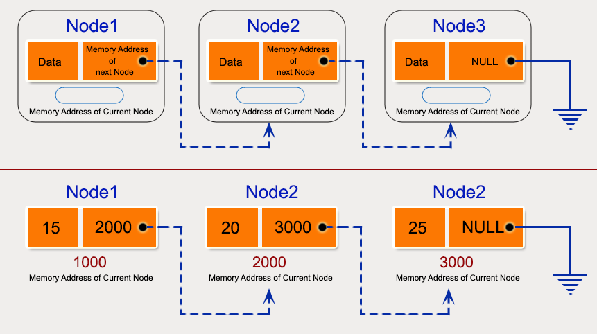

# Lists (Linked Lists)

## Contents

 - **Singly Linked List:**
   - ["Node" class representation for a Singly Linked List](#node-class-for-sll)
   - ["SinglyLinkedList" class representation](#ll-class-for-sll)
   - **Inserting Nodes manually (without functions):**
     - [Creating and Linking Nodes manually using only "Node" class (Using pointers)](#calnmuonc)
     - [Creating Nodes using "SinglyLinkedList" class (Using "head.next" reference/pointer)](#cnulcuhnrp)
   - **Inserting Nodes (Using functions):**
       - [Add a new Node at the front (push) | O(1)](#inserting-push-sll)
       - [Add a new Node after a passed Node (insertAfterPassedNode) | O(1)](#inserting-insertafterpassed-node-sll)
       - [Add a new Node at the end (append) | O(n)](#inserting-append-sll)
   - **Deleting a Node in a Singly Linked List:**
       - [Delete a Singly Linked List node at a given position | O(n)](#delete-node-given-position)
   - **Traversing:**
     - [Traversing in SinglyLinkedList from the Head until Tail | O(n)](#traversing-sll-from-the-head)
 - **Doubly Linked List:**
   - ["Node" class representation for a Doubly Linked List](#node-class-for-dll)
 - **Circular Linked List:**
   - ["Node" class representation for a Circular Linked List](#node-class-for-cll)
 - **Tips & Tricks:**
   - [Linked List: Advantages and Disadvantages](#advantages-disadvantages)
 - [**References**](#ref)


<!--- ( Singly Linked List ) --->

---

<div id="node-class-for-sll"></div>

## "Node" class representation for a Singly Linked List

> A **Linked List** is composed of connected **"Nodes"**, where each **"Node"** has:

 - **"Data"** stored.
 - And a pointer **"next"** to the next *Node*.

  

For example, see how represents a **"Node"** data structure *class*:

**Python:** [Node.py](src/python/singly-linked-list/Node.py)
```python
class Node:
    def __init__(self, data):
        self.data = data
        self.next = None
```

---

<div id="ll-class-for-sll"></div>

## "SinglyLinkedList" class representation

Now, let's see how to implement a **Singly Linked List** *class*:

**Python:** [SinglyLinkedList.py](src/python/singly-linked-list/SinglyLinkedList.py)
```python
from Node import Node


class SinglyLinkedList:
    def __init__(self):
        self.head = None
```


<!--- ( Singly Linked List/Inserting Nodes manually (without functions) ) --->

---

<div id="calnmuonc"></div>

## Creating and Linking Nodes manually using only "Node" class (Using pointers)

> One approach to create a Nodes is create a pointer to each new Node and link them manually.

**Using this approach first, we need to create a pointer for each new Node:**

**Python:**
```python
# Node pointers
head   = None
second = None
third  = None
```

**Allocate Nodes in the Heap. That's, allocate the memory to the new Nodes:**

   - We can use the constructor of the Node to assign the data here:
   - Or assign data next using *"-> (. in Python)"* operator:

**Python:**
```python
# Assign data using constructor.
head   = Node(10)
second = Node(20)
third  = Node(30)

# Assign data using "." operator.
head.data   = 10
second.data = 20
third.data  = 30
```

**Finally, we need to link the Nodes:**

 - The current Node pointer must have (deve ter) the memory address of the next Node saved in your "next" pointer.
 - The last Node (tail) must have (deve ter) "next" pointer as NULL (nullptr).

**Python:**
```python
head.next   = second   # Link first (head) node with second.
second.next = third    # Link second node with the third.
third.next  = None     # Set last Node (tail) as NULL.
```

Let's, test it in practice:

**Python:** [driver_insert_using_node_class.py](src/python/singly-linked-list/driver_insert_using_node_class.py)
```bash
from Node import Node

# Node pointers
head   = None
second = None
third  = None

# Assign data using constructor.
head = Node(10)
second = Node(20)
third = Node(30)

# Assign data using "." operator.
# head.data   = 10
# second.data = 20
# third.data  = 30

head.next   = second   # Link first (head) node with second.
second.next = third    # Link second node with the third.
third.next  = None     # Set last Node (tail) as NULL.

print(f"Value in the First Node (head): {head.data}")
print(f"Value in the Second Node: {second.data}")
print(f"Value in the Third Node (tail): {third.data}")
```

**INPUT:**  
```bash
python driver_insert_using_node_class.py 
```

**OUTPUT:**  
```bash
Value in the First Node (head): 10
Value in the Second Node: 20
Value in the Third Node (tail): 30
```

---

<div id="cnulcuhnrp"></div>

## Creating Nodes using "SinglyLinkedList" class (Using "head.next" reference/pointer)

> Another approach to create a new "Node" is use "next" pointer of the **"head Node"** of **SinglyLinkedList** class to create other Nodes.

**First, we need to create an instance (variable) of the SinglyLinkedList class:**

**Python:**
```python
sll = SinglyLinkedList()
```

**Now, we can use the "head Node" (Initialized as NULL by default in the constructor) to create other Nodes:**

   - We can use the constructor of the Node to assign the data here:
   - Or assign data next using *"-> (. in Python)"* operator:

**Python:**
```python
# Assign data using constructor.
sll.head = Node(10)            # 10
sll.head.next = Node(20)       # 10->20
sll.head.next.next = Node(30)  # 10->20->30

# Assign data using "." operator.
sll.head.data = 1            # 10
sll.head.next.data = 2       # 10->20
sll.head.next.next.data = 3  # 10->20->30
```

Let's, test it in practice:

**Python:** [driver_insert_using_SinglyLinkedList_class.py](src/python/singly-linked-list/driver_insert_using_SinglyLinkedList_class.py)
```python
from SinglyLinkedList import SinglyLinkedList
from Node import Node

sll = SinglyLinkedList()

# Assign data using constructor.
sll.head = Node(10)
sll.head.next = Node(20)
sll.head.next.next = Node(30)

# Assign data using "." operator.
# sll.head.data = 1
# sll.head.next.data = 2
# sll.head.next.next.data = 3

print("Value in the First Node (head):", sll.head.data)
print("Value in the Second Node:", sll.head.next.data)
print("Value in the Third Node (tail):", sll.head.next.next.data)
```

> **NOTE:**  
> - However, here we need to use the Node() class to reference a Node in a SinglyLinkedList class.
> - This is because we don't have a function to do it.

**INTPUT:**  
```bash
python driver_insert_using_SinglyLinkedList_class.py
```

**OUTPUT:**  
```bash
Value in the First Node (head): 10
Value in the Second Node: 20
Value in the Third Node (tail): 30
```


<!--- ( Singly Linked List/Inserting Nodes (Using functions) ) --->

---

<div id="inserting-push-sll"></div>

## Add a new Node at the front (push) | O(1)

> Now let's, see how to insert a new Node in the **front of a Singly Linked List (Also called push)**.

For example, imagine we have the following **Singly Linked List**:

```
10->15->20->25
```

If we add item (element) **5** at the *front*, then the **Singly Linked List** becomes:

```
5->10->15->20->25
```

To understand more easily see the image below:

  

To apply these mechanics we need to:

 1. Allocate a new Node:
   1.1. Here, we can assign data.
 2. Make "next" of the "new_node" point to head (old first Node).
 3. Move the head to point to the "new_node".

Now, let's see how to implement the **push()** function:

**Python:** [SinglyLinkedList.py](src/python/singly-linked-list/SinglyLinkedList.py)
```python
def push(self, data):
    new_node = Node(data)
    new_node.next = self.head
    self.head = new_node
```

> **Is this function work in an Empty List?**  
> Yes!

The **Time** and **Space complexity** of the **push()** function is:

 - **Time Complexity:**
   - **[Worst Case] - Big O(O)** 
     - **O(1):** The time complexity of this function in the *worst case* is **O(1)**, which means it is constant. This is because the insertion always occurs at the beginning of the list, regardless (sem considerar) of the size of the list. No matter (não importa) how many elements the list already contains, the function performs a fixed number of operations.
   - **[Best Case] - Omega (Ω)**
     - **Ω(1):** The time complexity of this function in the *best case* is **O(1)**, which means it is constant. This is because the insertion always occurs at the beginning of the list, regardless (sem considerar) of the size of the list.

Finally, let's test the function **push()** in practice:

**Python:** [driver_push.py](src/python/singly-linked-list/driver_push.py)
```python
from SinglyLinkedList import SinglyLinkedList

sll = SinglyLinkedList()

# Remember, we are using the push() approach, that's,
# the new Node is added in the front of the Singly Linked List.
sll.push(25); # 25(head)
sll.push(20); # 20(head)->25
sll.push(15); # 15(head)->20->25
sll.push(10); # 10(head)->15->20->25
sll.push(5);  # 5 (head)->10->15->20->25

print("Data in the first (head) Node:", sll.head.data)
print("Data in the second Node:", sll.head.next.data)
print("Data in the third Node:", sll.head.next.next.data)
print("Data in the four Node:", sll.head.next.next.next.data)
print("Data in the fifth Node:", sll.head.next.next.next.next.data)
```

**INTPUT:**  
```bash
python driver_push.py
```

**OUTPUT:**  
```bash
Data in the first (head) Node: 5
Data in the second Node: 10
Data in the third Node: 15
Data in the four Node: 20
Data in the fifth Node: 25
```

---

<div id="inserting-insertafterpassed-node-sll"></div>

## Add a new Node after a passed Node (insertAfterPassedNode) | O(1)

> Now let's, see how to insert a new Node after a passed Node in a **Singly Linked List**.

For example, see the image below:

  

**The first, thing we need to do is check if the passed Node is NULL (None):**

**Python:**
```python
if passed_node is None:
    print("The passed Node cannot be NULL!")
    return
```

**Now, we need to create a new Node and link (connect) the Nodes:**

 - Create a "new_node".
 - Next, set the "next" point of the "new_node" to point to "next" of the passed Node.
 - Finally, set the "next" point of the passed Node to point to the "new_node".

<<<<<<< HEAD
**Python:**
```python
new_node = Node(data)
new_node.next = passed_node.next
passed_node.next = new_node
```

=======
>>>>>>> algorithms-and-ds
See, the complete code to **insertAfterPassedNode()** function below:

**Python:** [SinglyLinkedList.py](src/python/singly-linked-list/SinglyLinkedList.py)
```python
def insertAfterPassedNode(self, passed_node, data):
    if passed_node is None:
        print("The passed Node cannot be NULL!")
        return
    new_node = Node(data)
    new_node.next = passed_node.next
    passed_node.next = new_node
```

The **Time** and **Space complexity** of the **insertAfterPassedNode()** function is:

 - **Time Complexity:**
   - **[Worst Case] - Big O(O)** 
     - **O(1):** The time complexity of this function in the *worst case* is **O(1)**. This is because the function performs a fixed number of operations, regardless of the size of the node list.
   - **[Best Case] - Omega (Ω)**
     - **Ω(1):** The time complexity of this function in the *best case* is also **O(1)**. This is because even in the best case, where the function doesn't need to print the error message and can proceed normally, it performs a fixed number of operations. 

Finally, let's test the **insertAfterPassedNode()** function in practice:

**Python:** [driver_insertAfterNodeN.py](src/python/singly-linked-list/driver_insertAfterNodeN.py)
```python
from SinglyLinkedList import SinglyLinkedList
from Node import Node

sll = SinglyLinkedList()

sll.head = Node(5)                  # 5(head)
sll.head.next = Node(10)            # 5(head)->10
sll.head.next.next = Node(20)       # 5(head)->10->20
sll.head.next.next.next = Node(25)  # 5(head)->10->20->25

print("Singlye Linked List before insert the new Node:")
print("Data in the first (head) Node:", sll.head.data)
print("Data in the second Node:", sll.head.next.data)
print("Data in the third Node:", sll.head.next.next.data)
print("Data in the four Node:", sll.head.next.next.next.data)

sll.insertAfterPassedNode(sll.head.next, 15)  # 5(head)->10(prev_node)->new_node(15)->20->25

print("\nSinglye Linked List after insert the new Node:")
print("Data in the first (head) Node:", sll.head.data)
print("Data in the second Node:", sll.head.next.data)
print("Data in the third Node:", sll.head.next.next.data)
print("Data in the four Node:", sll.head.next.next.next.data)
print("Data in the fifth Node:", sll.head.next.next.next.next.data)
```

**INPUT:**  
```bash
python driver_insertAfterNodeN.py 
```

**OUTPUT:**  
```bash
Singlye Linked List before insert the new Node:
Data in the first (head) Node: 5
Data in the second Node: 10
Data in the third Node: 20
Data in the four Node: 25

Singlye Linked List after insert the new Node:
Data in the first (head) Node: 5
Data in the second Node: 10
Data in the third Node: 15
Data in the four Node: 20
Data in the fifth Node: 25
```

---

<div id="inserting-append-sll"></div>

## Add a new Node at the end (append) | O(n)

> Now let's, see how to inser a new Node **at the end given Singly Linked List (Also called append)**.

For example, imagine we have the following **Singly Linked List**:

```
5->10->15->20
```

And we add item (element) **25** at the end, then the **Singly Linked List** becomes:

```
5->10->15->20->25
```

See the image below to understand more easily:

  

**To apply this first, we need to allocate memory to the "new_node":**

**Python:**
```python
new_node = Node(data)
```

**How the "new_node" will always be the last (tail) we need to set the "next" pointer as NULL (None):**

**Python:**
```python
new_node.next = None
```

**Now, we need to check if the Linked List is empty, this is because if the Singly Linked List is empty, then we need to make the "new_node" as head and stop the method (return):**

**Python:**
```python
if self.head is None:
    self.head = new_node
    return
```

**Now, we need to find the last Node. For it, let's create a "temp_node" to loop until the last Node:**

**Python:**
```python
temp_node = self.head
while temp_node.next is not None:
    temp_node = temp_node.next
```

**With the old last Node saved in "temp_node", now we need to set him to point to the "new_node" (new last Node):**

**Python:**
```python
temp_node.next = new_node
```

See, the complete code to **append()** function below:

**Python:** [SinglyLinkedList.py](src/python/singly-linked-list/SinglyLinkedList.py)
```python
def append(self, data):
    new_node = Node(data)
    new_node.next = None
    if self.head is None:
        self.head = new_node
        return
    else:
        temp_node = self.head
        while temp_node.next is not None:
            temp_node = temp_node.next
        temp_node.next = new_node
```

The **Time** and **Space complexity** of the **append()** function is:

 - **Time Complexity:**
   - **[Worst Case] - Big O(O)** 
     - **O(n):** The time complexity of this function in the *worst case* is **O(n)**, where *"n"* is the number of elements in the linked list.
   - **[Best Case] - Omega (Ω)**
     - **Ω(1):** The *"append"* function has a special best case when the linked list is empty. In this case, the time complexity is **O(1)**, which is constant.

Finally, let's test the **append()** function in practice:

**Python:** [driver_append.py](src/python/singly-linked-list/driver_append.py)
```python
from SinglyLinkedList import SinglyLinkedList
from Node import Node

print("List1 = 5->10->15->20->25 + append(30):")
List1 = SinglyLinkedList()
List1.head = Node(5)
List1.head.next = Node(10)
List1.head.next.next = Node(15)
List1.head.next.next.next = Node(20)
List1.head.next.next.next.next = Node(25)
List1.append(30)
List1.printListFromHead()

print("\nList2 = append(30):")
List2 = SinglyLinkedList()
List2.append(30)
List2.printListFromHead()

print("\nList3 = append(1) + append(2) + append(3):")
list3 = SinglyLinkedList()
list3.append(1)
list3.append(2)
list3.append(3)
list3.printListFromHead()

```

**OUTPUT:**  
```bash
python driver_append.py
```

**OUTPUT:**  
```bash
List1 = 5->10->15->20->25 + append(30):
5 10 15 20 25 30 

List2 = append(30):
30 

List3 = append(1) + append(2) + append(3):
1 2 3 
```


<!--- ( Singly Linked List/Deleting a Node in a Singly Linked List ) --->

---

<div id="delete-node-given-position"></div>

## Delete a Singly Linked List node at a given position | O(n)

Here, let's see how to delete a Node in a **Singly Linked List** given position. For example, imagine we have the following **Singly Linked List**:

```
5->10->15->20
```

Now, suppose we need delete the Node in **posiiton 2**:

```
5->10->20
```

> **NOTE:**  
> Like Arrays, Linked Lists same start from the index 0. That's why (por isso) Node(3) was deleted.

For example, see the image below to understand more easily:


**First, we need check if the Singly Linked List is empty. If the Singly Linked List is empty, then stop the function:**

**Python:**
```python
if self.head is None:
    print("List is empty!")
    return
```

**Next, we need to create a "temp_node" (useful Node) to loop by the Nodes:**

**Python:**
```python
temp = self.head
```

**If the position (n) is zero (0), then the head will be deleted:**

 - But, before we need to do the second Node as the new head:
   - `this->head = temp_node->next;`.
   - `self.head = temp.next`.
 - Now, we can dele the old head:
   - `free(temp_node); `.
   - `del temp`.

**Python:**
```python
if position == 0:
    self.head = temp.next
    del temp
    return
```

**Now, let's make "temp_node" point to the previous Node that will be deleted (to understand how to do that, see the example below):**

```cpp
/**
 * [Finds the "Node" before the "Node" (position) to be deleted]
 * Check in all iterations if the de Node (starting from temp=head)
 * is NULL and "i < position -1", that's, the Node before the "Node"
 * (position) to be deleted.
 *
 * For example, imagine we have the following list: 8->2->3->1->7->NULL
 * - temp = head (zero 0) = [8]->2->3->1->7->NULL
 * - Imagine that passed position was: 4
 *
 * First iteration: i=0 < (position=4 - 1) = 3 | YES!
 * Pass (loop) to the next node (temp = temp->next) = 8->[2]->3->1->7->NULL
 *
 * Second iteration: i++, i=1 < (position=4 - 1) = 3 | YES!
 * Pass (loop) to the next node (temp = temp->next) = 8->2->[3]->1->7->NULL
 *
 * Third iteration: i++, i=2 < (position=4 - 1) = 3 | YES!
 * Pass (loop) to the next node (temp = temp->next) =  8->2->3->[1]->7->NULL
 *
 * Fourth iteration: i++, i=3 < (position=4 - 1) = 3 | NO!
 * Now, the internal statements in the loop "for" not is executed!
 *
 * Ok, we have the "Node" before the "Node" that will be deleted
 * saved in the "temp_node" pointer: 8->2->3->[1]->7->NULL
 *
 * [Another example was if the "position" was 1:]
 * First iteration: i=0 < (position=1 - 1) = 0 | NO!
 * That's, temp = [8]->2->3->1->7->NULL, a "Node" before the
 * Node" that will be deleted saved in the "temp" pointer.
 */
```

**The loop to make it:**

**Python:**
```python
for i in range(position - 1):
    if temp_node is None:
        break
    temp_node = temp_node.next
```

**We also need to check if  the passed position is more than number of nodes:**

**Python:**
```python
if temp_node is None or temp_node.next is None:
    print("The Node position exceeded!")
    return
```

**Now, we need to save the "next (memory address of the next node)" of the Node will be deleted (to understand how to do that, see the example below):**

```cpp
/**
 * As the "temp->next" is the Node that will be deleted, we need to save
 * the "next" of the Node that will be deleted in some pointer (next).
 *
 * For example, position=1:
 *
 *  next   =   temp -> next -> next
 *              [8] ->  2   ->   3   ->1->7->NULL
 *                      |        |
 *                      |        ---(Node will be save in "next" pointer)
 *                      |
 *            (Node will be deleted)
 */
```

**The code to make it:**

**Python:**
```python
next = temp_node.next.next
```

**Now, let's delete the Node in the position (Free memory) passed:**

**Example:**
```cpp
/**
 * Delete the Node in the position passed, "temp->next":
 *
 *  next   =   temp ->        -> next
 *              [8] ->        ->   3   ->1->7->NULL
 *                                 |
 *                                 ---(Node will be save in "next" pointer)
 */
```

**The code to make it:**

**Python:**
```python
del temp_node.next
```

**Finally, let's link the unlinked Nodes (to understand how to do that, see the example below):**

```cpp
/**
 * Make the "Node" before the "Node" that was deleted point
 * to the "Node" after the "Node" that was deleted.
 *
 *    [8]->3->1->7->NULL
 *     |   |
 *     |   ---------
 *     |           |
 * temp->next = next
 */
```

**The code to make it:**

**Python:**
```python
temp_node.next = next
```

See, the complete code to **deleteNodeN()** function below:

**Python:** [SinglyLinkedList.py](src/python/singly-linked-list/SinglyLinkedList.py)
```python
def deleteNodeN(self, position):
    if self.head is None:
        print("List is empty!")
        return
    else:
        temp_node = self.head
        if position == 0:
            self.head = temp_node.next
            del temp_node
            return
        for i in range(position - 1):
            if temp_node is None:
                break
            temp_node = temp_node.next
        if temp_node is None or temp_node.next is None:
            print("The Node position exceeded!")
            return
        next = temp_node.next.next
        del temp_node.next
        temp_node.next = next
```

The **Time** and **Space complexity** of the **deleteNodeN()** function is:

 - **Time Complexity:**
   - **[Worst Case] - Big O(O)** 
     - **O(n):** If the position is not *"zero 0"*, and the list is no empty, the function traverses the nodes in the list until it finds the node before the one to be deleted. This involves a loop that traverses, at most, *n-1 nodes*, where *"n"* is the total number of nodes in the list. Therefore, the time complexity is **O(n)** in the *Worst Case*.
   - **[Best Case] - Omega (Ω)**
     - **Ω(1):** If the list is empty (i.e., head is nullptr), the function prints *"List is empty!"* and returns immediately. This requires only one operation, so the time complexity is **O(1)**.
     - **Ω(1):** If the list is not empty, but the node to be deleted is at the beginning of the list (i.e., the position is zero "0"), the function updates the head pointer to the next node and frees the memory of the deleted node. These operations require a fixed number of operations regardless of the list size, so the time complexity is also **O(1)**.

Finally, let's test the **deleteNodeN()** function in practice:

**Python:** [driver_deleteNodeN.py](src/python/singly-linked-list/driver_deleteNodeN.py)
```python
from SinglyLinkedList import SinglyLinkedList

if __name__ == '__main__':
    list = SinglyLinkedList()

    print("Try delete a Node 'n' in an Empty List:")
    list.deleteNodeN(0)

    print("\nList = 8->2->3->1->7:")
    list.append(8)
    list.append(2)
    list.append(3)
    list.append(1)
    list.append(7)
    list.printListFromHead() # Print Nodes values.

    print("\nList = (8->2->3->1->7) + deleteNodeN(4):")
    list.deleteNodeN(4)
    list.printListFromHead() # Print Nodes values after delete Node position 1.

    print("\nTry to delete a Node 'n' that position is more than the number of nodes:")
    list.deleteNodeN(4)
```

**INTPUT:**  
```bash
python driver_deleteNodeN.py
```

**OUTPUT:**  
```bash
Try delete a Node 'n' in an Empty List:
List is empty!

List = 8->2->3->1->7:
8 2 3 1 7 

List = (8->2->3->1->7) + deleteNodeN(4):
8 2 3 1 

Try to delete a Node 'n' that position is more than the number of nodes:
The Node position exceeded!
```


<!--- ( Singly Linked List/Traversing ) --->

---

<div id="traversing-sll-from-the-head"></div>

## Traversing in SinglyLinkedList from the Head until Tail | O(n)

> An approach to **traverse a Singly Linked List** is to start from the Head until the last Node (Tail).

**First, wee need to check if the list is empty:**

**Python:**
```python
if self.head is None:
    print("List is empty!")
    return
```

**Now, let's create a temporary Node to loop until de last Node printing your values:**

**Python:**
```python
current_node = self.head
```

**Finally, let's create a loop to iterate by all Nodes printing your values:**

**Python:**
```python
while current_node is not None:
    print(current_node.data, end=" ")
    current_node = current_node.next
```

See, the complete code to **printListFromHead()** function below:

**Python:** [SinglyLinkedList.py](src/python/singly-linked-list/SinglyLinkedList.py)
```python
def printListFromHead(self):
    if self.head is None:
        print("List is empty!")
        return
    else:
        current_node = self.head
        while current_node is not None:
            print(current_node.data, end=" ")
            current_node = current_node.next
```

The **Time** and **Space complexity** of the **printListFromHead()** function is:

 - **Time Complexity:**
   - **[Worst Case] - Big O(O)** 
     - **O(n):** The *worst case* time complexity occurs when the list is fully populated, and we need to traverse all nodes to print their values. In this case, the complexity will be **O(n)**, where **"n"** is the number of elements in the list. This happens because the function needs to traverse all the nodes in the list once.
   - **[Best Case] - Omega (Ω)**
     - **Ω(1):** A possible *best case* occurs when the list is empty, meaning there are no nodes in the list. In this case, the complexity will be **O(1)** because the function quickly checks if the list is empty and then returns immediately.
     - **Ω(1):** Another possible *best case* occurs when the list has only one node. The function checks if the list is empty (which it is not), prints the single element, and returns immediately. This operation is performed in constant time, so the time complexity is **O(1)**.

Finally, let's test the **printListFromHead()** function in practice:

**Python:** [driver_printListFromHead.py](src/python/singly-linked-list/driver_printListFromHead.py)
```python
from SinglyLinkedList import SinglyLinkedList
from Node import Node

print("####### ( Print values from the 'head' until 'tail' ) ######")

sll = SinglyLinkedList()

sll.printListFromHead()

sll.head = Node(40)
sll.printListFromHead()

sll.head.next = Node(50)
sll.printListFromHead()

sll.head.next.next = Node(60)
sll.printListFromHead()
```

**INPUT:** 
```bash
python driver_printListFromHead.py 
```

**OUTPUT:** 
```bash
####### ( Print Node values from the 'head' until 'tail' ) ######
List is empty!
40 
40 50 
40 50 60
```


<!--- ( Doubly Linked List ) --->

---

<div id="node-class-for-dll"></div>

## "Node" class representation for a Doubly Linked List

> A **Doubly Linked List** is composed of connected **"Nodes"**, where each **"Node"** has:

 - **"Data"** stored.
 - A pointer **"prev"** to the previous *Node*.
 - A pointer **"next"** to the next *Node*.

  

**See that:**

 - The **"prev"** point of the first Node is NULL.
 - The **"next"** point to the last Node is NULL.

For example, see how represents a **"Node"** *class* for a **Doubly Linked List**:

**Python:** [Node.py](src/python/doubly-linked-list/Node.py)
```python
class Node:
    def __init__(self, data):
        self.data = data
        self.prev = None
        self.next = None
```


<!--- ( Circular Linked List ) --->

---

<div id="node-class-for-cll"></div>

## "Node" class representation for a Circular Linked List

> There are generally two types of circular linked lists.

 - **Circular singly linked list.**
 - **Circular Doubly linked list.**

**Circular singly linked list:**
In a **Circular Singly Linked List**, the last node of the list contains a pointer to the first node of the list. We traverse the circular singly linked list until we reach the same node where we started. The circular singly linked list has no beginning or end. No null value is present in the next part of any of the nodes.

See the image below to understand more easily:

  

**Circular Singly Linked Lists** are similar to *Single Linked Lists* with the exception of connecting the last node to the first node. For example, see the code below:

**Python:**
```python
# Initialize the Nodes.
first  = Node(3)
second = Node(5)
third  = Node(9)
 
# Connect nodes.
first.next  = second
second.next = third
third.next  = first
```

**Circular Doubly linked list:**
**Circular Doubly Linked List** has properties of both doubly linked list and circular linked list in which two consecutive elements are linked or connected by the previous and next pointer and the last node points to the first node by the next pointer and also the first node points to the last node by the previous pointer.

See the image below to understand more easily:

  


<!--- ( Tips & Tricks ) --->

---

<div id="advantages-disadvantages"></div>

## Linked List: Advantages and Disadvantages

 - **General:**
   - **Advantages:**
     - Dynamic Array.
     - Ease of Insertion/Deletion.
     - Insertion at the beginning is a constant time operation and takes O(1) time:
       - As compared to arrays where inserting an element at the beginning takes **O(n)** time, where **"n"** is the number of elements in the array.
   - **Disadvantages (Drawbacks):**
     - Random access is not allowed. We have to access elements sequentially starting from the first node (head node):
       - So we cannot do a *binary search* with Linked Lists efficiently with its default implementation. 
     - Extra memory space for a *pointer* is required with each element of the list.
     - Not cache-friendly (Não compatível com cache):
     - Since array elements are contiguous locations, there is the locality of reference which is not there in the case of linked lists.
     - It takes a lot of time in traversing and changing the pointers.
     - Reverse traversing is not possible in singly linked lists.
     - It will be confusing when we work with pointers.
     - Direct access to an element is not possible in a linked list as in an array by index.
     - Searching for an element is costly and requires O(n) time complexity.
     - Sorting of linked lists is very complex and costly.
     - Appending an element to a linked list is a costly operation, and takes **O(n)** time, where **"n"** is the number of elements in the linked list:
       - As compared to arrays that take **O(1)** time.


<!--- ( References ) --->

---

<div id="ref"></div>

## References

 - **Singly Linked List:**
   - [What is Linked List](https://www.geeksforgeeks.org/what-is-linked-list//)
   - [Insertion in Linked List](https://www.geeksforgeeks.org/insertion-in-linked-list/)
   - [Delete a Linked List node at a given position](https://www.geeksforgeeks.org/delete-a-linked-list-node-at-a-given-position/)
 - **Doubly Linked List:**
   - [Introduction to Doubly Linked List – Data Structure and Algorithm Tutorials](https://www.geeksforgeeks.org/data-structures/linked-list/doubly-linked-list/?ref=appendix)
 - **Circular Linked List:**
   - [Introduction to Circular Linked List](https://www.geeksforgeeks.org/circular-linked-list/)
 - **Standard Template Library (STL):**
   - [List in C++ Standard Template Library (STL)](https://www.geeksforgeeks.org/list-cpp-stl/)
   - [Forward List in C++ | Set 1 (Introduction and Important Functions)](https://www.geeksforgeeks.org/forward-list-c-set-1-introduction-important-functions/)
   - [Forward List in C++ | Set 2 (Manipulating Functions)](https://www.geeksforgeeks.org/forward-list-c-set-2-manipulating-functions/)
   - [C++ boost::circular_buffer](https://cppsecrets.com/users/982115114100104114114971091071171099711464103109971051084699111109/C00-boostcircularbuffer.php)
   - [Circular buffer](https://en.wikipedia.org/wiki/Circular_buffer)

---

Ro**drigo** **L**eite da **S**ilva - **drigols**
