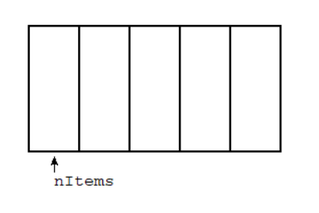
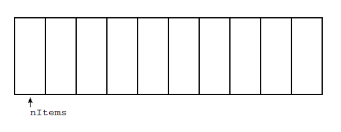

# Arrays, Vectors, Strings

## Contents

 - **Basics:**
   - [Constructor](#constructor)
   - [Array class (complete code)](src/python/Array.py)
 - **Length or Size:**
   - [Checking how many elements have the array](#checking-how-many-elements-have-the-array)
 - **Insertion:**
   - [Insert a new element at end](#insert-at-end)
 - **Traversal:**
   - [Traversing arrays from the beginning](#traversing-arrays-from-beginning)
 - **Deletion:**
   - [Deleting an element by value](#deleting-by-value)
 - **Sorting:**
 - **Search:**
 - **Operations by Index:**
 - **Reverse:**
 - **Split:**
 - **Clone or Copy:**
 - **Intersection and Union:**
 - **Detect Loops:**
 - **Concatenation:**
 - **Merge:**
 - **Tips & Tricks:**
 - [REFERENCES](#ref)


<!--- ( Basics ) --->

---

<div id="constructor"></div>

## Constructor

A constructor for an **Array class** is very simple. For example, see the code below:

[Array.py](src/python/Array.py)
```python
class Array:
    def __init__(self, size):
        self.size = size
        self.__arr = [None] * size
        self.nItems = 0
```

See that:

 - **The constructor receives an initial "size":**
   - How Arrays are *fixed size* Data Structures your constructor receives a value (int value) to init your size.
   - The "size" value will be saved to be used later for the instance.
 - **We create an empty list "__arr" to store the new elements:**
   - This empty list initially will be None.
   - This empty list also will be multiplied by the initial size. This is because the Array is (need be) fixed size.
 - **Finally, we have "nItems" variable initialized as zero (0) to count how many elements has the Array.**

For example, see the images below:

**Example, size=5:**
  

**Example, size=10:**
  

**Example, size=15:**
  

Looking at the examples above we can note that:

 - The greater (quanto maior) the size we pass, the more elements can be stored.
 - The "nItems" variable has the index of the first empty block of the Array:
   - In truth, "nItems" variable always has the index of the last empty block.

> **Okay, but how does it work on Python?**

[test_constructor.py](src/python/test_constructor.py)
```python
import Array as arr

if __name__ == "__main__":
    myArray = arr.Array(size=10)
    myArray.traverse()  # Array with size=10 and None values.
    print("Number of elements:", myArray.__len__(), "\n")
```

**OUTPUT:**
```bash
Array: [None, None, None, None, None, None, None, None, None, None]
Number of elements: 0
```

See that:

 - We have an array with the "size=10" filled as "None."
 - And the "nItems" counter is 0, that's, the Array is empty.


---

<!--- ( Length or Size ) --->

<div id="checking-how-many-elements-have-the-array"></div>

## Checking how many elements have the array

To check how many elements have the array we just need to return the value of the "nItems" variable. For example, see the code below:

[Array.py](src/python/Array.py)
```python
def __len__(self):
    return self.nItems
```

 - See that to check the Array size we need only return the value of the "nItems" variable.
 - "nItems" is a counter variable that counts *"+1"* or *"-1"* when we *add* or *remove* an element.

Let's see how it works in Python, step by step:

[test_len.py](src/python/test_len.py)
```python
import Array as arr

if __name__ == "__main__":

    # Array with size=10 and None values.
    myArray = arr.Array(size=10)

    myArray.traverse()
    print("Number of elements:", myArray.__len__(), "\n")

    myArray.insert_at_end(10)
    myArray.traverse()
    print("Number of elements:", myArray.__len__(), "\n")

    myArray.insert_at_end(20)
    myArray.traverse()
    print("Number of elements:", myArray.__len__(), "\n")

    myArray.insert_at_end(30)
    myArray.traverse()
    print("Number of elements:", myArray.__len__(), "\n")

    myArray.insert_at_end(40)
    myArray.traverse()
    print("Number of elements:", myArray.__len__(), "\n")

    myArray.insert_at_end(50)
    myArray.traverse()
    print("Number of elements:", myArray.__len__(), "\n")

    myArray.insert_at_end(60)
    myArray.traverse()
    print("Number of elements:", myArray.__len__(), "\n")

    myArray.insert_at_end(70)
    myArray.traverse()
    print("Number of elements:", myArray.__len__(), "\n")

    myArray.insert_at_end(80)
    myArray.traverse()
    print("Number of elements:", myArray.__len__(), "\n")

    myArray.insert_at_end(90)
    myArray.traverse()
    print("Number of elements:", myArray.__len__(), "\n")

    myArray.insert_at_end(99)
    myArray.traverse()
    print("Number of elements:", myArray.__len__(), "\n")
```

**OUTPUT:**
```bash
Array: [None, None, None, None, None, None, None, None, None, None]
Number of elements: 0 

Array: [10, None, None, None, None, None, None, None, None, None]
Index: 0, Item: 10
Number of elements: 1 

Array: [10, 20, None, None, None, None, None, None, None, None]
Index: 0, Item: 10
Index: 1, Item: 20
Number of elements: 2 

Array: [10, 20, 30, None, None, None, None, None, None, None]
Index: 0, Item: 10
Index: 1, Item: 20
Index: 2, Item: 30
Number of elements: 3 

Array: [10, 20, 30, 40, None, None, None, None, None, None]
Index: 0, Item: 10
Index: 1, Item: 20
Index: 2, Item: 30
Index: 3, Item: 40
Number of elements: 4 

Array: [10, 20, 30, 40, 50, None, None, None, None, None]
Index: 0, Item: 10
Index: 1, Item: 20
Index: 2, Item: 30
Index: 3, Item: 40
Index: 4, Item: 50
Number of elements: 5

Array: [10, 20, 30, 40, 50, 60, None, None, None, None]
Index: 0, Item: 10
Index: 1, Item: 20
Index: 2, Item: 30
Index: 3, Item: 40
Index: 4, Item: 50
Index: 5, Item: 60
Number of elements: 6

Array: [10, 20, 30, 40, 50, 60, 70, None, None, None]
Index: 0, Item: 10
Index: 1, Item: 20
Index: 2, Item: 30
Index: 3, Item: 40
Index: 4, Item: 50
Index: 5, Item: 60
Index: 6, Item: 70
Number of elements: 7

Array: [10, 20, 30, 40, 50, 60, 70, 80, None, None]
Index: 0, Item: 10
Index: 1, Item: 20
Index: 2, Item: 30
Index: 3, Item: 40
Index: 4, Item: 50
Index: 5, Item: 60
Index: 6, Item: 70
Index: 7, Item: 80
Number of elements: 8

Array: [10, 20, 30, 40, 50, 60, 70, 80, 90, None]
Index: 0, Item: 10
Index: 1, Item: 20
Index: 2, Item: 30
Index: 3, Item: 40
Index: 4, Item: 50
Index: 5, Item: 60
Index: 6, Item: 70
Index: 7, Item: 80
Index: 8, Item: 90
Number of elements: 9

Array: [10, 20, 30, 40, 50, 60, 70, 80, 90, 99]
Index: 0, Item: 10
Index: 1, Item: 20
Index: 2, Item: 30
Index: 3, Item: 40
Index: 4, Item: 50
Index: 5, Item: 60
Index: 6, Item: 70
Index: 7, Item: 80
Index: 8, Item: 90
Index: 9, Item: 99
Number of elements: 10
```

> **NOTE:**  
> - If you pay attention the indexes after inserting the first element are different of the number of elements (nItems).
> - This is because the indexes are references to the "Array (__arr)" and "nItems" is counter to how many elements have the array.


---

<!--- ( Insertion ) --->

<div id="insert-at-end"></div>

## Insert a new element at end

A common approach to insert in Arrays is **"insert at the end"**. For example, imagine we have an Array with the size=5:

  

See that:

 - How "nItems" variable always has the index of the last empty block we can always insert at index = "nItems".
 - However, we can see that when our Array is full the variable "nItems" has an invalid value:
   - Knowing this, we need to check if the "nItems" variable has an invalid value before inserting a new value.
   - Here we can use the "size" instance variable to check:
     - `if self.nItems >= self.size`

Let's, see the code to do all this:

[Array.py](src/python/Array.py)
```python
def insert_at_end(self, item):
    if self.nItems >= self.size:
        print("Array is full!")
        return None  # Stop the function, Array is full.
    self.__arr[self.nItems] = item
    self.nItems += 1
```

> **NOTE:**
> See that we always need to increment "nItems" variable after inserting a new value to ensure we have the index of the last empty block in the "nItems" variable.

Let's see how it works in Python:

[test_insert_at_end.py](src/python/test_insert_at_end.py)
```python
import Array as arr

if __name__ == "__main__":

    # Array with size=10 and None values.
    myArray = arr.Array(size=10)

    myArray.traverse()
    print("Number of elements:", myArray.__len__(), "\n")

    myArray.insert_at_end(10)
    myArray.traverse()
    print("Number of elements:", myArray.__len__(), "\n")

    myArray.insert_at_end(20)
    myArray.traverse()
    print("Number of elements:", myArray.__len__(), "\n")

    myArray.insert_at_end(30)
    myArray.traverse()
    print("Number of elements:", myArray.__len__(), "\n")

    myArray.insert_at_end(40)
    myArray.traverse()
    print("Number of elements:", myArray.__len__(), "\n")

    myArray.insert_at_end(50)
    myArray.traverse()
    print("Number of elements:", myArray.__len__(), "\n")

    myArray.insert_at_end(60)
    myArray.traverse()
    print("Number of elements:", myArray.__len__(), "\n")

    myArray.insert_at_end(70)
    myArray.traverse()
    print("Number of elements:", myArray.__len__(), "\n")

    myArray.insert_at_end(80)
    myArray.traverse()
    print("Number of elements:", myArray.__len__(), "\n")

    myArray.insert_at_end(90)
    myArray.traverse()
    print("Number of elements:", myArray.__len__(), "\n")

    myArray.insert_at_end(99)
    myArray.traverse()
    print("Number of elements:", myArray.__len__(), "\n")
```

**OUTPUT:**
```bash
Array: [None, None, None, None, None, None, None, None, None, None]
Number of elements: 0 

Array: [10, None, None, None, None, None, None, None, None, None]
Index: 0, Item: 10
Number of elements: 1 

Array: [10, 20, None, None, None, None, None, None, None, None]
Index: 0, Item: 10
Index: 1, Item: 20
Number of elements: 2 

Array: [10, 20, 30, None, None, None, None, None, None, None]
Index: 0, Item: 10
Index: 1, Item: 20
Index: 2, Item: 30
Number of elements: 3 

Array: [10, 20, 30, 40, None, None, None, None, None, None]
Index: 0, Item: 10
Index: 1, Item: 20
Index: 2, Item: 30
Index: 3, Item: 40
Number of elements: 4 

Array: [10, 20, 30, 40, 50, None, None, None, None, None]
Index: 0, Item: 10
Index: 1, Item: 20
Index: 2, Item: 30
Index: 3, Item: 40
Index: 4, Item: 50
Number of elements: 5 

Array: [10, 20, 30, 40, 50, 60, None, None, None, None]
Index: 0, Item: 10
Index: 1, Item: 20
Index: 2, Item: 30
Index: 3, Item: 40
Index: 4, Item: 50
Index: 5, Item: 60
Number of elements: 6 

Array: [10, 20, 30, 40, 50, 60, 70, None, None, None]
Index: 0, Item: 10
Index: 1, Item: 20
Index: 2, Item: 30
Index: 3, Item: 40
Index: 4, Item: 50
Index: 5, Item: 60
Index: 6, Item: 70
Number of elements: 7

Array: [10, 20, 30, 40, 50, 60, 70, 80, None, None]
Index: 0, Item: 10
Index: 1, Item: 20
Index: 2, Item: 30
Index: 3, Item: 40
Index: 4, Item: 50
Index: 5, Item: 60
Index: 6, Item: 70
Index: 7, Item: 80
Number of elements: 8

Array: [10, 20, 30, 40, 50, 60, 70, 80, 90, None]
Index: 0, Item: 10
Index: 1, Item: 20
Index: 2, Item: 30
Index: 3, Item: 40
Index: 4, Item: 50
Index: 5, Item: 60
Index: 6, Item: 70
Index: 7, Item: 80
Index: 8, Item: 90
Number of elements: 9

Array: [10, 20, 30, 40, 50, 60, 70, 80, 90, 99]
Index: 0, Item: 10
Index: 1, Item: 20
Index: 2, Item: 30
Index: 3, Item: 40
Index: 4, Item: 50
Index: 5, Item: 60
Index: 6, Item: 70
Index: 7, Item: 80
Index: 8, Item: 90
Index: 9, Item: 99
Number of elements: 10
```


---

<!--- ( Traversal ) --->

<div id="traversing-arrays-from-beginning"></div>

## Traversing arrays from the beginning

> Traversing an array is very easy. You just need to traverse all elements in the **"nItems"** variable.

The code to do all this is:

[Array.py](src/python/Array.py)
```python
def traverse(self):
    print("Array:", self.__arr)  # Prin all Array elements.
    for current_index in range(self.nItems):
        # Print current element and index.
        print(f"Index: {current_index}, Item: {self.__arr[current_index]}")
```

Let's see how it works in Python:

[test_traverse.py](src/python/test_traverse.py)
```python
import Array as arr

if __name__ == "__main__":

    # Array with size=10 and None values.
    myArray = arr.Array(size=10)

    myArray.traverse()
    print("Number of elements:", myArray.__len__(), "\n")

    myArray.insert_at_end(10)
    myArray.traverse()
    print("Number of elements:", myArray.__len__(), "\n")

    myArray.insert_at_end(20)
    myArray.traverse()
    print("Number of elements:", myArray.__len__(), "\n")

    myArray.insert_at_end(30)
    myArray.traverse()
    print("Number of elements:", myArray.__len__(), "\n")

    myArray.insert_at_end(40)
    myArray.traverse()
    print("Number of elements:", myArray.__len__(), "\n")

    myArray.insert_at_end(50)
    myArray.traverse()
    print("Number of elements:", myArray.__len__(), "\n")

    myArray.insert_at_end(60)
    myArray.traverse()
    print("Number of elements:", myArray.__len__(), "\n")

    myArray.insert_at_end(70)
    myArray.traverse()
    print("Number of elements:", myArray.__len__(), "\n")

    myArray.insert_at_end(80)
    myArray.traverse()
    print("Number of elements:", myArray.__len__(), "\n")

    myArray.insert_at_end(90)
    myArray.traverse()
    print("Number of elements:", myArray.__len__(), "\n")

    myArray.insert_at_end(99)
    myArray.traverse()
    print("Number of elements:", myArray.__len__(), "\n")
```

**OUTPUT:**
```bash
Array: [None, None, None, None, None, None, None, None, None, None]
Number of elements: 0 

Array: [10, None, None, None, None, None, None, None, None, None]
Index: 0, Item: 10
Number of elements: 1 

Array: [10, 20, None, None, None, None, None, None, None, None]
Index: 0, Item: 10
Index: 1, Item: 20
Number of elements: 2 

Array: [10, 20, 30, None, None, None, None, None, None, None]
Index: 0, Item: 10
Index: 1, Item: 20
Index: 2, Item: 30
Number of elements: 3 

Array: [10, 20, 30, 40, None, None, None, None, None, None]
Index: 0, Item: 10
Index: 1, Item: 20
Index: 2, Item: 30
Index: 3, Item: 40
Number of elements: 4 

Array: [10, 20, 30, 40, 50, None, None, None, None, None]
Index: 0, Item: 10
Index: 1, Item: 20
Index: 2, Item: 30
Index: 3, Item: 40
Index: 4, Item: 50
Number of elements: 5 

Array: [10, 20, 30, 40, 50, 60, None, None, None, None]
Index: 0, Item: 10
Index: 1, Item: 20
Index: 2, Item: 30
Index: 3, Item: 40
Index: 4, Item: 50
Index: 5, Item: 60
Number of elements: 6 

Array: [10, 20, 30, 40, 50, 60, 70, None, None, None]
Index: 0, Item: 10
Index: 1, Item: 20
Index: 2, Item: 30
Index: 3, Item: 40
Index: 4, Item: 50
Index: 5, Item: 60
Index: 6, Item: 70
Number of elements: 7

Array: [10, 20, 30, 40, 50, 60, 70, 80, None, None]
Index: 0, Item: 10
Index: 1, Item: 20
Index: 2, Item: 30
Index: 3, Item: 40
Index: 4, Item: 50
Index: 5, Item: 60
Index: 6, Item: 70
Index: 7, Item: 80
Number of elements: 8

Array: [10, 20, 30, 40, 50, 60, 70, 80, 90, None]
Index: 0, Item: 10
Index: 1, Item: 20
Index: 2, Item: 30
Index: 3, Item: 40
Index: 4, Item: 50
Index: 5, Item: 60
Index: 6, Item: 70
Index: 7, Item: 80
Index: 8, Item: 90
Number of elements: 9

Array: [10, 20, 30, 40, 50, 60, 70, 80, 90, 99]
Index: 0, Item: 10
Index: 1, Item: 20
Index: 2, Item: 30
Index: 3, Item: 40
Index: 4, Item: 50
Index: 5, Item: 60
Index: 6, Item: 70
Index: 7, Item: 80
Index: 8, Item: 90
Index: 9, Item: 99
Number of elements: 10
```


---

<!--- ( Deletion ) --->

<div id="deleting-by-value"></div>

## Deleting an element by value

To understand how to delete an element by value see the examples below. For example, imagine we need to delete the value "25" from the following array:

  

See that we need to iterable by all elements until "nItems" variable. For example, let's, see a not full Array:

  

Now, let's see an example where we have the value to delete in the array. For example, item=50:

  

See that:

 - First we find the element, item=50.
 - Moves the next elements to the left blocks:
   - Here we rewrite the elements from the right of the deleted value to the left.
 - Finally, decrements the "nItems" variable.

Now let's see the code to do all this:

[Array.py](src/python/Array.py)
```python
def delete(self, item):
    for current_item in range(self.nItems):
        if self.__arr[current_item] == item:
            # Here we need to decrement nItems (self.nItems-1)
            # to avoid index error in fully arrays.
            for moved_item in range(current_item, self.nItems-1):
                self.__arr[moved_item] = self.__arr[moved_item + 1]
            self.nItems -= 1  # One fewer in array now.
            return True  # Return success flag.
    return False  # Made it here, so couldn't find the item.
```

Let's see how it works in Python:

[test_delete-v1.py](src/python/test_delete-v1.py)
```python
import Array as arr

if __name__ == "__main__":

    # Array with size=10 and None values.
    myArray = arr.Array(size=10)

    myArray.insert_at_end(10)
    myArray.insert_at_end(20)
    myArray.insert_at_end(30)
    myArray.insert_at_end(40)
    myArray.insert_at_end(50)
    myArray.insert_at_end(60)
    myArray.insert_at_end(70)
    myArray.insert_at_end(80)
    myArray.insert_at_end(90)
    myArray.insert_at_end(99)

    print("Before delete element '50':")
    myArray.traverse()

    myArray.delete(50)
    print("\nAfter delete element '50':")
    myArray.traverse()
```

**OUTPUT:**
```bash
Before delete element '50':
Array: [10, 20, 30, 40, 50, 60, 70, 80, 90, 99]
Index: 0, Item: 10
Index: 1, Item: 20
Index: 2, Item: 30
Index: 3, Item: 40
Index: 4, Item: 50
Index: 5, Item: 60
Index: 6, Item: 70
Index: 7, Item: 80
Index: 8, Item: 90
Index: 9, Item: 99

After delete element '50':
Array: [10, 20, 30, 40, 60, 70, 80, 90, 99, 99]
Index: 0, Item: 10
Index: 1, Item: 20
Index: 2, Item: 30
Index: 3, Item: 40
Index: 4, Item: 60
Index: 5, Item: 70
Index: 6, Item: 80
Index: 7, Item: 90
Index: 8, Item: 99
```

See that:

 - We remove the element "50" by rewriting the elements right to the left.
 - The index=9 is not more present in the "nItems" counter variable:
   - This is because we decrement the variable "nItems" by 1.
 - However, we can see that the value “99” **is still (ainda está)** in the array:
   - We simply don't point to it with the "nItems" counter variable.

Now, let's see an example with an array not full:

[test_delete-v2.py](src/python/test_delete-v2.py)
```python
import Array as arr

if __name__ == "__main__":

    # Array with size=10 and None values.
    myArray = arr.Array(size=10)

    myArray.insert_at_end(10)
    myArray.insert_at_end(20)
    myArray.insert_at_end(30)
    myArray.insert_at_end(40)
    myArray.insert_at_end(50)

    print("Before delete element '50':")
    myArray.traverse()

    myArray.delete(50)
    print("\nAfter delete element '50':")
    myArray.traverse()
```

**OUPUT:**
```bash
Array: [10, 20, 30, 40, 50, None, None, None, None, None]
Index: 0, Item: 10
Index: 1, Item: 20
Index: 2, Item: 30
Index: 3, Item: 40
Index: 4, Item: 50

After delete element '50':
Array: [10, 20, 30, 40, 50, None, None, None, None, None]
Index: 0, Item: 10
Index: 1, Item: 20
Index: 2, Item: 30
Index: 3, Item: 40
```

> **NOTE:**  
> - See that again we don't remove the element from the array.
> - We just ignore it with the "nItems" counter variable.


---

<!--- ( Tips & Tricks ) --->

<div id="The Duplicates Issue"></div>

## The duplicates items issue

> To understand **"the duplicates items issue"** see the two examples below.

### Searching without Duplicates

When you design a data storage structure, you need to decide whether items with duplicate keys will be allowed.

 - If you’re writing a data storage program in which duplicates are not allowed, you may need to guard against human error during an insertion.
 - Checking all the data items in the array to ensure (garantir) that not one of them already has the same key value as the item being inserted.
 - **NOTE:** This check increases the steps required for an insertion from *1* to *N*:
   - This is because the Algorithm now needs to check all elements, that's, "N" times.

### Searching with Duplicates

 - Allowing duplicates complicates the search algorithm. Even if the search finds a match, it must continue looking for possible additional matches until the last occupied cell.
 - At least, this is one approach; you could also stop after the first match and perform subsequent searches after that.
 - How you proceed depends on whether the question is:
   - “Find me everyone with the family name of Smith”.
   - “Find me someone with the family name of Smith”.
   - “Find how many entries have the family name Smith”.
 - Finding all items matching a search key is an exhaustive search.
 - **NOTE:** Exhaustive searches require *N* steps because the algorithm must go all the way to the last occupied cell, regardless of what is being sought.

> **NOTE:**
> You need to worry about duplicate items to **Insertion**, **Deletion**, **Traversal**, and **Search**.

The table below shows the **average (here the focus is the average)** number of comparisons and moves for the four operations.

|               | **No Duplicates**          | **Duplicates OK**                  |
|---------------|----------------------------|------------------------------------|
| **Insertion** | <sup>N</sup>/<sub>2</sub> comparisons            | N comparisons                      |
| **Deletion**  | No comparisons, one move   | No comparisons, one move           |
| **Traversal** | <sup>N</sup>/<sub>2</sub> comparisons, <sup>N</sup>/<sub>2</sub> moves | N comparisons, more than <sup>N</sup>/<sub>2</sub> moves |
| **Search**    | N processing steps         | N processing steps                 |

 - First where no duplicates are allowed and then where they are allowed.
 - **N** is the number of items in the array.
 - Inserting a new item counts as one move.


<!--- ( REFERENCES ) --->

---

<div id="ref"></div>

## REFERENCES

 - [Data Structures & Algorithms in Python](https://learning.oreilly.com/library/view/data-structures/9780134855912/)

---

Ro**drigo** **L**eite da **S**ilva - **drigols**
