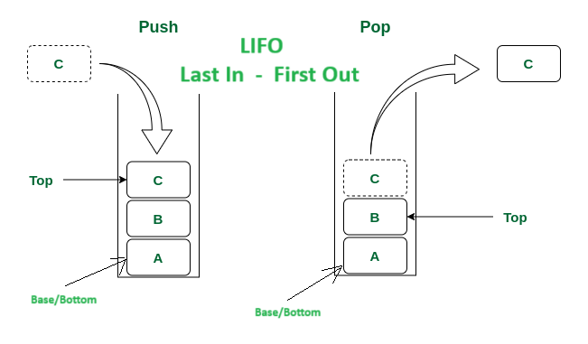
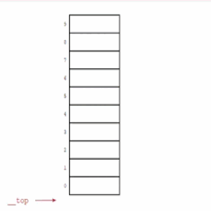

# Stacks (LIFO: Last-In, First-Out)

## Contents

 - **Basics:**
   - [Intro to Stacks](#intro-to-stacks)
 - **Stack using Arrays (Fixed Size Approach):**
   - [Stack class using Array](#stack-class-using-array)
   - [Useful methods len(), isEmpty() and isFull() | O(1)](#stack-using-array-useful-methods)
   - [Add an Item to the Stack | push() method | O(1)](#stack-using-array-push)
   - [Remove an Item from the Stack | pop() method | O(1)](#stack-using-array-pop)
   - [Get the "top" item from the Stack | peek() method | O(1)](#stack-using-array-peek)
   - [Traversing a Stack | traverse() method | O(n)](#stack-using-array-traverse)
 - **Stack using Linked List (Dynamic Size Approach):**
   - [Stack class using Linked List](#stack-class-using-linked-list)
   - [Useful methods len(), isEmpty() | O(1)](#stack-using-linkedlist-useful-methods)
   - [Add an Item to the Stack | push() method | O(1)](#stack-using-linkedlist-push)
   - [Remove an Item from the Stack | pop() method | O(1)](#stack-using-linked-list-pop)
   - [Get the "top" item from the Stack | peek() method | O(1)](#stack-using-linkedlist-peek)
   - [Traversing a Stack | traverse() method | O(n)](#stack-using-linkedlist-traverse)
 - **Stack using Python Built-in Functions (append/pop):**
   - [Stack class using Python Built-in Functions](#stack-class-using-python-builtin)
   - [Useful methods len(), isEmpty() | O(1)](#stack-using-python-builtin-useful-methods)
   - [Add an Item to the Stack | push() method | O(1)](#stack-using-python-builtin-push)
   - [Remove an Item from the Stack | pop() method | O(1)](#stack-using-python-builtin-list-pop)
   - [Get the "top" item from the Stack | peek() method | O(1)](#stack-using-python-builtin-peek)
   - [Traversing a Stack | traverse() method | O(n)](#stack-using-python-builtin-traverse)
 - **Problems:**
   - **Reverse Stack:**
     - [Intro to Reverse Stack problems (e.g. Undo/Redo Operations)](#reverse-stack-theory)
     - [Reversing a Word/Phrase](#reversing-word-phrase)
 - [REFERENCES](#ref)


---

<!--- ( Basics ) --->

<div id="intro-to-stacks"></div>

## Intro to Stacks

> A **Stack (sometimes called a “push-down stack”)** is a collection of items where the *addition* and *removal* of items always take the *same place*.

See the image below to understand more easily:

  

See that:

 - **The "addition" and "removal" are in the same place**.
 - **The "last item" to enter is referred to as "top":**
   - This item (top) is the first to leave from the Stack.
 - **The "first item" to enter is referred to as "base (or bottom)":**
   - This item (base/bottom) is the last to leave from the Stack.
 - **NOTE: The Stack data structure uses a "LIFO (Last-In, First-Out)" ordering principle.**

Let's see another example of the Stack, however, using animation visualization:

  

See that:

 - The **"last item"** to enter *(last in)*;
 - Is the **"first item"** to out *(first out)*.

We have two approaches to implementing Stacks:

 - **Fixed Size Stack (Array implementation):**
   - As the name suggests, a fixed size stack has a fixed size and cannot grow or shrink dynamically.
   - If the stack is full and an attempt is made to add an element to it, an *Overflow error occurs*.
   - If the stack is empty and an attempt is made to remove an element from it, an *Underflow error occurs*.
   - **Advantages:**
     - Easy to implement.
     - Memory is saved as pointers are not involved.
   - **Disadvantages:**
     - It is not dynamic i.e., it doesn’t grow and shrink depending on needs at runtime. [But in case of dynamic sized arrays like vector in C++, list in Python, ArrayList in Java, stacks can grow and shrink with array implementation as well].
     - The total size of the stack must be defined beforehand.
 - **Dynamic Size Stack (Linked List implementation):**
   - A dynamic size stack can grow or shrink dynamically.
   - When the stack is full, it automatically increases its size to accommodate the new element, and when the stack is empty, it decreases its size.
   - This type of stack is implemented using a *Linked List*, as it allows for easy resizing of the stack.
   - **Advantages:**
     - The linked list implementation of a stack can grow and shrink according to the needs at runtime.
     - It is used in many virtual machines like JVM.
   - **Disadvantages:**
     - Requires extra memory due to the involvement of pointers.
     - Random accessing is not possible in stack.


<!--- ( Stack using Arrays (Fixed Size Approach) ) --->

---

<div id="stack-class-using-array"></div>

## Stack class using Array

Here, let's see how to implement a Stack class using an Array (fixed size) approach.

Let's start by understanding the constructor:

**Python:** [stacks.py](src/python/stacks.py)
```python
def __init__(self, size):
    self.size = size          # O(1)
    self.arr = [None] * size  # O(1)
    self.top = -1             # O(1)
```

$f(n) = O(1) + O(1) + O(1)$
$f(n) = O(1)$

### Complexity Explanation

 - **Time Complexity: O(1)**
   - The *Time Complexity* of this code is **O(1)** because all the operations (assignment, indexing) are constant time operations.
 - **Space Complexity: O(n)**
   - The *Space Complexity* is **O(n)** because we are creating an array of size *"size"* which requires **O(n)** space.

### Code Explanation

 - Here we have instance variables similar (parecidas) to Array class implementation:
   - However, here let's use them to apply Stack concepts (LIFO).
 - The "size" variable is used later to check if the Stack is full or not.
 - The **"top variable"** **represent the index** of the **top item in the Stack**:
   - Knowing that, we start with -1, and when is incremented "+1" is 0.
   - This approach is interesting when we want a variable that needs to represent an index of the array/list.
   - **NOTE: However, we need pay attention:**
     - When we need the index of the element in the Stack use just the "top" variable.
     - When we need to count elements in the Stack we can use **"top+1"**.

Now, let's test in the practice:

**Python:**
```python
from stacks import StackUsingArray

if __name__ == "__main__":

    myStack = StackUsingArray(5)
    print(f"Stack: {myStack.arr}")
```

**OUTPUT:**  
```bash
Stack: [None, None, None, None, None]
```

---

<div id="stack-using-array-useful-methods"></div>

## Useful methods len(), isEmpty() and isFull() | O(1)

To work with Stacks is common to first implement useful methods to use later:

**Python:** [stacks.py](src/python/stacks.py)
```python
def __len__(self):
    return self.top + 1  # O(1)

def isEmpty(self):
    return self.top == -1  # O(1)

def isFull(self):
    return self.top + 1 == self.size  # O(1)
```

### Complexity Explanation

 - **Time Complexity: O(1)**
   - The *Time Complexity* of each of these methods is **O(1)** because they each perform a constant number of operations, regardless of the size of the stack. 
 - **Space Complexity: O(1)**
   - The *Space Complexity* is also **O(1)** because no additional space is used beyond the variables used in the methods.

### Code Explanation

 - `__len__():`
   - The `__len__()` method returns the length of the Stack.
   - **NOTE:** Here *"self.top+1"* is used as count, not index.
 - **isEmpty():**
   - The *isEmpty()* method returns a verification if the Stack is empty.
 - **isFull():**
   - The *isEmpty()* method returns a verification if the Stack is full.

---

<div id="stack-using-array-push"></div>

## Add an Item to the Stack | push() method | O(1)

Now, let's see how to add a new item in the Stack, that's, implement **push()** method:

**Python:** [stacks.py](src/python/stacks.py)
```python
def push(self, item):
    if self.isFull():                # O(1)
        print("The Stack is full.")  # O(1)
        return None                  # O(1)
    self.top += 1                    # O(1)
    self.arr[self.top] = item        # O(1)
```

$f(n) = O(1) + O(1) + O(1) + O(1) + O(1)$
$f(n) = O(1)$

### Complexity Explanation

 - **Time Complexity: O(1)**
   - The *Time Complexity* of the push() method is **O(1)** because it only involves a constant number of operations, regardless of the size of the stack.
 - **Space Complexity: O(1)**
   - The *Space Complexity* of the push() method is also **O(1)** because it does not require any additional space that grows with the input size.

### Code Explanation

 - First, we need to check if the Stack is full.
 - Next, how do we set the "top variable" as "-1" we need to first increment "+1":
   - This is because if the list (stack) is empty we can't insert at index "-1".
 - Finally, we just need to insert a new element at index "top", **"arr[self.top]"**.

Now, let's test in the practice:

**Python:**
```python
from stacks import StackUsingArray

if __name__ == "__main__":

    myStack = StackUsingArray(5)
    myStack.traverse()
    print("")

    myStack.push(10)
    myStack.traverse()
    print("")

    myStack.push(20)
    myStack.traverse()
    print("")

    myStack.push(30)
    myStack.traverse()
    print("")

    myStack.push(40)
    myStack.traverse()
    print("")

    myStack.push(50)
    myStack.traverse()
```

**OUTPUT:**  
```bash
The Stack is empty.

Stack: [10, None, None, None, None]
Index: 0, Item: 10

Stack: [10, 20, None, None, None]
Index: 0, Item: 10
Index: 1, Item: 20

Stack: [10, 20, 30, None, None]
Index: 0, Item: 10
Index: 1, Item: 20
Index: 2, Item: 30

Stack: [10, 20, 30, 40, None]
Index: 0, Item: 10
Index: 1, Item: 20
Index: 2, Item: 30
Index: 3, Item: 40

Stack: [10, 20, 30, 40, 50]
Index: 0, Item: 10
Index: 1, Item: 20
Index: 2, Item: 30
Index: 3, Item: 40
Index: 4, Item: 50
```

> **NOTE:**  
> - Looking at the output, we need to think that the "top" of the Stack is the higher index of the Array.
> - In other words, the end of the Array (Stack).

---

<div id="stack-using-array-pop"></div>

## Remove an Item from the Stack | pop() method | O(1)

To remove an item from the Stack, we need to implement the **pop()** method:

**Python:** [stacks.py](src/python/stacks.py)
```python
def pop(self):
    if self.isEmpty():                # O(1)
        print("The Stack is empty.")  # O(1)
        return None                   # O(1)
    popped_item = self.arr[self.top]  # O(1)
    self.arr[self.top] = None         # O(1)
    self.top -= 1                     # O(1)
    return popped_item                # O(1)
```

$f(n) = O(1) + O(1) + O(1) + O(1) + O(1) + O(1) + O(1)$
$f(n) = O(1)$

### Complexity Explanation

 - **Time Complexity: O(1)**
   - The *Time Complexity* of the pop() method is **O(1)** because it only involves a constant number of operations, regardless of the size of the stack.
 - **Space Complexity: O(1)**
   - The *Space Complexity* of the pop() method is also **O(1)** because it does not require any additional space that grows with the input size.

### Code Explanation

 - First, we need to check if the Stack is empty.
 - Next, we save the "top" item to return later.
 - Next, we set the last item (top) in the Stack as "None":
   - The last item in the Stack is **"arr[self.top]"**:
 - Next, we need to decrement the "top" (index) variable.
 - Finally, return the value of the old "top".

Now, let's test in the practice:

**Python:**
```python
from stacks import StackUsingArray

if __name__ == "__main__":

    myStack = StackUsingArray(5)

    popped_item = myStack.pop()
    print("Popped item: ", popped_item)

    myStack.push(10)
    myStack.push(20)
    myStack.push(30)
    myStack.push(40)
    myStack.push(50)
    print("\nStack Example (5/5):")
    myStack.traverse()
    print("")

    # 10->20->30->40
    popped_item = myStack.pop()
    print("Popped item: ", popped_item)
    myStack.traverse()
    print("")

    # 10->20->30
    popped_item = myStack.pop()
    print("Popped item: ", popped_item)
    myStack.traverse()
    print("")

    # 10->20
    popped_item = myStack.pop()
    print("Popped item: ", popped_item)
    myStack.traverse()
    print("")

    # 10
    popped_item = myStack.pop()
    print("Popped item: ", popped_item)
    myStack.traverse()
    print("")

    # Remove last item from the stack.
    popped_item = myStack.pop()
    print("Popped item: ", popped_item)
    myStack.traverse()
    print("")

    # Stack is empty.
    popped_item = myStack.pop()
    print("Popped item: ", popped_item)
    myStack.traverse()
    print("")
```

**OUTPUT:**  
```bash
The Stack is empty.
Popped item:  None

Stack Example (5/5):
Stack: [10, 20, 30, 40, 50]
Index: 0, Item: 10
Index: 1, Item: 20
Index: 2, Item: 30
Index: 3, Item: 40
Index: 4, Item: 50

Popped item:  50
Stack: [10, 20, 30, 40, None]
Index: 0, Item: 10
Index: 1, Item: 20
Index: 2, Item: 30
Index: 3, Item: 40

Popped item:  40
Stack: [10, 20, 30, None, None]
Index: 0, Item: 10
Index: 1, Item: 20
Index: 2, Item: 30

Popped item:  30
Stack: [10, 20, None, None, None]
Index: 0, Item: 10
Index: 1, Item: 20

Popped item:  20
Stack: [10, None, None, None, None]
Index: 0, Item: 10

Popped item:  10
The Stack is empty.

The Stack is empty.
Popped item:  None
The Stack is empty.
```

---

<div id="stack-using-array-peek"></div>

## Get the "top" item from the Stack | peek() method | O(1)

Sometimes we need to check which element is at the "top" of the Stack without deleting it. To do this, let's implement the **peek()** method:

**Python:** [stacks.py](src/python/stacks.py)
```python
def peek(self):                       # O(1)
    if self.isEmpty():                # O(1)
        print("The Stack is empty.")  # O(1)
        return None                   # O(1)
    return self.arr[self.top]         # O(1)
```

$f(n) = O(1) + O(1) = O(1) + O(1) + O(1)$
$f(n) = O(1)$

### Complexity Explanation

 - **Time Complexity: O(1)**
   - The *Time Complexity* of this function is **O(1)** because it only performs a constant number of operations, regardless of the size of the stack.
 - **Space Complexity: O(1)**
   - The *Space Complexity* is also **O(1)** because it does not use any additional space that grows with the input size.

### Code Explanation

> **NOTE:**  
> See that we just need to return the element in the array at index "top".

Now, let's test in the practice:

**Python:**
```python
from stacks import StackUsingArray

if __name__ == "__main__":

    myStack = StackUsingArray(5)

    myStack.push(10)
    myStack.traverse()
    print("Item at top:", myStack.peek())
    print("")

    myStack.push(20)
    myStack.traverse()
    print("Item at top:", myStack.peek())
    print("")

    myStack.push(30)
    myStack.traverse()
    print("Item at top:", myStack.peek())
    print("")

    myStack.push(40)
    myStack.traverse()
    print("Item at top:", myStack.peek())
    print("")

    myStack.push(50)
    myStack.traverse()
    print("Item at top:", myStack.peek())
```

**OUTPUT:**  
```bash
Stack: [10, None, None, None, None]
Index: 0, Item: 10
Item at top: 10

Stack: [10, 20, None, None, None]
Index: 0, Item: 10
Index: 1, Item: 20
Item at top: 20

Stack: [10, 20, 30, None, None]
Index: 0, Item: 10
Index: 1, Item: 20
Index: 2, Item: 30
Item at top: 30

Stack: [10, 20, 30, 40, None]
Index: 0, Item: 10
Index: 1, Item: 20
Index: 2, Item: 30
Index: 3, Item: 40
Item at top: 40

Stack: [10, 20, 30, 40, 50]
Index: 0, Item: 10
Index: 1, Item: 20
Index: 2, Item: 30
Index: 3, Item: 40
Index: 4, Item: 50
Item at top: 50
```

---

<div id="stack-using-array-traverse"></div>

## Traversing a Stack | traverse() method | O(n)

Here, let's see how to implement a method to traverse a Stack using the **LIFO (Last In First Out)** approach.

**Python:** [stacks.py](src/python/stacks.py)
```python
def traverse(self):
    if self.isEmpty():                                                     # O(1)
        print("The Stack is empty.")                                       # O(1)
        return None                                                        # O(1)
    print("Stack:", self.arr)                                              # O(1)
    for current_index in range(self.top, -1, -1):                          # O(n)
        print(f"Index: {current_index}, Item: {self.arr[current_index]}")  # O(1)
```

$f(n) = O(1) + O(1) + O(1) + O(1) + O(n) + O(1)$
$f(n) = O(1)$

### Complexity Explanation

 - **Time Complexity: O(n)**
   - The *Time Complexity* of the traverse() method is **O(n)**, where **"n"** is the number of elements in the stack. This is because the method iterates through each element in the stack and prints it, resulting in a *Linear Time Complexity*.
 - **Space Complexity: O(1)**
   - The *Space Complexity* of the traverse() method is **O(1)**, as it does not use any additional space that grows with the input size.

### Code Explanation

**Iterate through Items from "Top" to "Bottom":**
```python
for current_index in range(self.top, -1, -1):
    print(f"Index: {current_index}, Item: {self.arr[current_index]}")
```

 - Starts a for() loop that iterates through the stack's elements from "top" to "bottom":
   - `range(self.top, -1, -1)`
     - Generates a sequence of indices starting from the top index (self.top) and going down to 0 (inclusive).
     - "-1" step ensures the elements are accessed in reverse order, reflecting the stack's **LIFO** nature.


Now, let's test in the practice:

**Python:**
```python
from stacks import StackUsingArray

if __name__ == "__main__":

    myStack = StackUsingArray(5)
    myStack.traverse()
    print("")

    myStack.push(10)
    myStack.traverse()
    print("")

    myStack.push(20)
    myStack.traverse()
    print("")

    myStack.push(30)
    myStack.traverse()
    print("")

    myStack.push(40)
    myStack.traverse()
    print("")

    myStack.push(50)
    myStack.traverse()
```

**OUTPUT:**  
```bash
The Stack is empty.

Stack: [10, None, None, None, None]
Index: 0, Item: 10

Stack: [10, 20, None, None, None]
Index: 1, Item: 20
Index: 0, Item: 10

Stack: [10, 20, 30, None, None]
Index: 2, Item: 30
Index: 1, Item: 20
Index: 0, Item: 10

Stack: [10, 20, 30, 40, None]
Index: 3, Item: 40
Index: 2, Item: 30
Index: 1, Item: 20
Index: 0, Item: 10

Stack: [10, 20, 30, 40, 50]
Index: 4, Item: 50
Index: 3, Item: 40
Index: 2, Item: 30
Index: 1, Item: 20
Index: 0, Item: 10
```


<!--- ( Stack using Linked List (Dynamic Size Approach) ) --->

---

<div id="stack-class-using-linked-list"></div>

## Stack class using Linked List

> To implement a **Stack** using the *Singly Linked List* concept, all the *Singly Linked List* operations should be performed based on Stack operations **LIFO (Last In, First Out)**.

Let's start by implementing the Node class that will be used in the Stack class:

**Python:** [stacks.py](src/python/stacks.py)
```python
class Node:
    def __init__(self, data):
        self.data = data
        self.next = None
```

Ok, now let's implement the Stack class and your constructor:

**Python:** [stacks.py](src/python/stacks.py)
```python
class StackUsingLinkedList(Node):
    def __init__(self):
        self.top = None
        self.size = 0
```

### Code Explanation

 - `self.top = None`
   - The *"head"* in a Linked List is the *"top"* of the Stack.
   - **NOTE:** This is because always we add a new Node in the Linked List (Stack) will be added on the **front** of the Linked List (Stack).
 - `self.size = 0`
   - The *"size"* is the number of Nodes in the Linked List (Stack).

---

<div id="stack-using-linkedlist-useful-methods"></div>

## Useful methods len(), isEmpty() | O(1)

The most common useful method in a Stack using a Linked List are:

 - `__len()__`
 - `isEmpty()`

> **And isFull()?**

**NOTE:**  
The Stack using the Linked List approach is a Dynamic approach. That is, the Stack is never full.

Now, let's see how to implement the `__len()__` and `isEmpty()` methods:

**Python:** [stacks.py](src/python/stacks.py)
```python
def __len__(self):
    return self.size  # O(1)

def isEmpty(self):
    return self.top == None  # O(1)
```

### Complexity Explanation

 - **Time Complexity: O(1)**
   - The *Time Complexity* of both methods is **O(1)** because they both have constant time complexity.
 - **Space Complexity: O(1)**
   - The *Space Complexity* of both methods is also **O(1)** because they do not use any additional space that grows with the input size. They only access and return existing attributes of the object.

---

<div id="stack-using-linkedlist-push"></div>

## Add an Item to the Stack | push() method | O(1)

> To insert a new element in the Stack using Linked List we need to implement a method to do this *dynamically*.

**Python:** [stacks.py](src/python/stacks.py)
```python
def push(self, item):
    if self.isEmpty():            # O(1)
        self.top = Node(item)     # O(1)
        self.size += 1            # O(1)
    else:
        new_node = Node(item)     # O(1)
        new_node.next = self.top  # O(1)
        self.top = new_node       # O(1)
        self.size += 1            # O(1)
```

$f(n) = O(1) + O(1) + O(1) + O(1) + O(1) + O(1) + O(1)$
$f(n) = O(1)$

### Complexity Explanation

 - **Time Complexity: O(1)**
   - The *Time Complexity* of this method is **O(1)** because it takes constant time to perform the operations of creating a new node and updating the head pointer.
 - **Space Complexity: O(1)**
   - The *Space Complexity* of this method is **O(1)** because it does not require any additional space that grows with the input size.

### Code Explanation

**Handle Non-Empty List:**
```python
else:
    new_node = Node(item)
    new_node.next = self.top
    self.top = new_node
    self.size += 1
```

 - `new_node = Node(item)`
   - Creates a new node using the *Node* class to hold the *item*.
 - `new_node.next = self.top`
   - Sets the *"next"* attribute of the *"new_node"* to point to the current *top (head)* of the list, effectively linking the *"new_node"* to the **front** of the existing list.
   - **NOTE:** See that here the *"new_node"* is always set to the front of the list.
 - `self.top = new_node`
   - Updates the *"top (head)"* attribute of the list to point to the newly created node, making it the new *top (head)* of the list.
 - `self.size += 1`
   - Increments the *"size"* attribute to account for the added node.

Now, let's test in the practice:

**Python:**
```python
from stacks import StackUsingLinkedList

if __name__ == "__main__":

    myStack = StackUsingLinkedList()
    myStack.traverse()
    print(f"Stack size: {myStack.__len__()}\n")

    # 10(top/head)
    myStack.push(10)
    myStack.traverse()
    print(f"Stack size: {myStack.__len__()}\n")

    # 20(top/head)->10
    myStack.push(20)
    myStack.traverse()
    print(f"Stack size: {myStack.__len__()}\n")

    # 30(top/head)->20->10
    myStack.push(30)
    myStack.traverse()
    print(f"Stack size: {myStack.__len__()}\n")

    # 40(top/head)->30->20->10
    myStack.push(40)
    myStack.traverse()
    print(f"Stack size: {myStack.__len__()}\n")

    # 50(top/head)->40->30->20->10
    myStack.push(50)
    myStack.traverse()
    print(f"Stack size: {myStack.__len__()}\n")
```

**OUTPUT:**  
```bash
The Stack is empty.
Stack size: 0

10 
Stack size: 1

20 10 
Stack size: 2

30 20 10 
Stack size: 3

40 30 20 10 
Stack size: 4

50 40 30 20 10 
Stack size: 5
```

> **NOTE:**  
> See that this approach insert a new element at the top (front) of the Stack/Linked List - **push()**.

---

<div id="stack-using-linked-list-pop"></div>

## Remove an Item from the Stack | pop() method | O(1)

Now, let's see how to remove (pop) an element from the Stack, that's, implement **pop()** method:

**Python:** [stacks.py](src/python/stacks.py)
```python
def pop(self):
    if self.isEmpty():                # O(1)
        print("The Stack is empty.")  # O(1)
        return None                   # O(1)
    else:
        popped_item = self.top.item   # O(1)
        old_top = self.top            # O(1)
        self.top = self.top.next      # O(1)
        self.size -= 1                # O(1)
        del old_top                   # O(1)
        return popped_item            # O(1)
```

$f(n) = O(1) + O(1) + O(1) + O(1) + O(1) + O(1) + O(1) + O(1) + O(1)$
$f(n) = O(1)$

### Complexity Explanation

 - **Time Complexity: O(1)**
   - The *Time Complexity* of the *pop()* function is **O(1)** because it only performs a constant number of operations regardless of the size of the stack. It accesses the top item, updates the top pointer, decrements the size, and deletes the old top item.
 - **Space Complexity: O(1)**
   - The *Space Complexity* of the *pop()* function is also **O(1)** because it does not use any additional space that grows with the size of the stack. It only uses a constant amount of space to store the popped item, the old top pointer, and a few other variables.

### Code Explanation

**Remove and Return Top Item:**
```python
else:
    popped_item = self.top.item
    old_top = self.top
    self.top = self.top.next
    self.size -= 1
    del old_top
    return popped_item
```

 - `popped_item = self.top.item`
   - Retrieves the *item* value stored in the node currently at the *top* of the stack and stores it in the *popped_item* variable, ready to be returned.
 - `old_top = self.top`
   - Stores a reference to the current *top* node in the *old_top* variable to ensure proper deletion later.
 - `self.top = self.top.next`
   - Updates the *top* attribute of the stack to point to the next node in the list, effectively removing the previous *top* node from the stack's structure.
 - `self.size -= 1`
   - Decrements the *"size"* attribute to reflect the removal of a node.
 - `del old_top`
   - Deletes the old *top* node to free up memory, preventing *memory leaks*.
 - Finally, return the *popped_item* variable to the caller.

Now, let's test in the practice:

**Python:**
```python
from stacks import StackUsingLinkedList

if __name__ == "__main__":
    myStack = StackUsingLinkedList()

    myStack.push(10)  # 10(head)
    myStack.push(20)  # 20(head)->10
    myStack.push(30)  # 30(head)->20->10
    myStack.push(40)  # 40(head)->30->20->10
    myStack.push(50)  # 50(head)->40->30->20->10
    myStack.traverse()

    popped_item = myStack.pop()  # 50(DELETED) | 40(head)->30->20->10
    print("\nPopped item:", popped_item)
    print(f"Stack size: {myStack.__len__()}\n")

    popped_item = myStack.pop()  # 40(DELETED) | 30(head)->20->10
    print("Popped item:", popped_item)
    print(f"Stack size: {myStack.__len__()}\n")

    popped_item = myStack.pop()  # 30(DELETED) | 20(head)->10
    print("Popped item:", popped_item)
    print(f"Stack size: {myStack.__len__()}\n")

    popped_item = myStack.pop()  # 20(DELETED) | 10(head)
    print("Popped item:", popped_item)
    print(f"Stack size: {myStack.__len__()}\n")

    popped_item = myStack.pop()  # 10(DELETED)
    print("Popped item:", popped_item)
    print(f"Stack size: {myStack.__len__()}\n")

    popped_item = myStack.pop()  # The Stack is empty.
    print(f"Stack size: {myStack.__len__()}\n")
```

**OUTPUT:**  
```bash
50 40 30 20 10 

Popped item: 50
Stack size: 4

Popped item: 40
Stack size: 3

Popped item: 30
Stack size: 2

Popped item: 20
Stack size: 1

Popped item: 10
Stack size: 0

The Stack is empty.
Stack size: 0
```

---

<div id="stack-using-linkedlist-peek"></div>

## Get the "top" item from the Stack | peek() method | O(1)

Ok, now let's implement a method to check the item on the top of the Stack, that's, **peek()** method:

**Python:** [stacks.py](src/python/stacks.py)
```python
def peek(self):
    if self.isEmpty():                # O(1)
        print("The Stack is empty.")  # O(1)
        return None                   # O(1)
    else:
        return self.top.item          # O(1)
```

$f(n) = O(1) + O(1) + O(1) + O(1)$
$f(n) = O(1)$

### Complexity Explanation

 - **Time Complexity: O(1)**
   - The *Time Complexity* of the *peek()* method is **O(1)** because it only involves accessing the top item of the stack, which can be done in constant time.
 - **Space Complexity: O(1)**
   - The *Space Complexity of the *peek()* method is also **O(1)** because it does not require any additional space that grows with the input size.

### Code Explanation

 - First, we need to check if the Stack is empty.
 - If the Stack is not empty, we just return the item in the top (head) Node.

Now, let's test in the practice:

**Python:**
```python
from stacks import StackUsingLinkedList

if __name__ == "__main__":
    myStack = StackUsingLinkedList()
    myStack.peek()  # The Stack is empty.
    print("")

    myStack.push(10)  # 10(head/top)
    myStack.traverse()
    print(f"TOP/HEAD->ITEM: {myStack.peek()}\n")

    myStack.push(20)  # 20(head/top)->10
    myStack.traverse()
    print(f"TOP/HEAD->ITEM: {myStack.peek()}\n")

    myStack.push(30)  # 30(head/top)->20->10
    myStack.traverse()
    print(f"TOP/HEAD->ITEM: {myStack.peek()}\n")

    myStack.push(40)  # 40(head/top)->30->20->10
    myStack.traverse()
    print(f"TOP/HEAD->ITEM: {myStack.peek()}\n")

    myStack.push(50)  # 50(head/top)->40->30->20->10
    myStack.traverse()
    print(f"TOP/HEAD->ITEM: {myStack.peek()}")
```

**OUTPUT:**  
```bash
The Stack is empty.

10 
TOP/HEAD->ITEM: 10

20 10 
TOP/HEAD->ITEM: 20

30 20 10 
TOP/HEAD->ITEM: 30

40 30 20 10 
TOP/HEAD->ITEM: 40

50 40 30 20 10 
TOP/HEAD->ITEM: 50
```

---

<div id="stack-using-linkedlist-traverse"></div>

## Traversing a Stack | traverse() method | O(n)

Here, let's see how to implement a method to **traverse()** a Stack using the **LIFO (Last In First Out)** approach.

[stacks.py](src/python/stacks.py)
```python
def traverse(self):
    if self.isEmpty():                # O(1)
        print("The Stack is empty.")  # O(1)
        return None                   # O(1)
    current = self.top                # O(1)
    while current:                    # O(n)
        print(current.item, end=" ")  # O(1)
        current = current.next        # O(1)
    print("")                         # O(1)
```

$f(n) = O(1) + O(1) + O(1) + O(1) + O(n) + O(1) + O(1) + O(1)$
$f(n) = O(n)$

### Complexity Explanation

 - **Time Complexity: O(n)**
   - The *Time Complexity* of this *traverse()* method is **O(n)**, where **"n"** is the number of elements in the stack. This is because we need to iterate through each element in the stack in order to print them.
 - **Space Complexity: O(1)**
   - The *Space Complexity* of this method is **O(1)**, as it does not require any additional space that grows with the input size.


<!--- ( Stack using Python Built-in Functions (append/pop) ) --->

---

<div id="stack-class-using-python-builtin"></div>

## Stack class using Python Built-in Functions

In Python, we can abuse of the **"object orientation"**, **"lists"**, and the **"Built-in Functions"** to create Stacks just by using the **append()** and **pop()** functions to implement the necessary mechanisms in a Stack.

  

Knowing this:

 - We need only to decide which end of the list will be considered the **"top"** of the stack.
 - And which will be the **"base (bottom)"**.

**NOTE:**  
Once that decision is made, the operations can be implemented using the list methods such as **append()** and **pop()**.

Let's start by implementing the class and your constructor:

**Python:** [stacks.py](src/python/stacks.py)
```python
class StackUsingPythonBuiltIn:
    def __init__(self):
        self.stack = []
```

> **NOTE:**
> See that the constructor just creates an empty list.

---

<div id="stack-using-python-builtin-useful-methods"></div>

## Useful methods len(), isEmpty() | O(1)

Here, let's how to implement the useful methods **len()** and **isEmpty()** using the **Built-in Functions**:

**Python:** [stacks.py](src/python/stacks.py)
```python
def __len__(self):
    return len(self.stack)   # O(1)

def isEmpty(self):
    return self.stack == []  # O(1)
```

### Complexity Explanation

 - **Time Complexity: O(1)**
   - The *Time Complexity* of both the `__len__()` and `isEmpty()` functions is **O(1)** because they both perform a constant number of operations, regardless of the size of the stack. 
 - **Space Complexity: O(1)**
   - The *Space Complexity* is also **O(1)** because no additional space is required beyond the stack itself.

---

<div id="stack-using-python-builtin-push"></div>

## Add an Item to the Stack | push() method | O(1)

Here, let's see how implement the **push()** method using the **append()** *Built-In* function:

**Python:** [stacks.py](src/python/stacks.py)
```python
def push(self, item):
    self.stack.append(item)  # O(1)
```

$f(n) = O(1)$

### Complexity Explanation

 - **Time Complexity: O(1)**
   - The *Time Complexity* of the *push()* operation is **O(1)** because appending an item to the end of a list takes constant time.
 - **Space Complexity: O(1)**
   - The *Space Complexity* of the *push()* operation is also **O(1)** because it does not require any additional space proportional to the size of the input.

### Code Explanation

 - See how easy it is, we just insert a new element at the end of the list using the **append()** function.
 - This item inserted always will be the **"top"**.

Now, let's test in the practice:

**Python:**
```python
from stacks import StackUsingPythonBuiltIn

if __name__ == "__main__":
    myStack = StackUsingPythonBuiltIn()

    print(myStack.stack)  # The Stack is empty = [].
    print(f"Stack size/len: {myStack.__len__()}\n")

    myStack.push(10)  # 10(top)
    print(myStack.stack)
    print(f"Stack size/len: {myStack.__len__()}\n")

    myStack.push(20)  # 10->20(top)
    print(myStack.stack)
    print(f"Stack size/len: {myStack.__len__()}\n")

    myStack.push(30)  # 10->20->30(top)
    print(myStack.stack)
    print(f"Stack size/len: {myStack.__len__()}\n")

    myStack.push(40)  # 10->20->30->40(top)
    print(myStack.stack)
    print(f"Stack size/len: {myStack.__len__()}\n")

    myStack.push(50)  # 10->20->30->40->50(top)
    print(myStack.stack)
    print(f"Stack size/len: {myStack.__len__()}\n")
```

**OUTPUT:**  
```bash
[]
Stack size/len: 0

[10]
Stack size/len: 1

[10, 20]
Stack size/len: 2

[10, 20, 30]
Stack size/len: 3

[10, 20, 30, 40]
Stack size/len: 4

[10, 20, 30, 40, 50]
Stack size/len: 5
```

---

<div id="stack-using-python-builtin-list-pop"></div>

## Remove an Item from the Stack | pop() method | O(1)

Here, let's see how implement the **pop()** method using the **pop()** Built-In function:

**Python:** [stacks.py](src/python/stacks.py)
```python
def pop(self):
    if self.isEmpty():                # O(1)
        print("The Stack is empty.")  # O(1)
        return None                   # O(1)
    return self.stack.pop()           # O(1)
```

$f(n) = O(1) + O(1) + O(1) + O(1)$
$f(n) = O(1)$

### Complexity Explanation

 - **Time Complexity: O(1)**
   - The *Time Complexity* of the *pop()* function is **O(1)** because it only involves removing the last element from the stack, which can be done in constant time.
 - **Space Complexity: O(1)**
   - The *Space Complexity* of the *pop()* function is also **O(1)** because it does not require any additional space that grows with the input size.

Now, let's test in the practice:

**Python:**
```python
from stacks import StackUsingPythonBuiltIn

if __name__ == "__main__":

    myStack = StackUsingPythonBuiltIn()

    myStack.push(10)  # 10(top)
    myStack.push(20)  # 10->20(top)
    myStack.push(30)  # 10->20->30(top)
    myStack.push(40)  # 10->20->30->40(top)
    myStack.push(50)  # 10->20->30->40->50(top)

    print("Stack Items:", myStack.stack)  # 10->20->30->40->50(top)
    print(f"Stack size/len: {myStack.__len__()}")

    popped_item = myStack.pop()  # 10->20->30->40(top) | popped_item = 50
    print("\nPOPPED ITEM:", popped_item)
    print("Stack Items:", myStack.stack)
    print(f"Stack size/len: {myStack.__len__()}")

    popped_item = myStack.pop()  # 10->20->30(top) | popped_item = 40
    print("\nPOPPED ITEM:", popped_item)
    print("Stack Items:", myStack.stack)
    print(f"Stack size/len: {myStack.__len__()}")

    popped_item = myStack.pop()  # 10->20(top) | popped_item = 30
    print("\nPOPPED ITEM:", popped_item)
    print("Stack Items:", myStack.stack)
    print(f"Stack size/len: {myStack.__len__()}")

    popped_item = myStack.pop()  # 10(top) | popped_item = 20
    print("\nPOPPED ITEM:", popped_item)
    print("Stack Items:", myStack.stack)
    print(f"Stack size/len: {myStack.__len__()}")

    popped_item = myStack.pop()  # popped_item = 10
    print("\nPOPPED ITEM:", popped_item)
    print("Stack Items:", myStack.stack)
    print(f"Stack size/len: {myStack.__len__()}\n")

    popped_item = myStack.pop()  # The Stack is empty = []
```

**OUTPUT:**  
```bash
Stack Items: [10, 20, 30, 40, 50]
Stack size/len: 5

POPPED ITEM: 50
Stack Items: [10, 20, 30, 40]
Stack size/len: 4

POPPED ITEM: 40
Stack Items: [10, 20, 30]
Stack size/len: 3

POPPED ITEM: 30
Stack Items: [10, 20]
Stack size/len: 2

POPPED ITEM: 20
Stack Items: [10]
Stack size/len: 1

POPPED ITEM: 10
Stack Items: []
Stack size/len: 0

The Stack is empty.
```

---

<div id="stack-using-python-builtin-peek"></div>

## Get the "top" item from the Stack | peek() method | O(1)

Here, let's see how to implement a method to get the **"top"** item from the Stack:

**Python:** [stacks.py](src/python/stacks.py)
```python
def peek(self):
    if self.isEmpty():                # O(1)
        print("The Stack is empty.")  # O(1)
        return None                   # O(1)
    # "self.stack[-1]" get the last element of the list (Stack).
    return self.stack[-1]             # O(1)
```

$f(n) = O(1) + O(1) + O(1) + O(1)$
$f(n) = O(1)$

### Complexity Explanation

 - **Time Complexity: O(1)**
   - The *Time Complexity* of the *peek()* method is **O(1)** because it only involves accessing the last element of the stack, which can be done in constant time.
 - **Space Complexity: O(1)**
   - The *Space Complexity* is also **O(1)** because no additional space is required.

### Code Explanation

> **NOTE:**  
> See that we use the index "self.stack[-1]" to get the last element of the list (Stack).

Now, let's test in the practice:

**Python:**
```python
from stacks import StackUsingPythonBuiltIn

if __name__ == "__main__":
    myStack = StackUsingPythonBuiltIn()

    print(myStack.stack)  # The Stack is empty = [].
    print(f"Stack size/len: {myStack.__len__()}")
    print(f"TOP Item: {myStack.peek()}\n")

    myStack.push(10)  # 10(top)
    print(myStack.stack)
    print(f"Stack size/len: {myStack.__len__()}")
    print(f"TOP Item: {myStack.peek()}\n")

    myStack.push(20)  # 10->20(top)
    print(myStack.stack)
    print(f"Stack size/len: {myStack.__len__()}")
    print(f"TOP Item: {myStack.peek()}\n")

    myStack.push(30)  # 10->20->30(top)
    print(myStack.stack)
    print(f"Stack size/len: {myStack.__len__()}")
    print(f"TOP Item: {myStack.peek()}\n")

    myStack.push(40)  # 10->20->30->40(top)
    print(myStack.stack)
    print(f"Stack size/len: {myStack.__len__()}")
    print(f"TOP Item: {myStack.peek()}\n")

    myStack.push(50)  # 10->20->30->40->50(top)
    print(myStack.stack)
    print(f"Stack size/len: {myStack.__len__()}")
    print(f"TOP Item: {myStack.peek()}")
```

**OUTPUT:**  
```bash
[]
Stack size/len: 0
The Stack is empty.
TOP Item: None

[10]
Stack size/len: 1
TOP Item: 10

[10, 20]
Stack size/len: 2
TOP Item: 20

[10, 20, 30]
Stack size/len: 3
TOP Item: 30

[10, 20, 30, 40]
Stack size/len: 4
TOP Item: 40

[10, 20, 30, 40, 50]
Stack size/len: 5
TOP Item: 50
```

---

<div id="stack-using-python-builtin-traverse"></div>

## Traversing a Stack | traverse() method | O(n)

Traversing a Stack implemented as a list in Python is very easy, we just need to traverse the list item by item.

> **NOTE:**  
> We only need to modify the method to use the **LIFO (Last In First Out)** approach.

[stacks.py](src/python/stacks.py)
```python
def traverse(self):
    if self.isEmpty():                                     # O(1)
        print("The Stack is empty.")                       # O(1)
        return None                                        # O(1)
    print("Stack:", self.stack)                            # O(1)
    for item in range(len(self.stack) - 1, -1, -1):        # O(n)
        print(f"Index: {item}, Item: {self.stack[item]}")  # O(1)
    print("")                                              # O(1)
```

$f(n) = O(1) + O(1) + O(1) + O(1) + O(n) + O(1) + O(1)$
$f(n) = O(n)$

### Complexity Explanation

 - **Time Complexity: O(n)**
   - The *Time Complexity* of this *traverse()* method is **O(n)**, where **"n"** is the number of elements in the stack. This is because the method iterates through each element in the stack once.
 - **Space Complexity: O(1)**
   - The *Space Complexity* of this method is **O(1)**, as it does not use any additional data structures that grow with the size of the input.

Now, let's test in the practice:

**Python:**
```python
from stacks import StackUsingPythonBuiltIn

if __name__ == "__main__":

    myStack = StackUsingPythonBuiltIn()

    print(myStack.stack)  # The Stack is empty = [].
    myStack.traverse()
    print("")

    myStack.push(10)  # 10(top)
    myStack.traverse()

    myStack.push(20)  # 10->20(top)
    myStack.traverse()

    myStack.push(30)  # 10->20->30(top)
    myStack.traverse()

    myStack.push(40)  # 10->20->30->40(top)
    myStack.traverse()

    myStack.push(50)  # 10->20->30->40->50(top)
    myStack.traverse()
```

**OUTPUT:**
```bash
[]
The Stack is empty.

Stack: [10]
Index: 0, Item: 10

Stack: [10, 20]
Index: 1, Item: 20
Index: 0, Item: 10

Stack: [10, 20, 30]
Index: 2, Item: 30
Index: 1, Item: 20
Index: 0, Item: 10

Stack: [10, 20, 30, 40]
Index: 3, Item: 40
Index: 2, Item: 30
Index: 1, Item: 20
Index: 0, Item: 10

Stack: [10, 20, 30, 40, 50]
Index: 4, Item: 50
Index: 3, Item: 40
Index: 2, Item: 30
Index: 1, Item: 20
Index: 0, Item: 10
```


<!--- ( Problems/Reverse Stack ) --->

---

<div id="reverse-stack-theory"></div>

## Intro to Reverse Stack problems (e.g. Undo/Redo Operations)

Consider what happens when you reverse objects in a Stack. The order in which they are removed is exactly the reverse of the order in which they were placed.

For example, see the image below:

  

See that in the above image, we **reversed Python objects**:

 - **Before reverse:**
   - The "4" is the *base (or bottom)*.
   - The "8.4" is the *top*.
 - **After reverse:**
   - The "8.4" is the *base (or bottom)*.
   - The "4" is the *top*.

> **Ok, but when reverse stack is needed?**

 - **WEB BROWSER:**
   - For example, *every web browser* has a *Back button*;
   - As you navigate from web page to web page, those pages are placed on a stack *(actually it is the URLs that are going on the stack)*;
   - The current page that you are viewing is on the *top* and the first page you looked at is at the *base (or bottom)*;
   - If you click on the *Back button*, you begin to move in reverse order through the pages.
 - **A TEXT EDITOR (UNDO/REDO):**
   - A text editor that allows undo and redo operations can use a reserve stack to store undone operations. When the user clicks "undo", the last operation is popped from the reserve stack and pushed onto a redo stack.
 - **UNDO SYSTEM IN GAMES:**
   - In games, it is common to have an *undo system* to allow the player to undo their last actions. A reserve stack can be used to store undone actions, and when the player clicks "redo," the corresponding action is popped from the reserve stack and pushed onto a redo stack.
 - **FUNCTION CALL MANAGEMENT:**
   - A reserve stack can be used to manage function calls in a program. When a function is called, its arguments are pushed onto the reserve stack, and when the function returns, the arguments are popped.

---

<div id="reversing-word-phrase"></div>

## Reversing a Word/Phrase

> Imagine we need to implement a function/method that receives a Word/Phrase and returns it reversed.

Let's get started implementing the **reverser_word_phrase()** method to do this by using a Stack approach:

**Python:** [stacks.py](src/python/stacks.py)
```python
class StackUsingArray:

    def reverser_word_phrase(self, string):
        for letter in string:         # O(n)
            self.push(letter)         # O(1)
        reverse = ''                  # O(1)
        while self.__len__() > 0:     # O(n)
            popped_item = self.pop()  # O(1)
            reverse += popped_item    # O(1)
        return reverse                # O(1)


class StackUsingLinkedList(Node):

    def reverser_word_phrase(self, string):
        for letter in string:         # O(n)
            self.push(letter)         # O(1)
        reverse = ''                  # O(1)
        while self.top is not None:   # O(n)
            popped_item = self.pop()  # O(1)
            reverse += popped_item    # O(1)
        return reverse                # O(1)


class StackUsingPythonBuiltIn:

    def reverser_word_phrase(self, string):
        for letter in string:         # O(n)
            self.push(letter)         # O(1)
        reverse = ''                  # O(1)
        while not self.isEmpty():     # O(n)
            popped_item = self.pop()  # O(1)
            reverse += popped_item    # O(1)
        return reverse                # O(1)
```

### Complexity Explanation

 - **Time Complexity: O(n)**
   - The *Time Complexity* of the `reverser_word_phrase()` method is **O(n)**, where **"n"** is the length of the input string. This is because the method iterates through each character in the string and performs constant time operations (pushing and popping from a stack) for each character.
 - **Space Complexity: O(n)**
   - The *Space Complexity* of the method is also **O(n)**, where **"n"** is the length of the input string. This is because the function uses a stack to store the characters of the string, and the size of the stack will be equal to the length of the string.

To test these codes you can use the following code:

```python
from stacks import *

if __name__ == "__main__":

    stack_one = StackUsingArray(100)
    stack_two = StackUsingLinkedList()
    stack_three = StackUsingPythonBuiltIn()

    string = input("Word/Phrase to reverse: ")
    print("Passed Word/Phrase:", string)

    print("\nReversing Word/Phrase using StackUsingArray() class:")
    reversed_string = stack_one.reverser_word_phrase(string)
    print("Reversed Word/Phrase:", reversed_string)

    print("\nReversing Word/Phrase using StackUsingLinkedList() class:")
    reversed_string = stack_two.reverser_word_phrase(string)
    print("Reversed Word/Phrase:", reversed_string)


    print("\nReversing Word/Phrase using StackUsingPythonBuiltIn() class:")
    reversed_string = stack_three.reverser_word_phrase(string)
    print("Reversed Word/Phrase:", reversed_string)
```

**OUTPUT:**
```bash
Word/Phrase to reverse: avlis ad etiel ogirdor
Passed Word/Phrase: avlis ad etiel ogirdor

Reversing Word/Phrase using StackUsingArray() class:
Reversed Word/Phrase: rodrigo leite da silva

Reversing Word/Phrase using StackUsingLinkedList() class:
Reversed Word/Phrase: rodrigo leite da silva

Reversing Word/Phrase using StackUsingPythonBuiltIn() class:
Reversed Word/Phrase: rodrigo leite da silva
```


<!--- ( REFERENCES ) --->

---

<div id="ref"></div>

## REFERENCES

 - **General:**
   - [Problem Solving with Algorithms and Data Structures using Python](https://runestone.academy/ns/books/published/pythonds/index.html)
   - [Introduction to Stack – Data Structure and Algorithm Tutorials](https://www.geeksforgeeks.org/introduction-to-stack-data-structure-and-algorithm-tutorials/)
   - [Implement a stack using singly linked list](https://www.geeksforgeeks.org/implement-a-stack-using-singly-linked-list/)
   - [Data Structures & Algorithms in Python](https://learning.oreilly.com/library/view/data-structures/9780134855912/)
   - [Runtime Calculator](https://www.timecomplexity.ai/)
   - [Big O Calc](https://www.bigocalc.com/)
   - [ChatGPT](https://chat.openai.com/)
   - [Bard](https://bard.google.com/)

---

Ro**drigo** **L**eite da **S**ilva - **drigols**
