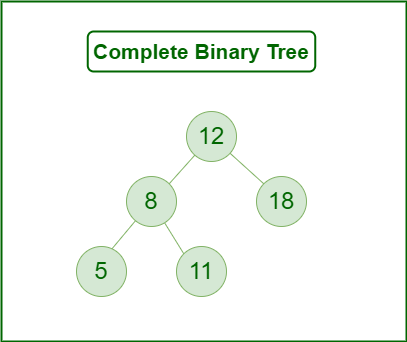
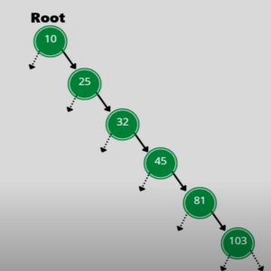
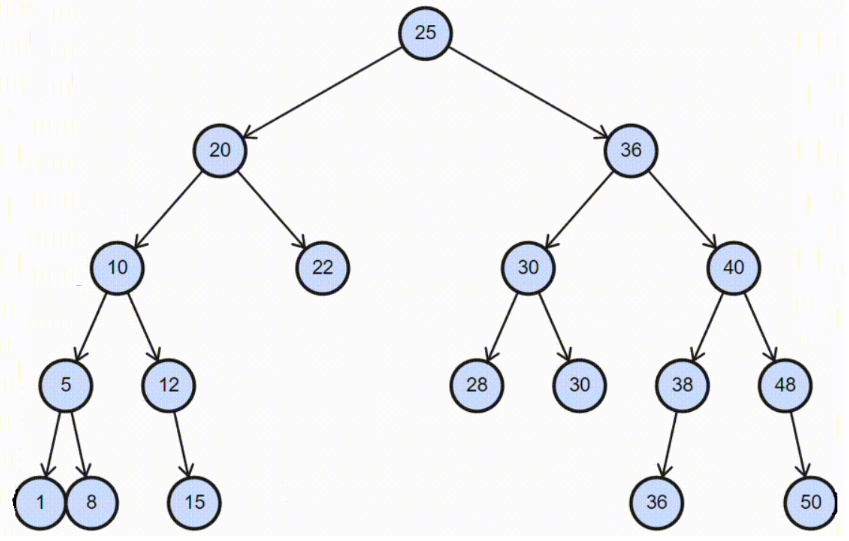
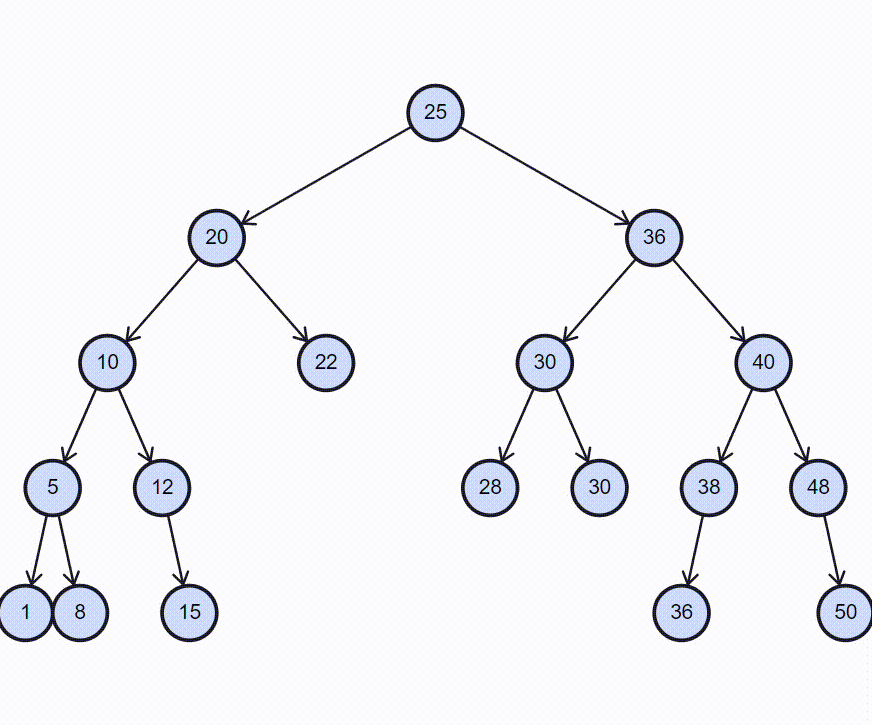
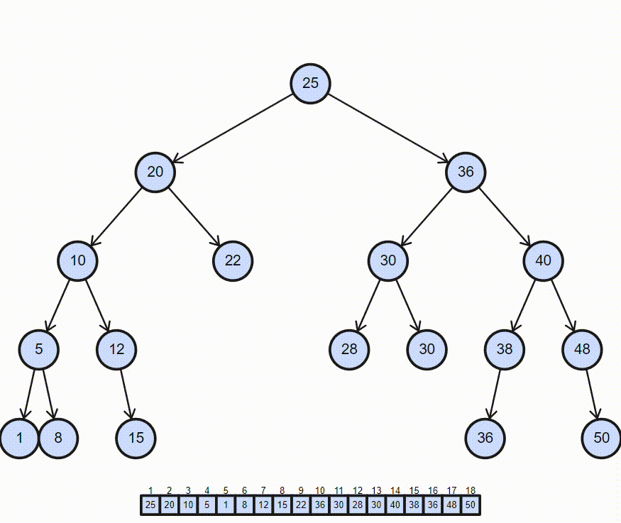

# Trees

## Contents

 - **Basics:**
   - [Tree Terminology](#tree-terminology)
   - [Tree Height & Depth](#tree-height-depth)
   - [Node class representation for a Binary Tree](#node-class-for-bt)
 - **Types of Trees:**
   - **Binary Tree based on the number of children:**
     - [Full Binary Tree](#intro-to-full-binary-tree)
     - [Degenerate (or pathological) Binary Tree](#intro-to-degenerate-binary-tree)
     - [Skewed Binary Tree](#intro-to-skewed-binary-tree)
   - **Binary Tree based on completion of levels:**
     - [Complete Binary Tree](#intro-to-complete-binary-tree)
     - [Perfect Binary Tree](#intro-to-perfect-binary-tree)
     - [Balanced Binary Tree (Also known as Height Balanced Tree)](#intro-to-balanced-binary-tree)
   - **Special Types of Trees:**
     - [Binary Search Tree](#intro-to-binary-search-tree)
       - [Useful methods len(), isEmpty() | O(1)](#bst-useful-methods)
       - [Inserting in a Binary Search Tree | O(log n), O(n)](#insert-bst-recursive-iterative-approach)
     - AVL Tree
     - Red Black Tree
     - B Tree
     - B+ Tree
     - Segment Tree
 - [**Tree Traversal Techniques:**](#ttt)
   - [**Depth First Search (DFS):**](#depth-first-search)
     - [Preorder Traversal | O(n)](#preorder-traversal)
     - [Inorder Traversal | O(n)](#inorder-traversal)
     - [Postorder Traversal | O(n)](#postorder-traversal)
   - **Breadth-First Search (BFS):**
     - Level Order Traversal
 - **Tips & Tricks:**
   - [Recursive vs. Iterative approach in Trees](#recursive-vs-iterative)
 - [**REFERENCES**](#ref)


<!--- ( Basics ) --->

---

<div id="tree-terminology"></div>

## Tree Terminology

A Tree consists of **"Nodes"** connected by **"Edges"**.

  

In such a picture of a tree:

 - The **"Nodes"** are represented as circles.
 - And the **"Edges"** as lines connecting the circles.

Many terms are used to describe particular aspects of trees. For example, see the image below:

  

---

<div id="tree-height-depth"></div>

## Tree Height & Depth

> To know the *Tree's Height* and *Depth*, **we need to focus on each Node** ➔ **not the entire tree**.

For each *node* in a tree, we can define two features:

 - **Height:**
   - A **"node height"** is the number of edges from the *current Node* to the most distant *leaf* node.
 - **Depth:**
   - A **"node depth"** is the number of edges from the *current node* to the *root*.

For example, see the image below to understand more easily:

  

---

<div id="node-class-for-bt"></div>

## Node class representation for a Binary Tree

> A **Binary Tree** is a *tree* data structure in which each parent node can have at most two children.

Each node of a binary tree consists of three items:

 - Data *item (or key)*.
 - Address of *left child*.
 - Address of *right child*.

For example:

  

A common approach to work with ***Binary Trees*** is to create a ***Node*** class to represent our nodes in the Tree.

For example:

[trees.py](src/python/trees.py)
```python
class Node:
    def __init__(self, key):
        self.leftChild = None
        self.rightChild = None
        self.key = key
```

Now, let's test in the practice:

```python
from trees import Node

if __name__ == "__main__":

    #     1 (root)
    #    / \
    # None None
    root = Node(1)
    print(root.key)

    #         1 (root)
    #        /  \
    #       /    \
    #      /      \
    #     2         3
    #    / \       / \
    # None None None None
    root.left = Node(2)
    root.right = Node(3)
    print(root.left.key)
    print(root.right.key)

    #         1 (root)
    #        /  \
    #       /    \
    #      /      \
    #     2         3
    #    / \       / \
    #   4  None  None None
    #  / \
    # None None
    root.left.left = Node(4)
    print(root.left.left.key)
```

**OUTPUT:**
```bash
1
2
3
4
```


<!--- ( Types of Trees/Binary Tree based on the number of children ) --->

---

<div id="intro-to-full-binary-tree"></div>

## Full Binary Tree

A **Binary Tree** is a **Full Binary Tree** if every node has **0** or **2 children**.

For example:


---

<div id="intro-to-degenerate-binary-tree"></div>

## Degenerate (or pathological) Binary Tree

A **Binary Tree** is a **Degenerate (or pathological) Binary Tree** when every internal node has **one child**.

  

> **NOTE:**  
> A degenerate or pathological tree is a tree having a single child either left or right.

---

<div id="intro-to-skewed-binary-tree"></div>

## Skewed Binary Tree

We have two ways to implement a **Skewed Binary Tree**:

 - **Left-Skewed Binary Tree:**
   - All the nodes are having a left child or no child at all.
   - It is a *left side dominated* tree.
   - All the right children remain as *null*.
 - **Right-Skewed Binary Tree:**
    - All the nodes are having a right child or no child at all.
    - It is a *right side dominated* tree.
    - All the left children remain as *null*.

See the image below to understand more easily:


<!--- ( Types of Trees/Binary Tree based on completion of levels ) --->

---

<div id="intro-to-complete-binary-tree"></div>

## Complete Binary Tree

>  A **Binary Tree** is a **Complete Binary Tree** if all the levels are completely filled except possibly the last level and the last level has all keys as left as possible.

A **Complete Binary Tree** is just like a **Full Binary Tree**, but with two major differences:

 - Every level except the last level must be completely filled.
 - All the leaf elements must lean towards the left.
 - The last leaf element might not have a right sibling i.e. a complete binary tree doesn’t have to be a full binary tree.

For example, see the image below to understand more easily:



---

<div id="intro-to-perfect-binary-tree"></div>

## Perfect Binary Tree

A **Binary tree** is a **Perfect Binary Tree** when:

 - All the internal nodes have two children.
 - And all leaf nodes are at the same level. 

For example, see the image below to understand more easily:


---

<div id="intro-to-balanced-binary-tree"></div>

## Balanced Binary Tree (Also known as Height Balanced Tree)

To understand what's a **Balanced Binary Tree (Also known as Height Balanced Tree)**, let's get started by seeing a **Degenerate Binary Tree**:

  

See that:

 - This Degenerate Binary Tree is similar to:
   - Linked-List
   - Linked-List Queue
   - Linked-List Stack
   - Vector

See also our **Degenerate Binary Tree** is a **Binary Search Tree (That is, follow the BST properties)**. For example, imagine we need to search the key 500:

  

If you pay attention:

 - To discover that the key 500 is not in the tree, we need to traverse the tree node by node like a Linked List traversing.
 - That is, all operations insertion, removing, and searching are **O(n) (or O(h) where "h" is the tree height)**:
   - This can be slow for tasks we need to repeat many times. E.g. *search*.

> This type of Tree is known as **Unbalanced Binary Tree**.

### Ok, but what's a Balanced Binary Tree?

A Tree is *balanced* if the **"balance factor of each node"** is between *-1* to *1*, otherwise (caso contrário), the Tree will be *unbalanced* and needs to be *balanced*.

> Ok, but what's a **"balance factor of a node"**?

For example, let's see a **formula of a "balance factor of a node"** of the **AVL Tree**:

  

Where:

 - **Balance Factor(k):**
   - The *current node* **Balance Factor result**.
 - **height(left(k)):**
   - The number of edges from the *current Node* to the most distant *left leaf node (k)*.
 - **height(right(k)):**
   - The number of edges from the *current Node* to the most distant *right leaf node (k)*.

To understand more easily, see the **Binary Tree** below:

  

 - If the **Balance Factor** is *1* or *-1*, then the node is **balanced**.
 - If the **Balance Factor** is *above 1 (e.g. 2, 3, 4, etc.)* or below -1 (e.g. -2, -3, -4, etc.), then the node is **unbalanced**.
 - **NOTE:** For the *Tree to be balanced*, the *Balance Factor* of each node must be between **-1** and **1**.


<!--- ( Types of Trees/Special Types of Trees ) --->

---

<div id="intro-to-binary-search-tree"></div>

## Binary Search Tree

**Binary Search Tree** is a *node-based binary tree* data structure that has the following properties:

 - All nodes of the **left subtree** are `less than` the **root node**.
 - All nodes of **right subtree** are `more than` the **root node**.
 - Both subtrees of each node are also **Binary Search Tree**.
   - In other words, they have the above two properties

For example:

  

To implement the ***Binary Search Tree class*** let's get started by implementing the class *constructor*:

[trees.py](src/python/trees.py)
```python
class Node:
    def __init__(self, key):
        self.leftChild = None
        self.rightChild = None
        self.key = key


class BinarySearchTree(Node):
    def __init__(self):
        self.root = None
        self.size = 0
```

---

<div id="bst-useful-methods"></div>

## Useful methods len(), isEmpty() | O(1)

Here, let's implement the useful methods **len()** and **isEmpty()**:

**Python:** [trees.py](src/python/trees.py)
```python
def isEmpty(self):
    return self.root is None  # O(1)

def __len__(self):
    return self.size  # O(1)
```

#### Complexity Explanation

 - **Time Complexity: O(1)**
   - The *Time Complexity* of both methods is **O(1)** because they both have constant time complexity. This is because they both only involve simple operations such as checking if a variable is None or returning a variable, which can be done in constant time.
 - **Space Complexity: O(1)**
   - The *Space Complexity* of both methods is also **O(1)** because they do not use any additional space that grows with the input size. They only use a constant amount of space to store the variables.

Now, let's test in the practice:

**Python:**
```python
from trees import BinarySearchTree

if __name__ == '__main__':

    bst = BinarySearchTree()

    print(f"The Binary Search Tree is empty? {bst.isEmpty()}")
    print(f"Binary Search Tree size: {bst.__len__()}")
```

**OUTPUT:**
```bash
The Binary Search Tree is empty? True
Binary Search Tree size: 0
```

---

<div id="insert-bst-recursive-iterative-approach"></div>

## Inserting in a Binary Search Tree | O(log n), O(n)

> A **new key** is always inserted at the *leaf (folha)* of the Binary by maintaining the *property* of the *Binary Search Tree*.

  

Before creating methods to *insert* a new Node first, let's create the useful method **insert()**:

**Python:** [trees.py](src/python/trees.py)
```python
def insert(self, key, approach="recursive"):
    if self.isEmpty():
        self.root = Node(key)
        self.size += 1
    else:
        if approach == "recursive":
            self._insert_recursive(self.root, key)
        elif approach == "iterative":
            self._insert_iterative(self.root, key)
        else:
            print("Invalid approach. Please use 'recursive' or 'iterative'.")
        self.size += 1
```

 - **Time and Space Complexity:**
   - Here, the focus is method goals, not Complexities.
 - **Code Explanation:**
   - `if self.isEmpty():`
     - The focus here is to check if the Binary Search Tree is empty. If is empty, we just create a new Node and set it as the *"BST"* root.
     - Next, we increment the *"size"* of the BST by 1.
   - `The "else" block has some crucial parts:`
     - First, but not crucial is to choose the insertion approach *"recursive"* or *"iterative"*.
     - The really crucial part to pay attention is `"(self.root, key)"`:
       - See that both *"recursive"* or *"iterative"* approaches receive the same arguments.
       - Passing `"self.root"` as an argument is the most crucial part of this code because:
         - We always start from the root by passing Node by Node (recursively or iteratively).
         - That is, the *recursive* or *iterative* methods *do not need to worry about (não precisam se preocupar)* where to start to pass Node by Node because we've already given them the starting point (self.root).
         - **NOTE:** If we hadn't passed the root/head of the tree here, anyone calling this method would have to pass the starting point. E.g. `insert(root, data)`.
     - `self.size += 1`
       - As the "_insert_recursive" and "_insert_iterative" methods will iterate Node by Node in a *recursive* or *loop* way we cannot increment the number of Nodes in the Tree from them. It is interesting to increase this at the end of the else() block.
   - **NOTE:** Finally, pay attention that this method just calls the methods *"_insert_recursive"* or *"_insert_iterative"* and does not return nothing.

### Recurvive Approach

Now, let's see how to insert a new node (data/key) in the ***Binary Search Tree*** using a *recursive approach*

[trees.py](src/python/trees.py)
```python
def _insert_recursive(self, current_node, key):
    if key <= current_node.key:                                   # O(1)
        if current_node.leftChild is None:                        # O(1)
            current_node.leftChild = Node(key)                    # O(1)
        else:
            self._insert_recursive(current_node.leftChild, key)   # O(h)
    elif key >= current_node.key:                                 # O(1)
        if current_node.rightChild is None:                       # O(1)
            current_node.rightChild = Node(key)                   # O(1)
        else:
            self._insert_recursive(current_node.rightChild, key)  # O(h)
```

$f(n) = O(1) + O(1) + O(1) + O(h) + O(1) + O(1) + O(1) + O(h)$$

#### Complexity Explanation

 - **Time Complexity:**
   - **Degenerate (or pathological) Binary Search Tree: O(n)**
     - The *Time Complexity* if the *BST* is degenerate is **O(n)** in the *Worst Case* scenario, where **"n"** is the total number of nodes in the tree. This happens when the tree degenerates into a linear list, meaning each node has only one child (all to the left or all to the right), and the insertion occurs at the end of the list.
   - **Balanced Binary Search Tree: O(log n)**
     - However, if the tree is *balanced*, the *Time Complexity* will be **O(log n)**, where *"log n"* is the logarithm base 2 of the total number of nodes in the tree.
     - This is because in balanced trees, such as balanced binary search trees (e.g., an AVL tree), the depth of the tree is limited by the logarithm of the number of nodes in the tree.
 - **Space Complexity: O(h)**
   - The *Space Complexity* of this method is **O(h)** as well, due to the recursive calls. Each recursive call adds a new frame to the call stack, and the maximum depth of the call stack is equal to the height of the tree.

#### Code Explanation

 - `_insert_recursive() - This is the real method to insert a new value into the not empty Tree:`
   - This method receives the following arguments:
     - **current_node:** The first time, the "current_node" will be the "root" and loop Node by Node when necessary.
     - **key:** The "key" is the value to be inserted at the new Node.
   - Inside of the `_insert_recursive()` method the first thing to check is the side to move, left or right:
     - `"if key <= current_node.key"`:
       - If the *"key"* `is less or equal` to *"the key of the current_node"*, we move to the left subtree.
       - **NOTE:** This approach allows the insertion of *duplicate values*. If you don't wish allow change `"<="` to `"<"`.
     - `"elif key >= current_node.key"`:
       - If the *"key"* `is greater or equal` to *"the key of the current_node"*, we move to the right subtree.
       - **NOTE:** This approach allows the insertion of *duplicate values*. If you don't wish allow change `">="` to `">"`.
   - Next, we need to check if the *"current_node.left/right"* are empty (`"if current_node.leftChild is None" | "if current_node.rightChild is None"`):
     - If the *"current_node.left/right"* `is empty (None)`, then we must insert the new Node (value/key) here.
     - If the *"current_node.left/right"* `is not empty`, then we need to move recursively to the next Node (left or right):
       - `"self._insert_recursive(current_node.leftChild, key)"`
       - `"self._insert_recursive(current_node.rightChild, key)"`
       - **NOTE:** See that here we pass the *"current_node.left/right"* to the `_insert_recursive()` method, not the *root* Node.
       - **Base case (condiction to stop the recursion):**
         - The new Node (value/key) was created.
         - When the new Node (value/key) is created we don't call the `_insert_recursive()` method again recursively.

Now, let's test in the practice:

```python
from trees import BinarySearchTree

if __name__ == '__main__':

    bst = BinarySearchTree()
    print(f"The Binary Search Tree is empty? {bst.isEmpty()}")
    print(f"Binary Search Tree size: {bst.__len__()}\n")

    bst.insert(25, approach="recursive")
    print(f"The Binary Search Tree is empty? {bst.isEmpty()}")
    print(f"Binary Search Tree size: {bst.__len__()}\n")

    bst.insert(20, approach="recursive")
    print(f"The Binary Search Tree is empty? {bst.isEmpty()}")
    print(f"Binary Search Tree size: {bst.__len__()}\n")

    bst.insert(36, approach="recursive")
    print(f"The Binary Search Tree is empty? {bst.isEmpty()}")
    print(f"Binary Search Tree size: {bst.__len__()}\n")

    bst.insert(10, approach="recursive")
    print(f"The Binary Search Tree is empty? {bst.isEmpty()}")
    print(f"Binary Search Tree size: {bst.__len__()}\n")

    bst.insert(30, approach="recursive")
    print(f"The Binary Search Tree is empty? {bst.isEmpty()}")
    print(f"Binary Search Tree size: {bst.__len__()}\n")

    bst.insert(40, approach="recursive")
    print(f"The Binary Search Tree is empty? {bst.isEmpty()}")
    print(f"Binary Search Tree size: {bst.__len__()}\n")

    bst.insert(22, approach="recursive")
    print(f"The Binary Search Tree is empty? {bst.isEmpty()}")
    print(f"Binary Search Tree size: {bst.__len__()}\n")

    bst.insert(28, approach="recursive")
    print(f"The Binary Search Tree is empty? {bst.isEmpty()}")
    print(f"Binary Search Tree size: {bst.__len__()}\n")

    bst.insert(5, approach="recursive")
    print(f"The Binary Search Tree is empty? {bst.isEmpty()}")
    print(f"Binary Search Tree size: {bst.__len__()}\n")

    bst.insert(1, approach="recursive")
    print(f"The Binary Search Tree is empty? {bst.isEmpty()}")
    print(f"Binary Search Tree size: {bst.__len__()}\n")

    bst.insert(8, approach="recursive")
    print(f"The Binary Search Tree is empty? {bst.isEmpty()}")
    print(f"Binary Search Tree size: {bst.__len__()}\n")

    bst.insert(12, approach="recursive")
    print(f"The Binary Search Tree is empty? {bst.isEmpty()}")
    print(f"Binary Search Tree size: {bst.__len__()}\n")

    bst.insert(30, approach="recursive")
    print(f"The Binary Search Tree is empty? {bst.isEmpty()}")
    print(f"Binary Search Tree size: {bst.__len__()}\n")

    bst.insert(15, approach="recursive")
    print(f"The Binary Search Tree is empty? {bst.isEmpty()}")
    print(f"Binary Search Tree size: {bst.__len__()}\n")

    bst.insert(36, approach="recursive")
    print(f"The Binary Search Tree is empty? {bst.isEmpty()}")
    print(f"Binary Search Tree size: {bst.__len__()}\n")

    bst.insert(48, approach="recursive")
    print(f"The Binary Search Tree is empty? {bst.isEmpty()}")
    print(f"Binary Search Tree size: {bst.__len__()}\n")

    bst.insert(36, approach="recursive")
    print(f"The Binary Search Tree is empty? {bst.isEmpty()}")
    print(f"Binary Search Tree size: {bst.__len__()}\n")

    bst.insert(50, approach="recursive")
    print(f"The Binary Search Tree is empty? {bst.isEmpty()}")
    print(f"Binary Search Tree size: {bst.__len__()}\n")

    preorder_result = bst.traverse(approach="preorder")
    print(f"Preorder: {preorder_result}")

    inorder_result = bst.traverse()  # default approach is "inorder".
    print(f"Inorder: {inorder_result}")

    postorder_result = bst.traverse(approach="postorder")
    print(f"Postorder: {postorder_result}")
```

**OUTPUT:**
```bash
The Binary Search Tree is empty? True
Binary Search Tree size: 0

The Binary Search Tree is empty? False
Binary Search Tree size: 1

The Binary Search Tree is empty? False
Binary Search Tree size: 2

The Binary Search Tree is empty? False
Binary Search Tree size: 3

The Binary Search Tree is empty? False
Binary Search Tree size: 4

The Binary Search Tree is empty? False
Binary Search Tree size: 5

The Binary Search Tree is empty? False
Binary Search Tree size: 6

The Binary Search Tree is empty? False
Binary Search Tree size: 7

The Binary Search Tree is empty? False
Binary Search Tree size: 8

The Binary Search Tree is empty? False
Binary Search Tree size: 9

The Binary Search Tree is empty? False
Binary Search Tree size: 10

The Binary Search Tree is empty? False
Binary Search Tree size: 11

The Binary Search Tree is empty? False
Binary Search Tree size: 12

The Binary Search Tree is empty? False
Binary Search Tree size: 13

The Binary Search Tree is empty? False
Binary Search Tree size: 14

The Binary Search Tree is empty? False
Binary Search Tree size: 15

The Binary Search Tree is empty? False
Binary Search Tree size: 16

The Binary Search Tree is empty? False
Binary Search Tree size: 17

The Binary Search Tree is empty? False
Binary Search Tree size: 18

Preorder: [25, 20, 10, 5, 1, 8, 12, 15, 22, 36, 30, 28, 30, 36, 36, 40, 48, 50]
Inorder: [1, 5, 8, 10, 12, 15, 20, 22, 25, 28, 30, 30, 36, 36, 36, 40, 48, 50]
Postorder: [1, 8, 5, 15, 12, 10, 22, 20, 30, 28, 36, 36, 30, 50, 48, 40, 36, 25]
```

### Iterative Approach

Now, let's see how to insert a new node (data/key) in the ***Binary Search Tree*** using a *Iterative Approach*:

[trees.py](src/python/trees.py)
```python
def _insert_iterative(self, current_node, key):
    while True:                                         # O(h)
        if key <= current_node.key:                     # O(1)
            if current_node.leftChild is None:          # O(1)
                current_node.leftChild = Node(key)      # O(1)
                break                                   # O(1)
            else:
                current_node = current_node.leftChild   # O(1)
        elif key >= current_node.key:                   # O(1)
            if current_node.rightChild is None:         # O(1)
                current_node.rightChild = Node(key)     # O(1)
                break                                   # O(1)
            else:
                current_node = current_node.rightChild  # O(1)
```

$f(n) = O(h) + O(1) + O(1) + O(1) + O(1) + O(1) + O(1) + O(1) + O(1) + O(1) + O(1)$

#### Complexity Explanation

 - **Time Complexity:**
   - **Degenerate (or pathological) Binary Search Tree: O(n)**
     - The *Time Complexity* if the *BST* is degenerate is **O(n)** in the *Worst Case* scenario, where **"n"** is the total number of nodes in the tree. This happens when the tree degenerates into a linear list, meaning each node has only one child (all to the left or all to the right), and the insertion occurs at the end of the list.
   - **Balanced Binary Search Tree: O(log n)**
     - However, if the tree is *balanced*, the *Time Complexity* will be **O(log n)**, where *"log n"* is the logarithm base 2 of the total number of nodes in the tree.
     - This is because in balanced trees, such as balanced binary search trees (e.g., an AVL tree), the depth of the tree is limited by the logarithm of the number of nodes in the tree.
 - **Space Complexity: O(h)**
   - The *Space Complexity* of this function is **O(1)** because we are not using any additional data structures that grow with the input size. We are only using a constant amount of space to store the current_node and key variables.

#### Code Explanation

 - `_insert_iterative():`
   - Inside the `_insert_iterative() method` we have a `loop "while" (infinite loop)` to through (percorrer) the Tree:
     - Inside the `"while" loop`:
       - `"if key <= current_node.key"`:
         - If the *"key"* `is less or equal` to *"the key of the current_node"*, we move to the left subtree.
         - **NOTE:** This approach allows the insertion of *duplicate values*. If you don't wish allow change `"<="` to `"<"`.
       - `"elif key >= current_node.key"`:
         - If the *"key"* `is greater or equal` to *"the key of the current_node"*, we move to the right subtree.
         - **NOTE:** This approach allows the insertion of *duplicate values*. If you don't wish allow change `">="` to `">"`.
       - Next, we need to check if the *"current_node.left/right"* are empty (`"if current_node.leftChild is None" | "if current_node.rightChild is None"`):
         - If the *"current_node.left/right"* `is empty (None)`, then we must insert the new Node (value/key) here and `"break"` the `"while" loop`.
         - If the *"current_node.left/right"* `is not empty`, then we need to move to the next Node (left or right):
           - `"current_node = current_node.leftChild"`
           - `"current_node = current_node.rightChild"`

Now, let's test in the practice:

```python
from trees import BinarySearchTree

if __name__ == '__main__':

    bst = BinarySearchTree()
    print(f"The Binary Search Tree is empty? {bst.isEmpty()}")
    print(f"Binary Search Tree size: {bst.__len__()}\n")

    bst.insert(25, approach="iterative")
    print(f"The Binary Search Tree is empty? {bst.isEmpty()}")
    print(f"Binary Search Tree size: {bst.__len__()}\n")

    bst.insert(20, approach="iterative")
    print(f"The Binary Search Tree is empty? {bst.isEmpty()}")
    print(f"Binary Search Tree size: {bst.__len__()}\n")

    bst.insert(36, approach="iterative")
    print(f"The Binary Search Tree is empty? {bst.isEmpty()}")
    print(f"Binary Search Tree size: {bst.__len__()}\n")

    bst.insert(10, approach="iterative")
    print(f"The Binary Search Tree is empty? {bst.isEmpty()}")
    print(f"Binary Search Tree size: {bst.__len__()}\n")

    bst.insert(30, approach="iterative")
    print(f"The Binary Search Tree is empty? {bst.isEmpty()}")
    print(f"Binary Search Tree size: {bst.__len__()}\n")

    bst.insert(40, approach="iterative")
    print(f"The Binary Search Tree is empty? {bst.isEmpty()}")
    print(f"Binary Search Tree size: {bst.__len__()}\n")

    bst.insert(22, approach="iterative")
    print(f"The Binary Search Tree is empty? {bst.isEmpty()}")
    print(f"Binary Search Tree size: {bst.__len__()}\n")

    bst.insert(28, approach="iterative")
    print(f"The Binary Search Tree is empty? {bst.isEmpty()}")
    print(f"Binary Search Tree size: {bst.__len__()}\n")

    bst.insert(5, approach="iterative")
    print(f"The Binary Search Tree is empty? {bst.isEmpty()}")
    print(f"Binary Search Tree size: {bst.__len__()}\n")

    bst.insert(1, approach="iterative")
    print(f"The Binary Search Tree is empty? {bst.isEmpty()}")
    print(f"Binary Search Tree size: {bst.__len__()}\n")

    bst.insert(8, approach="iterative")
    print(f"The Binary Search Tree is empty? {bst.isEmpty()}")
    print(f"Binary Search Tree size: {bst.__len__()}\n")

    bst.insert(12, approach="iterative")
    print(f"The Binary Search Tree is empty? {bst.isEmpty()}")
    print(f"Binary Search Tree size: {bst.__len__()}\n")

    bst.insert(30, approach="iterative")
    print(f"The Binary Search Tree is empty? {bst.isEmpty()}")
    print(f"Binary Search Tree size: {bst.__len__()}\n")

    bst.insert(15, approach="iterative")
    print(f"The Binary Search Tree is empty? {bst.isEmpty()}")
    print(f"Binary Search Tree size: {bst.__len__()}\n")

    bst.insert(36, approach="iterative")
    print(f"The Binary Search Tree is empty? {bst.isEmpty()}")
    print(f"Binary Search Tree size: {bst.__len__()}\n")

    bst.insert(48, approach="iterative")
    print(f"The Binary Search Tree is empty? {bst.isEmpty()}")
    print(f"Binary Search Tree size: {bst.__len__()}\n")

    bst.insert(36, approach="iterative")
    print(f"The Binary Search Tree is empty? {bst.isEmpty()}")
    print(f"Binary Search Tree size: {bst.__len__()}\n")

    bst.insert(50, approach="iterative")
    print(f"The Binary Search Tree is empty? {bst.isEmpty()}")
    print(f"Binary Search Tree size: {bst.__len__()}\n")

    preorder_result = bst.traverse(approach="preorder")
    print(f"Preorder: {preorder_result}")

    inorder_result = bst.traverse()  # default approach is "inorder".
    print(f"Inorder: {inorder_result}")

    postorder_result = bst.traverse(approach="postorder")
    print(f"Postorder: {postorder_result}")
```

**OUTPUT:**
```bash
The Binary Search Tree is empty? True
Binary Search Tree size: 0

The Binary Search Tree is empty? False
Binary Search Tree size: 1

The Binary Search Tree is empty? False
Binary Search Tree size: 2

The Binary Search Tree is empty? False
Binary Search Tree size: 3

The Binary Search Tree is empty? False
Binary Search Tree size: 4

The Binary Search Tree is empty? False
Binary Search Tree size: 5

The Binary Search Tree is empty? False
Binary Search Tree size: 6

The Binary Search Tree is empty? False
Binary Search Tree size: 7

The Binary Search Tree is empty? False
Binary Search Tree size: 8

The Binary Search Tree is empty? False
Binary Search Tree size: 9

The Binary Search Tree is empty? False
Binary Search Tree size: 10

The Binary Search Tree is empty? False
Binary Search Tree size: 11

The Binary Search Tree is empty? False
Binary Search Tree size: 12

The Binary Search Tree is empty? False
Binary Search Tree size: 13

The Binary Search Tree is empty? False
Binary Search Tree size: 14

The Binary Search Tree is empty? False
Binary Search Tree size: 15

The Binary Search Tree is empty? False
Binary Search Tree size: 16

The Binary Search Tree is empty? False
Binary Search Tree size: 17

The Binary Search Tree is empty? False
Binary Search Tree size: 18

Preorder: [25, 20, 10, 5, 1, 8, 12, 15, 22, 36, 30, 28, 30, 36, 36, 40, 48, 50]
Inorder: [1, 5, 8, 10, 12, 15, 20, 22, 25, 28, 30, 30, 36, 36, 36, 40, 48, 50]
Postorder: [1, 8, 5, 15, 12, 10, 22, 20, 30, 28, 36, 36, 30, 50, 48, 40, 36, 25]
```


<!--- ( Tree Traversal Techniques ) --->

---

<div id="ttt"></div>

## Tree Traversal Techniques

> Unlike **Linear Data Structures (Array, Strings, Vectors, Linked Lists, Queues, Stacks)** which have only one logical way to traverse them, *Trees* can be traversed in different ways.

 - **Depth First Search (DFS):**
   - Preorder Traversal (current-left-right)
   - Inorder Traversal (left-current-right)
   - Postorder Traversal (left-right-current)
 - **Breadth First Search (BFS):**
   - Level Order Traversal
 - **Boundary Traversal**
 - **Diagonal Traversal**

**NOTE:**  
To remember the **Depth First Search (DFS)** approaches see that:

 - **Preorder -** The *current (root)* is the *first*.
 - **Inorder -** The *current (root)* is the *second*.
 - **Postorder -** The *current (root)* is the *third*.

---

<div id="depth-first-search"></div>

## Depth First Search (DFS)

> **Depth-First Search (DFS)** is an algorithm used for *searching* or *traversing* **Tree** or **Graph** data structures.

We have two approaches to implementing the **Depth First Search (DFS)** Algorithm:

 - **Recursive Implementation:**
   - The recursive approach does not explicitly rely (depende) on a stack for tree traversal since (pois) *the stack is implicitly managed by the programming language's* **call stack**.
 - **Iterative Implementation:**
   - The iterative approach uses a **Stack (Last In, First Out (LIFO))** to store the visited Nodes.
   - *Stack* also is used to maintain (manter) control of the tree traversal process.
   - The *stack* also is used to store the nodes that still need to be processed.
   - The use of the *stack* in the iterative approach allows for a non-recursive tree traversal and is particularly useful in situations where recursion can lead (levar) to a *stack overflow* in **very large** or **deep trees**.
   - Additionally, the iterative approach can be more efficient in terms of resource consumption compared to the recursive approach in certain cases.

---

<div id="preorder-traversal"></div>

## Preorder Traversal | O(n)

> This technique follows the **'CURRENT->LEFT->RIGHT'** policy.

 - It means that, *first root (current) node* is visited.
 - After that, the *left subtree* is traversed recursively.
 - Finally, *right subtree* is recursively traversed.

To understand more easily, imagine we have the following *Tree*:

  

**NOTE:**  
If you pay attention you can see that the *Tree* has another subtrees:

  

> **NOTE:**  
> All subtree (and all the Tree) follow the **Preorder** policy - **'CURRENT->LEFT->RIGHT'**.

Until all nodes of the *Tree* are not visited:

 - **Step 1 -** Visit the root (current) node.
 - **Step 2 -** Traverse the left subtree recursively.
 - **Step 3 -** Traverse the right subtree recursively.



> **NOTE:**  
> See that here we start from the root and next follow the **'CURRENT->LEFT->RIGHT'** policy.

Before creating methods to *traverse* a *Tree* first, let's create the useful method **traverse()**:

**Python:** [trees.py](src/python/trees.py)
```python
def traverse(self, approach="inorder"):
    if self.isEmpty():
        print("Tree is empty.")
        return
    else:
        result = []
        if approach == "preorder":
            self._preorder_recursive(self.root, result)
            return result
        elif approach == "inorder":
            self._inorder_recursive(self.root, result)
            return result
        elif approach == "postorder":
            self._postorder_recursive(self.root, result)
            return result
        else:
            print(
                "Invalid approach. Please use 'preorder', 'inorder', or 'postorder'."
            )
            return
```

 - **Time and Space Complexity:**
   - Here, the focus is method goals, not Complexities.
 - **Code Explanation:**
   - First, the method check if the *Tree* is empty.
   - Next, if the list is not empty (else block) we create an empty list `"result = []"`:
     - It is interesting to create the list before selecting the approach to avoid repeating the same code.
   - Next, we need to select the method *(preorder, inorder, or postorder)* to be used.
   - The selected method will append() the Node values following your approach.
   - Finally, we return the "result" variable (list).

### Recurvive Approach

Now, let's see how to implement the **preorder** method using **Recursive approach** to do this:

[trees.py](src/python/trees.py)
```python
def _preorder_recursive(self, current_node, result):
    if current_node:                                               # O(1)
        result.append(current_node.key)                            # O(1)
        self._preorder_recursive(current_node.leftChild, result)   # O(n)
        self._preorder_recursive(current_node.rightChild, result)  # O(n)
```

$f(n) = O(1) + O(1) + O(n) + O(n)$

#### Complexity Explanation

 - **Time Complexity: O(n)**
   - The *Time Complexity* of this function is **O(n)**, where **"n"** is the number of nodes in the tree. This is because the function visits each node exactly once.
 - **Space Complexity: O(n)**
   - The *Space Complexity* of this function is **O(n)**, where **"n"** is the number of nodes in the tree. This is because the function uses recursion, and each recursive call adds a new frame to the call stack. In the worst case, the call stack can have a depth of **"n"**, resulting in **O(n)** *Space complexity*.

#### Code Explanation

 - `if current_node:`
   - Checks if *current_node* is not *None* (empty). If it's not empty, it means there's a node to process.
 - If the current_node is not empty (None) we follow the preorder policy: **'CURRENT->LEFT->RIGHT'**:
   - `result.append(current_node.key)`
     - Appends the key of the *current_node* to the *"result"* list, storing it in the preorder sequence.
   - `self._preorder_recursive(current_node.leftChild, result)`
     - Recursively calls `_preorder_recursive` on the *leftChild* of the *current_node*, traversing the *left subtree* first.
   - `self._preorder_recursive(current_node.rightChild, result)`
     - Recursively calls `_preorder_recursive` on the *rightChild* of the *current_node*, traversing the *right subtree* after the left subtree.

Now, let's test in the practice:

```python
from trees import BinarySearchTree

if __name__ == "__main__":
    bst = BinarySearchTree()

    bst.insert(25, approach="iterative")
    bst.insert(20, approach="iterative")
    bst.insert(36, approach="iterative")
    bst.insert(10, approach="iterative")
    bst.insert(30, approach="iterative")
    bst.insert(40, approach="iterative")
    bst.insert(22, approach="iterative")
    bst.insert(28, approach="iterative")
    bst.insert(5, approach="iterative")
    bst.insert(1, approach="iterative")
    bst.insert(8, approach="iterative")
    bst.insert(12, approach="iterative")
    bst.insert(30, approach="iterative")
    bst.insert(15, approach="iterative")
    bst.insert(36, approach="iterative")
    bst.insert(48, approach="iterative")
    bst.insert(36, approach="iterative")
    bst.insert(50, approach="iterative")

    preorder_result = bst.traverse(approach="preorder")
    print(f"Preorder: {preorder_result}")
```

**OUTPUT:**
```bash
Preorder: [25, 20, 10, 5, 1, 8, 12, 15, 22, 36, 30, 28, 30, 36, 36, 40, 48, 50]
```

---

<div id="inorder-traversal"></div>

## Inorder Traversal | O(n)

> This technique follows the **'LEFT->CURRENT->RIGHT'** policy.

 - It means that first *left subtree is visited*.
 - After, the *root (current) node is traversed*.
 - Finally, the *right subtree is traversed*.

To understand more easily, imagine we have the following *Tree*:

  

**NOTE:**  
If you pay attention you can see that the Tree has another subtrees:

  

> **NOTE:**  
> All subtrees (and all the Tree) follow the **Inorder** policy - **'LEFT->CURRENT->RIGHT'**.

Until all nodes of the *Tree* are not visited:

  - **Step 1 -** Traverse the *left subtree* recursively.
  - **Step 2 -** Visit the *root (current) node*.
  - **Step 3 -** Traverse the *right subtree* recursively.



> **NOTE:**  
> See that here we start from the last left subtree (two sides) following the **'LEFT->CURRENT->RIGHT'** policy.

Before creating methods to *traverse* a *Tree* first, let's create the useful method **traverse()**:

**Python:** [trees.py](src/python/trees.py)
```python
def traverse(self, approach="inorder"):
    if self.isEmpty():
        print("Tree is empty.")
        return
    else:
        result = []
        if approach == "preorder":
            self._preorder_recursive(self.root, result)
            return result
        elif approach == "inorder":
            self._inorder_recursive(self.root, result)
            return result
        elif approach == "postorder":
            self._postorder_recursive(self.root, result)
            return result
        else:
            print(
                "Invalid approach. Please use 'preorder', 'inorder', or 'postorder'."
            )
            return
```

 - **Time and Space Complexity:**
   - Here, the focus is method goals, not Complexities.
 - **Code Explanation:**
   - First, the method check if the *Tree* is empty.
   - Next, if the list is not empty (else block) we create an empty list `"result = []"`:
     - It is interesting to create the list before selecting the approach to avoid repeating the same code.
   - Next, we need to select the method *(preorder, inorder, or postorder)* to be used.
   - The selected method will append() the Node values following your approach.
   - Finally, we return the "result" variable (list).

### Recurvive Approach

Now, let's see how to implement the **inorder** method using **Recursive approach** to do this:

[trees.py](src/python/trees.py)
```python
def _inorder_recursive(self, current_node, result):
    if current_node:                                              # O(1)
        self._inorder_recursive(current_node.leftChild, result)   # O(n)
        result.append(current_node.key)                           # O(1)
        self._inorder_recursive(current_node.rightChild, result)  # O(n)
```

$f(n) = O(1) + O(n) + O(1) + O(n)$

#### Complexity Explanation

 - **Time Complexity: O(n)**
   - The *Time Complexity* of this function is **O(n)**, where **"n"** is the number of nodes in the tree. This is because the function visits each node exactly once in an inorder traversal.
 - **Space Complexity: O(n)**
   - The *Space Complexity* of this function is **O(n)**, where **"n"** is the number of nodes in the tree. This is because the function uses recursion, and each recursive call adds a new frame to the call stack. In the worst case, the call stack can have a depth of **"n"**, resulting in **O(n)** space complexity.

#### Code Explanation

 - `if current_node:`
   - Checks if *current_node* is not *None* (empty). If it's not empty, it means there's a node to process.
 - If the current_node is not empty (None) we follow the inorder policy: **'LEFT->CURRENT->RIGHT'**:
   - `self._inorder_recursive(current_node.leftChild, result)`
     - Recursively calls `_inorder_recursive` on the *leftChild* of the *current_node*, traversing the left subtree first. This ensures the *inorder* traversal pattern.
   - `result.append(current_node.key)`
     - Appends the key of the *current_node* to the result list, storing it in the *inorder* sequence.
   - `self._inorder_recursive(current_node.rightChild, result)`
     - Recursively calls `_inorder_recursive` on the *rightChild* of the *current_node*, traversing the right subtree after the left subtree and the current node, following the *inorder* pattern.

Now, let's test in the practice:

```python
from trees import BinarySearchTree

if __name__ == "__main__":
    bst = BinarySearchTree()

    bst.insert(25, approach="iterative")
    bst.insert(20, approach="iterative")
    bst.insert(36, approach="iterative")
    bst.insert(10, approach="iterative")
    bst.insert(30, approach="iterative")
    bst.insert(40, approach="iterative")
    bst.insert(22, approach="iterative")
    bst.insert(28, approach="iterative")
    bst.insert(5, approach="iterative")
    bst.insert(1, approach="iterative")
    bst.insert(8, approach="iterative")
    bst.insert(12, approach="iterative")
    bst.insert(30, approach="iterative")
    bst.insert(15, approach="iterative")
    bst.insert(36, approach="iterative")
    bst.insert(48, approach="iterative")
    bst.insert(36, approach="iterative")
    bst.insert(50, approach="iterative")

    inorder_result = bst.traverse()  # Default approach is "inorder".
    print(f"Inorder: {inorder_result}")
```

**OUTPUT:**
```bash
Inorder: [1, 5, 8, 10, 12, 15, 20, 22, 25, 28, 30, 30, 36, 36, 36, 40, 48, 50]
```

---

<div id="postorder-traversal"></div>

## Postorder Traversal | O(n)

> This technique follows the **'LEFT->RIGHT->CURRENT'** policy.

 - It means that the first *left subtree* of the *root node is traversed*.
 - After that, recursively traverses the *right subtree*.
 - Finally, the *root node* is traversed.

To understand more easily, imagine we have the following *Tree*:

  

**NOTE:**  
If you pay attention you can see that the Tree has another subtrees:

  

> **NOTE:**  
> All subtrees (and all the Tree) follow the **Postorder** policy - **'LEFT->RIGHT->CURRENT'**.

Until all nodes of the *Tree* are not visited:

 - **Step 1 -** Traverse the *left subtree* recursively.
 - **Step 2 -** Traverse the *right subtree* recursively.
 - **Step 3 -** Visit the *root node*.


> **NOTE:**  
> - See that here we start from the last left Node of the Tree, then follow the **'LEFT->RIGHT->CURRENT'** policy.
> - Start from the last left Node of the Tree because is the last left Node of all the Tree and all the Tree follow the **'LEFT->RIGHT->CURRENT'** policy.

Before creating methods to *traverse* a *Tree* first, let's create the useful method **traverse()**:

**Python:** [trees.py](src/python/trees.py)
```python
def traverse(self, approach="inorder"):
    if self.isEmpty():
        print("Tree is empty.")
        return
    else:
        result = []
        if approach == "preorder":
            self._preorder_recursive(self.root, result)
            return result
        elif approach == "inorder":
            self._inorder_recursive(self.root, result)
            return result
        elif approach == "postorder":
            self._postorder_recursive(self.root, result)
            return result
        else:
            print(
                "Invalid approach. Please use 'preorder', 'inorder', or 'postorder'."
            )
            return
```

 - **Time and Space Complexity:**
   - Here, the focus is method goals, not Complexities.
 - **Code Explanation:**
   - First, the method check if the *Tree* is empty.
   - Next, if the list is not empty (else block) we create an empty list `"result = []"`:
     - It is interesting to create the list before selecting the approach to avoid repeating the same code.
   - Next, we need to select the method *(preorder, inorder, or postorder)* to be used.
   - The selected method will append() the Node values following your approach.
   - Finally, we return the "result" variable (list).

### Recurvive Approach

Now, let's see how to implement the **postorder** method using **Recursive approach** to do this:

[trees.py](src/python/trees.py)
```python
def _postorder_recursive(self, current_node, result):
    if current_node:                                                # O(1)
        self._postorder_recursive(current_node.leftChild, result)   # O(n)
        self._postorder_recursive(current_node.rightChild, result)  # O(n)
        result.append(current_node.key)                             # O(1)
```

$f(n) = O(1) + O(n) + O(n) + O(1)$

#### Complexity Explanation

 - **Time Complexity: O(n)**
   - The *Time Complexity* of this function is **O(n)**, where **"n"** is the number of nodes in the tree. This is because the function visits each node exactly once in a *postorder* traversal.
 - **Space Complexity: O(n)**
   - The *Space Complexity* of this function is **O(n)**, where **"n"** is the number of nodes in the tree. This is because the function uses recursion to traverse the tree, and each recursive call adds a new frame to the call stack. In the worst case, the call stack can have a depth of **"n"**, resulting in **O(n)** *Space Complexity*.

#### Code Explanation

 - `if current_node:`
   - Checks if *current_node* is not *None* (empty). If it's not empty, it means there's a node to process.
 - If the current_node is not empty (None) we follow the postorder policy: **'LEFT->RIGHT->CURRENT'**:
   - `self._postorder_recursive(current_node.leftChild, result)`
     - Recursively calls `_postorder_recursive` on the *leftChild* of the *current_node*, traversing the left subtree first, following the *postorder* pattern.
   - `self._postorder_recursive(current_node.rightChild, result)`
     - Recursively calls `_postorder_recursive` on the *rightChild* of the *current_node*, traversing the right subtree before the current node, adhering to the *postorder* pattern.
   - `result.append(current_node.key)`
     - Appends the key of the current_node to the result list, storing it in the postorder sequence, after both subtrees have been processed.

Now, let's test in the practice:

```python
from trees import BinarySearchTree

if __name__ == "__main__":
    bst = BinarySearchTree()

    bst.insert(25, approach="iterative")
    bst.insert(20, approach="iterative")
    bst.insert(36, approach="iterative")
    bst.insert(10, approach="iterative")
    bst.insert(30, approach="iterative")
    bst.insert(40, approach="iterative")
    bst.insert(22, approach="iterative")
    bst.insert(28, approach="iterative")
    bst.insert(5, approach="iterative")
    bst.insert(1, approach="iterative")
    bst.insert(8, approach="iterative")
    bst.insert(12, approach="iterative")
    bst.insert(30, approach="iterative")
    bst.insert(15, approach="iterative")
    bst.insert(36, approach="iterative")
    bst.insert(48, approach="iterative")
    bst.insert(36, approach="iterative")
    bst.insert(50, approach="iterative")

    postorder_result = bst.traverse(approach="postorder")
    print(f"Postorder: {postorder_result}")
```

**OUTPUT:**
```bash
Postorder: [1, 8, 5, 15, 12, 10, 22, 20, 30, 28, 36, 36, 30, 50, 48, 40, 36, 25]
```


<!--- ( Tips & Tricks ) --->

---

<div id="recursive-vs-iterative"></div>

## Recursive vs. Iterative approach in Trees

### Recursive approach

 - **Advantages:**
   - **Clarity and Readability:**
     - Recursive solutions are often more concise and easier to read. The function closely mirrors the natural structure of a binary search tree insertion, making it more intuitive for someone reading the code to understand.
 - **Disadvantages:**
   - **Stack Usage:**
     - Recursive functions use the call stack, and in the case of deep or unbalanced trees, there is a risk of a stack overflow. However, for typical binary search tree use cases, this may not be a significant concern.
     - *Potential for stack overflow:* Extremely deep trees or large datasets could exhaust the call stack, leading to errors.

### Iterative approach

 - **Advantages:**
   - **Space Efficiency:**
     - Iterative solutions typically use less memory compared to recursive solutions because they do not rely on the call stack. This can be advantageous in situations where memory usage is a critical concern.
   - **No risk of Stack Overflow:**
     - Eliminates the possibility of stack overflow errors, making it suitable for large trees or constrained memory.
   - **Tail Call Optimization:**
     - Some programming languages optimize tail-recursive calls, but this is not universally supported. In such languages, the iterative approach may be more memory-efficient.
 - **Disadvantages:**
   - **Code Complexity:**
     - Iterative solutions, especially for tree-related operations, can sometimes be more verbose and less intuitive than their recursive counterparts. The use of a loop and explicit stack management may make the code harder to understand for some programmers.
   - **Requires explicit stack management:**
     - If needed, managing the stack manually can add complexity.


<!--- ( REFERENCES ) --->

---

<div id="ref"></div>

## REFERENCES

 - [AVL Tree](https://www.javatpoint.com/avl-tree)
 - [Data Structures & Algorithms in Python](https://learning.oreilly.com/library/view/data-structures/9780134855912/)
 - [Introduction to Binary Tree – Data Structure and Algorithm Tutorials](https://www.geeksforgeeks.org/introduction-to-binary-tree-data-structure-and-algorithm-tutorials/)
 - [Types of Binary Tree](https://www.geeksforgeeks.org/types-of-binary-tree/)
 - [Applications, Advantages and Disadvantages of Binary Tree](https://www.geeksforgeeks.org/applications-advantages-and-disadvantages-of-binary-tree/)
 - [Applications, Advantages and Disadvantages of Binary Search Tree](https://www.geeksforgeeks.org/applications-advantages-and-disadvantages-of-binary-search-tree/)
 - [Insertion in Binary Search Tree (BST)](https://www.geeksforgeeks.org/insertion-in-binary-search-tree/)
 - [Depth-First Search: Conceptual](https://www.codecademy.com/article/depth-first-search-conceptual)
 - [Depth-first search - wikipedia](https://en.wikipedia.org/wiki/Depth-first_search)
 - [Learn Depth-First Search(DFS) Algorithm From Scratch](https://www.simplilearn.com/tutorials/data-structure-tutorial/dfs-algorithm)
 - [Tree traversal (Inorder, Preorder an Postorder)](https://www.javatpoint.com/tree-traversal)
 - [Tree Traversal: Breadth-First Search vs Depth-First Search](https://www.codecademy.com/article/tree-traversal)
 - [Boundary Traversal of Binary Tree](https://www.codingninjas.com/studio/problems/boundary-traversal_790725)
 - [Perform boundary traversal on a binary tree](https://www.techiedelight.com/boundary-traversal-binary-tree/)
 - [Boundary Traversal of a Binary Tree](https://takeuforward.org/data-structure/boundary-traversal-of-a-binary-tree/)
 - [Diagonal Traversal of Binary Tree](https://www.geeksforgeeks.org/diagonal-traversal-of-binary-tree/)
 - [Difference Between Tree Depth and Height](https://www.baeldung.com/cs/tree-depth-height-difference)

---

Ro**drigo** **L**eite da **S**ilva - **drigols**
