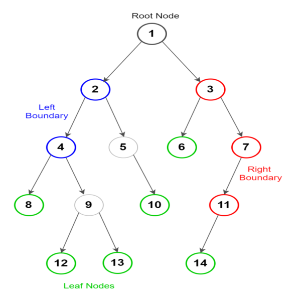

# Trees

## Contents

 - **Basics:**
   - [Tree Terminology](#tree-terminology)
 - [**Binary Tree (+Node class implementation)**](#intro-to-binary-tree)
   - Basic operations on Binary Tree:
     - [Tree Traversal Techniques:](#ttt)
       - [Depth First Search (DFS):](#depth-first-search)
         - [Preorder Traversal (current-left-right)](#preorder-traversal)
         - [Inorder Traversal (left-current-right)](#inorder-traversal)
         - [Postorder Traversal (left-right-current)](#postorder-traversal)
       - [Breadth-First Search (BFS)](#bfs)
         - Level Order Traversal
     - Inserting
     - Searching
     - Removing
     - Deletion
   - Auxiliary operations on Binary Tree:
     - Finding the height of the tree
     - Find the level of the tree
     - Finding the size of the entire tree
   - Special types of Binary Tree:
     - [Binary Search Tree (+Class implementation)](#intro-to-binary-search-tree)
       - Inserting:
         - [Inserting in a Binary Search Tree (Recursive Approach)](#insert-bst-recursive-approach)
         - [Inserting in a Binary Search Tree (Iterative Approach)](#insert-bst-iterative-approach)
 - [**REFERENCES**](#ref)


   - [**Level Order Traversal or Breadth First Search (BFS)**](#)
   - [**Boundary Traversal**](#boundary-traversal)
   - [**Diagonal Traversal**](#diagonal-traversal)


<!--- ( Basics ) --->

---

<div id="tree-terminology"></div>

## Tree Terminology

A Tree consists of **"Nodes"** connected by **"Edges"**.

  

In such a picture of a tree:

 - The **"Nodes"** are represented as circles.
 - And the **"Edges"** as lines connecting the circles.

Many terms are used to describe particular aspects of trees. For example, see the image below:

  


<!--- ( Binary Tree ) --->

---

<div id="intro-to-binary-tree"></div>

## Binary Tree (+Node class implementation)

> A **Binary Tree** is a *tree* data structure in which each parent node can have at most two children.

Each node of a binary tree consists of three items:

 - Data *item (or key)*.
 - Address of *left child*.
 - Address of *right child*.

For example:

  

A common approach to work with ***Binary Trees*** is to create a ***Node*** class to represent our nodes in the Tree.

For example:

[trees.py](src/python/trees.py)
```python
class Node:
    def __init__(self, key):
        self.leftChild = None
        self.rightChild = None
        self.key = key
```

Now, let's test in the practice:

```python
from trees import Node

if __name__ == "__main__":

    #     1 (root)
    #    / \
    # None None
    root = Node(1)
    print(root.key)

    #         1 (root)
    #        /  \
    #       /    \
    #      /      \
    #     2         3
    #    / \       / \
    # None None None None
    root.left = Node(2)
    root.right = Node(3)
    print(root.left.key)
    print(root.right.key)

    #         1 (root)
    #        /  \
    #       /    \
    #      /      \
    #     2         3
    #    / \       / \
    #   4  None  None None
    #  / \
    # None None
    root.left.left = Node(4)
    print(root.left.left.key)
```

**OUTPUT:**
```bash
1
2
3
4
```


<!--- ( Binary Tree/Basic operations on Binary Tree/Traversing ) --->

---

<div id="ttt"></div>

## Tree Traversal Techniques

> Unlike **Linear Data Structures (Array, Strings, Vectors, Linked Lists, Queues, Stacks)** which have only one logical way to traverse them, *Trees* can be traversed in different ways.

 - **Depth First Search (DFS):**
   - Preorder Traversal (current-left-right)
   - Inorder Traversal (left-current-right)
   - Postorder Traversal (left-right-current)
 - **Breadth First Search (BFS):**
   - Level Order Traversal
 - **Boundary Traversal**
 - **Diagonal Traversal**

> **NOTE:**  
> To remember the **Depth First Search (DFS)** approaches see that:
> - **Preorder -** The *current (root)* is the *first*.
> - **Inorder -** The *current (root)* is the *second*.
> - **Postorder -** The *current (root)* is the *third*.
> - **NOTE:** The "left" is always the first node visited before the "right" node.


---

<div id="depth-first-search"></div>

## Depth First Search (DFS)

> **Depth-First Search (DFS)** is an algorithm used for *searching* or *traversing* **Tree** or **Graph** data structures.

Has two approaches to implementing the **Depth First Search (DFS)** Algorithm:

 - **Recursive Implementation:**
   - The recursive approach does not explicitly rely (depende) on a stack for tree traversal since (pois) *the stack is implicitly managed by the programming language's* **call stack**.
 - **Iterative Implementation:**
   - The iterative approach uses a **Stack (Last In, First Out (LIFO))** to store the visited Nodes.
   - *Stack* also is used to maintain (manter) control of the tree traversal process.
   - The *stack* also is used to store the nodes that still need to be processed.
   - The use of the *stack* in the iterative approach allows for a non-recursive tree traversal and is particularly useful in situations where recursion can lead (levar) to a *stack overflow* in **very large** or **deep trees**.
   - Additionally, the iterative approach can be more efficient in terms of resource consumption compared to the recursive approach in certain cases.


---

<div id="preorder-traversal"></div>

## Preorder Traversal (current-left-right)

> This technique follows the **'CURRENT->LEFT->RIGHT'** policy.

 - It means that, *first current (root) node* is visited.
 - After that the *left subtree* is traversed recursively.
 - And finally, *right subtree* is recursively traversed.

> **NOTE:**  
> - As the *root node* is traversed **before (or pre)** the left and right subtree, it is called **preorder traversal**.
> - So, in a **preorder traversal**, each *node* is visited before both of its *subtrees*.

Until all nodes of the tree are not visited:

 - **Step 1 -** Visit the *curret (root) node*.
 - **Step 2 -** Traverse the *left subtree* recursively.
 - **Step 3 -** Traverse the *right subtree* recursively.

Now, let's see the example of the **preorder traversal** technique:

  

Now, start applying the **preorder traversal** on the above tree:

 - First, we traverse the *root node A*.
 - After that, move to its left *subtree*, which will also be *traversed in preorder*.
 - And finally, the *right subtree C* is *traversed in preorder*.

```md
A->B->D->E->C->F->G
```

Now, imagine we have the following tree:

  

The visual **preorder traversal** of the above tree is:


Now, let's see how to implement the **preorder** method using **Recursive approach** to do this:

[trees.py](src/python/trees.py)
```python

```

See that:

 - x
 - x

Now, let's test in the practice:

```python
from trees import BinarySearchTree

if __name__ == "__main__":

    bst = BinarySearchTree()

    bst.insert(25, approach="iterative")
    bst.insert(20, approach="iterative")
    bst.insert(36, approach="iterative")
    bst.insert(10, approach="iterative")
    bst.insert(30, approach="iterative")
    bst.insert(40, approach="iterative")
    bst.insert(22, approach="iterative")
    bst.insert(28, approach="iterative")
    bst.insert(5, approach="iterative")
    bst.insert(1, approach="iterative")
    bst.insert(8, approach="iterative")
    bst.insert(12, approach="iterative")
    bst.insert(30, approach="iterative")
    bst.insert(15, approach="iterative")
    bst.insert(36, approach="iterative")
    bst.insert(48, approach="iterative")
    bst.insert(36, approach="iterative")
    bst.insert(50, approach="iterative")

    print("Preorder:", bst.preorder())
    print("Inorder:", bst.inorder())
    print("Postorder:", bst.postorder())
```

**OUTPUT:**
```bash
Preorder: [25, 20, 10, 5, 1, 8, 12, 15, 22, 36, 30, 28, 30, 36, 36, 40, 48, 50]
Inorder: [1, 5, 8, 10, 12, 15, 20, 22, 25, 28, 30, 30, 36, 36, 36, 40, 48, 50]
Postorder: [1, 8, 5, 15, 12, 10, 22, 20, 30, 28, 36, 36, 30, 50, 48, 40, 36, 25]
```


---

<div id="inorder-traversal"></div>

## Inorder Traversal (left-current-right)

> This technique follows the **'LEFT->ROOT->RIGHT'** policy.

 - It means that first *left subtree is visited*.
 - After, the *root node is traversed*.
 - And finally, the *right subtree is traversed*.

> **NOTE:**  
> As the **current (root) node** is traversed between the *left* and *right subtree*, it is named **inorder traversal**.

Until all nodes of the tree are not visited:

  - **Step 1 -** Traverse the *left subtree* recursively.
  - **Step 2 -** Visit the *root node*.
  - **Step 3 -** Traverse the *right subtree* recursively.

Now, let's see the example of the **Inorder traversal** technique:

  

Now, start applying the **inorder traversal** on the above tree:

 - First, we traverse the *left subtree B* that will be traversed in inorder.
 - After that, we will traverse the *root node A*.
 - And finally, the *right subtree C* is traversed in inorder.

```md
D->B->E->A->F->C->G
```

Now, imagine we have the following tree:

  

The visual **inorder traversal** of the above tree is:


---

<div id="postorder-traversal"></div>

## Postorder Traversal (left-right-current)

> This technique follows the **'LEFT->RIGHT->ROOT'** policy.

 - It means that the first *left subtree* of the *root node is traversed*.
 - After that recursively traverses the *right subtree*.
 - And finally, the *root node* is traversed.

> **NOTE:**  
> As the root node is traversed **after (or post)** the *left* and *right subtree*, it is called **postorder traversal**.

Until all nodes of the tree are not visited:

 - **Step 1 -** Traverse the *left subtree* recursively.
 - **Step 2 -** Traverse the *right subtree* recursively.
 - **Step 3 -** Visit the *root node*.

Now, let's see the example of the **postorder traversal** technique:

  

Now, start applying the **postorder traversal** on the above tree:

 - First, we traverse the *left subtree B* that will be *traversed in postorder*.
 - After that, we will traverse the *right subtree C in postorder*.
 - And finally, the *root node* of the above tree, i.e., A, is traversed.

```md
D->E->B->F->G->C->A
```

Now, imagine we have the following tree:

  

The visual **postorder traversal** of the above tree is:


Now, let's see how to implement the **postorder** method using **Recursive approach** to do this:

[trees.py](src/python/trees.py)
```python

```

See that:

 - x
 - x

Now, let's test in the practice:

```python
from trees import BinarySearchTree

if __name__ == "__main__":

    bst = BinarySearchTree()

    bst.insert(25, approach="iterative")
    bst.insert(20, approach="iterative")
    bst.insert(36, approach="iterative")
    bst.insert(10, approach="iterative")
    bst.insert(30, approach="iterative")
    bst.insert(40, approach="iterative")
    bst.insert(22, approach="iterative")
    bst.insert(28, approach="iterative")
    bst.insert(5, approach="iterative")
    bst.insert(1, approach="iterative")
    bst.insert(8, approach="iterative")
    bst.insert(12, approach="iterative")
    bst.insert(30, approach="iterative")
    bst.insert(15, approach="iterative")
    bst.insert(36, approach="iterative")
    bst.insert(48, approach="iterative")
    bst.insert(36, approach="iterative")
    bst.insert(50, approach="iterative")

    print("Preorder:", bst.preorder())
    print("Inorder:", bst.inorder())
    print("Postorder:", bst.postorder())
```

**OUTPUT:**
```bash
Preorder: [25, 20, 10, 5, 1, 8, 12, 15, 22, 36, 30, 28, 30, 36, 36, 40, 48, 50]
Inorder: [1, 5, 8, 10, 12, 15, 20, 22, 25, 28, 30, 30, 36, 36, 36, 40, 48, 50]
Postorder: [1, 8, 5, 15, 12, 10, 22, 20, 30, 28, 36, 36, 30, 50, 48, 40, 36, 25]
```


---

<div id="bfs"></div>

## Level Order Traversal or Breadth First Search (BFS)

> **Level Order Traversal or Breadth First Search (BFS)** is when you inspect every node on a level starting at the top of the tree and then move to the *next level*.

For example, see the image below to understand more easily:

  

**NOTE:**  
The **Level Order Traversal or Breadth First Search (BFS)** use the **Queue (First In First Out - FIFO)** approach to store and manage the Nodes:

  

---

<div id="boundary-traversal"></div>

## Boundary Traversal

> A **Boundary Traversal** uses an **Anti-Clockwise** direction to traverse or search Trees or Graphs.

For example, see the image below to understand more easily:

  

Following the **"Boundary Traversal"** approach:

 - First, we need to visit the *"root node"*.
 - Next, we visit the *"Left Boundary Nodes"*.
 - Next, we visit the *"Leaf Nodes"*.
 - And finally, we visit the *"Right Boundary Nodes"*.

Following this order, we have the following output (result):

  

```md
1->2->4->8->12->13->10->6->14->11->7->3
```

> **And the internal *9* and *5* nodes?**

 - In the **Boundary Traversal** algorithm, the internal nodes on the right side are omitted because the traversal aims (visa) to visit only the nodes that lie (que estão) on the outer boundary (limites externos) of a binary tree, including:
   - The *root node*.
   - *Left boundary nodes*.
   - And *right boundary nodes*.
 - In the typical implementation of this algorithm, the internal nodes on the right side are omitted because the traversal focuses on the outer boundary (limites externos) of the tree:
   - This means that only the nodes that are closest (próximos) to the edge (borda) of the tree are considered, while the internal nodes are ignored.

See the other **Boundary Traversal** images (examples) below:

  
  
  

> **NOTE:**  
> Remember that **Boundary Traversal** uses an **Anti-Clockwise** direction.

---

<div id="diagonal-traversal"></div>

## Diagonal Traversal

To understand **Diagonal Traversal** first see the image below:

  

To *traverse (or search)* using the **Diagonal Traversal** approach we:

 - The first *node* to visit is the *root node*.
 - From the *root node* go to the *right node* following the slope (-1):
   - root and *root->right* values will be prioritized over all *root->left* values.
 - Follow the same process to the other lines.

The output (traversal and search) to the tree shown is:

```
8->10->14->3->6->7->13->1->4
```


<!--- ( Binary Tree/Special types of Binary Tree/Binary Search Tree ) --->

---

<div id="intro-to-binary-search-tree"></div>

## Binary Search Tree (+Class implementation)

**Binary Search Tree** is a *node-based binary tree* data structure that has the following properties:

 - All nodes of the **left subtree** are `less than` the **root node**.
 - All nodes of **right subtree** are `more than` the **root node**.
 - Both subtrees of each node are also **Binary Search Tree**.
   - In other words, they have the above two properties

For example:

  

To implement the ***Binary Search Tree class*** let's get started by implementing the class *constructor*:

[trees.py](src/python/trees.py)
```python
class Node:
    def __init__(self, key):
        self.leftChild = None
        self.rightChild = None
        self.key = key


class BinarySearchTree(Node):
    def __init__(self):
        self.root = None
```

Now, let's implement the **isEmpty()** method to check if the **Binary Search Tree** is empty:

[trees.py](src/python/trees.py)
```python
def isEmpty(self):
    return self.root is None
```

Now, let's test in the practice:

```python
from trees import BinarySearchTree

if __name__ == '__main__':

    bst = BinarySearchTree()

    print("The Binary Search Tree is empty? ", bst.isEmpty())
```

**OUTPUT:**
```bash
The Binary Search Tree is empty? True
```

---

<div id="insert-bst-recursive-approach"></div>

## Inserting in a Binary Search Tree (Recursive Approach)

> A **new key** is always inserted at the *leaf (folha)* by maintaining the *property* of the Binary Search Tree.

  

For example, let's see how to insert a new node (data/key) in the ***Binary Search Tree*** using a *recursive approach*:

[trees.py](src/python/trees.py)
```python
def insert(self, key, approach="recursive"):
    if self.isEmpty():
        self.root = Node(key)
    else:
        if approach == "recursive":
            self._insert_recursive(self.root, key)
        elif approach == "iterative":
            self._insert_iterative(self.root, key)
        else:
            print("Invalid approach. Please use 'recursive' or 'iterative'.")

def _insert_recursive(self, current_node, key):
    if key <= current_node.key:
        if current_node.leftChild is None:
            current_node.leftChild = Node(key)
        else:
            self._insert_recursive(current_node.leftChild, key)
    elif key >= current_node.key:
        if current_node.rightChild is None:
            current_node.rightChild = Node(key)
        else:
            self._insert_recursive(current_node.rightChild, key)
```

See that:

 - We have two methods `"insert() public"` and `"_insert_recursive() private"`:
 - `insert():`
   - This method first checks if the *Binary Search Tree* is empty:
     - If the Tree is empty, it creates a new Node (value/key) as root.
   - If it's not empty, it calls the private method `"_insert_recursive()"`:
     - That's, we need to insert a new value (key) into the Tree with existing values.
 - `_insert_recursive() - This is the real method to insert a new value into the not empty Tree:`
   - This method receives the following arguments:
     - **current_node:** The first time, the "current_node" will be the "root" and loop Node by Node when necessary.
     - **key:** The "key" is the value to be inserted at the new Node.
   - Inside of the `_insert_recursive()` method the first thing to check is the side to move, left or right:
     - `"if key <= current_node.key"`:
       - If the *"key"* `is less or equal` to *"the key of the current_node"*, we move to the left subtree.
       - **NOTE:** This approach allows the insertion of *duplicate values*. If you don't wish allow change `"<="` to `"<"`.
     - `"elif key >= current_node.key"`:
       - If the *"key"* `is greater or equal` to *"the key of the current_node"*, we move to the right subtree.
       - **NOTE:** This approach allows the insertion of *duplicate values*. If you don't wish allow change `">="` to `">"`.
   - Next, we need to check if the *"current_node.left/right"* are empty (`"if current_node.leftChild is None" | "if current_node.rightChild is None"`):
     - If the *"current_node.left/right"* `is empty (None)`, then we must insert the new Node (value/key) here.
     - If the *"current_node.left/right"* `is not empty`, then we need to move recursively to the next Node (left or right):
       - `"self._insert_recursive(current_node.leftChild, key)"`
       - `"self._insert_recursive(current_node.rightChild, key)"`
       - **NOTE:** See that here we pass the *"current_node.left/right"* to the `_insert_recursive()` method, not the *root* Node.
       - **Base case (condiction to stop the recursion):**
         - The new Node (value/key) was created.
         - When the new Node (value/key) is created we don't call the `_insert_recursive()` method again recursively.

Now, let's test in the practice:

```python
from trees import BinarySearchTree

if __name__ == "__main__":

    bst = BinarySearchTree()

    bst.insert(25, approach="recursive")
    bst.insert(20, approach="recursive")
    bst.insert(36, approach="recursive")
    bst.insert(10, approach="recursive")
    bst.insert(30, approach="recursive")
    bst.insert(40, approach="recursive")
    bst.insert(22, approach="recursive")
    bst.insert(28, approach="recursive")
    bst.insert(5, approach="recursive")
    bst.insert(1, approach="recursive")
    bst.insert(8, approach="recursive")
    bst.insert(12, approach="recursive")
    bst.insert(30, approach="recursive")
    bst.insert(15, approach="recursive")
    bst.insert(36, approach="recursive")
    bst.insert(48, approach="recursive")
    bst.insert(36, approach="recursive")
    bst.insert(50, approach="recursive")

    result = bst.inorder()
    print(result)
```

**OUTPUT:**
```bash
[1, 5, 8, 10, 12, 15, 20, 22, 25, 28, 30, 30, 36, 36, 36, 40, 48, 50]
```

---

<div id="insert-bst-iterative-approach"></div>

## Inserting in a Binary Search Tree (Iterative Approach)

> A **new key** is always inserted at the *leaf (folha)* by maintaining the *property* of the Binary Search Tree.

  

For example, let's see how to insert a new node (data/key) in the ***Binary Search Tree*** using a *Iterative Approach*:

[trees.py](src/python/trees.py)
```python
def _insert_iterative(self, current_node, key):
    while True:
        if key <= current_node.key:
            if current_node.leftChild is None:
                current_node.leftChild = Node(key)
                break
            else:
                current_node = current_node.leftChild
        elif key >= current_node.key:
            if current_node.rightChild is None:
                current_node.rightChild = Node(key)
                break
            else:
                current_node = current_node.rightChild
```

See that:

 - **Again we have two function:**
   - **inser():** To check if the *Binary Search Tree* is empty and select the appropriate approach (recursive or iterative).
   - **_insert_iterative():** To insert a new value (key) into the Tree with existing values.
 - **_insert_iterative():**
   - Inside the **"_insert_iterative()" function** we have a `loop "while" (infinite loop)` to through (percorrer) the Tree:
     - Inside the `"while" loop`:
       - `"if key <= current_node.key"`:
         - If the *"key"* `is less or equal` to *"the key of the current_node"*, we move to the left subtree.
         - **NOTE:** This approach allows the insertion of *duplicate values*. If you don't wish allow change `"<="` to `"<"`.
       - `"elif key >= current_node.key"`:
         - If the *"key"* `is greater or equal` to *"the key of the current_node"*, we move to the right subtree.
         - **NOTE:** This approach allows the insertion of *duplicate values*. If you don't wish allow change `">="` to `">"`.
       - Next, we need to check if the *"current_node.left/right"* are empty (`"if current_node.leftChild is None" | "if current_node.rightChild is None"`):
         - If the *"current_node.left/right"* `is empty (None)`, then we must insert the new Node (value/key) here and `"break"` the `"while" loop`.
         - If the *"current_node.left/right"* `is not empty`, then we need to move to the next Node (left or right):
           - `"current_node = current_node.leftChild"`
           - `"current_node = current_node.rightChild"`

Now, let's test in the practice:

```python
from trees import BinarySearchTree

if __name__ == "__main__":

    bst = BinarySearchTree()

    bst.insert(25, approach="iterative")
    bst.insert(20, approach="iterative")
    bst.insert(36, approach="iterative")
    bst.insert(10, approach="iterative")
    bst.insert(30, approach="iterative")
    bst.insert(40, approach="iterative")
    bst.insert(22, approach="iterative")
    bst.insert(28, approach="iterative")
    bst.insert(5, approach="iterative")
    bst.insert(1, approach="iterative")
    bst.insert(8, approach="iterative")
    bst.insert(12, approach="iterative")
    bst.insert(30, approach="iterative")
    bst.insert(15, approach="iterative")
    bst.insert(36, approach="iterative")
    bst.insert(48, approach="iterative")
    bst.insert(36, approach="iterative")
    bst.insert(50, approach="iterative")

    result = bst.inorder()
    print(result)
```

**OUTPUT:**
```bash
[1, 5, 8, 10, 12, 15, 20, 22, 25, 28, 30, 30, 36, 36, 36, 40, 48, 50]
```


<!--- ( REFERENCES ) --->

---

<div id="ref"></div>

## REFERENCES

 - [Data Structures & Algorithms in Python](https://learning.oreilly.com/library/view/data-structures/9780134855912/)
 - [Introduction to Binary Tree – Data Structure and Algorithm Tutorials](https://www.geeksforgeeks.org/introduction-to-binary-tree-data-structure-and-algorithm-tutorials/)
 - [Types of Binary Tree](https://www.geeksforgeeks.org/types-of-binary-tree/)
 - [Applications, Advantages and Disadvantages of Binary Tree](https://www.geeksforgeeks.org/applications-advantages-and-disadvantages-of-binary-tree/)
 - [Applications, Advantages and Disadvantages of Binary Search Tree](https://www.geeksforgeeks.org/applications-advantages-and-disadvantages-of-binary-search-tree/)
 - [Insertion in Binary Search Tree (BST)](https://www.geeksforgeeks.org/insertion-in-binary-search-tree/)
 - [Depth-First Search: Conceptual](https://www.codecademy.com/article/depth-first-search-conceptual)
 - [Depth-first search - wikipedia](https://en.wikipedia.org/wiki/Depth-first_search)
 - [Learn Depth-First Search(DFS) Algorithm From Scratch](https://www.simplilearn.com/tutorials/data-structure-tutorial/dfs-algorithm)
 - [Tree traversal (Inorder, Preorder an Postorder)](https://www.javatpoint.com/tree-traversal)
 - [Tree Traversal: Breadth-First Search vs Depth-First Search](https://www.codecademy.com/article/tree-traversal)
 - [Boundary Traversal of Binary Tree](https://www.codingninjas.com/studio/problems/boundary-traversal_790725)
 - [Perform boundary traversal on a binary tree](https://www.techiedelight.com/boundary-traversal-binary-tree/)
 - [Boundary Traversal of a Binary Tree](https://takeuforward.org/data-structure/boundary-traversal-of-a-binary-tree/)
 - [Diagonal Traversal of Binary Tree](https://www.geeksforgeeks.org/diagonal-traversal-of-binary-tree/)

---

Ro**drigo** **L**eite da **S**ilva - **drigols**
