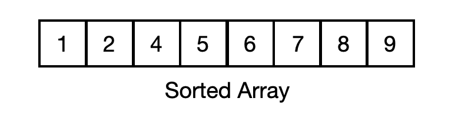
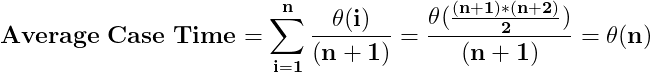

# Asymptotic Analysis

## Contents

 - **Asymptotic Analysis:**
   - [Intro to Asymptotic Analysis](#intro-to-aa)
   - [Asymptotic Analysis example with search problem](#aa-sp)
   - [Understanding Asymptotic Behavior](#aab)
 - **Asymptotic notations**
   - [Big Oh (O) Notation ( Worst-Case / Upper Bound )](#big-o-notation)
   - [Omega (Ω) Notation ( Best Case / Lower Bound )](#omega-notation)
   - [Theta (Θ) Notation ( Average Case / Average Bound )](#theta-notation)
 - **Cases (examples):**
   - [Constant Time Complexity O(1)](#o1)
   - [Linear Time Complexity O(n)](#on)
   - [Quadratic Time Complexity O(n<sup>2</sup>)](#qtc)
   - [Logarithmic Time Complexity O(Log n)](#ltc)
   - [Logarithmic Time Complexity O(Log Log n):](#loglogn)
   - [Linear search algorithm](#case-lsa)
 - **Tips & Tricks:**
   - [Algorithms with same Asymptotic Notation for all the cases (worst, best, average)](#algo-same-an)

---

<div id="intro-to-aa"></div>

## Intro to Asymptotic Analysis

> **Given two algorithms for a task, how do we find out which one is better?**

One naive way of doing this is – to implement both the algorithms and run the two programs on your computer for different inputs and see which one takes less time. There are many problems with this approach for the analysis of algorithms.

For example:

 - It might be possible that for **some inputs**, **the first algorithm performs better than the second**:
   - And for **some inputs second performs better**.
 - It might also be possible that for **some inputs**, **the first algorithm performs better on one *machine***:
   - And **the second works better on another *machine*** for *some other inputs*.

Asymptotic Analysis is the big idea that handles the above issues in analyzing algorithms:

 - **[ENG] -** In Asymptotic Analysis, we **evaluate the performance of an algorithm in terms of input size** (we don’t measure the actual running time). We calculate, how the time (or space) taken by an algorithm increases with the input size.
 - **[PT-BR] -** Na Análise Assintótica, **avaliamos o desempenho de um algoritmo em termos de tamanho de entrada** (não medimos o tempo real de execução). Calculamos como o tempo (ou espaço) gasto por um algoritmo aumenta com o tamanho da entrada. 

---

<div id="aa-sp"></div>

## Asymptotic Analysis example with search problem

Let us consider the **search problem (searching a given item)** in a sorted array:

  

The solution to above search problem includes:

 - **Linear Search** (order of growth is linear).
 - **Binary Search** (order of growth is logarithmic).

To understand how **Asymptotic Analysis** solves the problems mentioned above in analyzing algorithms, let us say:

 - We run the **Linear Search** on a **fast computer A**.
 - And **Binary Search** on a **slow computer B**.
 - Pick the *constant values* for the two computers so that it tells us exactly how long it takes for the given machine to perform the search in seconds.

Now, let’s say the constant for **computer A** is **0.2** and the constant for **computer B** is **1000**.

> **NOTE:**  
> Which means that **computer A** is **5000** times more powerful than **computer B**.

 - For **small values** of **input array size n**, the *fast computer (computer A)* may take less time.
 - But, **after a certain value of input array size, the Binary Search will definitely start taking less time compared to the Linear Search even though the Binary Search is being run on a slow machine**.

For example, see the table below comparing the search algorithms:

| Input Size    | Running time on computer A | Running time on computer B |
|---------------|----------------------------|----------------------------|
| 10	          | 2 sec                      | ~ 1 h                      |
| 100	          | 20 sec                     | ~ 1.8 h                    |
| 10<sup>6<sup> | ~ 55.5 h                   | ~ 5.5 h                    |
| 10<sup>9<sup>	| ~ 6.3 years                | ~ 8.3 h                    |

See that from **n (input size) >= 10<sup>6<sup>** the algorithm A (Linear Search) will always take more time compared algorithm B (Binary Search).

 - The reason is the **order of growth of Binary Search** with respect to input size is **logarithmic**.
 - While the **order of growth of Linear Search** is **linear**.

> **NOTE:**  
> So the machine-dependent **constants can always be ignored** after a certain value of input size.

Running times for this example:

 - **Linear Search:**
   - Running time in seconds on computer A: **0.2 * n**.
 - **Binary Search:**
   - Running time in seconds on computer B: **1000*log(n)**

**Does Asymptotic Analysis always work?**  
Asymptotic Analysis is not perfect, but that’s the best way available for analyzing algorithms.

**NOTE:**  
For example, say there are two sorting algorithms that take **1000nLogn** and **2nLogn** time respectively on a machine. Both of these algorithms are asymptotically the same **(order of growth is nLogn)**. So, With Asymptotic Analysis, we can’t judge which one is better as we ignore constants in Asymptotic Analysis.

**NOTE:**  
Also, in Asymptotic analysis, we always talk about input sizes larger than a constant value. It might be possible that those large inputs are never given to your software and an asymptotically slower algorithm always performs better for your particular situation. So, you may end up choosing an algorithm that is Asymptotically slower but faster for your software.

---

<div id="aab"></div>

## Understanding Asymptotic Behavior

Knowing that discarding all constant terms and maintaining only the highest growth, we obtain the **Asymptotic behavior**.

> **Asymptotic behavior is the behavior of a function *T(n)* when *"n"* tends to infinity.**

This happens (acontece) because the term that has the largest exponent dominates the behavior of the function **T(n)** when **"n"** tends to infinity.

To understand better, consider the following functions (algorithms):


Although (embora/apesar) the function **g(n)** has higher constants multiplying *(1000 and 500)* your terms, exist a value to **"n"** where the function (algorithms) **h(n)** will always greater than the **g(n)** function.

For example, let's test some **"n"** values to the functions **g(n)** and **h(n)**:

 - **n = 10**
   - g(n): 10.500
   - h(n): 111
 - **n = 100**
   - g(n): 100.500
   - h(n): 10.101
 - **n = 1.000**
   - g(n): 1.000.500
   - h(n): 1.001.001
 - **n = 1.500**
   - g(n): 1.500.500
   - h(n): 2.251.501
 - **n = 2.000**
   - g(n): 2.000.500
   - h(n): 4.002.001
 - **n = 2.500**
   - g(n): 2.500.500
   - h(n): 6.252.501
 - **n = 3.000**
   - g(n): 3.000.500
   - h(n): 9.003.001
 - **n = 3.500**
   - g(n): 3.500.500
   - h(n): 12.253.501
 - **n = 4.000**
   - g(n): 4.000.500
   - h(n): 16.004.001
 - **n = 4.500**
   - g(n): 4.500.500
   - h(n): 20.254.501
 - **n = 5.000**
   - g(n): 5.000.500
   - h(n): 25.005.001
 - **n = 5.500**
   - g(n): 5.500.500
   - h(n): 30.255.501
 - **n = 6.000**
   - g(n): 6.000.500
   - h(n): 36.006.001
 - **n = 6.500**
   - g(n): 6.500.500
   - h(n): 42.256.501
 - **n = 7.000**
   - g(n): 7.000.500
   - h(n): 49.007.001
 - **n = 7.500**
   - g(n): 7.500.500
   - h(n): 56.257.501
 - **n = 8.000**
   - g(n): 8.000.500
   - h(n): 64.008.001
 - **n = 8.500**
   - g(n): 8.500.500
   - h(n): 72.258.501
 - **n = 9.000**
   - g(n): 9.000.500
   - h(n): 81.009.001
 - **n = 9.500**
   - g(n): 9.500.500
   - h(n): 90.259.501
 - **n = 10.000**
   - g(n): 10.000.500
   - h(n): 100.010.001

See that for **n => 1500** the function (algorithm) **h(n)** will always be greater than the function (algorithm) **g(n)**.

> **NOTE:**
> - That is, the asymptotic behavior focuses on the largest term of a function (algorithm) because this term will describe the behavior of the function (algorithm).
> - We say that the function **h(n)** is **n<sup>2</sup>**.

See another functions and your **asymptotic behavior**:

  

**NOTE:**  
Note that the focus is always the largest term of the function.

---

<div id="big-o-notation"></div>

## Big Oh (O) Notation ( Worst-Case / Upper Bound )

> We define an algorithm’s **worst-case** time complexity by using the **Big-O (O) notation**, which determines the set of functions grows slower than or at the same rate as the expression. Furthermore, **it explains the maximum amount of time an algorithm requires to consider all input values**.

**Worst Case Analysis (Mostly used):**

 - In the **worst-case analysis**, **we calculate the upper bound on the running time of an algorithm**.
 - We must know (devemos conhecer) **the case that causes a maximum number of operations to be executed**.
 - For example, *Linear Search*, the **worst case happens when the element to be searched (x) is not present in the array**:
   - When x is not present, the search() function compares it with all the elements of arr[] one by one.
   - Therefore, the worst-case time complexity of the linear search would be **O(n)**.

---

<div id="omega-notation"></div>

## Omega (Ω) Notation ( Best Case / Lower Bound)

> It defines the **best case** of an algorithm’s time complexity, the **Omega (Ω) notation** defines whether the set of functions will grow faster or at the same rate as the expression. Furthermore, **it explains the minimum amount of time an algorithm requires to consider all input values**.

**Best Case Analysis (Very Rarely used)**

 - In the **best-case analysis**, **we calculate the lower bound on the running time of an algorithm**.
 - We must know (devemos conhecer) **the case that causes a minimum number of operations to be executed**.
 - For example, in the linear search problem, the best case occurs when x is present at the first location:
   - The number of operations in the best case is constant (not dependent on n).
   - So time complexity in the best case would be **Ω(1)**.

---

<div id="theta-notation"></div>

## Theta (Θ) Notation ( Average Case / Average Bound )

> It defines the **average case** of an algorithm’s time complexity, the **Theta (Θ) notation** defines **when the set of functions lies in both O(expression) and Omega(expression), then Theta (Θ) notation is used**. This is how we **define a time complexity average case for an algorithm**.

**Average Case Analysis (Rarely used):**

 - In **average case analysis**, **we take all possible inputs and calculate the computing time for all of the inputs**.
 - **Sum all the calculated values** and **divide the sum by the total number of inputs**.
 - We must know (devemos conhece or predict) the distribution of cases.
 - For example, in the linear search problem, let us assume that all cases are [uniformly distributed](https://en.wikipedia.org/wiki/Discrete_uniform_distribution) (including the case of x not being present in the array).
 - So we sum all the cases and divide the sum by (n+1).
 - Following is the value of average-case time complexity.




---

<div id="o1"></div>

## Constant Time Complexity O(1)

The **time complexity** of a function (or set of statements) is considered as **O(1)** if it doesn’t contain a **loop**, **recursion**, and **call to any other non-constant time function**.

> i.e (ou seja). set of **non-recursive** and **non-loop** *statements*.

For example, **swap() function** has **O(1)** time complexity:

[swap.h](src/swap.h)  
```cpp
void swap(int& first, int& second); // Function prototype.
```

[swap.cpp](src/swap.cpp)  
```cpp
#include "swap.h"


void swap(int& first, int& second)
{
    int temp = first;
    first = second;
    second = temp;
}
```

[swap_main.cpp](src/swap_main.cpp)  
```cpp
#include <iostream>
#include "swap.h"
using namespace std;


int main()
{
    int x, y;

    cout << "Enter the first value: ";
    cin >> x;

    cout << "Enter the second value: ";
    cin >> y;

    // Call the swap() function.
    swap(x, y);

    cout << "After swapping " <<
    "the first value is " << x <<
    ", the second value is " << y << ".";


    return 0;
}
```

**COMPILATION AND RUN:**  
```cpp
g++ swap_main.cpp swap.cpp -o swap

./swap.exe

Enter the first value: 10
Enter the second value: 20
```

**OUTPUT:**
```cpp
After swapping the first value is 20, the second value is 10.
```

**NOTE:**  
A **loop** or **recursion** that **runs a constant number of times is also considered O(1)**. For example, the following loop (python) is **O(1)**:

[constant_loop.py](src/constant_loop.py)  
```python
# Here c is a constant
for i in range(1, c+1):
    # some O(1) expressions

    # This code is contributed by Pushpesh Raj.
```

---

<div id="on"></div>

## Linear Time Complexity O(n)

> The **Time Complexity of a loop is considered as O(n)** if **the loop variables are incremented/decremented by a constant amount (valor)**.

For example following functions have **O(n)** time complexity:

**C++ Examples:**  
```c
// Here c is a positive integer constant
for (int i = 1; i <= n; i += c) {
    // some O(1) expressions
}

for (int i = n; i > 0; i -= c) {
	  // some O(1) expressions
}
```

**Python Examples:**  
```python
# Here c is a positive integer constant
for i in range(1, n+1, c):
	# some O(1) expressions

for i in range(n, 0, -c):
    # some O(1) expressions

    # This code is contributed by Pushpesh Raj
```

---

<div id="qtc"></div>

## Quadratic Time Complexity O(n<sup>2</sup>)

The **Time Complexity is quadratic **O(n<sup>2</sup>)**** when:

 - **ENG notes:**
   - Performance is **directly proportional to the squared size of the input data**.
   - **As in nested loops it is equal to the number of times the innermost statement is executed**.
 - **PT-BR notes:**
   - Desempenho é diretamente proporcional ao tamanho ao quadrado dos dados de entrada.
   - Pois em loops aninhados é igual ao número de vezes que a instrução mais interna é executada.

For example, the following sample loops have **O(n<sup>2</sup>)** time complexity:

**C++ Examples:**  
```cpp
for (int i = 1; i <= n; i += c) {
    for (int j = 1; j <= n; j += c) {
        // some O(1) expressions
    }
}

for (int i = n; i > 0; i -= c) {
    for (int j = i + 1; j <= n; j += c) {
        // some O(1) expressions
    }
}
```

**Python Examples:**  
```python
for i in range(1, n+1, c):
    for j in range(1, n+1, c):
        # some O(1) expressions

for i in range(n, 0, -c):
    for j in range(i+1, n+1, c):
        # some O(1) expressions
```

**NOTE:**  
[Selection sort](https://www.geeksforgeeks.org/selection-sort/) and [Insertion Sort](https://www.geeksforgeeks.org/insertion-sort/) have **O(n<sup>2</sup>)** time complexity. 

---

<div id="ltc"></div>

## Logarithmic Time Complexity O(Log n)

 - The **time Complexity of a loop is considered as O(Log n)** if the **loop variables are divided/multiplied** by a **constant amount (valor)**.
 - And also for **recursive calls in the recursive function**, the **Time Complexity is considered as O(Logn)**.

**C++ Examples:**  
```cpp
// variables are divided/multiplied.
for (int i = 1; i <= n; i *= c) {
    // some O(1) expressions
}


// variables are divided/multiplied.
for (int i = n; i > 0; i /= c) {
    // some O(1) expressions
}


// Recursive function
void recurse(n)
{
    if (n == 0)
        return;
    else {
        // some O(1) expressions
    }
    recurse(n - 1);
}
```

**Python Examples:**  
```python
i = 1
# variables are divided/multiplied.
while(i <= n):
    # some O(1) expressions
    i = i*c


i = n
# variables are divided/multiplied.
while(i > 0):
    # some O(1) expressions
    i = i//c


# Recursive function
def recurse(n):
    if(n == 0):
		    return
    else:
        # some O(1) expressions
    recurse(n-1)
```

**NOTE:**  
[Binary Search(refer iterative implementation)](https://www.geeksforgeeks.org/binary-search/) has **O(Logn)** time complexity.

---

<div id="loglogn"></div>

## Logarithmic Time Complexity O(Log Log n)

The **Time Complexity of a loop is considered as O(Log Log n)** if **the loop variables are reduced/increased exponentially by a constant amount (valor)**.

**C++ Example:**  
```cpp
// "i" variable is increased exponentially with pow() function.
for (int i = 2; i <= n; i = pow(i, c)) {
    // some O(1) expressions
}
```

**Python Example:**  
```python
# "i" variable is increased exponentially (i**c).
i = 2
while(i <= n):
    # some O(1) expressions
    i = i**c
```

**See the post below to understand mathematical details:**  
[Time Complexity of a Loop when Loop variable “Expands or Shrinks” exponentially](https://www.geeksforgeeks.org/time-complexity-loop-loop-variable-expands-shrinks-exponentially/)

---

<div id="case-lsa"></div>

## Linear search algorithm

Imagine you have the follow **Linear Search Algorithms**:

[linear_search.cpp](src/linear_search.cpp)
```cpp
#include <iostream>
using namespace std;

// Linearly search x in arr[].
// If x is present then return the index,
// otherwise return -1
int search(int arr[], int n, int x)
{
    int i;
    for (i = 0; i < n; i++) {
        if (arr[i] == x)
            return i;
    }
    return -1;
}


// Driver's Code
int main()
{
    int arr[] = { 1, 10, 30, 15 };
    int x = 30;
    int n = sizeof(arr) / sizeof(arr[0]);

    // Function call
    cout << x << " is present at index " << search(arr, n, x);

    return 0;
}
```

**OUTPUT:**  
```cpp
30 is present at index 2
```

[linear_search.py](src/linear_search.py)
```python
# Linearly search x in arr[].
# If x is present then return the index,
# otherwise return -1
def search(arr, x):
    for index, value in enumerate(arr):
        if value == x:
            return index
    return -1


# Driver's Code
if __name__ == '__main__':
    arr = [1, 10, 30, 15]
    x = 30

    # Function call
    print(x, "is present at index", search(arr, x))
```

**OUTPUT:**  
```python
30 is present at index 2
```

The **time complexity analysis** to the algorithm above is **(In Big-O notation)**:

 - **Best Case: O(1)**
   - This will take place if the element to be searched is on the first index of the given list. So, the number of comparisons, in this case, is 1.
 - **Average Case: O(n)**
   - This will take place if the element to be searched is on the middle index of the given list.
 - **Worst Case: O(n)**
   - The element to be searched is on the last index.
   - Or the element to be searched is not present on the list

---

<div id="algo-same-an"></div>

## Algorithms with same Asymptotic Notation for all the cases (worst, best, average)

For some algorithms, all the *cases (worst, best, average)* are asymptotically the same. i.e., there **are no worst** and **best cases**.

**NOTE:**  
For example, [Merge Sort](https://en.wikipedia.org/wiki/Merge_sort) does **Θ(n log(n))** operations in all cases.

---

**REFERENCES:**  
[[ED] Aula 101 - Análise de Algoritmos - Comportamento Assintótico](https://www.youtube.com/watch?v=SClFMUpBiaw&list=PL8iN9FQ7_jt6buW7SBD3yzjIp8NnJYrZl&index=3)  
[How to Analyse Loops for Complexity Analysis of Algorithms](https://www.geeksforgeeks.org/analysis-of-algorithms-set-4-analysis-of-loops/)  
[Worst, Average and Best Case Analysis of Algorithms](https://www.geeksforgeeks.org/worst-average-and-best-case-analysis-of-algorithms/)  
[Time Complexity Analysis](https://log2base2.com/courses/time-complexity-analysis)  

---

Ro**drigo** **L**eite da **S**ilva - **drigols**
