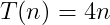

# Counting Statements

## Contents

 - [Statement (simple) Counting](#statement-counting)
   - [Worst Case example](#worst-case)
 - [Ignoring unnecessary statements](#ignoring-unnecessary-statements)
 - **Tips & Tricks:**
   - [Analyzing loops (without recursion)](#analyzing-loops)

---

<div id="statement-counting"></div>

## Statement (simple) Counting

To analyze an Algorithm we need count how many statements the Algorithm run. Knowing this, let's start counting **simple statements**:

> **A simple statements is an statements that can be run directly by the CPU or something close to that (ou algo parecido).**

 - **Statements types:**
   - Assign a value to a variable.
   - Access the value (element) of the determined array.
   - Compare Arrays.
   - Increment a value.
   - Arithmetic Operations:
     - Add
     - Sub
     - Div
     - Mult
 - **Let's assume that:**
   - The statements have the same cost.
   - The selections command has zero (0) cost.

For example, imagine we have an Algorithm that receive an **Array "A"** with **"n"** elements and store the higher element into **"M"** variable:

```cpp
01 int M = A[0];
02 for(int i = 0; i < n; i++)
03     if (A[i] >= M)
04         M = A[i];
```

Now, let's count how many **simple statements** the Algorithm above running:

**Line 01: 1 statement to assign the value zero (0) to the "M" variable**
```cpp
                                Cost:     Times:
01 int M = A[0];                c1        1
02 for(int i = 0; i < n; i++)
03     if (A[i] >= M)
04         M = A[i];
```

**Cost to INITIALIZE the for() (line2) statements is 2:**
 - The **for()** statements need be initialized:
   - 1 statements: **int i = 0**.
 - And same that the **Array A** have size zero (0) at least (ao menos) one comparison will be run:
   - **i < n**; That is, more 1 statements.
```cpp
                                Cost:     Times:
01 int M = A[0];                c1        1
02 for(int i = 0; i < n; i++)   c2        2
03     if (A[i] >= M)
04         M = A[i];
```

**Cost to RUN the for() (line 2) statements is 2n:**
 - At the end (ao final) of each iteration of the *for() loop*, we need:
   - Increment:
     - **i++**
   - And an statements to compare if the loop will continue:
     - **i < n**
 - The loop will be run **"n"** time, that is, the **2 statements** above will be run **"n"** times:
   - **+ 2n (statements)**.
```cpp
                                Cost:     Times:
01 int M = A[0];                c1        1
02 for(int i = 0; i < n; i++)   c2        2 + 2n
03     if (A[i] >= M)
04         M = A[i];
```

**NOTE:**  
Ignoring commands inside **for()** statement, the algorithm has **3 + 2n** statements.

 - **3** statements before initialize **for()** statements.
 - **2** Statements at the end of each **for()** loop, which will be executed **"n"** times.

Thus, considering an *empty loop (for)*, we can define a mathematical function that represents the cost of the Algorithm in relation to the size of the input array as:

  

Ok, but what about the statements inside the **for() loop** how do we count?

 - The **if()** statement has 1 comparison statement: **(A[i] >= M)**;
 - And inside the **if()** we have 1 more assignment statement: **M = A[i]**.

```cpp
                                     Cost:     Times:
01 int M = A[0];                     c1        1
02 for(int i = 0; i < n; i++)        c2        2 + 2n
03     if (A[i] >= M)                c3        1 (How many times?)
04         M = A[i];                 c4        1 (How many times?)
```

> **PROBLEM:**  
> Well, now we have a little problem, how many times will these statements be executed?

 - Statements seen previously were always executed.
 - However, the statements inside *for()* may or may not be executed.

That is, before it was enough to know the size of array **A**, **"n"**, to define the cost function **T(n)**. Now we also need to consider the contents of the array.

For example, look at the two arrays below:


```cpp
01 A1 = [1, 2, 3, 4]
02 A2 = [4, 3, 2, 1]
```

 - Array **A1** will have more statements, because the **if()** will always be true:
   - Will always have a value (element) greater than another to algorithm get.
   - That's because array **A1** is in *ascending order*.
 - And the **A2** array will have less statements because the **if()** will always be false:
   - How the array **A2** is in **descending order** never will have a value (element) greater than first. That is, the **if()** will always be false.

---

<div id="worst-case"></div>

## Worst Case example

When analyzing an Algorithm, it is very common to consider the **worst case possible**.

> **The *Worst Case* is when the Algorithm executes as many statements as possible.**

In our Algorithm (finding the greatest value (element) in an arra) **Worst Case** occurs when the array A is in **ascending order**:

**INPUT:**  
```cpp
A = [1, 2, 3, 4]
```

**Algorithms cost:**  
```cpp
                                     Cost:     Times:
01 int M = A[0];                     c1        1
02 for(int i = 0; i < n; i++)        c2        2 + 2n
03     if (A[i] >= M)                c3        1 (always executed)
04         M = A[i];                 c4        1 (always executed)
```

 - The value of **"M"** is always substituted;
 - And the **for() loop** always executes the 2 inside statements **"n"** times.

Thus, the cost function of the Algorithm will be:

  

**NOTE:**  
This function represents the cost of the Algorithm in relation to the size of the array **A ("n")** in the **Worst case**.

---

<div id="ignoring-unnecessary-statements"></div>

## Ignoring unnecessary statements

> **All the terms of an algorithm cost function necessary?**

For example, see Algorithm and *cost function (worst-case)* below:

```cpp
                                     Cost:     Times:
01 int M = A[0];                     c1        1
02 for(int i = 0; i < n; i++)        c2        2 + 2n
03     if (A[i] >= M)                c3        1
04         M = A[i];                 c4        1
```

  

In fact, not all terms are necessary. We can drop certain terms in the *Cost Function* and keep only the ones that tell us what happens to the function when the input data size **("n")** grows too large.

> **NOTE:**  
> If an Algorithm is faster than another for a large set of input data, it is very likely that it will continue to be faster on a smaller data set as well *(But it's not certain, it's just likely)*.

Okay, now we know that not all terms are crucial, let's drop the terms that grow slowly and keep only the ones that grow faster as the *input ("n")* value gets bigger.

For example, our Cost Function **T(n) = 4n + 3** has 2 terms:

 - **4n**
 - **3**

The **3** term are **initialization constants** and do not change as the *input ("n")* increases. So our Cost Function can be reduced to:

  

Another observation is that *constants that multiply* the **"n"** term of the *Cost Function* must also be discarded. This makes sense if we think about different programming languages.

For example, look at the following line of code in **Pascal Programming Language**:

```pascal
M := A[i];
```

Is equivalent to the following code in **C Programming Language**:

```c
if(i >= 0 && i < n)
    M = A[i];
```

Ignoring these multiplication constants is equivalent to ignoring the particularities of each language and analyzing only the idea of the Algorithm.

So our *Cost Function* can be reduced again to:

  

---

<div id="analyzing-loops"></div>

## Analyzing loops (without recursion)

> In general, we can get the cost function of a function (Algorithm) just by counting the **nested loop statements**.

Some tips are:

 - **Loopless Algorithm:**
   - Constant number of statements (except if there is recursion), that is, **T(n) = 1**.
 - **Algorithm with 1 loop:**
   - Going from **1** to **"n"** will be **T(n) = n**.
 - **Algorithm with 2 nested loops:**
   - Will be **T(n) = n<sup>2</sup>**, and so on...

---

**REFERENCES:**  
[[ED] Aula 101 - Análise de Algoritmos - Comportamento Assintótico](https://www.youtube.com/watch?v=SClFMUpBiaw&list=PL8iN9FQ7_jt6buW7SBD3yzjIp8NnJYrZl&index=3)

---

Ro**drigo** **L**eite da **S**ilva - **drigols**
