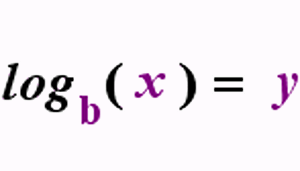

# Math for Algorithms

## Contents

 - **Logarithms:**
   - [Intro to Logarithms](#intro-to-log)
   - [Properties of Logarithms in Analysis of Algorithms](#proprities-of-log)
 - [**References**](#ref)

<!--- ( Logarithms ) -->

---

## Intro to Logarithms

> **Logarithms are the opposite of exponentials.**

 - Just as *subtraction* is the opposite of *addiction*;
 - And *division* is the opposite of *multiplication*;
 - **Logarithms** is the *opposite* of **exponentials**.

> Technically speaking (tecnicamente falando), `log functions are the inverses of exponential functions`.

For example, see the image below to understand more easily:

> **NOTE:**  
> We read the formula above as **"Log of x in base b", logb(x)**.

$$\log_{b} (x) = y$$

---

## Properties of Logarithms in Analysis of Algorithms

The *most common properties of logarithms* used in the **Analysis of Algorithms** are:

Perhaps (Talvez) the **"Logarithm of Exponential"** is the most commonly used:

$\log_{b} (b^x) = x$

**NOTE:**  
If you pay attention you can see that the **logarithm "$\log_{b}$"** and the exponentiation have the same base **$"(b^x)"$**.

> **Ok, but how is this related (relacionado) to algorithm analysis?**

<!--- ( References ) -->

---

## References

 - ["The Relationship" for Logarithms](https://www.purplemath.com/modules/logs.htm)
 - [ChatGPT](https://chat.openai.com/)

---

Ro**drigo** **L**eite da **S**ilva - **drigols**
