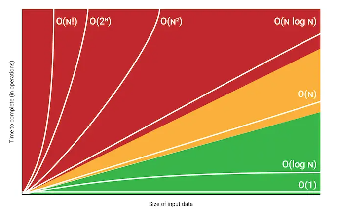

# Análise de Algoritmos

## Conteúdo

 - [Contando Instruções](modules/counting-statements)
 - [Comportamento Assintótico](modules/asymptotic-behavior)
 - [Análise do Pior, Médio & Melhor Caso de um Algoritmo](modules/worst-average-and-best-cases)

---

**Rodrigo Leite -** *Software Engineer*
