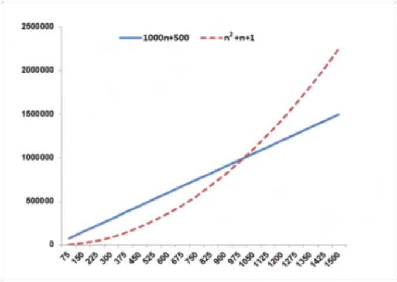

# Comportamento Assintótico

## Conteúdo

 - [01 - Introdução & Problema](#intro-problem)
 - [02 - Comportamento Assintótico](#asymptotic-behavior)
 - [03 - Descobrindo a Função de Custo a partir de laços (sem recursão)](#loop-counting)

<div id="intro-problem"></div>

## 01 - Introdução & Problema

Será que todos os termos da função de custo de um algoritmo são necessários? Por exemplo, veja o Algoritmo e função de custo abaixo:

```cpp
int M = A[0];
for(int i = 0; i < n; i++)
  if (A[i] >= M)
    M = A[i];
```

  

De fato, nem todos os termos são necessários. Podemos descartar certos termos na Função de Custo e manter apenas os que nos dizem o que acontece com a função quando o tamanho dos dados de entrada **("n")** cresce muito.

**NOTE:**  
Se um Algoritmo é mais rápido do que outro para um grande conjunto de dados de entrada, é muito provável que ele continue sendo também mais rápido em um conjunto de dados menor **(Mas não é certeza, só é provável)**.

Ok, agora nós sabemos que nem todos os termos são cruciais, vamos descartar os termos que crescem lentamente e manter apenas os que crescem mais rápido a medida que o valor de entrada **("n")** se torna maior.

Por exemplo, a nossa *Função de Custo* **T(n) = 4n + 3** tem 2 termos:

 - **4n**
 - **3**

**NOTE:**  
O termo **3** é uma **constante de inicialização** e não se altera a medida que a entrada **("n")** aumenta. Assim, nossa *Função de Custo* pode ser reduzida para:

  

**NOTE:**  
Outra observação é que constantes que multiplicam o termo **"n"** da *Função de Custo* também devem ser descartados. Isso faz sentido se pensarmos em diferentes Linguagens de Programação.

Por exemplo, veja a seguinte linha de código em **Pascal**:

```pascal
M := A[i];
```

Equivale ao seguinte código em **C**:

```c
if(i >= 0 && i < n)
  M = A[i];
```

**NOTE:**  
Ignorar essas constantes de multiplicação equivale a ignorar as particularidades de cada linguagem e compilador e analisar apenas a ideia do Algoritmo.

Assim, nossa *Função de Custo* pode ser reduzida novamente para:

  

<div id="asymptotic-behavior"></div>

## 02 - Comportamento Assintótico

Descartando todos os termos constantes e mantendo apenas o de *maior crescimento*, obtemos o **Comportamento Assintótico**. Trata-se do comportamento de uma função **T(n)** quando **"n"** tende ao infinito.

Isso acontece porque o termo que possui o maior expoente domina o comportamento da função **T(n)** quando **"n"** tende ao infinito.

Para entender melhor, considere as seguintes funções:

  

**NOTE:**  
Apesar da função **g(n)** possuir constantes maiores multiplicando seus termos, existe um valor de **"n"** a partir do qual o resultado de **h(n)** é sempre maior do que **g(n)**, tornando os demais termos e constantes pouco importantes.

Veja o gráfico abaixo:

  

Abaixo podemos ver alguns exemplos de *Função de Custo* e seus respectivos **Comportamentos Assintóticos**.


**NOTE:**  
Se a função não possui nenhum termo multiplicado por **"n"**, seu comportamento assintótico é constante **(1)**.

<div id="loop-counting"></div>

## 03 - Descobrindo a Função de Custo a partir de laços (sem recursão)

De modo geral, podemos obter a função de custo de um programa (Algoritmo) apenas contando os comandos de laços aninhados.

**Exemplos:**  
 - **Algoritmo sem laço:** Número constante de Instruções (exceto se houver recursão), ou seja, **T(n) = 1**.
 - **Algoritmo com 1 laço:** Indo de **1** a **"n"** será **T(n) = n**.
 - **Algoritmo com 2 laços aninhados:** será **T(n) = n²**, e assim por diante.

---

**REFERENCES:**  
[[ED] Aula 101 - Análise de Algoritmos - Comportamento Assintótico](https://www.youtube.com/watch?v=SClFMUpBiaw&list=PL8iN9FQ7_jt6buW7SBD3yzjIp8NnJYrZl&index=3)


---

**Rodrigo Leite -** *Software Engineer*
