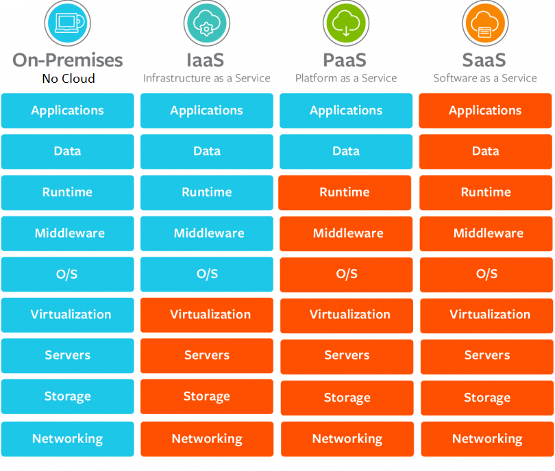
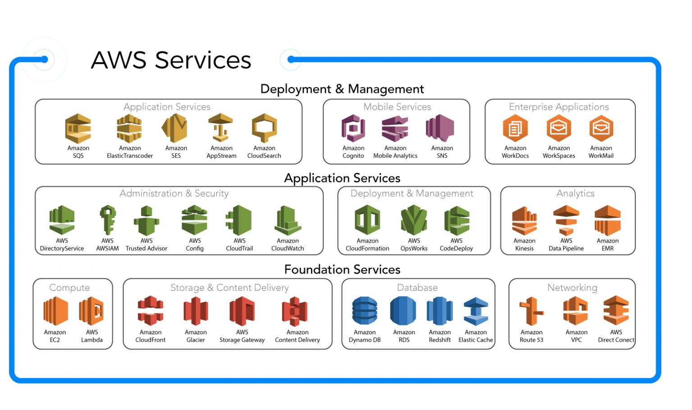

# Services

## Contents

 - [Principais modelos de serviços](#models)
 - [AWS Services](#aws-services)

---

## Principais modelos de serviços

Os principais modelos de serviços são **IaaS**, **PaaS** e **SaaS**. A primeira coisa que vocês tem que ter em mente é que dependendo do modelo existem partes dos serviços que são gerenciáveis pelo a gente e outras que são gerenciadas pelo a provedora do serviço (AWS, GCP, Azure).

Veja a imagem abaixo para entender melhor:

  

 - **As partes em azul são gerenciadas por nós:**
   - Vejam que uma *On premise* é toda gerenciada por nós ja que ela não é Cloud, pelo menos para nós que a criamos.
 - **As partes em laranja são gerenciadas por quem prover o serviço.**

---

## AWS Services

Os principais (não são todos) serviços que a **AWS** prover são de:

 - **Computer:**
   - Amazon EC2
   - AWS Lambda (Function-as-a-Service (FaaS))
 - **Storage:**
   - Amazon CloudFront (Entrega de conteúdo: Por exemplo, vídeo, fotos, Website)
   - Amazon Glacier (Armazenamento de dados frios, dados que você quase não usa, porém que guarda com segurança)
 - **Management and security**
 - **Database:**
   - Amazon Dynamo DB (NoSQL: key-value database)
 - **Networkd and Connectiviy**

Para cada tópico acima nós temos vários serviços diferentes. Por exemplo, veja a imagem abaixo com alguns serviços por tópico acima:

---

**REFERENCES:**  
  

---

**Rodrigo Leite -** *drigols*
