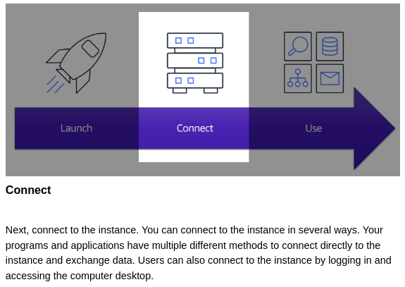
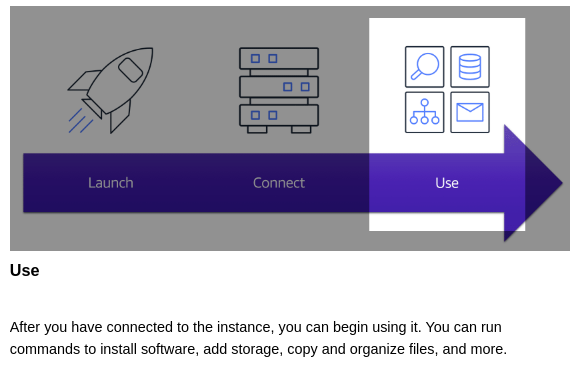

# Amazon Elastic Compute Cloud (EC2=ei-ci-two)

## Contents

 - [How Amazon EC2 works](#how-works)

---

## How Amazon EC2 works

  

  

  

---

**REFERENCES:**  
[AWS Cloud Practitioner Essentials | Cloud Essentials Online Course | AWS Training & Certification](https://www.amazon.com/dp/B09HSJ6HN8/ref=s9_acsd_hps_bw_c2_x_0_t?pf_rd_m=ATVPDKIKX0DER&pf_rd_s=merchandised-search-5&pf_rd_r=GKDHKER89AA5NXV1KJBN&pf_rd_t=101&pf_rd_p=253c0625-2631-4d93-b88d-c57dc07bb681&pf_rd_i=14297978011)  

---

**Rodrigo Leite -** *drigols*
