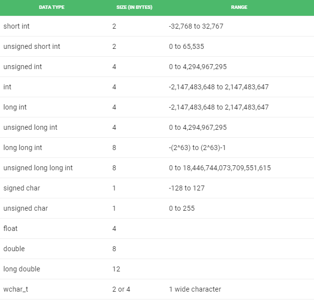

# Fundamentos Básicos

# Conteúdo

 - [01 - Compilando nosso primeiro programa](#01)
 - [02 - Tipos de Dados em C ++](#02)
 - [03 - Modificadores de tipo de dados](#03)
 - [04 - I/O Básico em C++](#04)
 - [05 - Pré-processadores em C/C++](#05)

<div id='01'></div>

## 01 - Compilando nosso primeiro programa


Bem, antes de tudo vocês tem que saber que a linguagem de programação **C++** é uma linguagem compilada. Não vamos focar nesse conceito agora, mas já de inicio você deve saber que sempre que você alterar seu programa você deve compilar o código para só depois ver as alterçaões.

Um dos compiladores mais famoso para C/C++ é gcc/g++. Veja abaixo como é fácil compilar seu primeiro programa:

[helloWorld.cc](src/helloWorld.cc)
```cpp
#include <iostream>
using namespace std;
main()
{
  cout << "Hello World!!!";
}
```

Para compilar o código acima é muito simples, basta para o diretório do arquivo é executar:

```cpp
// MODEL
g++ helloWorld.cpp -o qualquer-nome

g++ helloWorld.cpp -o helloWorld
```

Isso vai gerar nosso arquivo executável... Agora é só executar ele:

```cpp
./helloWorld
```

<div id='02'></div>

## 02 - Tipos de Dados em C ++

Todas as variáveis usam o tipo de dados durante a declaração para restringir o tipo de dados a serem armazenados. Portanto, podemos dizer que os tipos de dados são usados ​​para informar às variáveis ​​o tipo de dados que ele pode armazenar. Sempre que uma variável é definida em **C++**, o compilador aloca alguma memória para essa variável com base no tipo de dados com o qual é declarada. Todo tipo de dados requer uma quantidade diferente de memória.


Os tipos de dados em **C++** são principalmente divididos em três tipos:

**Tipos de dados primitivos:**  
Esses tipos de dados são tipos de dados internos ou predefinidos e podem ser usados ​​diretamente pelo usuário para declarar variáveis. exemplo: **int**, **char**, **float**, **bool** etc. Os tipos de dados primitivos disponíveis em **C++** são:
 - Integer
 - Character
 - Boolean
 - Floating Point
 - Double Floating Point
 - Valueless or Void
 - Wide Character

**Tipos de dados derivados:**  
Os tipos de dados derivados dos tipos de dados primitivos ou internos são chamados de Tipos de dados derivados. Estes podem ser de quatro tipos:
 - Function
 - Array
 - Pointer
 - Reference

**Tipos de dados abstratos ou definidos pelo usuário:**  
Esses tipos de dados são definidos pelo próprio usuário. Como, definir uma classe em **C++** ou uma estrutura. O **C++** fornece os seguintes tipos de dados definidos pelo usuário:
 - Class
 - Structure
 - Union
 - Enumeration
 - Typedef defined DataType

<div id='03'></div>

## 03 - Modificadores de tipo de dados

Como o nome indica, modificadores de tipo de dados são usados ​​com os tipos de dados internos para **modificar** o **comprimento dos dados** que um determinado tipo de dados pode conter. Os modificadores de tipo de dados disponíveis no **C++** são:

 - signed
 - snsigned
 - short
 - long

  

A tabela abaixo resume o **tamanho** e o **intervalo modificados** dos tipos de dados internos quando `combinados com os modificadores de tipo`:

  

**NOTE:**  
Os valores acima podem variar de compilador para compilador. No exemplo acima, consideramos o *GCC* de *64* bits.

Podemos exibir o tamanho de todos os tipos de dados usando o operador **sizeof()** e passando a palavra-chave do tipo de dados como argumento para esta função, como mostrado abaixo:

[size-types.cc](src/size-types.cc)
```cpp
// C++ program to sizes of data types 
#include <iostream>
using namespace std;

int main()
{
  cout << "Size of char: " << sizeof(char)
  << " byte" << endl;
  cout << "Size of int: " << sizeof(int)
  << " bytes" << endl;
  cout << "Size of short int: " << sizeof(short int)
  << " bytes" << endl;
  cout << "Size of long int: " << sizeof(long int)
  << " bytes" << endl;
  cout << "Size of signed long int: " << sizeof(signed long int)
  << " bytes" << endl;
  cout << "Size of unsigned long int: " << sizeof(unsigned long int)
  << " bytes" << endl;
  cout << "Size of float: " << sizeof(float)
  << " bytes" <<endl;
  cout << "Size of double: " << sizeof(double)
  << " bytes" << endl;
  cout << "Size of wchar_t: " << sizeof(wchar_t)
  << " bytes" <<endl;

	return 0;
}
```

**OUTPUT:**
```cpp
$ g++.exe size-types.cc -o size-types
$ ./size-types.exe

Size of char: 1 byte
Size of int: 4 bytes
Size of short int: 2 bytes
Size of long int: 4 bytes
Size of signed long int: 4 bytes
Size of unsigned long int: 4 bytes
Size of float: 4 bytes
Size of double: 8 bytes
Size of wchar_t: 2 bytes
```

<div id='04'></div>

## 04 - I/O Básico em C++

**Fluxo de saída padrão (cout):**  
Geralmente o dispositivo de saída padrão é a tela do visor. A função **cout()** da classe `iostream` quem consegue fazer isso. Os dados que precisam ser exibidos na tela são inseridos no fluxo de saída padrão (cout) usando o operador de inserção **(<<)**:

[cout.cc](src/cout.cc)
```cpp
#include <iostream>

using namespace std;

int main()
{
  char sample[] = "GeeksforGeeks";

  cout << sample << " - A computer science portal for geeks";

  return 0;
}
```

**OUTPUT:**
```cpp
GeeksforGeeks - A computer science portal for geeks
```

**Fluxo de entrada padrão (cin):**  
Geralmente o dispositivo de entrada em um computador é o teclado. A função **cin()** da classe `iostream` quem consegue fazer isso. O operador de extração **(>>)** é usado junto com com a função **cin()** para ler as entradas:

[cin.cc](src/cin.cc)
```cpp
#include <iostream>

using namespace std; 

int main()
{
  int age;

  cout << "Enter your age: ";
  cin >> age;
  cout << "Your age is: " << age;

  return 0;
}
```

**OUTPUT:**  
```
Enter your age: 31
Your age is: 31
```

<div id='05'></div>

## 05 - Pré-processadores em C/C++

Como o nome sugere, os **pré-processadores** são  partes do nosso programas que processam nosso código-fonte antes da compilação. Há várias etapas envolvidas entre escrever um programa e executar um programa em **C/C++**. Vamos dar uma olhada nessas etapas antes de começarmos a aprender sobre pré-processadores.

  

**NOTE:**  
Todas essas diretivas de **pré-processador** começam com um símbolo **'#' (hash)**. O símbolo **'#'** indica que, qualquer que seja a instrução que comece com **"#"**, vai para a parte de pré-processador no diagrama acima.

Exemplos de algumas diretivas de pré-processador são:

 - #include
 - #define
 - #ifndef
 - etc...

> Por exemplo, **#include** incluirá código extra no seu programa. Podemos colocar essas diretivas de pré-processador em qualquer lugar do nosso programa... Mas geralmente elas ficam no topo do nosso código.

**Existem 4 tipos principais de diretivas de pré-processador:**  
 1. Macros
 2. Inclusão de arquivo
 3. Compilação Condicional
 4. Outras diretrizes

**NOTE:**  
Não vamos abordar exemplos reais aqui porque a intenção era apenas entender as etapas de **pré-processadores**.

---

[GeeksforGeeks - C++](https://www.geeksforgeeks.org/c-plus-plus/#Basics)

---

**Rodrigo Leite -** *Software Engineer*
