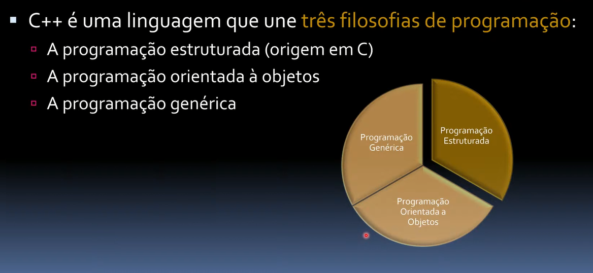

# Por que C++?

## Conteúdo

 - [01 - Desempenho por $](#01)
 - [02 - Paradigmas do C++](#02)

---

## 01 - Desempenho por $

Bem, não sei se vocês sabem, mas o **C++** é a melhor linguagem de programação quando estamos falando em ***desempenho por $*** - **What?**

Não entendeu? Veja a imagem abaixo para ficar mais claro:

  

Por exemplo:

 - ***Desempenho por Watts:***
   - **Bateria de um celular:**
     - Você não quer que o seu celular descarregue tão rápido não é?
     - Se, seu aplicativo demorar muito para processar mais bateria (energia) vai ser gasta.
   - **Resfriamento de um Data Center:**
     - Todo Data Center tem (ou deveria ter) um Sistema de Resfriamento que é acionado quando o processamento aumenta;
     - Ou seja, quanto mais rápido ele termina a tarefa (ou as tarefas), menos Resfriamento vai ser necessário (ou seja, menos energia).
 - ***Desempenho por Transistores:***
   - **Imagine a placa de um celular:**
     - Não dá para colocar o mesmo número de transistores de um computador pessoal;
     - Ou seja, para algumas aplicações o tamanho é limitado.
 - ***Desempenho por ciclo:***
   - **Imagine um sistema que detecta uma imagem (a partir de um celular):**
     - Nesse, caso o nosso sistema tem que aproveitar o máximo de ciclos possíveis, para dar uma melhor experiência interativa para o usuário.

---

## 02 - Paradigmas do C++

Bem, não são todos, mas o C++ é muito famoso por ter esses 3 paradigmas como filosofia:

  

---

**REFERÊNCIAS:**  
[Curso de Programação C++ | Aula 00 - Introdução | Computador | Linguagem | Aprenda a Programar](https://www.youtube.com/watch?v=ZFaGnEKEjFs&t=5238s)
