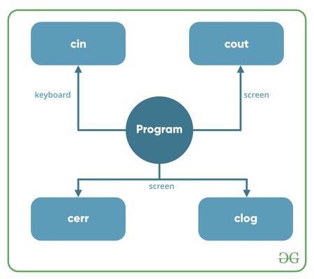

# Entrada e Saída em C++ (I/O)

## Conteúdo

 - [01 - Introdução](#intro)
 - [02 - Funções básicas de entrada e saída: cin & cout](#cin-cout)

<div id="intro"></div>

## 01 - Introdução

**C++** vem com bibliotecas que nos fornecem muitas maneiras de realizar entrada e saída. Em **C++**, a entrada e a saída são executadas na forma de uma **sequência de bytes** ou mais comumente conhecidas como **fluxos**.

 - **Fluxo de entrada:**
   - Se a direção do fluxo de bytes for do dispositivo (por exemplo, teclado) para a memória principal, esse processo é chamado de *entrada*.
 - **Fluxo de saída:**
   - Se a direção do fluxo de bytes for oposta, ou seja, da memória principal para o dispositivo (tela de exibição), esse processo é chamado de *saída*.

  

**Os arquivos de cabeçalho disponíveis em C++ para operações de entrada / saída são:**

 - **iostream:**
   - *iostream* significa fluxo de entrada-saída padrão. Este arquivo de cabeçalho contém definições para objetos como **cin**, **cout**, **cerr**, **etc**...
 - **iomanip:**
   - *iomanip* significa manipuladores de entrada e saída. Os métodos declarados nestes arquivos são usados ​​para manipular fluxos. Este arquivo contém definições de **setw**, **setprecision**, **etc**...
 - **fstream:**
   - Este arquivo de cabeçalho descreve principalmente o fluxo de arquivo. Este arquivo de cabeçalho é usado para lidar com os dados sendo lidos de um arquivo como entrada ou os dados sendo gravados no arquivo como saída.

---

<div id="cin-cout"></div>

## 02 - Funções básicas de entrada e saída: cin & cout

As duas palavras-chave **cint** e **cout** em C++ são usadas com frequência para **receber entrada (cin)** e **imprimir saídas (cout)**, respectivamente. Esses dois são os métodos mais básicos de entrada e saída de impressão em C++.

**NOTE:**  
Para usar **cin** e **cout** em C++, é necessário incluir o arquivo de cabeçalho **iostream** no programa:

**"cout" example:**

[cout.cc](src/cout.cc)
```cpp
#include <iostream> 

using namespace std; 

int main() 
{ 
	char sample[] = "GeeksforGeeks"; 

	cout << sample << " - A computer science portal for geeks"; 

	return 0; 
} 
```

**OUTPUT:**  
```
GeeksforGeeks - A computer science portal for geeks
```

**"cin" + "cout" example:**  

[cin-cout.cc](src/cin-cout.cc)
```cpp
#include <iostream> 
using namespace std; 

int main() 
{ 
	int age; 

	cout << "Enter your age: "; 
	cin >> age; 
	cout << "\nYour age is: " << age; 

	return 0; 
} 
```

**OUTPUT:**  
```
Enter your age: 31 // My input.
Your age is: 31 // Program output.
```

**NOTE:**  
Se você prestar bem atenção fica fácil memorizar (aprender) qual a função de *entrada (input)* e qual a de *Saída (output)*:

 - **cin** - **C** + **IN**put
 - **cout** - **C** + **OUT**put

  

**NOTE:**  
Outra observação muito importante é sobre os operadores **(>>)** e **(<<)**

```cpp
cout << "Enter your age: "; 
cin >> age; 
cout << "\nYour age is: " << age; 
```

**NOTE:**  
Outra observação é que se você prestar atenção nos operadores **(>>)** e **(<<)**, vai ver qual a direção dos fluxos.

---

**REFERENCES:**  
[Basic Input / Output in C++](https://www.geeksforgeeks.org/basic-input-output-c/)

---

**Rodrigo Leite -** *Software Engineer*
