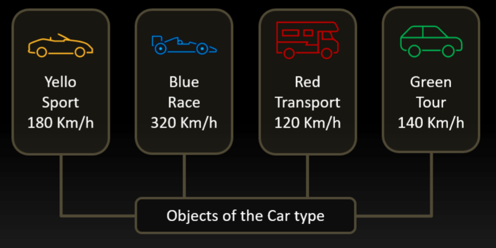

# Classes

## Contents

 - [Classes in C++ (+Game example)](#classes-in-cpp)

---

<div id="classes-in-cpp"></div>

## Classes in C++ (+Game example)

> A **class** in *C++* can represent many **objects**.

A class in C++ is defined in two parts:

 - **Declaration:**
   - Describe the attributes.
   - Describe the methods
 - **Definition:**
   - Methods implementations.

> **NOTE:**  
> Like a *record*, a *class* defines a new type.


For example, the code below represent a **Car class**:

[Car.h](src/Car.h)
```cpp
#include <string>
using std::string;

class Car
{
private:
    // Encapsulation.
    int color;
    string type;
    float velocity;

public:
    // Interfaces.
    void turnOn();
    void turnOff();
    void speed();
    void brake();
};
```

Now, with this class (Car) we can create many objects (abstractions):

  

> **NOTE:**  
> Another observation is that usually we declared a **class** in **".h"** file.

**Ok, I know that class are declared in ".h" file, but and the implementations?**  
Implementations or definitions of a class are written another file, reference to your class **(same name your ".h", however using .cpp)**.

For example, imagine we have the **Game class**:

[Game.h](src/Game.h)
```cpp
#pragma once
#include <string>
using std::string;

class Game
{
private:
	// Encapsulation.
	string name;                                        // Game name.
	float price;                                        // Game price.
	int hours;                                          // Hours played.
	float cost;                                         // Cost per hour player.

	// Calculate the cost to played hours (Inline function/Method).
	void calculate() { if (hours > 0) cost = price / hours; }

public:
	// Interfaces.
	void purchase(const string& title, float value);    // Fill the information.
	void update(float value);                           // Update game price.
	void play(int time);                                // Record (save) the hours played.
	void showInformation();                             // show information.
};
```

[Game.cpp](src/Game.cpp)
```cpp
#include <iostream>
#include "Game.h"

void Game::purchase(const string& title, float value)
{
    name = title;
    price = value;
    hours = 0;
    cost = price;
}

void Game::update(float value)
{
    price = value;
    calculate();
}

void Game::play(int time)
{
    hours = hours + time;
    calculate();
}

void Game::showInformation()
{
    std::cout << name << " R$"
        << price << " "
        << hours << "h = R$"
        << cost << "/h\n";
}
```

[driver_game.cpp](src/driver_game.cpp)
```cpp
#include "Game.h"

int main()
{
	Game gow; // Variable of type "Game".

	// Call methods of Game (gow) object.
	gow.purchase("Gow", 160.0f);
	gow.showInformation();

	// Call methods of Game (gow) object.
	gow.play(5);
	gow.showInformation();

	// Call methods of Game (gow) object.
	gow.play(3);
	gow.showInformation();
}
```

**COMPILATION AND RUN:**  
```cpp
g++ Game.cpp driver_game.cpp -o game

./game.exe
```

**OUTPUT:**  
```cpp
Gow R$160 0h = R$160/h
Gow R$160 5h = R$32/h
Gow R$160 8h = R$20/h
```

---

**REFERENCES:**  
[Aula 02 - Classes / Encapsulamento / Curso de C++](https://www.youtube.com/watch?v=pONnilIFY64&list=PLX6Nyaq0ebfhlKSTKlADladUNBHNBXxHg&index=5)  
[Lab02 - Exercícios de Classes / Encapsulamento / Curso de C++](https://www.youtube.com/watch?v=XP91FuJjicM&list=PLX6Nyaq0ebfhlKSTKlADladUNBHNBXxHg&index=6)  

---

Ro**drigo** **L**eite da **S**ilva - **drigols**
