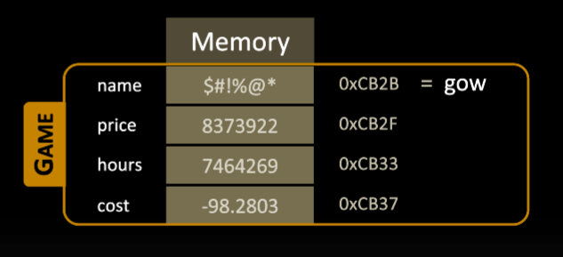

# Constructor & Destructor

## Contents

 - **Constructor:**
   - [Problem and intro to Constructors](#problem-intro)
   - [Initializing constructors](#initializing-constructors)
   - [Default parameters (Good example)](#default-parameters)
 - **Destructor:**
   - [](#)
 - **Tips & Tricks:**
   - [Attributes (members) & Constructor parameters conventions](#attributes-constructor-conventions)

---

<div id="problem-intro"></div>

## Problem and intro to Constructors

Imagine we have the follow Game class:

[Game.h](src/Game.h)
```cpp
#pragma once
#include <string>
using std::string;

class Game
{
private:
    // Encapsulation.
    string name; // Game name.
    float price; // Game price.
    int hours;   // Hours played.
    float cost;  // Cost per hour player.

    // Calculate the cost to played hours (Inline function/Method).
    void calculate()
    {
        if (hours > 0)
            cost = price / hours;
    }

public:
    // Interfaces.
    void purchase(const string &title, float value); // Fill the information.
    void update(float value);                        // Update game price.
    void play(int time);                             // Record (save) the hours played.
    void showInformation();                          // show information.
};
```

[Game.cpp](src/Game.cpp)
```cpp
#include <iostream>
#include "Game.h"

void Game::purchase(const string& title, float value)
{
    name = title;
    price = value;
    hours = 0;
    cost = price;
}
```

Here we have the method **purchase()** to init the attributes. However, imagine we make a Game object and use **play()** and **showInformation()** methods without use **purchase()**:

[testing_game_wt_purchase.cpp](src/testing_game_wt_purchase.cpp)
```cpp
#include "Game.h"

int main()
{
	Game gow; // Variable of type "Game".

	// Call methods of Game (gow) object.
	gow.showInformation();

	// Call methods of Game (gow) object.
	gow.play(5);
	gow.showInformation();

	// Call methods of Game (gow) object.
	gow.play(3);
	gow.showInformation();
}
```


**COMPILATION AND RUN:**  
```cpp
g++ Game.cpp testing_game_wt_purchase.cpp -o game

./game.exe
```

**OUTPUT:**  
```
R$1.12104e-44 0h = R$8.26766e-44/h
R$1.12104e-44 5h = R$2.8026e-45/h
R$1.12104e-44 8h = R$1.4013e-45/h
```

**What?**  
Well, the problem is that we don't initialize the attribute before play the game. That's, **we have trash in the memory**:

  

> **Ok, how solve that?**  
> Using *constructor*.

 - The constructor is declared in the class declaration (.h file).
 - The constructor have the same class name:
   - However, has no return.

For example, let's see a constructor for the class Game:

[GameWithConstructor.h](src/GameWithConstructor.h)
```cpp
#pragma once
#include <string>
using std::string;

class Game
{
private:
    // Encapsulation.
    string m_name; // Game name.
    float m_price; // Game price.
    int m_hours;   // Hours played.
    float m_cost;  // Cost per hour player.

    // Calculate the cost to played hours (Inline function/Method).
    void calculate()
    {
        if (m_hours > 0)
            m_cost = m_price / m_hours;
    }

public:
    // Interfaces.
    Game(const string &name, float cost = 0); // Constructor prototype.
    void update(float cost);                  // Update game price.
    void play(int hours);                     // Record (save) the hours played.
    void showInformation();                   // show information.
};
```

[GameWithConstructor.cpp](src/GameWithConstructor.cpp)
```cpp
#include <iostream>
#include "GameWithConstructor.h"

// Class (Game) constructor definition (implementation)
Game::Game(const string &name, float cost)
{
    m_name = name;
    m_price = cost;
    m_hours = 0;
    m_cost = cost;
}

void Game::update(float cost)
{
    m_price = cost;
    calculate();
}

void Game::play(int hours)
{
    m_hours += hours;
    calculate();
}

void Game::showInformation()
{
    std::cout << m_name << " R$"
              << m_price << " "
              << m_hours << "h = R$"
              << m_cost << "/h\n";
}
```

[testing_constructor.cpp](src/testing_constructor.cpp)
```cpp
#include "GameWithConstructor.h"

int main()
{
	Game gow = Game("Gears", 50.0f);

	// Call methods of Game (gow) object.
	gow.showInformation();

	// Call methods of Game (gow) object.
	gow.play(5);
	gow.showInformation();

	// Call methods of Game (gow) object.
	gow.play(3);
	gow.showInformation();
}
```

**COMPILATION AND RUN:**  
```cpp
g++ GameWithConstructor.cpp testing_constructor.cpp -o gamewc

./gamewc.exe 
```

**OUTPUT:**  
```cpp
Gears R$50 0h = R$50/h
Gears R$50 5h = R$10/h
Gears R$50 8h = R$6.25/h
```

> **NOTE:**  
> Another advantage of creating a constructor is forcing anyone who instantiates an object to always start its attributes (members).

---

<div id="initializing-constructors"></div>

## Initializing constructors

There are three common approaches to initialize a constructor:

**Explicitly approach:**  
```cpp
Game gow = Game("Gears", 50.0f);
```

**Implicitly approach:**
```cpp
Game gow("Gears", 50.0f);
```

**List approach:**
```cpp
Game gow { "Gears", 50.0f };

or

Game gow = { "Gears", 50.0f };
```

---

<div id="default-parameters"></div>

## Default parameters

> **Default parameters** in a constructor are **defined in the "constructor prototype"** *not in the constructor definition (implementation)*.

For example, see default parameters for Game class below:

[default_parameters.h](src/default_parameters.h)
```cpp
#pragma once
#include <string>
using std::string;

class Game
{
private:
    string m_name;
    float m_price;
    int m_hours;
    float m_cost;

    // Inline function.
    void calculate() { if (m_hours > 0) m_cost = m_price / m_hours; }

public:
    // Constructor prototype (with default parameters).
    Game(const string &name = "Gears", float price = 100, int hours = 0, float cost = 0);

    void update(float cost);
    void play(int hours);
    void showInformation();
};
```

[default_parameters.cpp](src/default_parameters.cpp)
```cpp
#include <iostream>
#include "default_parameters.h"

// Class (Game) constructor definition (implementation)
Game::Game(const string &name, float price, int hours, float cost)
{
    m_name = name;
    m_price = price;
    m_hours = hours;
    m_cost = cost;
}

void Game::update(float cost)
{
    m_price = cost;
    calculate();
}

void Game::play(int hours)
{
    m_hours += hours;
    calculate();
}

void Game::showInformation()
{
    std::cout << "Game name: "       << m_name <<
                 ", Price: R$"       << m_price <<
                 ", Hours played:  " << m_hours <<
                 ", Game Cost: R$"   << m_cost << "/h\n";
}
```

[testing_default_parameters.cpp](src/testing_default_parameters.cpp)
```cpp
#include "default_parameters.h"

int main()
{
	Game gow;

	// Call methods of Game (gow) object.
	gow.showInformation();

	// Call methods of Game (gow) object.
	gow.play(5);
	gow.showInformation();

	// Call methods of Game (gow) object.
	gow.play(3);
	gow.showInformation();
}
```


**COMPILATION AND RUN:**  
```cpp
g++ default_parameters.cpp testing_default_parameters.cpp -o game

./game.exe
```

**OUTPUT:**  
```
Game name: Gears, Price: R$100, Hours played:  0, Game Cost: R$0/h
Game name: Gears, Price: R$100, Hours played:  5, Game Cost: R$20/h
Game name: Gears, Price: R$100, Hours played:  8, Game Cost: R$12.5/h
```

**NOTE:**  
See that now we have default parameters for our constructor.

---

<div id="attributes-constructor-conventions"></div>

## Attributes (members) & Constructor parameters conventions

> The **constructor parameters** can't have the same name of the attributes (members) of the class.

There are two common conventions to solve that:

 - **Prefix:**
   - The first is using the prefix **"m_"** before your attribute (member).
     - **"m_"** is abbreviation to **"member"**.
 - **suffix:**
   - The second is using the suffix **"_"** after your attribute (member).

For example, to our Game class we used **prefix "m_"**:

[GameWithConstructor.h](src/GameWithConstructor.h)
```cpp
#pragma once
#include <string>
using std::string;

class Game
{
private:
    // Encapsulation.
    string m_name; // Game name.
    float m_price; // Game price.
    int m_hours;   // Hours played.
    float m_cost;  // Cost per hour player.

    // Calculate the cost to played hours (Inline function/Method).
    void calculate()
    {
        if (m_hours > 0)
            m_cost = m_price / m_hours;
    }

public:
    // Interfaces.
    Game(const string &name, float cost = 0); // Constructor prototype.
    void update(float cost);                  // Update game price.
    void play(int hours);                     // Record (save) the hours played.
    void showInformation();                   // show information.
};
```

 - See we have the **prefix "m_"** in the **attributes (members)**.
 - And **not having the "m_"** prefix in the **constructor parameters**.

---

**REFERENCES:**  
[Aula 05 - Construtores / Construtor Padrão / Curso de C++](https://www.youtube.com/watch?v=ziFZul0HCyU&list=PLX6Nyaq0ebfhlKSTKlADladUNBHNBXxHg&index=12)

---

Ro**drigo** **L**eite da **S**ilva - **drigols**

[](src/)
```cpp

```

**COMPILATION AND RUN:**  
```cpp
 
```

**OUTPUT:**  
```

```
