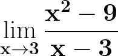
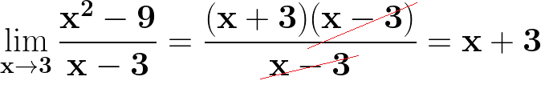

# Calculus

## Contents

 - [**Taxa de Variação**](#intro-to-rate-of-change)
   - [Taxa de Variação Linear](#linear-rate-of-change)
 - [**Limite**](#intro-to-limit)
   - [Limites laterais](#one-sided-limit)
   - [Como utilizar o método Q.C.P para resolver limites](#intro-to-qcp)
 - [**Derivada**](#intro-to-derivative)
 - [**Integral**](#intro-to-integral)
 - **DICAS & TRUQUES:**
   - [Notação de Intervalo](#interval-notation)
 - [**Configurações**](#settings)
 - [**REFERÊNCIAS**](#ref)
<!---
[WHITESPACE RULES]
- Same topic = "10" Whitespace character.
- Different topic = "50" Whitespace character.
--->


<!--- ( Taxa de Variação ) --->

---

<div id="intro-to-rate-of-change"></div>

## Taxa de Variação

A **Taxa de Variação** indica:

 - A *rapidez (velocidade)* e a *direção* da mudança de uma *variável dependente (y)*.
 - Em relação à variação da *variável independente (𝑥)*.

> **NOTE:**  
> Em **Funções Lineares**, essa *taxa* é *constante*, enquanto em **Funções Não Lineares**, ela pode variar dependendo do valor de 𝑥.


---

<div id="linear-rate-of-change"></div>

## Taxa de Variação Linear

Para entender como funciona uma **"Taxa de Variação Linear"**, vamos começar com a seguinte *função q(x)*, que retorna:

 - O número de **metros (variável dependente y)** percorridos por um ciclista.
 - Com base no número de **segundos (variável independente x)** que o ciclista pedalou.

**Imagine que a função seja esta:**  
  
<!---
\mathbf{q(x) = 2x + 1}
--->


<details>
<summary>Código Python</summary>

[meters_travelled_by_cyclist.py](src/meters_travelled_by_cyclist.py)
```python
from matplotlib import pyplot as plt
import numpy as np

def q(x):
    return 2 * x + 1

if __name__ =='__main__':
    x = np.array(range(0, 10+1))

    plt.figure(figsize=(7, 5))  # Largura(Width), Height(Altura).
    plt.plot(x, q(x), color='green', marker='o')
    plt.title("q(x) = 2x + 1")
    plt.xlabel('Segundos')
    plt.ylabel('Metros')
    plt.xticks(range(0, 10+1, 1))
    plt.yticks(range(0, 21+1, 1))
    plt.grid()
    plt.savefig("../images/rate-of-change-01.png")
    plt.show()
```

</details>

  

Olhando para o gráfico acima, podemos ver:

 - **Quantos *segundos (variável independente x)* o ciclista percorreu:**  
   - 10 segundos.
 - **Quantos *metros (variável dependente y)* foram percorridos por segundo:**  
   - 1 segundo  = 3 metros.  
   - 2 segundos = 5 metros.  
   - 3 segundos = 7 metros.  
   - 4 segundos = 9 metros.  
   - 5 segundos = 11 metros.  
   - 6 segundos = 13 metros.  
   - 7 segundos = 15 metros.  
   - 8 segundos = 17 metros.  
   - 9 segundos = 19 metros.  
   - 10 segundos = 21 metros.  

Se prestarmos atenção, podemos ver:

 - Quanto de distância muda a cada segundo percorrido, que é de `2 metros por segundo`.
 - **NOTE:** Isso ocorre porque nossa função é linear (constante) e a variação (y<sub>1</sub> para y<sub>2</sub>) é a mesma (constante) de um valor de x para outro.

> **Olhando para o gráfico é fácil, mas como identificar essa *mudança (Taxa de Variação)* para qualquer função linear?**

Para resolver isso nós podemos utilizar a seguinte formula:

  
<!---
\mathbf{m = \frac{\Delta y}{\Delta x} = \frac{q(x)_{2} \ - \ q(1)_{1}}{x_{2} \ - \ x_{1}} = \frac{y_{2} \ - \ y_{1}}{x_{2} \ - \ x_{1}}}
--->

Ou seja, nós vamos precisar de apenas dois pares ordenados de valores **x** e **y** para aplicar na equação (formula):

 - **Após 1 segundo:**
   - *"x"* é *"1"*.
   - *"y"* é *"3"*.
 - **Após 10 segundos:**
   - *"x"* é *"10"*.
   - *"y"* é *"21"*.

Logo:

  
<!---
\\\mathbf{m = \frac{21 \ - \ 3}{10 \ - \ 1} = \frac{18}{9} = 2}
\\
\\\mathbf{ m = 2}
--->

> **Mas o que significa esse 2**

 - Significa que a nossa *variável dependente (y)* está mudando (aumentando ou diminuindo) 2 em relação a *variável independente (x)*.
 - Ou seja, o ciclista está percorrendo `2 metros por segundo`.


<!--- ( Limite ) --->

---

<div id="intro-to-limit"></div>

## Limite

Para entendermos sobre **"Limites"**, vamos imaginar que temos a seguinte função:


<!---
\mathbf{f(x) = \frac{2x^{2} \ - \ x \ - 1}{x \ - \ 1}}
--->

De início, vamos testar essa função para `x = 0`:

  
<!---
\\\mathbf{f(x) = \frac{2x^{2} \ - \ x \ - 1}{x \ - \ 1} = \frac{2 \times 0^{2} - 0 - 1}{0 - 1} = \frac{2 x 0 - 0 - 1}{-1} = \frac{0 - 0 - 1}{-1} = \frac{-1}{-1}}
\\
\\\mathbf{f(x) = \frac{-1}{-1}} 
--->

Agora, vamos testar a função para `x = 1`:

  
<!---
\\\mathbf{f(x) = \frac{2x^{2} \ - \ x \ - \ 1}{x \ - \ 1} = \frac{2 \times 1^{2} - 1 - 1}{1 - 1} = \frac{2 \times 1 - 1 - 1}{0} = \frac{2 - 1 - 1}{0} = \frac{0}{0}}
\\
\\\mathbf{f(x) = \frac{0}{0}}
--->

> **Como assim?**  
> Não tem como dividir por zero!

 - **No contexto de limites, isso é o que conhecemos como:**
   - *"Indeterminação"*.
   - **NOTE:** Também podemos dizer que *"1" está fora do domínio da minha função* (neste exemplo).

Para entender melhor vamos ver isso visualmente:

<details><summary>Python Code</summary>

```python
from matplotlib import pyplot as plt
import numpy as np

# Remove warnings.
import warnings
warnings.filterwarnings(
    "ignore",
    category=RuntimeWarning,
    message="invalid value encountered in divide"
)

def f(x):
    return (2 * x**2 - x - 1) / (x - 1)


def check_indeterminate(x, y):
    indeterminate_indices = []
    for i, (x, y) in enumerate(zip(x_list, y_list)):
        if x == 1 and y == 0:  # Example condition for indeterminate case
            indeterminate_indices.append(i)  # Add index where indeterminate occurs
    return indeterminate_indices


def createGraph(x, y):
    plt.figure(figsize=(7, 5))  # Width, height.
    plt.plot(x, f(x), color='green', marker='o', linewidth=1, label=r"$f(x) = \frac{2x^{2} - x - 1}{x - 1}$")
    plt.title(r"$f(x) = \frac{2x^{2} - x - 1}{x - 1}$")
    plt.xlabel('x')
    plt.ylabel('f(x)')
    plt.grid()
    plt.legend()
    plt.savefig("../images/limit-fx-01.png")
    plt.show()


if __name__ == '__main__':

    x = np.linspace(-2, 5)  # Generate points to from -2 to 5.
    y = f(x)                # Compute the corresponding y values.

    # Print x and y values.
    for xi, yi in zip(x, y):
        print(f"x: {xi:.4f}, y: {yi:.4f}")

    createGraph(x, y)
```

**OUTPUT:**
```
x: -2.0000, y: -3.0000
x: -1.8571, y: -2.7143
x: -1.7143, y: -2.4286
x: -1.5714, y: -2.1429
x: -1.4286, y: -1.8571
x: -1.2857, y: -1.5714
x: -1.1429, y: -1.2857
x: -1.0000, y: -1.0000
x: -0.8571, y: -0.7143
x: -0.7143, y: -0.4286
x: -0.5714, y: -0.1429
x: -0.4286, y: 0.1429
x: -0.2857, y: 0.4286
x: -0.1429, y: 0.7143
x: 0.0000, y: 1.0000
x: 0.1429, y: 1.2857
x: 0.2857, y: 1.5714
x: 0.4286, y: 1.8571
x: 0.5714, y: 2.1429
x: 0.7143, y: 2.4286
x: 0.8571, y: 2.7143
x: 1.0000, y: nan
x: 1.1429, y: 3.2857
x: 1.2857, y: 3.5714
x: 1.4286, y: 3.8571
x: 1.5714, y: 4.1429
x: 1.7143, y: 4.4286
x: 1.8571, y: 4.7143
x: 2.0000, y: 5.0000
x: 2.1429, y: 5.2857
x: 2.2857, y: 5.5714
x: 2.4286, y: 5.8571
x: 2.5714, y: 6.1429
x: 2.7143, y: 6.4286
x: 2.8571, y: 6.7143
x: 3.0000, y: 7.0000
x: 3.1429, y: 7.2857
x: 3.2857, y: 7.5714
x: 3.4286, y: 7.8571
x: 3.5714, y: 8.1429
x: 3.7143, y: 8.4286
x: 3.8571, y: 8.7143
x: 4.0000, y: 9.0000
x: 4.1429, y: 9.2857
x: 4.2857, y: 9.5714
x: 4.4286, y: 9.8571
x: 4.5714, y: 10.1429
x: 4.7143, y: 10.4286
x: 4.8571, y: 10.7143
x: 5.0000, y: 11.0000
```

</details>


**NOTE:**  
Vejam que quando nós temos `x = 1`, temos um espaço em branco no gráfica.

> **Novamente, contexto de limites isso é o que nós conhecemos como: *"Indeterminação" ou "Indefinido"*.**

**Ok, mas como resolvemos isso?**  
Quando temos um valor "indeterminado", precisamos nos aproximar *O MAIS PRÓXIMO POSSÍVEL* desse valor SEM CHEGAR NELE.  

> **Em outras palavras, precisamos alcançar o limite.**  

Para nossa função **f(x)**, podemos dizer que queremos chegar *o mais próximo possível de 1* *sem chegar nele* da seguinte maneira:  

  
<!---
\mathbf{\displaystyle \lim_{x \to 1} = \frac{2x^{2} - x - 1}{x - 1}}
--->

Lemos como:

> **Qual é o limite dessa função quando *x* se aproxima (tende a) a 1?**  
> Em outras palavras, *"quão próximo posso chegar em 1 sem chegar nele?"*


---

<div id="one-sided-limit"></div>

## Limites laterais

Olhando para o gráfico abaixo:

  

> **Qual o limite da função *quando x se aproxima (tende a) a 1*?**

 - **Vejam que essa função não tem um valor *definido*, ou seja, quando `x = 1` não existe um valor para *f(x)*:**
   - Isso porque a bolinha está aberta (não está pintada = exclusão) na intersecção entre os eixos x e y.
 - **Porém, quando meu x se aproxima (tende) do 1, minha função *f(x)* se aproxima do 2:**
   - Nesse caso meu limite vai ser 2.

Continuando, a partir do mesmo gráfico qual o valor dos limites abaixo:

  

> **Como assim?**

 - `x → 1-`
   - Quando nós temos esse sinal negativo que dizer que o nosso limite **está vindo do lado esquerdo (negativo)** da função.
 - `x → 1+`
   - Quando nós temos esse sinal positivo que dizer que o nosso limite **está vindo do lado direito (positivo)** da função.

> **NOTE:**  
> Isso é o que nós chamamos de **"limites laterais"**.

Porém, vejam que o limite foi 2 para os dois lados da função.

> **NOTE:**  
> Quando isso acontece se eu desconsiderar os lados (- ou +) meu limite também vai ser 2.

Agora, imagine que nós temos o seguinte gráfico:

  

Com base no gráfico acima:

> **Qual o valor do limite quando *x se aproxima (tende) a 7*?**  

  

Nesse caso (em específico) nós temos dois pontos de limite 2 e 6:

  

> **E agora qual dos dois vai ser?**  

Como não foi especificado o lado que nós vamos partir (- ou +) nós dizemos que o limite para esse caso *não existe*:

  

> **NOTE:**  
>  Isso faz todo sentido. Porque se eu não sei em qual direção ir como vou escolher o limite correto?


---

<div id="intro-to-qcp"></div>

## Como utilizar o método Q.C.P para resolver limites

> Agora nós vamos aprender sobre o conceito de **Q.C.P (Quem Causa o Problema)** no contexto dos limites.

Existe todo um estudo para entender esse conceito, utilizando números oposto que se cancelam, mas eu vou direto ao ponto com um método que simplfique tudo isso.

Imagine que nós temos o seguinte limite:

  

Está vendo aquela parte que tem **"x"** a **"setinha (→)"** e o **"3"**?

  

Então, agora você vai remover essa **setinha (→)** adicionar o sinal oposto do número que vem depois da seta.

> **Como assim?**  
> Depois da seta (→) não é 3 (positivo)? Então adiciona o sinal de negativo (+) no lugar da seta.

```bash
x → 3
|   |
|   |
x - 3 (Sinal oposto no lugar da seta)
|   |
|   | 
(x - 3)
```

> **Mas o que é esse (x - 3)?**  
> Esse é o nosso *Q.C.P (Quem Causa o Problema)*.

Ou seja, nós precisamos remover ele da equação (limite).

> **Mas como?**

Para fazer isso (nesse exemplo) vou tentar fatorar o numerador de alguma maneira que me permita cancelar/eliminar o **(x - 3)**:

  

Vejam que nós fizemos aparecer:

 - **Quem Causa o Problema (QCP)** no numerador;
 - **Quem Causa o Problema (QCP)** no denominador;
 - E por fim, cancelamos um pelo outro.

  

Viram que depois de cancelarmos **Quem Causa o Problema (QCP)** sobrou apenas **x + 3**? Então, esse é o limite da função:

  

> **NOTE:**  
> Ou seja, o limite para nossa função é 6.

Isso é útil porque nem sempre teremos um gráfico para visualizar e determinar o limite da função. Mesmo assim, apenas para este exemplo, vamos observar como seria em um gráfico:

  

Vejam que:

 - **"3"** não está no domínio dessa função (bolinha está aberta/exclusão);
 - Quando `x` se aproxima (tende) a 3.
 - A nossa função (resultado) se aproxima de 6.

> **NOTE:**  
> Ou seja, **"6"** é o limite para essa função.


<!--- ( Derivada ) --->
<!--- ( Integral ) --->


<!--- ( Dicas & Truques ) --->

---

<div id="interval-notation"></div>

## Notação de Intervalo

 - Ponto fechado (⚫) = `[]` = **Inclusão**
   - Significa que o número **está incluído** no intervalo.
 - Ponto aberto (⚪) = `()` = **Exclusão**
   - Significa que o número **NÃO está incluído** no intervalo.

Por exemplo:

| Representação Visual | Notação de Intervalo | Notação de Desigualdade |
| ---------------------| ---------------------| ------------------------|
| ⚫—⚫               | `[a, b]`             | `a ≤ x ≤ b`             |
| ⚪—⚪               | `(a, b)`             | `a < x < b`             |
| ⚫—⚪               | `[a, b)`             | `a ≤ x < b`             |
| ⚪—⚫               | `(a, b]`             | `a < x ≤ b`             |


<!--- ( Configurações ) --->

---

<div id="settings"></div>

## Configurações

**CRIANDO O AMBIENTE VIRTUAL:**
```bash
python -m venv environment
```

**ATIVANDO O AMBIENTE VIRTUAL (LINUX):**
```bash
source environment/bin/activate
```

**ATIVANDO O AMBIENTE VIRTUAL (WINDOWS):**
```bash
source environment/Scripts/activate
```

**UPDATE PIP:**
```bash
python -m pip install --upgrade pip
```

**INSTALANDO AS DEPENDÊNCIAS:**  
```bash
pip install -U -v --require-virtualenv -r requirements.txt
```

**Agora, seja feliz!!!** 😬


<!--- ( REFERENCES ) --->

---

<div id="ref"></div>

## REFERENCES

 - **Geral:**
   - [Help Engenharia](https://helpengenharia.com/)
 - **Limite:**
 - **Derivada:**
 - **Integral:**

---

**Rodrigo** **L**eite da **S**ilva - **drigols**
