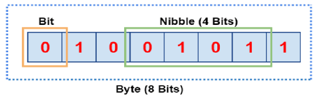
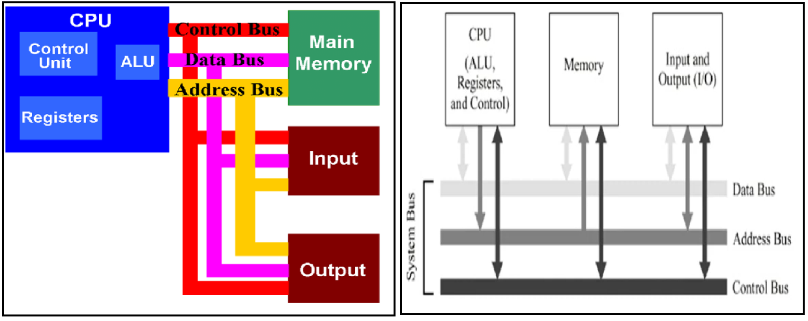

# Computer Organization and Architecture

## Contents

 - **Data Representation in Computer Systems:**
   - **Information Measurements (Units of Information):**
     - [Bit (Binary Digit | 0 or 1)](#intro-to-bits)
     - [NibbleNibble (or half a Byte)](#intro-to-nibble)
     - [Byte (B | 8 bits)](#intro-to-byte)
     - [Relationship between Units of Measure](#units-relationship)
     - [Word (The maximum number of bits a computer can process at one time)](#intro-to-word)
   - **Number Systems:**
     - [x](#)
 - **Processors:**
   - [**Registers:**](#intro-to-registers)
   - **Processors Architectures (Describes the characteristics of an *"processor line"*):**
     - [x86](#intro-x86)
       - [x86 and Von Neumann Architecture (+Von Neumann bottleneck)](#x86-vna)
     - [AMD64](#intro-amd64)
     - [ARM](#intro-arm)
 - [**REFERENCES**](#ref)

<!--- 
[WHITESPACE RULES]
- Same topic = "10" Whitespace character.
- Different topic = "50" Whitespace character.
--->

<!--- ( Data Representation in Computer Systems/Information Measurements (Units of Information) ) --->

---

## Bit (Binary Digit | 0 or 1)

| Unit of measurement | Abbreviation | Conversion               |
| ------------------- | ------------ | ------------------------ |
| **Bit**             | b            | 1 bit                    |

> The most basic unit of information in a digital computer is called a **"bit"**, which is a contraction of **"Binary Digit"**.

In the concrete sense, a **"bit"** is nothing more than a state of **“on”** or **“off” (or “high” and “low”)** within a computer circuit. In 1964, the designers of the IBM System/360 mainframe

  

---

## Nibble (or half a Byte)

| Unit of measurement | Abbreviation | Conversion               |
| ------------------- | ------------ | ------------------------ |
| **Nibble**          | -            | 4 bits (or half a Byte)  |

> A **Nibble** refers to *four (4)* consecutive binary digits or half of an 8-bit byte in the context of computing and digital technology.

A **Nibble** can be used to represent *Decimals* and *Hexadecimal* in *Binary* form:

| Binary (Nibble) | Decimal | Hexadecimal |
|--------|---------|-------------|
| 0000   | 0       | 0           |
| 0001   | 1       | 1           |
| 0010   | 2       | 2           |
| 0011   | 3       | 3           |
| 0100   | 4       | 4           |
| 0101   | 5       | 5           |
| 0110   | 6       | 6           |
| 0111   | 7       | 7           |
| 1000   | 8       | 8           |
| 1001   | 9       | 9           |
| 1010   | 10      | A           |
| 1011   | 11      | B           |
| 1100   | 12      | C           |
| 1101   | 13      | D           |
| 1110   | 14      | E           |
| 1111   | 15      | F           |

---

## Byte (B | 8 bits)

| Unit of measurement | Abbreviation | Conversion               |
| ------------------- | ------------ | ------------------------ |
| **Byte**            | B            | 8 bits                   |

 - A byte contains 8 bits.
 - We can arrange the Bits in a Byte into 256 unique combinations to represent decimal values from 0 to 255.

For example, let's see a table with **Byte (8 bits)** to represent *Decimal* and *Hexadecimal* values:

| Byte (8 Bits) | Decimal | Hexadecimal |
|---------------|---------|-------------|
| 00000000      | 0       | 0           |
| 00000001      | 1       | 1           |
| 00000010      | 2       | 2           |
| 00000011      | 3       | 3           |
| 00000100      | 4       | 4           |
| 00000101      | 5       | 5           |
| 00000110      | 6       | 6           |
| 00000111      | 7       | 7           |
| 00001000      | 8       | 8           |
| 00001001      | 9       | 9           |
| 00001010      | 10      | A           |
| 00001011      | 11      | B           |
| 00001100      | 12      | C           |
| 00001101      | 13      | D           |
| 00001110      | 14      | E           |
| 00001111      | 15      | F           |
| ...           | ...     | ...         |
| 11110000      | 240     | F0          |
| 11110001      | 241     | F1          |
| 11110010      | 242     | F2          |
| 11110011      | 243     | F3          |
| 11110100      | 244     | F4          |
| 11110101      | 245     | F5          |
| 11110110      | 246     | F6          |
| 11110111      | 247     | F7          |
| 11111000      | 248     | F8          |
| 11111001      | 249     | F9          |
| 11111010      | 250     | FA          |
| 11111011      | 251     | FB          |
| 11111100      | 252     | FC          |
| 11111101      | 253     | FD          |
| 11111110      | 254     | FE          |
| 11111111      | 255     | FF          |

---

## Relationship between Units of Measure

In terms of the relationship between each **Unit of Measurement**, from the Byte onwards, each unit is exactly 1024 (2^10) of the previous unit.

| Unit            | Symbol | Number of Bytes                                      |
|-----------------|--------|------------------------------------------------------|
| Byte            | B      | 1                                                    |
| Kilobyte        | KB     | 1,024 (2^10)                                         |
| Megabyte        | MB     | 1,024 KB = 1,048,576 (2^20)                          |
| Gigabyte        | GB     | 1,024 MB = 1,073,741,824 (2^30)                      |
| Terabyte        | TB     | 1,024 GB = 1,099,511,627,776 (2^40)                  |
| Petabyte        | PB     | 1,024 TB = 1,125,899,906,842,624 (2^50)              |
| Exabyte         | EB     | 1,024 PB = 1,152,921,504,606,846,976 (2^60)          |
| Zettabyte       | ZB     | 1,024 EB = 1,180,591,620,717,411,303,424 (2^70)      |
| Yottabyte       | YB     | 1,024 ZB = 1,208,925,819,614,629,174,706,176 (2^80)  |
| Brontobyte      | BB     | 1,024 YB = 1,237,940,039,285,380,274,899,124,224 (2^90) |

---

## Word (The maximum number of bits a computer can process at one time)

> The **Word (The maximum number of bits a computer can process at one time)** size refers to the maximum number of bits a CPU can process at a time. Most CPUs use a much bigger word size than 8 bits.

 - *32-bit/64-bit* CPUs can handle *32 bits/64 bits* of information at one time.
 - Modern PCs have a *64-bit* processor.
 - A *64-bit CPU* can handle numbers larger than 18 quintillion (as 264 = 18,446,744,073,709,551,615).

<!--- ( Data Representation in Computer Systems/Number Systems ) --->

---

x

<!--- ( Processors/Registers ) --->>

---

## Registers

x

<!--- ( Processors/Processors Architectures ) --->

---

## x86

> The **x86 processor** was born with *"Intel's 8086"* in *1978*.

 - Basic service for a lot of processors.
 - Currently operates in 32 bits.

---

## x86 and Von Neumann Architecture (+Von Neumann bottleneck)

> The *x86 Architecture* follows the **Von Neumann Architecture**.

The Von Neumann Architecture is the following:

  

See that the CPU communicates with the memory by the **System Bus (Control Bus, Data Bus, and Address Bus**:

 - **Buses – Data is transmitted from one part of a computer to another, connecting all major internal components to the CPU and memory:**
   - **Data Bus:**
     - *It carries data among the memory unit (transporta dados entre a unidade de memória)*, the I/O devices, and the processor.
   - **Address Bus:**
     - It carries the address of data (not the actual data) between memory and processor. 
   - **Control Bus:**
     - It carries control commands from the CPU (and status signals from other devices) in order to control and coordinate all the activities within the computer.

**Von Neumann bottleneck:**
However, if you paid attention to Von Neumann's model, you will see that it is only possible to access memory once at a time. In other words, you either read or write. But not both at the same time.

---

## AMD64

> The **AMD64 processor** was born with the *"AMD Opteron"* in *2003*.

  - Currently operates in 64-bit.
  - Backward compatibility with x86 (also called x86-64).

---

## ARM

> The **ARM processor** was born with the *"Acorn ARM1"* in *1985*.

  - Currently operates in 32-bit.
  - Suitable (próprio) for Embedded Systems.

---

## REFERENCES

 - **General:**
   - [Essentials of Computer Organization and Architecture 5th Edition](https://www.amazon.com/Essentials-Computer-Organization-Architecture-Linda/dp/1284123030)
   - [Computer Organization and Architecture 10th Edition](https://www.amazon.com/Computer-Organization-Architecture-William-Stallings/dp/0134101618/ref=sr_1_5?crid=159ZGFFY9W79O&dib=eyJ2IjoiMSJ9.-gLvUjsvx_FMtVBDJRlsbmfUC6L0fwnyYIK2tkn9eoj8cVsHGren_s8Y4IB4qFyIjGaluBiMek3nZKzORMLyGa9ojw6SDgJRRE9Z8kMR6hFORJZEKdd4-o6SNkVDlBjAkWsBd_Zqfam89HVIqrX5LDx6NjJsACsnEwutLoCjLFg1PAqGbDRHIVn_YMOtA0yAHiuv1OTxHS53FIKPK27AbJgetn-zrl6XGxm8QXXUC64.1O_iSMXKBYemO51IIaKeWya3gpq_G6CP2Lsw5Ql8vA0&dib_tag=se&keywords=computer+organization+and+architecture+designing+for+performance&qid=1716672729&s=books&sprefix=computer+organization+and+architecture+design%2Cstripbooks-intl-ship%2C487&sr=1-5)
   - [Digital Design and Computer Architecture: ARM Edition 1st Edition](https://www.amazon.com/Digital-Design-Computer-Architecture-ARM/dp/0128000562/ref=sr_1_3?crid=2XB9F8DPHHQZ4&dib=eyJ2IjoiMSJ9.uLIfKDCaVyJLxhneF59w3X-WXI7-z5mAEBwSbVWC61NbjIy0scpcZl5IH5gK6QHAZJ7EHaFtic9UffrfLsJIysxT7y3klNAy02RZ-XoZAInLaB0s9BnFRV1vOqllTxEp_yzmxUxElBjp-SIJwHJ3pXqiuaCS4-DayLFi_T2U9o2z9-QssFxMDOKkEOxnbORtVJ5J3zUdN6ysUp71dZ5UAD_KWbrqrOhivOfVp3JScHA.S1Jt0SJFnaZMaMu0iNANPFgy2ES_b1JGIkQa43uA26E&dib_tag=se&keywords=digital+design+and+computer+architecture&qid=1716672780&s=books&sprefix=Digital+Design+and+%2Cstripbooks-intl-ship%2C210&sr=1-3)
 - **Data Representation in Computer Systems:**
   - **Information Measurements (Units of Information):**
     - [Units of Data Storage](https://www.studysmarter.co.uk/explanations/computer-science/computer-organisation-and-architecture/units-of-data-storage/)
     - [Difference between Bit, Nibble, and Byte](https://www.dataunitconverter.com/blog/bit-nibble-byte)
     - [How many bits are there in a nibble?](https://answers.mindstick.com/qa/51929/how-many-bits-are-there-in-a-nibble)

---

**Rodrigo** **L**eite da **S**ilva
