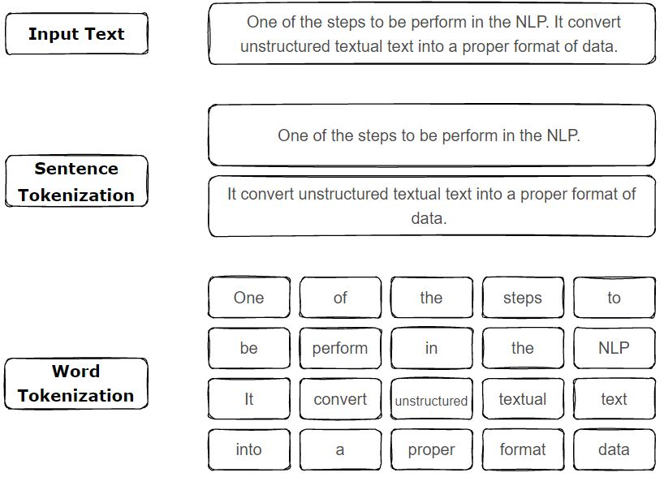
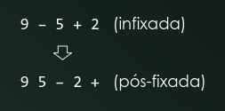

# Compilation & Debugging

## Contents

 - **Compilation:**
   - **Concepts:**
     - **General:**
     - **C++:**
     - **Python:**
       - [Intermediate Language (IL) vs. Machine Language (Assembly)](#il-ml)
       - [Python compilation process (before virtual machine step)](#pcp)
         - [Tokenizer + Lexical Analysis + Grammar](#py-tlag)
         - [Parser](#py-parser)
   - **Tools:**
     - **C++:**
       - **GNU Compiler Collection (GCC/G++):**
         - **Options:**
           - [x](#)
       - **GNU Make:**
          - [Makefile (targets:prerequisites/command(s), variables, and wildcard functions)](#intro-to-makefile)
       - **CMake:**
         - [Intro to CMake](#intro-to-cmake)
         - **CMakeLists.txt:**
           - [cmake_minimum_required()](#cmake-minimum-required)
           - [project()](#project)
           - [add_executable()](#add-executable)
     - **Python:**
 - **Debugging:**
     - **C++:**
       - **gdb (GNU Debugger):**
         - [Intro to gdb (GNU Debugger)](#gdb-intro-to-gdb)
         - [Interactive Debug](#gdb-interactive-debug)
           - **GDB commands:**
             - [run](#gdb-run-r)
             - [list](#gdb-list-l)
             - [break](#gdb-break-b)
             - [next and print](#gdb-next-print)
             - [step](#gdb-step)
             - [frame (where I stopped debug?)](gdb-#frame)
             - [set](#gdb-set)
     - **Python:**
       - **pdb (Python Debugger):**
         - [Problema inicial](#pdb-initial-problem)
         - [Breakpoint()](#pdb-breakpoint)
         - [Comandos do Pdb (help/h)](#pdb-commands)
         - [Entendendo o comando l(ist)](#pdb-list)
         - [Entendendo o comando next (n)](#pdb-next)
         - [O que tem dentro da variável msg?](#pdb-next-variables)
         - [Entendendo o comando step (s)](#pdb-step)
         - [Entendendo o comando continue (c)](#pdb-continue)
         - [Entendendo os comandos type() & whatis](#pdb-type-whatis)
         - [Entendendo os comandos p, pp e vars()](#pdb-p-pp-vars)
         - [Entendendo os comandos quit e exit](#pdb-quit-exit)
 - [**References**](#ref)

<!--- ( Compilation/Concepts/Python ) --->

---

<div id="il-ml"></div>

## Intermediate Language (IL) vs. Machine Language (Assembly)

To understand how Python is interpreted, first, let's see how a compilation works for a compiled language. For example, see the image below:

  

See our **file.xx** passes by a *compiler* → next is generated a Machine Language (Assembly). However, the compiler has **Front-end** and **Backend** steps:

 - **Compiler:**
   - **Front-end:**
     - Receive the compiled language code: C/C++, Go, Rust.
     - Translates to an *Intermediate Language (IL)* → The compiler knows to work with this language (IL).
   - **Backend:**
     - The compiler backend translates the *Intermediate Language (IL)* to *Machine Language (Assembly)*:
       - The *Machine Language (Assembly)* is a language used/read by the *CPU*.
       - This *Machine Language (Assembly)* is:
         - *x83:* 32 architecture.
         - *x64:* 64 architecture.
         - *ARM:* Cellphone architecture.

> **NOTE:**
> **This is the traditional compilation, but how Python compiler works?**

To understand how Python is interpreted, let's see another image (abstraction) below:

  

 - Looking at the image above we can see that the Python compilation has no **"backend step"**.
 - That's, the Python compilation doesn't generate a **Machine Language (Assembly)** for a specific CPU architecture.

> **Ok, but if the Python compiler doesn't compiler for a specific architecture where does he send the Intermediate Language (IL)?**

To understand this, let's see another abstraction (image):

  

Looking at the image above we can see that:

 - We have a compiled language (Python for us).
 - The compiler translates our code to an *Intermediate Language (IL)*.
 - This *Intermediate Language (IL)* is sended to a **Virtual Machine**.
 - The **Virtual Machine** communicates with the **computer (CPU)** and repeats this process until it finishes the tasks.

> **NOTE:**
> See that here the Python compiler doesn't have a backend step to generate a *Machine Language*. **The *Virtual Machine* that communicates with the *computer (CPU)***.

Knowing this, we can say that:

 - Traditional compilers compile code for **Real Machines (or CPU architecture)**.
 - The Python compiler compiles code for a **Virtual Machine**.

---

<div id="pcp"></div>

## Python compilation process (before virtual machine step)

The Python compiler has three steps before sending an *Intermediate Language (IL)* to the **Virtual Machine**:

  

---

<div id="py-tlag"></div>

## Tokenizer + Lexical Analysis + Grammar

The first step before sending an *Intermediate Language (IL)* to the **Virtual Machine** is the ***Tokenizer***.

> In Computer Science, **Lexical Analysis**, **Lexing** or **tokenization** is the process of converting a sequence of characters into a sequence of **lexical tokens**.

For example, see the **Lexing (or tokenizations)** below:

  

---

  

See that:

 - **We have a Input (text):**
 - **Next, we tokenize the Input (text) by sentences:**
   - The *dot symbol "."* sometimes says that the sentence is ended.
 - **Finally, we to tokenize the sentences.**

> **OK, but why tokenize?**

 - **Do you remember in the high school the "Morphological Analysis"?**
   - That's, we get each word in the sentence and find your grammatical class.
 - **The Lexical Analysis do the same thing:**
   - Take each tokenized word (or statement) and place it in the appropriate context.

**NOTE:**  
However, here the focus is not "Morphological Analysis" or "Words", but **Python statements**, **inputs**, **expressions**, etc.

For example:

  

If you pay attention you can see that the **"+"** is an operator. But, which operator?

> **NOTE:**  
> Like "Morphological Analysis" here we also have subclass.

  

> **Ok, but how do I know what's the Grammar for Python?**

**NOTE:**  
You can check the Python Grammar on the [CPython repository](https://github.com/python/cpython) by clicking on the [Grammar/Tokens](https://github.com/python/cpython/blob/main/Grammar/Tokens) folder.

**Current Python grammar (25/07/2023):**
```py
ENDMARKER
NAME
NUMBER
STRING
NEWLINE
INDENT
DEDENT

LPAR                    '('
RPAR                    ')'
LSQB                    '['
RSQB                    ']'
COLON                   ':'
COMMA                   ','
SEMI                    ';'
PLUS                    '+'
MINUS                   '-'
STAR                    '*'
SLASH                   '/'
VBAR                    '|'
AMPER                   '&'
LESS                    '<'
GREATER                 '>'
EQUAL                   '='
DOT                     '.'
PERCENT                 '%'
LBRACE                  '{'
RBRACE                  '}'
EQEQUAL                 '=='
NOTEQUAL                '!='
LESSEQUAL               '<='
GREATEREQUAL            '>='
TILDE                   '~'
CIRCUMFLEX              '^'
LEFTSHIFT               '<<'
RIGHTSHIFT              '>>'
DOUBLESTAR              '**'
PLUSEQUAL               '+='
MINEQUAL                '-='
STAREQUAL               '*='
SLASHEQUAL              '/='
PERCENTEQUAL            '%='
AMPEREQUAL              '&='
VBAREQUAL               '|='
CIRCUMFLEXEQUAL         '^='
LEFTSHIFTEQUAL          '<<='
RIGHTSHIFTEQUAL         '>>='
DOUBLESTAREQUAL         '**='
DOUBLESLASH             '//'
DOUBLESLASHEQUAL        '//='
AT                      '@'
ATEQUAL                 '@='
RARROW                  '->'
ELLIPSIS                '...'
COLONEQUAL              ':='
EXCLAMATION             '!'

OP
AWAIT
ASYNC
TYPE_IGNORE
TYPE_COMMENT
SOFT_KEYWORD
FSTRING_START
FSTRING_MIDDLE
FSTRING_END
COMMENT
NL
ERRORTOKEN

# These aren't used by the C tokenizer but are needed for tokenize.py
ENCODING
```

Imagine we have the following program:

[tokenize-ex01.py](src/python/tokenize-ex01.py)
```python
class Calc:
    def add(self, x: float, y: float) -> float:
        return x + y

    def sub(self, x: float, y: float) -> float:
        return x - y

    def mult(self, x: float, y: float) -> float:
        return x * y

    def div(self, x: float, y: float) -> float:
        try:
          return x / y
        except ZeroDivisionError:
          print("Sorry! You are dividing by zero ")


if __name__ == "__main__":
   c = Calc()

   x1: float = 10
   x2: float = 20
   x3: float = c.add(x1, x2)
   print("The sum is: ",x3)
```

To see all tokens to the program above we can run:

**INTPUT:**
```bash
python3 -m tokenize tokenize-ex01.py
```

**OUTPUT:**
```bash
0,0-0,0:            ENCODING       'utf-8'        
1,0-1,5:            NAME           'class'        
1,6-1,10:           NAME           'Calc'         
1,10-1,11:          OP             ':'            
1,11-1,12:          NEWLINE        '\n'           
2,0-2,4:            INDENT         '    '         
2,4-2,7:            NAME           'def'          
2,8-2,11:           NAME           'add'          
2,11-2,12:          OP             '('            
2,12-2,16:          NAME           'self'         
2,16-2,17:          OP             ','            
2,18-2,19:          NAME           'x'            
2,19-2,20:          OP             ':'            
2,21-2,26:          NAME           'float'        
2,26-2,27:          OP             ','            
2,28-2,29:          NAME           'y'            
2,29-2,30:          OP             ':'            
2,31-2,36:          NAME           'float'        
2,36-2,37:          OP             ')'            
2,38-2,40:          OP             '->'           
2,41-2,46:          NAME           'float'        
2,46-2,47:          OP             ':'            
2,47-2,48:          NEWLINE        '\n'           
3,0-3,8:            INDENT         '        '     
3,8-3,14:           NAME           'return'       
3,15-3,16:          NAME           'x'            
3,17-3,18:          OP             '+'            
3,19-3,20:          NAME           'y'            
3,20-3,21:          NEWLINE        '\n'           
4,0-4,1:            NL             '\n'           
5,4-5,4:            DEDENT         ''             
5,4-5,7:            NAME           'def'          
5,8-5,11:           NAME           'sub'          
5,11-5,12:          OP             '('            
5,12-5,16:          NAME           'self'         
5,16-5,17:          OP             ','            
5,18-5,19:          NAME           'x'            
5,19-5,20:          OP             ':'            
5,21-5,26:          NAME           'float'        
5,26-5,27:          OP             ','            
5,28-5,29:          NAME           'y'            
5,29-5,30:          OP             ':'            
5,31-5,36:          NAME           'float'        
5,36-5,37:          OP             ')'            
5,38-5,40:          OP             '->'           
5,41-5,46:          NAME           'float'        
5,46-5,47:          OP             ':'            
5,47-5,48:          NEWLINE        '\n'           
6,0-6,8:            INDENT         '        '     
6,8-6,14:           NAME           'return'       
6,15-6,16:          NAME           'x'            
6,17-6,18:          OP             '-'            
6,19-6,20:          NAME           'y'            
6,20-6,21:          NEWLINE        '\n'           
7,0-7,1:            NL             '\n'           
8,4-8,4:            DEDENT         ''             
8,4-8,7:            NAME           'def'          
8,8-8,12:           NAME           'mult'         
8,12-8,13:          OP             '('            
8,13-8,17:          NAME           'self'         
8,17-8,18:          OP             ','            
8,19-8,20:          NAME           'x'            
8,20-8,21:          OP             ':'            
8,22-8,27:          NAME           'float'        
8,27-8,28:          OP             ','            
8,29-8,30:          NAME           'y'            
8,30-8,31:          OP             ':'            
8,32-8,37:          NAME           'float'        
8,37-8,38:          OP             ')'            
8,39-8,41:          OP             '->'           
8,42-8,47:          NAME           'float'        
8,47-8,48:          OP             ':'            
8,48-8,49:          NEWLINE        '\n'           
9,0-9,8:            INDENT         '        '     
9,8-9,14:           NAME           'return'       
9,15-9,16:          NAME           'x'            
9,17-9,18:          OP             '*'            
9,19-9,20:          NAME           'y'            
9,20-9,21:          NEWLINE        '\n'           
10,0-10,1:          NL             '\n'           
11,4-11,4:          DEDENT         ''             
11,4-11,7:          NAME           'def'          
11,8-11,11:         NAME           'div'          
11,11-11,12:        OP             '('            
11,12-11,16:        NAME           'self'         
11,16-11,17:        OP             ','            
11,18-11,19:        NAME           'x'            
11,19-11,20:        OP             ':'            
11,21-11,26:        NAME           'float'        
11,26-11,27:        OP             ','            
11,28-11,29:        NAME           'y'            
11,29-11,30:        OP             ':'            
11,31-11,36:        NAME           'float'        
11,36-11,37:        OP             ')'            
11,38-11,40:        OP             '->'           
11,41-11,46:        NAME           'float'        
11,46-11,47:        OP             ':'            
11,47-11,48:        NEWLINE        '\n'           
12,0-12,8:          INDENT         '        '     
12,8-12,11:         NAME           'try'          
12,11-12,12:        OP             ':'            
12,12-12,13:        NEWLINE        '\n'           
13,0-13,10:         INDENT         '          '   
13,10-13,16:        NAME           'return'       
13,17-13,18:        NAME           'x'            
13,19-13,20:        OP             '/'            
13,21-13,22:        NAME           'y'            
13,22-13,23:        NEWLINE        '\n'           
14,8-14,8:          DEDENT         ''             
14,8-14,14:         NAME           'except'       
14,15-14,32:        NAME           'ZeroDivisionError'
14,32-14,33:        OP             ':'            
14,33-14,34:        NEWLINE        '\n'           
15,0-15,10:         INDENT         '          '   
15,10-15,15:        NAME           'print'        
15,15-15,16:        OP             '('            
15,16-15,50:        STRING         '"Sorry! You are dividing by zero "'
15,50-15,51:        OP             ')'            
15,51-15,52:        NEWLINE        '\n'           
16,0-16,1:          NL             '\n'           
17,0-17,1:          NL             '\n'           
18,0-18,0:          DEDENT         ''             
18,0-18,0:          DEDENT         ''             
18,0-18,0:          DEDENT         ''             
18,0-18,2:          NAME           'if'           
18,3-18,11:         NAME           '__name__'     
18,12-18,14:        OP             '=='           
18,15-18,25:        STRING         '"__main__"'   
18,25-18,26:        OP             ':'            
18,26-18,27:        NEWLINE        '\n'           
19,0-19,3:          INDENT         '   '          
19,3-19,4:          NAME           'c'            
19,5-19,6:          OP             '='            
19,7-19,11:         NAME           'Calc'         
19,11-19,12:        OP             '('            
19,12-19,13:        OP             ')'            
19,13-19,14:        NEWLINE        '\n'           
20,0-20,1:          NL             '\n'           
21,3-21,5:          NAME           'x1'           
21,5-21,6:          OP             ':'            
21,7-21,12:         NAME           'float'        
21,13-21,14:        OP             '='            
21,15-21,17:        NUMBER         '10'           
21,17-21,18:        NEWLINE        '\n'           
22,3-22,5:          NAME           'x2'           
22,5-22,6:          OP             ':'            
22,7-22,12:         NAME           'float'        
22,13-22,14:        OP             '='            
22,15-22,17:        NUMBER         '20'           
22,17-22,18:        NEWLINE        '\n'           
23,3-23,5:          NAME           'x3'           
23,5-23,6:          OP             ':'            
23,7-23,12:         NAME           'float'        
23,13-23,14:        OP             '='            
23,15-23,16:        NAME           'c'            
23,16-23,17:        OP             '.'            
23,17-23,20:        NAME           'add'          
23,20-23,21:        OP             '('            
23,21-23,23:        NAME           'x1'           
23,23-23,24:        OP             ','            
23,25-23,27:        NAME           'x2'           
23,27-23,28:        OP             ')'            
23,28-23,29:        NEWLINE        '\n'           
24,3-24,8:          NAME           'print'        
24,8-24,9:          OP             '('            
24,9-24,23:         STRING         '"The sum is: "'
24,23-24,24:        OP             ','            
24,24-24,26:        NAME           'x3'           
24,26-24,27:        OP             ')'            
24,27-24,28:        NEWLINE        '\n'           
25,0-25,0:          DEDENT         ''             
25,0-25,0:          ENDMARKER      ''
```

Analyzing the output above we have:

 - **Three columns:**
   - **Statement mapping:** This mapping is separated into three parts.
     - [INITIAL_LANE], [INITIAL_COLUMN-FINAL_LANE], [FINAL_COLUM]
   - **Token name in the grammar.**
   - **Token value.**

We can also specific to the *"tokenize"* show *subclass* of tokens using **"-e"** flag:

**INTPUT:**
```bash
python3 -m tokenize -e tokenize-ex01.py
```

**OUTPUT:**
```bash
0,0-0,0:            ENCODING       'utf-8'        
1,0-1,5:            NAME           'class'        
1,6-1,10:           NAME           'Calc'         
1,10-1,11:          COLON          ':'            
1,11-1,12:          NEWLINE        '\n'           
2,0-2,4:            INDENT         '    '         
2,4-2,7:            NAME           'def'          
2,8-2,11:           NAME           'add'          
2,11-2,12:          LPAR           '('            
2,12-2,16:          NAME           'self'         
2,16-2,17:          COMMA          ','            
2,18-2,19:          NAME           'x'            
2,19-2,20:          COLON          ':'            
2,21-2,26:          NAME           'float'        
2,26-2,27:          COMMA          ','            
2,28-2,29:          NAME           'y'            
2,29-2,30:          COLON          ':'            
2,31-2,36:          NAME           'float'        
2,36-2,37:          RPAR           ')'            
2,38-2,40:          RARROW         '->'           
2,41-2,46:          NAME           'float'        
2,46-2,47:          COLON          ':'            
2,47-2,48:          NEWLINE        '\n'           
3,0-3,8:            INDENT         '        '     
3,8-3,14:           NAME           'return'       
3,15-3,16:          NAME           'x'            
3,17-3,18:          PLUS           '+'            
3,19-3,20:          NAME           'y'            
3,20-3,21:          NEWLINE        '\n'           
4,0-4,1:            NL             '\n'           
5,4-5,4:            DEDENT         ''             
5,4-5,7:            NAME           'def'          
5,8-5,11:           NAME           'sub'          
5,11-5,12:          LPAR           '('            
5,12-5,16:          NAME           'self'         
5,16-5,17:          COMMA          ','            
5,18-5,19:          NAME           'x'            
5,19-5,20:          COLON          ':'            
5,21-5,26:          NAME           'float'        
5,26-5,27:          COMMA          ','            
5,28-5,29:          NAME           'y'            
5,29-5,30:          COLON          ':'            
5,31-5,36:          NAME           'float'        
5,36-5,37:          RPAR           ')'            
5,38-5,40:          RARROW         '->'           
5,41-5,46:          NAME           'float'        
5,46-5,47:          COLON          ':'            
5,47-5,48:          NEWLINE        '\n'           
6,0-6,8:            INDENT         '        '     
6,8-6,14:           NAME           'return'       
6,15-6,16:          NAME           'x'            
6,17-6,18:          MINUS          '-'            
6,19-6,20:          NAME           'y'            
6,20-6,21:          NEWLINE        '\n'           
7,0-7,1:            NL             '\n'           
8,4-8,4:            DEDENT         ''             
8,4-8,7:            NAME           'def'          
8,8-8,12:           NAME           'mult'         
8,12-8,13:          LPAR           '('            
8,13-8,17:          NAME           'self'         
8,17-8,18:          COMMA          ','            
8,19-8,20:          NAME           'x'            
8,20-8,21:          COLON          ':'            
8,22-8,27:          NAME           'float'        
8,27-8,28:          COMMA          ','            
8,29-8,30:          NAME           'y'            
8,30-8,31:          COLON          ':'            
8,32-8,37:          NAME           'float'        
8,37-8,38:          RPAR           ')'            
8,39-8,41:          RARROW         '->'           
8,42-8,47:          NAME           'float'        
8,47-8,48:          COLON          ':'            
8,48-8,49:          NEWLINE        '\n'           
9,0-9,8:            INDENT         '        '     
9,8-9,14:           NAME           'return'       
9,15-9,16:          NAME           'x'            
9,17-9,18:          STAR           '*'            
9,19-9,20:          NAME           'y'            
9,20-9,21:          NEWLINE        '\n'           
10,0-10,1:          NL             '\n'           
11,4-11,4:          DEDENT         ''             
11,4-11,7:          NAME           'def'          
11,8-11,11:         NAME           'div'          
11,11-11,12:        LPAR           '('            
11,12-11,16:        NAME           'self'         
11,16-11,17:        COMMA          ','            
11,18-11,19:        NAME           'x'            
11,19-11,20:        COLON          ':'            
11,21-11,26:        NAME           'float'        
11,26-11,27:        COMMA          ','            
11,28-11,29:        NAME           'y'            
11,29-11,30:        COLON          ':'            
11,31-11,36:        NAME           'float'        
11,36-11,37:        RPAR           ')'            
11,38-11,40:        RARROW         '->'           
11,41-11,46:        NAME           'float'        
11,46-11,47:        COLON          ':'            
11,47-11,48:        NEWLINE        '\n'           
12,0-12,8:          INDENT         '        '     
12,8-12,11:         NAME           'try'          
12,11-12,12:        COLON          ':'            
12,12-12,13:        NEWLINE        '\n'           
13,0-13,10:         INDENT         '          '   
13,10-13,16:        NAME           'return'       
13,17-13,18:        NAME           'x'            
13,19-13,20:        SLASH          '/'            
13,21-13,22:        NAME           'y'            
13,22-13,23:        NEWLINE        '\n'           
14,8-14,8:          DEDENT         ''             
14,8-14,14:         NAME           'except'       
14,15-14,32:        NAME           'ZeroDivisionError'
14,32-14,33:        COLON          ':'            
14,33-14,34:        NEWLINE        '\n'           
15,0-15,10:         INDENT         '          '   
15,10-15,15:        NAME           'print'        
15,15-15,16:        LPAR           '('            
15,16-15,50:        STRING         '"Sorry! You are dividing by zero "'
15,50-15,51:        RPAR           ')'            
15,51-15,52:        NEWLINE        '\n'           
16,0-16,1:          NL             '\n'           
17,0-17,1:          NL             '\n'           
18,0-18,0:          DEDENT         ''             
18,0-18,0:          DEDENT         ''             
18,0-18,0:          DEDENT         ''             
18,0-18,2:          NAME           'if'           
18,3-18,11:         NAME           '__name__'     
18,12-18,14:        EQEQUAL        '=='           
18,15-18,25:        STRING         '"__main__"'   
18,25-18,26:        COLON          ':'            
18,26-18,27:        NEWLINE        '\n'           
19,0-19,3:          INDENT         '   '          
19,3-19,4:          NAME           'c'            
19,5-19,6:          EQUAL          '='            
19,7-19,11:         NAME           'Calc'         
19,11-19,12:        LPAR           '('            
19,12-19,13:        RPAR           ')'            
19,13-19,14:        NEWLINE        '\n'           
20,0-20,1:          NL             '\n'           
21,3-21,5:          NAME           'x1'           
21,5-21,6:          COLON          ':'            
21,7-21,12:         NAME           'float'        
21,13-21,14:        EQUAL          '='            
21,15-21,17:        NUMBER         '10'           
21,17-21,18:        NEWLINE        '\n'           
22,3-22,5:          NAME           'x2'           
22,5-22,6:          COLON          ':'            
22,7-22,12:         NAME           'float'        
22,13-22,14:        EQUAL          '='            
22,15-22,17:        NUMBER         '20'           
22,17-22,18:        NEWLINE        '\n'           
23,3-23,5:          NAME           'x3'           
23,5-23,6:          COLON          ':'            
23,7-23,12:         NAME           'float'        
23,13-23,14:        EQUAL          '='            
23,15-23,16:        NAME           'c'            
23,16-23,17:        DOT            '.'            
23,17-23,20:        NAME           'add'          
23,20-23,21:        LPAR           '('            
23,21-23,23:        NAME           'x1'           
23,23-23,24:        COMMA          ','            
23,25-23,27:        NAME           'x2'           
23,27-23,28:        RPAR           ')'            
23,28-23,29:        NEWLINE        '\n'           
24,3-24,8:          NAME           'print'        
24,8-24,9:          LPAR           '('            
24,9-24,23:         STRING         '"The sum is: "'
24,23-24,24:        COMMA          ','            
24,24-24,26:        NAME           'x3'           
24,26-24,27:        RPAR           ')'            
24,27-24,28:        NEWLINE        '\n'           
25,0-25,0:          DEDENT         ''             
25,0-25,0:          ENDMARKER      '' 
```

> **NOTE:**
> See that now the tokenize return the actual name of the token in the Grammar.

---

<div id="py-parser"></div>

## Parser

The second step before sending an *Intermediate Language (IL)* to the **Virtual Machine** is the ***Parser***.

> The "Parser" phase is where Python will analyze the tokens and *make sense of operations (dar sentido as operações)*.

x


# Compilation & Debugging

## Contents

 - **Compilation:**
   - **Concepts:**
     - [x](#)
   - **Tools:**
     - **GNU Compiler Collection (GCC/G++):**
       - **Options:**
         - [x](#)
     - **GNU Make:**
        - [Makefile (targets:prerequisites/command(s), variables, and wildcard functions)](#intro-to-makefile)
     - **CMake:**
       - [Intro to CMake](#intro-to-cmake)
       - **CMakeLists.txt:**
         - [cmake_minimum_required()](#cmake-minimum-required)
         - [project()](#project)
         - [add_executable()](#add-executable)
 - **Debugging:**
   - **gdb (GNU Debugger):**
     - [Intro to gdb (GNU Debugger)](#intro-to-gdb)
     - [Interactive Debug](#interactive-debug)
     - **GDB commands:**
       - [run](#run-r)
       - [list](#list-l)
       - [break](#break-b)
       - [next and print](#next-print)
       - [step](#step)
       - [frame (where I stopped debug?)](#frame)
       - [set](#set)
 - [**References**](#ref)

<!--- ( Compilation/Concepts ) --->

---

<div id=""></div>


<!--- ( Compilation/Tools/GCC/G++ ) --->

---

<div id=""></div>


<!--- ( Compilation/Tools/GNU Make ) --->

---

<div id="intro-to-makefile"></div>

## Makefile (targets:prerequisites/command(s), variables, and wildcard functions)

A makefile consist:

 - **targets:prerequisites**
   - command<sub>1</sub>
   - command<sub>2</sub>
   - ...
   - command<sub>n</sub>
 - **variables.**
 - **wildcard functions.**

Let's get started with **targets:prerequisites/command(s)**:

 - **target:**
   - **target** is the name of the ***action*** you want to execute.
   - Or usually the name of the file you want to produce.
 - **prerequisites:**
   - Are files that are used as input to create the *target*.
 - **command(s)**:
   - Are operations run to generate or help the **"prerequisites"**.

For example, imagine we have the following files (program):

**helloWorld.h**
```cpp
#ifndef _H_TESTE
#define _H_TESTE

void helloWorld();
```

**helloWorld.c**
```cpp
#include <stdio.h>
#include <stdlib.h>

void helloWorld(void){
    printf("Hello World!\n");
}
```

**main.c**
```cpp
#include <stdlib.h>
#include "helloWorld.h"

int main(){
    helloWorld();
    return (0);
}
```

Now, imagine we need to compile these files. We can use a makefile to do it:

**makefile**
```makefile
printy: main.o helloWorld.o
    gcc -o printy main.o helloWorld.o

main.o: main.c helloWorld.h
    gcc -o main.o main.c -c -W -Wall -ansi -pedantic

helloWorld.o: helloWorld.c helloWorld.h
    gcc -o helloWorld.o helloWorld.c -c -W -Wall -ansi -pedantic

clean:
    rm -rf *.o *~ printy
```

See that:

 - **printy** depends on → **main.o** and **helloWorld.o**:
   - And run the command **"gcc -o printy main.o helloWorld.o"** to help.
 - **main.o** depends on → **main.c** and **helloWorld.h**:
   - And run the command **"gcc -o main.o main.c -c -W -Wall -ansi -pedantic"** to help.
 - **helloWorld.o** depends on → **helloWorld.c** and **helloWorld.h**:
   - And run the command **"gcc -o helloWorld.o helloWorld.c -c -W -Wall -ansi -pedantic"** to help.
 - Finally, we have a command (target) **"clean"**:
   - How this command (target) has no prerequisites we just run this command (target) with: **"make clean"**.
   - This command is useful to remove unnecessary files.

**NOTE:**  
If you pay attention you can see that we have repeat many times the command **"gcc"**. To solve that, we can create a variable to represent this value.

 - **Variable syntax:**
   - VAR_NAME=value
 - **To use:**
   - $(VAR_NAME)

For example:

**makefile**
```makefile
# Variables
COMPILER=gcc

printy: main.o helloWorld.o
    $(COMPILER) -o printy main.o helloWorld.o

main.o: main.c helloWorld.h
    $(COMPILER) -o main.o main.c -c -W -Wall -ansi -pedantic

helloWorld.o: helloWorld.c helloWorld.h
    $(COMPILER) -o helloWorld.o helloWorld.c -c -W -Wall -ansi -pedantic

clean:
    rm -rf *.o *~ printy
```

Now, if we change the compiler we need just  modify the value in the **"COMPILER"** variable.

**NOTE:**  
See also we have the argument **"-o"** and **"-c -W -Wall -ansi -pedantic"** used in many cases. That's, we can create variables for them:

**makefile**
```makefile
# Variables
COMPILER=gcc
ARGS=-o

# Flags for compiler
CC_FLAGS=-c         \
         -W         \
         -Wall      \
         -ansi      \
         -pedantic

printy: main.o helloWorld.o
    $(COMPILER) $(ARGS) printy main.o helloWorld.o

main.o: main.c helloWorld.h
    $(COMPILER) $(ARGS) main.o main.c $(CC_FLAGS)

helloWorld.o: helloWorld.c helloWorld.h
    $(COMPILER) $(ARGS) helloWorld.o helloWorld.c $(CC_FLAGS)

clean:
    rm -rf *.o *~ printy
```

**NOTE:**  
We can also call these *targets (printy, main.o, helloWorld.o, clean)* separated, for example:

```bash
make printy
make main.o
make helloWorld.o
make clean
```

> **NOTE:**  
> However, if we call **"make printy"** he will call your prerequisites, that will call your prerequisites, and so on (e assim por diante/sucessivamente).

Knowing that, is common to create a *main target (e.g. "all")* e call just him. For example:


```makefile
# Variables
COMPILER=gcc
ARGS=-o

# Flags for compiler
CC_FLAGS=-c         \
         -W         \
         -Wall      \
         -ansi      \
         -pedantic

all:printy

printy: main.o helloWorld.o
    $(COMPILER) $(ARGS) printy main.o helloWorld.o

main.o: main.c helloWorld.h
    $(COMPILER) $(ARGS) main.o main.c $(CC_FLAGS)

helloWorld.o: helloWorld.c helloWorld.h
    $(COMPILER) $(ARGS) helloWorld.o helloWorld.c $(CC_FLAGS)

clean:
    rm -rf *.o *~ printy
```

```bash
make all
```

**NOTE:**
Another problem is that we have many files **"o."**, **".c"**, and **".h"**. How we can call all at once (de uma vez)?

**Using "wildcard functions":**  
To solve that we can use the **wildcard "*"**, for example see the code below:

**NOTE: Esse exemplo não está completo, pois não usa wildcard "%", mas em breve retornare aqui para arrumar, quando eu aprender como utiliza-lo:**
```makefile
# Variables
PROJ_NAME=printy
COMPILER=gcc
ARGS=-o

# .c files.
C_SOURCE=$(wildcard *.c)

# .h files.
H_SOURCE=$(wildcard *.h)

# Object files.
OBJ=$(C_SOURCE:.c=.o)

all:$(PROJ_NAME)

printy: main.o helloWorld.o
    $(COMPILER) $(ARGS) printy main.o helloWorld.o

main.o: main.c helloWorld.h
    $(COMPILER) $(ARGS) main.o main.c $(CC_FLAGS)

helloWorld.o: helloWorld.c helloWorld.h
    $(COMPILER) $(ARGS) helloWorld.o helloWorld.c $(CC_FLAGS)

clean:
    rm -rf *.o $(PROJ_NAME) *~
```

See that, we are grouping by file:

 - **NOTE:** In this example we create a variable (PROJ_NAME) to store the project name.
 - **All ".c":**
   - `C_SOURCE=$(wildcard *.c)`
 - **All ".h":**
   - `H_SOURCE=$(wildcard *.h)`
 - **All ".o":**
   - `OBJ=$(C_SOURCE:.c=.o)`
   - See that here depend on all `".c"=C_SOURCE`.


<!--- ( Compilation/Tools/CMake ) --->

---

<div id="intro-to-cmake"></div>

# Intro to CMake

> **CMake is a compiler generator system.**

**What?**  
For example, CMake can be used to generate a makefile for your project automatically.

 - In truth, the CMake tool generates a makefile and many auxiliary files.
 - We need a file called *CMakeLists.txt* to set up our project in the same folder as our program files. For example:
   - MyProject:
     - calc.h
     - calc.cpp
     - main.cpp
     - CMakeLists.txt
 - As many files are generated by CMake is recommended to create a folder to put these files. For example:
   - MyProject:
     - **Debug/** For debug compilation.
     - **Release/** For release compilation.
     - calc.h
     - calc.cpp
     - main.cpp
     - CMakeLists.txt

To generate these files we need go to the **"Debug/"** or **"Release"** folder and run the following commands:

**Debug:**
```bash
cd Debug/

cmake -DCMAKE_BUILD_TYPE=Debug ../
```

**Release:**
```bash
cd Release/

cmake -DCMAKE_BUILD_TYPE=Release ../
```

---

<div id="cmake-minimum-required"></div>

## cmake_minimum_required()

Any project's top most **CMakeLists.txt** must start by specifying a minimum CMake version using the **cmake_minimum_required()** command.

```c
cmake_minimum_required(VERSION <min>[...<policy_max>] [FATAL_ERROR])
```

**NOTE:**  
> - **ENG -** This establishes policy settings and ensures that the following CMake functions are run with a compatible version of CMake.
> - **PT -** Isso estabelece configurações de política e garante que as seguintes funções do CMake sejam executadas com uma versão compatível do CMake.

**Useful Links:**  
[cmake_minimum_required](https://cmake.org/cmake/help/latest/command/cmake_minimum_required.html#command:cmake_minimum_required)

**Real example:**
```c
cmake_minimum_required(VERSION 3.27.0)
```

---

<div id="project"></div>

## project()

> To start a project, we use the **project()** command to set the project name.

 - This call is required with every project and should be called soon after *cmake_minimum_required()*.
 - As we will see later, this command can also be used to specify other project level information such as the language or version number.

```c
project(<PROJECT-NAME> [<language-name>...])
project(<PROJECT-NAME>
        [VERSION <major>[.<minor>[.<patch>[.<tweak>]]]]
        [DESCRIPTION <project-description-string>]
        [HOMEPAGE_URL <url-string>]
        [LANGUAGES <language-name>...])
```

**Useful Links:**  
[project](https://cmake.org/cmake/help/latest/command/project.html#command:project)

**Real example:**
```c
cmake_minimum_required(VERSION 3.27.0)
project(studies)
```

---

<div id="add-executable"></div>

## add_executable()

> The **add_executable()** command tells CMake to create an *executable* using the specified source code files.

**Normal Executables:**
```c
add_executable(<name> [WIN32] [MACOSX_BUNDLE]
               [EXCLUDE_FROM_ALL]
               [source1] [source2 ...])
```

**Imported Executables:**
```c
add_executable(<name> IMPORTED [GLOBAL])
```

**Alias Executables:**
```c
add_executable(<name> ALIAS <target>)
```

**Useful Links:**  
[add_executable](https://cmake.org/cmake/help/latest/command/add_executable.html#normal-executables)

**Real example:**
```c
cmake_minimum_required(VERSION 3.27.0)
project(studies)
add_executable(studies tutorial.cxx)
```


<!--- ( Debugging/gdb ) --->

---

<div id="intro-to-gdb"></div>

## Intro to gdb (GNU Debugger)

> The first thing you need to know is that before debugging a C++ program you'll need to compile the program (e.g. using "g++ -g" option).

For example, see the code below:

[showName.cpp](src/showName.cpp)
```cpp
#include <iostream>
#include <string>
#include <sstream>

std::string showName(const int &age, const std::string &name)
{
    std::ostringstream ss;
    ss << "Name: " << name << ", Age: " << age;
    return ss.str();
}

int main()
{
    int age = 30;
    std::string name = "Rodrigo";

    std::string result = showName(age, name);
    std::cout << result << "\n";
    return 0;
}
```

Now, let's compiler this code as debug:

**COMPILATION:**
```bash
g++ showName.cpp -o test.out -g
```

Finally, to start the debug:


**DEBUG:**
```bash
gdb ./test.out
```

---

<div id="interactive-debug"></div>

## Interactive Debug

There are two common approaches to interactively debugging a program:

 - First, passing the argument **"-tui"** to the GDB:
   - `gdb exec-file -tui`
 - Second, enter **"+"** on GDB to show you the code visually.

---

<div id="run-r"></div>

## run

> **"run"** or **"r"** executes the program from **start** to **end**.

For example:

[showName.cpp](src/showName.cpp)
```cpp
#include <iostream>
#include <string>
#include <sstream>

std::string showName(const int &age, const std::string &name)
{
    std::ostringstream ss;
    ss << "Name: " << name << ", Age: " << age;
    return ss.str();
}

int main()
{
    int age = 30;
    std::string name = "Rodrigo";

    std::string result = showName(age, name);
    std::cout << result << "\n";
    return 0;
}
```

**COMPILATION:**
```bash
g++ showName.cpp -o test.out -g
```

**DEBUG:**
```bash
gdb ./test.out
```

**GDB:**
```bash
run
```

**OUTPUT:**
```bash
[Thread debugging using libthread_db enabled]
Using host libthread_db library "/lib/x86_64-linux-gnu/libthread_db.so.1".
Name: Rodrigo Leite
[Inferior 1 (process 9268) exited normally]
(gdb) 
```

**NOTE:**  
You can also pass arguments if the program needs some command-line arguments to be passed to it:

**GDB:**
```bash
run arg1 arg2
```

---

<div id="list-l"></div>

## list

> **"list"** or **"l"** displays the code.

The "list" command in GDB (GNU Debugger) is used to display the source code of the program being debugged. It shows a portion of the source code around the current execution line or a specific location specified as an argument.

Here is the basic syntax of the "list" command:

```bash
(gdb) list [START_LINE [, END_LINE]]
```

Arguments of the **"list"** command:

 - **START_LINE (optional):**
   - Specifies the starting line from which the source code will be displayed. *If no value is provided, the display will start at the current execution line*.
 - **END_LINE (optional):**
   - Specifies the ending line up to which the source code will be displayed. *If no value is provided, the display will continue until the default ending line, which is typically 10 lines after the starting line*.

Additionally, you can also use additional options with the **"list"** command to modify its behavior. Some examples of these options are:

 - **list -**
   - Use the hyphen to display the source code preceding the current execution line.
   - This command is useful for gdb to show 10 lines of code *above* the current line. Just continue with **"list -"** until you get where you want it (até chegar onde você quer).
 - **list +**
   - Use the plus sign to display the source code following the current execution line.
   - This command is useful for gdb to show 10 lines of code *below* the current line. Just continue with **"list +"** until you get where you want (até chegar onde você quer).
 - **You can also specify how many lines you show above or below:**
   - list -5
   - list +5
 - **FILE**
   - Specifies the source file in which you want to display the code.
   - For example, **"list main.c"** will display the source code from the **"main.c"** file.

Let's see an example now:

[showName.cpp](src/showName.cpp)
```cpp
#include <iostream>
#include <string>
#include <sstream>

std::string showName(const int &age, const std::string &name)
{
    std::ostringstream ss;
    ss << "Name: " << name << ", Age: " << age;
    return ss.str();
}

int main()
{
    int age = 30;
    std::string name = "Rodrigo";

    std::string result = showName(age, name);
    std::cout << result << "\n";
    return 0;
}
```

**COMPILATION:**
```bash
g++ showName.cpp -o test.out -g
```

**DEBUG:**
```bash
gdb ./test.out
```

**GDB:**
```bash
list 1, 20
```

**OUTPUT:**
```bash
(gdb) list 1, 20
1       #include <iostream>
2       #include <string>
3       #include <sstream>
4
5       std::string showName(const std::string &name, const std::string &lastName)
6       {
7           std::string msg = "Name: " + name + " " + lastName;
8           return msg;
9       }
10
11      int main()
12      {
13          std::string name = "Rodrigo";
14          std::string lastName = "Leite";
15
16          std::string result = showName(name, lastName);
17          std::cout << result << "\n";
18          return 0;
19      }
(gdb) 
```

---

<div id="break-b"></div>

## break

> **"break"** or **"b"** sets a *breakpoint on a particular line or function*.

 - We can set a breakpoint on a particular line, just pass the line number.
 - Or we can sets breakpoint on a function, just pass the function name.

The following example sets a breakpoint at the start of the main function:

**GDB:**
```bash
break main
```

The next example sets a breakpoint at a specific line (17):

**GDB:**
```bash
break 17
```

The next example lists all of the breakpoints:

**GDB:**
```bash
info break
```

**OUTPUT:**
```bash
(gdb) info break
Num     Type           Disp Enb Address            What
1       breakpoint     keep y   0x00000000004023b7 in main() at showName.cpp:13
2       breakpoint     keep y   0x0000000000402428 in main() at showName.cpp:17
(gdb) 
```

The next example deletes the first breakpoint:

**GDB:**
```bash
delete 1
```

**NOTE:**  
Here, we delete a break breakpoint by your number not your line.

```bash
(gdb) info break
Num     Type           Disp Enb Address            What
 1       breakpoint     keep y   0x00000000004023b7 in main() at showName.cpp:13
 2       breakpoint     keep y   0x0000000000402428 in main() at showName.cpp:17
 |
 |
 ------ (breakpoint number).
(gdb) 
```

---

<div id="next-print"></div>

## next and print

> The "next" statement execute the next statement.

> **NOTE:**  
> If the next statement is a function call, execute the entire function and return to the next line of code.

For example, imagine we have the following code:

[debug.cpp](src/debug.cpp)
```cpp
#include <iostream>
#include <string>

int add(const int &x, const int &y);
int sub(const int &x, const int &y);
int mult(const int &x, const int &y);
float divFunc(const int &x, const int &y);

int main(int argc, char *argv[])
{
    int x = 5;
    int y = 10;
    int add_result = add(x, y);
    std::cout << "The sum between " << x << " and " << y << " is: " << add_result << "\n";

    int w = 5;
    int z = 10;
    int sub_result = sub(w, z);
    std::cout << "The subtraction between " << w << " and " << z << " is: " << sub_result << "\n";

    int r = 5;
    int s = 10;
    int mult_result = mult(r, s);
    std::cout << "The multiplication between " << r << " and " << s << " is: " << mult_result << "\n";

    float g = 5;
    float h = 10;
    float div_result = divFunc(g, h);
    std::cout << "The division between " << g << " and " << h << " is: " << div_result << "\n";

    return 0;
}

int add(const int &x, const int &y)
{
    int result;
    result = x + y;
    return result;
}

int sub(const int &x, const int &y)
{
    int result;
    result = x - y;
    return result;
}

int mult(const int &x, const int &y)
{
    int result;
    result = x * y;
    return result;
}

float divFunc(const int &x, const int &y)
{
    float div;
    div = static_cast<float>(x) / y;
    return div;
}
```

**COMPILATION:**
```bash
g++ debug.cpp -o test.out -g
```

**DEBUG:**
```bash
gdb ./test.out
```

To start let's run the code:

**GDB:**
```bash
run
```

**OUTPUT:**
```bash
[Thread debugging using libthread_db enabled]
Using host libthread_db library "/lib/x86_64-linux-gnu/libthread_db.so.1".
The sum between 5 and 10 is: 15
The subtraction between 5 and 10 is: -5
The multiplication between 5 and 10 is: 50
The division between 5 and 10 is: 0.5
[Inferior 1 (process 8152) exited normally]
(gdb)
```

Now, let's print the code:

**GDB:**
```bash
(gdb) list 1
1       #include <iostream>
2       #include <string>
3
4       int add(const int &x, const int &y);
5       int sub(const int &x, const int &y);
6       int mult(const int &x, const int &y);
7       float divFunc(const int &x, const int &y);
8
9       int main(int argc, char *argv[])
10      {
(gdb) list
11          int x = 5;
12          int y = 10;
13          int add_result = add(x, y);
14          std::cout << "The sum between " << x << " and " << y << " is: " << add_result << "\n";
15
16          int w = 5;
17          int z = 10;
18          int sub_result = sub(w, z);
19          std::cout << "The subtraction between " << w << " and " << z << " is: " << sub_result << "\n";
20
(gdb) list
21          int r = 5;
22          int s = 10;
23          int mult_result = mult(r, s);
24          std::cout << "The multiplication between " << r << " and " << s << " is: " << mult_result << "\n";
25
26          float g = 5;
27          float h = 10;
28          float div_result = divFunc(g, h);
29          std::cout << "The division between " << g << " and " << h << " is: " << div_result << "\n";
30
(gdb) list
31          return 0;
32      }
33
34      int add(const int &x, const int &y)
35      {
36          int result;
37          result = x + y;
38          return result;
39      }
40
(gdb) list
41      int sub(const int &x, const int &y)
42      {
43          int result;
44          result = x - y;
45          return result;
46      }
47
48      int mult(const int &x, const int &y)
49      {
50          int result;
(gdb) list
51          result = x * y;
52          return result;
53      }
54
55      float divFunc(const int &x, const int &y)
56      {
57          float div;
58          div = static_cast<float>(x) / y;
59          return div;
60      }
(gdb) list
Line number 61 out of range; debug.cpp has 60 lines.
```

Ok, now let's add a breakpoints starting from the main() function:

**GDB:**
```bash
break main
```

**OUTPUT:**
```bash
Breakpoint 1 at 0x401185: file debug.cpp, line 11.
```

Now, let's *run* the program again:

**GDB:**
```bash
run
```

**OUTPUT:**
```bash
Breakpoint 1, main (argc=1, argv=0x7fffffffdc48) at debug.cpp:11
11          int x = 5;
```

> **NOTE:**  
> See that now we are on line 11, however, this line (instruction) has not yet been executed (ainda não foi executada).

For example, we can use the **GDB "print" statement** to show the value in the **"x" variable**:

**GDB:**
```bash
(gdb) print x
$1 = 0
(gdb) print y
$2 = 0
```

> **What?**  
> Then, the problem here is that we are on line 11, however, this line (instruction) has not yet been executed (ainda não foi executada).

A possible GDB command to execute this line is the command "next", for example:

**GDB:**
```bash
(gdb) next
12          int y = 10;
(gdb) print x
$3 = 5
(gdb) next
13          int add_result = add(x, y);
(gdb) print y
$4 = 10
```

> **NOTE:**  
> See that, we run the **GDB "next"** command to run the current line instruction.

Ok now, let's run some instructions:

**GDB:**
```bash
Breakpoint 1, main (argc=1, argv=0x7fffffffdc48) at debug.cpp:11
11          int x = 5;
(gdb) next
12          int y = 10;
(gdb) next
13          int add_result = add(x, y);
(gdb) next
14          std::cout << "The sum between " << x << " and " << y << " is: " << add_result << "\n";
(gdb) 
```

See that:

 - If you pay attention in line (instruction) 13, the **GDB "next"** command runs the *add()* function and gets your return, however, does not come in to debug (não entra para depurar) the function's internal instructions.
 - This is because, if the next statement is a function, execute the entire function and get your return without coming into the function to debug internal instructions.

> **Ok, but how to solve that?**
> Using **GDB "step"** command.

---

<div id="step"></div>

## step

> The **"step"** statement execute the next statement.

> **NOTE:**  
> If the next statement is a function call, step into the function *(i.e. start debugging inside the function itself)*.

Let's debug the **add()** function step by step using **GDB "step" command**:

**GDB:**
```bash
(gdb) break main
Breakpoint 1 at 0x4013ee: file debug.cpp, line 37.
```

Now, let's run:

**GDB:**
```bash
run
```

**OUTPUT:**
```bash
Breakpoint 1, main (argc=1, argv=0x7fffffffdc48) at debug.cpp:11
11          int x = 5;
```

Now, let's run the **"step"** command until inside the add() function:

**GDB:**
```bash
(gdb) step
12          int y = 10;
(gdb) step
13          int add_result = add(x, y);
(gdb) step
add (x=@0x7fffffffdb0c: 5, y=@0x7fffffffdb08: 10) at debug.cpp:37
37          result = x + y;
```

Ok, here we can see the **"x"** and **"y"** value passed as argument to the add() function:

**GDB:**
```bash
(gdb) print x
$1 = (const int &) @0x7fffffffdb0c: 5
(gdb) print y
$2 = (const int &) @0x7fffffffdb08: 10
(gdb) print result
$3 = 0
```

> **What? Why "result" variable is zero?**  
> That's because we haven't yet executed the statement **"result = x + y;"** yet (ainda). That is, we are still standing on that line.

Now, let's run the **"step"** command and check the value in **"result" variable**:

**GDB:**
```bash
(gdb) step
38          return result;
(gdb) print result
$4 = 15
```

Nice, now we can follow the debug process back to the main function running the **"step"** command:

**GDB:**
```bash
(gdb) step
38          return result;
(gdb) step
39      }
(gdb) step
main (argc=1, argv=0x7fffffffdc48) at debug.cpp:14
14          std::cout << "The sum between " << x << " and " << y << " is: " << add_result << "\n";
(gdb) 
```

> **NOTE:**  
> See that now we are on below instruction below the add() function call.

```cpp
   int add_result = add(x, y);
-> std::cout << "The sum between " << x << " and " << y << " is: " << add_result << "\n";
```

---

<div id="frame"></div>

## frame (where I stopped debug?)

Now imagine you are out to lunch and when back don't remember where you stopped debug.

> **How check it?**  
> Using the **frame** command.

**GDB:**
```bash
                                                        ||
                                                        ||
                                                        ||
    (gdb) frame                                         \/
    #0  main (argc=1, argv=0x7fffffffdc48) at debug.cpp:14
--> 14          std::cout << "The sum between " << x << " and " << y << " is: " << add_result << "\n";
```

See that you stopped on the 14 line.

> **NOTE:**  
> You can also see the lines below from where you stopped using **"list +10"** command. For example:

**OUTPUT:**
```bash
(gdb) frame
#0  main (argc=1, argv=0x7fffffffdc48) at debug.cpp:14
14          std::cout << "The sum between " << x << " and " << y << " is: " << add_result << "\n";
(gdb) list +10
19          std::cout << "The subtraction between " << w << " and " << z << " is: " << sub_result << "\n";
20
21          int r = 5;
22          int s = 10;
23          int mult_result = mult(r, s);
24          std::cout << "The multiplication between " << r << " and " << s << " is: " << mult_result << "\n";
25
26          float g = 5;
27          float h = 10;
28          float div_result = divFunc(g, h);
(gdb) 
```

---

<div id="set"></div>

## set

The **"set"** command is used to:

 - Modify variables values.
 - Or settings during program debugging.
 - It allows you to assign a new value to a variable or configure specific options of GDB.

Here is the basic syntax of the **"set"** command:

```bash
set <variable> <value>
```

 - Here, `<variable>` represents the name of the variable you want to modify.
 - And `<value>` is the new value you want to assign to that variable.


<!--- ( References ) --->

---

<div id="ref"></div>

## References

 - [Como o interpretador do Python funciona? | Live de Python #218](https://www.youtube.com/watch?v=pxfZTAJDipY)
 - [Como debugar código Python? - Live de Python #197](https://www.youtube.com/watch?v=yffiyHEiUvo)
 - [Aula 01 - Ambiente Linux | Histórico | Terminal | Shell | g++ | gdb | make | cmake | Compiladores](https://www.youtube.com/watch?v=JJmf1wlNGeQ&t=1s)
 - [Advanced C and C++ Compiling](https://www.oreilly.com/library/view/advanced-c-and/9781430266679/)
 - [Introdução ao Makefile](https://embarcados.com.br/introducao-ao-makefile/)

---

Ro**drigo** **L**eite da **S**ilva - **drigols**


# Tradução Dirigida por Sintaxe (Syntax Directed Translation)

## Contents

 - [Introdução a sintaxe de um programa](#intro-to-sintax)
 - [Relação entre sintax de uma linguagem de programação e gramática](#sintax-grammar)
 - [Tradutor dirigido por sintaxe](#translator)

---

<div id="intro-to-sintax"></div>

## Introdução a sintaxe de um programa

> A **sintaxe de uma linguagem de programação** descreve a <u>forma</u> como os programas são escritos para essa línguagem.

Para entender melhor veja a imagem abaixo:


**NOTE:**  
Olhando para o programa (image) acima nós conseguimos identificar a forma como escreve um programa **C++.** Por exemplo:

 - Um comentário inicia com `//`
 - Diretivas de pré-processamento iniciam com `#
 - Funções tem:
   - Um tipo;
   - Um Nome;
   - Um corpo.
 - instruções terminam com ponto e vírgula `(;)`

**NOTE:**  
Essa é a <u>forma</u> de escrever um programa em **C++** e a sintaxe são essas regrinhas.

---

<div id="sintax-grammar"></div>

## Relação entre sintaxes de uma linguagem de programação e gramática

> As sintaxes das linguagens de programação podem ser representadas por gramáticas. Normalmente escritas na linguagem **Backus-Naur Form (BNF)**.

Por exemplo, veja uma parte da **gramática da linguagem C++** escrita em **Backus-Naur Form (BNF)**:

  

**NOTE:**  
Normalmente, gramáticas são utilizadas para fazer traduções que é uma tecnica muita utilizada em compiladores.

---

<div id="translator"></div>

## Tradutor dirigido por sintaxe

Uma das maneiras de entender melhor como funciona o Front-End de um Compilador seria criar um **tradutor dirigido por sintaxe**.

> esse tradutor deve traduzir expressões aritméticas **infixadas** para a forma **pós-fixada**.

 - **Notação infixada:**
   - Operadores aparecem <u>entre</u> os operandos.
 - **Notaçao pós-fixada:**
   - Operadores aparecem <u>após</u> operandos

Para entender melhor veja a imagem abaixo:

  

 - **No exemplo infixada:**
   - O operador `-` aparece <u>entre</u> os operandos **9** e **5**; E o operador `+` aparece <u>entre</u> o resultado da subtração (que vai gerar um operando) e o operando 2.
 - **No exemplo pós-fixada:**
   - O operador `-` vai aparecer <u>após</u> os operandos **9** e **5**; E o operador `+` vai aparecer <u>após</u> o operandor 2.

> **Mas quando eu vou precisar utilizar o modelo <u>pós-fixada</u>?**

Não sei se vocês já utilizaram a calculadora **HP 48G** (mais utilizada nos cursos de Engenharias para calcular integrais, derivadas) que segue um modelo de pilha (Stack), onde você vai empilhando os operandos e operadores.

Vejam o exemplo abaixo:

  

No exemplo acima a calculadora **HP 48G** adiciona os operandos **1** e **3** a pilha (pode ver no index da calculadora que começa de baixo para cima) e agora é só você adicionar o operador <u>após</u> os operandos oara a calculadora fazer a operação.

**NOTE:**  
Vejam que esse exemplo é o mesmo utilizado na **notaçao pós-fixada**.


<!--- ( Debugging ) --->

---

<div id="tools"></div>

## 01 - Ferramentas mais comuns para Debugger em python

Antes de iniciar nossos estudos sobre ***depuração*** vou listar algumas das ferramentas mais comuns do Python com abreviações e significados:

 - **Python DeBuger (PDB):**
   - Embutido no Python.
 - **IPython DeBuger (IPDB):**
   - pip install ipdb.
 - **Remote Python DeBuger (RPDB):**
   - pip install rpdb.
   - Debuger remoto,v ia netcat.
 - **Web Python DeBuger (Web PDB):**
   - pip install web_pdb.server
   - Debuger remoto utilizando o browser
 - **PySnooper:**
   - pip install pySnooper
 - **Integrações de IDEs:**
   - VSCode.
   - PyCharm.

---

<div id="initial-problem"></div>

## 02 - Problema inicial

Talvez uma das coisas mais complicadas para quem está começando com Python é entender como debugar no terminal. Agora vem a pergunta-chave:

> Por que nós precisamos aprender a **debugar** no terminal se podemos utilizar uma **IDE** com várias ferramentas prontas?

**RESPOSTA:**  
Existem cenários, onde, nós não vamos poder abrir nossos códigos em uma **IDE**. Por exemplo, imagine que nós estamos acessando uma máquina remota e precisamos debugar uma parte específica do código, como faríamos sem saber debugar pelo terminal (console)?

Por exemplo, imagine que nós temos o seguinte código:

[example-01.py](src/example-01.py)
```python
def say_hello(name, age):
  return 'Hello, my name is {name}, age {age}'


if __name__ =="__main__":
  name = "Rodrigo"
  age  = "32"

  msg = say_hello(name, age)

  # TEST!
  assert msg == 'Hello, my name is Rodrigo, age 32'
```

Agora nós vamos rodar o código acima, que vai nos gerar o seguinte resultado:

**OUTPUT:**  
```python
$ python example-01.py


Traceback (most recent call last):
  File "example-01.py", line 12, in <module>
    assert msg == 'Hello, my name is Rodrigo, age 32'
AssertionError
```

**Vejam que o nosso teste não passou:**  
 - Mas por quê?
 - E o que tem dentro da variável **msg**?
   - Que é o retorno da nossa função **say_hello()**.

**NOTE:**  
Uma das maneiras de saber o que tem dentro da variável **"msg"** é abrindo o arquivo no modo iterativo utilizando o argumento **-i**:

```python
Traceback (most recent call last):
  File "example-01.py", line 12, in <module>
    assert msg == 'Hello, my name is Rodrigo, age 32'
AssertionError
>>> msg
'Hello, my name is {name}, age {age}'
>>>
```

**Ué, não deveria ter o nome e idade passado para a função?**
Na verdade o que nós temos aqui é o famoso erro de **"Semântica"**.

> **Erro semântico:** É um erro na "lógica de seu código", em sua semântica, o código está sintaticamente correto, porém não faz o que se esperava dele. Por isso, este tipo de erro é geralmente mais difícil de ser identificado e corrigido.

**NOTE:**  
A verdade é que nem sempre nós vamos poder entrar no modo iterativo e fazer esse tipo de observação.

> **Ok, mas e o erro aqui qual é?**

**NOTE:**  
Na verdade o problema aqui é que nós esquecemos de utilizar o **f** para formatar a string, mas vamos imaginar que nós não sabemos ainda qual é o erro.

> **Como encontrar um erro que nós nem imaginamos ainda onde esta?**

---

<div id="breakpoint"></div>

## 03 - Breakpoint()

Agora nós vamos aprender o que é **Breakpoint()** que nada mais é que:

> **Um ponto de parada dentro do código**

Por exemplo, vamos voltar para o nosso código anterior:

[example-01.py](src/example-01.py)
```python
1  def say_hello(name, age):
2   return 'Hello, my name is {name}, age {age}'
3
4
5  if __name__ =="__main__":
6   name = "Rodrigo"
7   age  = "32"
8
9   breakpoint()
10
11  msg = say_hello(name, age)
12
13  # TEST!
14  assert msg == 'Hello, my name is Rodrigo, age 32'
```

Vejam que na linha 9 agora nós temos um **breakpoint()**, mas o que isso significa? Imagine que o compilador/interpretador está lá linha por linha, lendo funções, variáveis e etc...  Eassim, que ele chegar no **breakpoint()** na linha 9 ele vai parar! Agora vem a pergunta:

> **O que vem depois que ele parar?**

**NOTE:**  
Na verdade ele não vai *parar* a execução do programa e sim ele vai **"pausar"** e ficar esperando.

> **Mas esperando o que?**

Nós interagirmos com ele! Vamos agora rodar nosso exemplo novamente com o **breakpoint()** e ver o que acontece:

```python
example-01.py(11)<module>()
$ python example-01.py

-> msg = say_hello(name, age)
(Pdb)
```

**NOTE:**  
Olhando para a saída acima nós temos o seguinte:
 - O caminho onde está o arquivo;
 - Uma **seta (->)** apontando para a próxima instrução depois do nosso **breakpoint()**;
 - E também nós temos o **(Pdb)** que nós sabemos que é o **Python DeBuger** embutido no Python.
 - Por fim nós devemos observação que depois do nome do nosso arquivo nós temos **(11)**:
   - example-01.py(11)
     - Isso significa que o nosso programa está parado (pausado) na linha 11

Agora vamos no nosso **Pdb** e digitar **msg** que é a variável que deveria ter o retorno da nossa função:

```python
(Pdb) msg
*** NameError: name 'msg' is not defined
```

**What? Como assim msg ainda não foi definido?**  
Na verdade nós temos acesso a tudo que está antes do **breakpoint()**, lembrem que nós estamos parados (pausados) na linha 11, ou seja, ele chegou na linha 11 e pausou, mas não leu ou executou nada lá ainda.

Por exemplo, vamos interagir com o **Pdb** e ver se ele responde bem sobre as variáveis **"name"** e **"age"**:

```python
(Pdb) name
'Rodrigo'
(Pdb) age
'32'
(Pdb)
```

**NOTE:**  
Vejam que realmente condiz com o que eu falei, o **Pdb** tem tudo disponível, porém, ATÉ o **breakpoint()**.

---

<div id="pdb-commands"></div>

## 04 - Comandos do Pdb (help/h)

Bem, sabendo que nós estamos pausados na linha 11 e o **Pdb** está disponível para nós interagirmos com ele é importante nós sabermos que existem comandos que nós podemos passar para ele (Pdb).

Por exemplo, se você utilizar o comando **help** ou **h (abreviação de help)** o **Pdb** vai retornar uma lista com esses comandos:

```python
(Pdb) help

Documented commands (type help <topic>):
========================================
EOF    c          d        h         list      q        rv       undisplay
a      cl         debug    help      ll        quit     s        unt
alias  clear      disable  ignore    longlist  r        source   until
args   commands   display  interact  n         restart  step     up
b      condition  down     j         next      return   tbreak   w
break  cont       enable   jump      p         retval   u        whatis
bt     continue   exit     l         pp        run      unalias  where

Miscellaneous help topics:
==========================
exec  pdb
```

**NOTE:**  
Vejam que em alguns comandos nós temos o comando original e a abreviação para esse comando.

---

<div id="list"></div>

## 05 - Entendendo o comando l(ist)

O comando **l(ist)** vai listar 11 linhas em volta do nosso ponto de parada. Por exemplo, veja a saída abaixo:

```python
  6       name = "Rodrigo"
  7       age  = "32"
  8
  9       breakpoint()
 10
 11  ->   msg = say_hello(name, age)
 12
 13       # TEST!
 14       assert msg == 'Hello, my name is Rodrigo, age 32'
```

Vejam que nós temos uma **seta (->)** apontando para onde nós estamos parados (pausado) e 11 em volta (divido para cima e para baixo) do nosso ponto de parada.

**NOTE:**  
Nós também podemos utilizar o comando help (h) em conjunto com o comando **l(ist)** para ver a documentação do do comando **l(ist)**.

```python
(Pdb) h l
l(ist) [first [,last] | .]

        List source code for the current file.  Without arguments,
        list 11 lines around the current line or continue the previous
        listing.  With . as argument, list 11 lines around the current
        line.  With one argument, list 11 lines starting at that line.
        With two arguments, list the given range; if the second
        argument is less than the first, it is a count.

        The current line in the current frame is indicated by "->".
        If an exception is being debugged, the line where the
        exception was originally raised or propagated is indicated by
        ">>", if it differs from the current line.
(Pdb)
```

---

<div id="next"></div>

## 06 - Entendendo o comando next (n)

Agora nós vamos entender como funciona o comando **next** que nada mas é que andar no nossso ponto de parada para a próxima instrução, ou conjunto de instruções internas (por exemplo, uma função).

**Não entendeu?**  
Nós não estavamos parado na linha 11?

```python
> example-01.py(11)<module>()
-> msg = say_hello(name, age)
(Pdb) list
  6       name = "Rodrigo"
  7       age  = "32"
  8
  9       breakpoint()
 10
 11  ->   msg = say_hello(name, age)
 12
 13       # TEST!
 14       assert msg == 'Hello, my name is Rodrigo, age 32'
```

**Se eu der o comando next o que vai acontecer?**

```python
(Pdb) next
example-01.py(14)<module>()
-> assert msg == 'Hello, my name is Rodrigo, age 32'
(Pdb) list
  9       breakpoint()
 10
 11       msg = say_hello(name, age)
 12
 13       # TEST!
 14  ->   assert msg == 'Hello, my name is Rodrigo, age 32'
```

**NOTES:**  
 - Vejam que agora a nossa **seta (->)** está apontando para a linha 14, ou seja, o comando next (n) pula instruções e não linhas.
 - Só para relembrar, o **Pdb** ainda não executou a linha 14, ele apenas está apontando para lá que é o nosso ponto de parada.

---

<div id="next-variables"></div>

## 07 - O que tem dentro da variável msg?

Bem, como nós sabemos antes não dava para saber o que tinha dentro da variável **msg** porque o nosso **breakpoint()** tinha pausado a compilação/interpretação antes desse ponto. Mas, como nós utilizamos o comando **next** para o nosso ponto de parada pular para a próxima instrução agora nós podemos ver o que tem na variável **msg**:

```python
(Pdb) msg
'Hello, my name is {name}, age {age}'
```

Opa, vejam que o problema é realmente o que nós estavamos pensando, faltou formatar a string com **f**.

---

<div id="step"></div>

## 08 - Entendendo o comando step (s)

Agora pensem comigo quando eu utilizo o comando **next** a nossa seta **(->)** não deveria ter entrado na função e ter parado lá? Pensando por esse lado sim, pois era a próxima instrução.

**NOTE:**  
O que acontece é que o **next** executa uma instrução completa de uma linha. Ou seja, se essa linha tiver instruções interna, por exemplo, execução de uma função ela vai rodar tudo e ir para a próxima instrução.

Agora vem outra pergunta-chave:

> E se eu quiser que o **Pdb** vá **PASSO** a **PASSO** até a parte interna da função?

**Utilize o comando step (s):**  
Com o comando step (s) nós conseguimos aplicar esse conceito, vejam o exemplo abaixo passo a passo:

```python
$ python example-01.py
example-01.py(11)<module>()
-> msg = say_hello(name, age)
(Pdb) list
  6       name = "Rodrigo"
  7       age  = "32"
  8
  9       breakpoint()
 10
 11  ->   msg = say_hello(name, age)
 12
 13       # TEST!
 14       assert msg == 'Hello, my name is Rodrigo, age 32'
[EOF]
(Pdb) step

--Call--
example-01.py(1)say_hello()
-> def say_hello(name, age):
(Pdb) list
  1  -> def say_hello(name, age):
  2       return 'Hello, my name is {name}, age {age}'
  3
  4
  5     if __name__ =="__main__":
  6       name = "Rodrigo"
  7       age  = "32"
  8
  9       breakpoint()
 10
 11       msg = say_hello(name, age)
(Pdb) step

example-01.py(2)say_hello()
-> return 'Hello, my name is {name}, age {age}'
(Pdb) list
  1     def say_hello(name, age):
  2  ->   return 'Hello, my name is {name}, age {age}'
  3
  4
  5     if __name__ =="__main__":
  6       name = "Rodrigo"
  7       age  = "32"
  8
  9       breakpoint()
 10
 11       msg = say_hello(name, age)
(Pdb) step

--Return--
example-01.py(2)say_hello()->'Hello, my na...e}, age {age}'
-> return 'Hello, my name is {name}, age {age}'
(Pdb) list
  1     def say_hello(name, age):
  2  ->   return 'Hello, my name is {name}, age {age}'
  3
  4
  5     if __name__ =="__main__":
  6       name = "Rodrigo"
  7       age  = "32"
  8
  9       breakpoint()
 10
 11       msg = say_hello(name, age)
(Pdb) step

example-01.py(14)<module>()
-> assert msg == 'Hello, my name is Rodrigo, age 32'
(Pdb) list
  9       breakpoint()
 10
 11       msg = say_hello(name, age)
 12
 13       # TEST!
 14  ->   assert msg == 'Hello, my name is Rodrigo, age 32'
```

**NOTE:**  
Vejam que com o comando **step (s)** nós vamos executando instrução por instrução, mesmo que tenham instruções internas. Diferente do comando **next** que executa todas as instruções de uma linha, mesmo que essa linha tenha instruções internas (como uma função).

---

<div id="continue"></div>

## 09 - Entendendo o comando continue (c)

A primeira coisa que vocês tem que ter em mente é que:

> **O comando *continue* executa um intervalo de instruções entre um *breakpoint()* e outro.**

**What? Como assim?**  
Vocês já pararam para pensar que em alguns momentos nós vamos precisar **debugar** partes do nosso código separadamente? Então, o comando **continue** em conjunto com **breakpoint()** possibilita isso.

Por exemplo, vejam o código abaixo:

[continue.py](src/)
```python
name = "Rodrigo"
age  = 32

breakpoint()

msg = "Hello World!"
employee = "Jobson"

breakpoint()

bye = "Good bye!"
```

**PDB:**  

```python
$ python continue.py
> continue.py(9)<module>()
-> msg = "Hello World!"
(Pdb) name
'Rodrigo'
(Pdb) age
32
(Pdb) msg
*** NameError: name 'msg' is not defined
(Pdb) continue
> continue.py(14)<module>()
-> bye = "Good bye!"
(Pdb) msg
'Hello World!'
(Pdb) employee
'Jobson'
(Pdb) bye
*** NameError: name 'bye' is not defined
(Pdb) continue
```

Olhando para o código acima e a depuração que foi feita nós temos o seguinte:

 - Como não tinha nenhum comando **breakpoint()** no início do arquivo ele já reconheceu as variáveis **name** e **age** e parou na linha 9;
 - Quando nós executamos o **continue** o *PDB* pulou para o próximo ponto de parada na linha 14, ou seja, o próximo **breakpoint()** e também já leu mais duas variáveis que eram **msg** e **employee**
 - Por fim, quando nós executamos o comando **continue** acabou a depuração já que não tinha mais **breakpoint()**:
   - Ou seja, não teve como a gente ver o tinha na variável **bye**.
   - Se você tiver interesse pode adicionar mais um **breakpoint()** depois desse ponto de parada para testar o que tinha na variável **bye** para caso de estudo.

**NOTE:**  
O mais importante a observar aqui é que o comando **continue** executa um intervalo de instruções entre um **breakpoint()** e outro, não importa quantas instruções tem entre um e outro, ele vai ler tudo que tiver entre um **breakpoint()** e outro e pausar. E isso é crucial para debugar partes do código sem precisar ficar rodando várias vezes os comando **next** ou **step**. 

---

<div id="type-whatis"></div>

## 10 - Entendendo os comandos type() & whatis

E se em algum momento nós precisarmos saber qual o tipo de uma variável como faz? Para isso você pode utilizar os comando **type()** e **whatis** do *PDB*:

Veja o exemplo abaixo:

```python
$ python example-01.py
> example-01.py(11)<module>()
-> msg = say_hello(name, age)
(Pdb) type(name)
<class 'str'>
(Pdb) whatis name
<class 'str'>
(Pdb) type(age)
<class 'str'>
(Pdb) whatis age
<class 'str'>
```

**NOTE:**  
Vejam como os comandos **types()** e **whatis** são úteis, principalmente, quando estamos debugando um código de outra pessoa e não sabemos muito bem o que está acontecendo.

---

<div id="p-pp-vars"></div>

## 11 - Entendendo os comandos p, pp e vars()

Resumidamente, os comandos **p**, **pp** e **vars()** fazem o seguinte:

 - **p:**
   - O comando **p (de print)** printa algo no *PDB*.
 - **pp:**
   - O comando **pp (de pretty)** printa algo no *PDB*, porem, mais bonitinho (ou formatado).
 - **vars()**
   - O comando **vars()** retorna todas as variáveis que já estão definidas atualmente e seus valores:

Vamos começar com o seguinte código:

[example-03.py](src/example-03.py)
```python
breakpoint()

name = "Rodrigo"
age  = 32

breakpoint()

msg = "Hello World!"
```

Agora vamos fazer alguns exemplos de **p** e **pp**:

```python
$ python example-03.py
> example-03.py(3)<module>()
-> name = "Rodrigo"
(Pdb) p name
*** NameError: name 'name' is not defined
(Pdb) p age
*** NameError: name 'age' is not defined
(Pdb) continue
> example-03.py(8)<module>()
-> msg = "Hello World!"
(Pdb) p name
'Rodrigo'
(Pdb) pp name
'Rodrigo'
(Pdb) p age
32
(Pdb) p "I Love You"
'I Love You'
(Pdb) pp "Oh my God!"
'Oh my God!
```

**NOTE:**  
Como foi dito na definição os comandos **p (de print)** e **pp (de pretty)** printam algo no terminal (console) do **PDB**.

Agora vamos ver alguns exemplos do comando **vars()** que retorna todas as variáveis que já estão definidas atualmente e seus valores:

```python
$ python example-03.py
> example-03.py(3)<module>()
-> name = "Rodrigo"
(Pdb) pp vars()
{'__annotations__': {},
 '__builtins__': <module 'builtins' (built-in)>,
 '__cached__': None,
 '__doc__': None,
 '__file__': 'example-03.py',
 '__loader__': <_frozen_importlib_external.SourceFileLoader object at 0x000002BC46409640>,
 '__name__': '__main__',
 '__package__': None,
 '__spec__': None}
(Pdb) continue
> example-03.py(8)<module>()
-> msg = "Hello World!"
(Pdb) pp vars()
{'__annotations__': {},
 '__builtins__': <module 'builtins' (built-in)>,
 '__cached__': None,
 '__doc__': None,
 '__file__': 'example-03.py',
 '__loader__': <_frozen_importlib_external.SourceFileLoader object at 0x000002BC46409640>,
 '__name__': '__main__',
 '__package__': None,
 '__spec__': None,
 'age': 32,
 'name': 'Rodrigo'}
(Pdb)
```

**NOTES:**  
 - A primeira observação aqui é que nós vamos sempre utilizar o comando **pp (de pretty)** porque ele printa as variáveis de forma mais organizada (você pode testar apenas o comando **p** para ver).
 - Outra observação é que o comando **vars()** só retorna as variáveis que já estão definidas, vejam que no **debuger** acime nós tivemos que executar o comando **continue** para ele pular para o próximo **breakpoint()** e lá sim as variáveis **name** e **age** já estavam definidas e assim foram exibidas no nosso retorno.

---

<div id="quit-exit"></div>

## 12 - Entendendo os comandos quit e exit

Os comandos **quit** e **exit** tem os mesmos proprósitos que é **sair do Pdb**.

**Exemplo com quit:**  
```python
$ python loop.py
> loop.py(2)<module>()
-> while count <= 10:
(Pdb) quit
Traceback (most recent call last):
  File "loop.py", line 2, in <module>
    while count <= 10:
  File "loop.py", line 2, in <module>
    while count <= 10:
  File "C:\Users\Drigo\anaconda3\lib\bdb.py", line 88, in trace_dispatch
    return self.dispatch_line(frame)
  File "C:\Users\Drigo\anaconda3\lib\bdb.py", line 113, in dispatch_line
    if self.quitting: raise BdbQuit
bdb.BdbQuit
```

**Exemplo com exit:**  
```python
$ python loop.py
> loop.py(2)<module>()
-> while count <= 10:
(Pdb) exit
Traceback (most recent call last):
  File "loop.py", line 2, in <module>
    while count <= 10:
  File "loop.py", line 2, in <module>
    while count <= 10:
  File "C:\Users\Drigo\anaconda3\lib\bdb.py", line 88, in trace_dispatch
    return self.dispatch_line(frame)
  File "C:\Users\Drigo\anaconda3\lib\bdb.py", line 113, in dispatch_line
    if self.quitting: raise BdbQuit
bdb.BdbQuit
```


**INTPUT:**
```bash

```

**OUTPUT:**
```bash

```

