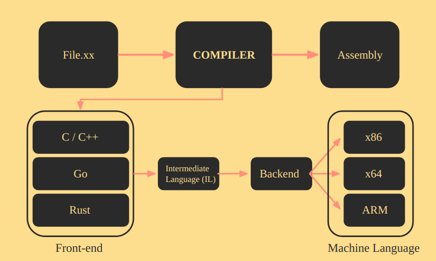
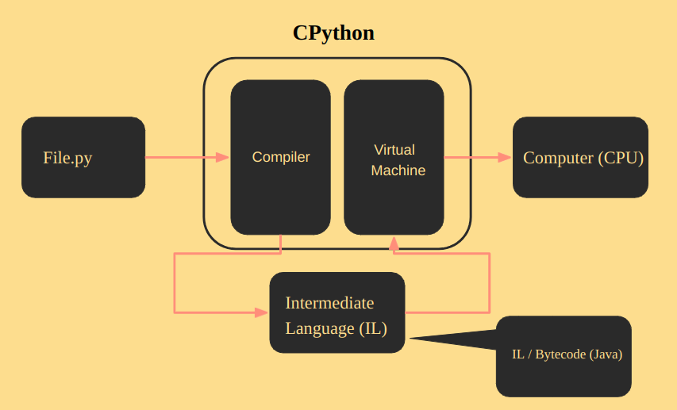
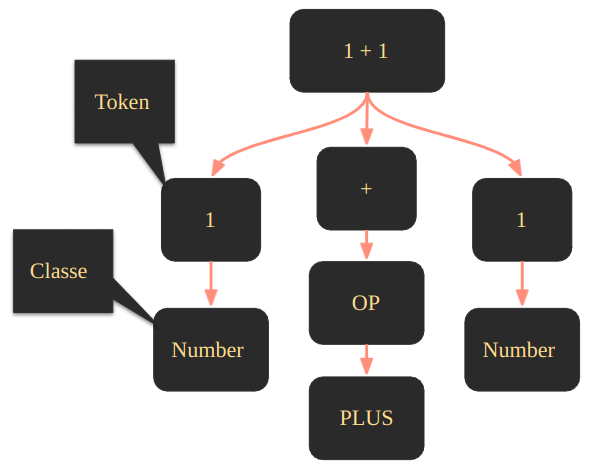

# Compilers

## Contents

 - **Concepts:**
   - **General:**
   - **C++:**
   - **Python:**
     - [Intermediate Language (IL) vs. Machine Language (Assembly)](#il-ml)
     - [Python compilation process (before virtual machine step)](#pcp)
     - [Tokenizer + Lexical Analysis + Grammar](#py-tlag)
     - [Parser](#py-parser)
   - **Tools:**
     - **C++:**
       - **GNU Compiler Collection (GCC/G++):**
       - **GNU Make:**
          - [Makefile (targets:prerequisites/command(s), variables, and wildcard functions)](#intro-to-makefile)
       - **CMake:**
         - [Intro to CMake](#intro-to-cmake)
         - **CMakeLists.txt:**
           - [cmake_minimum_required()](#cmake-minimum-required)
           - [project()](#project)
           - [add_executable()](#add-executable)
     - **Python:**
 - [**References**](#ref)

<!--- ( Concepts/Python ) --->

---

<div id="il-ml"></div>

## Intermediate Language (IL) vs. Machine Language (Assembly)

To understand how Python is interpreted, first, let's see how a compilation works for a compiled language. For example, see the image below:

  

See our **file.xx** passes by a *compiler* → next is generated a Machine Language (Assembly). However, the compiler has **Front-end** and **Backend** steps:

 - **Compiler:**
   - **Front-end:**
     - Receive the compiled language code: C/C++, Go, Rust.
     - Translates to an *Intermediate Language (IL)* → The compiler knows to work with this language (IL).
   - **Backend:**
     - The compiler backend translates the *Intermediate Language (IL)* to *Machine Language (Assembly)*:
       - The *Machine Language (Assembly)* is a language used/read by the *CPU*.
       - This *Machine Language (Assembly)* is:
         - *x83:* 32 architecture.
         - *x64:* 64 architecture.
         - *ARM:* Cellphone architecture.

> **NOTE:**
> **This is the traditional compilation, but how Python compiler works?**

To understand how Python is interpreted, let's see another image (abstraction) below:

  

 - Looking at the image above we can see that the Python compilation has no **"backend step"**.
 - That's, the Python compilation doesn't generate a **Machine Language (Assembly)** for a specific CPU architecture.

> **Ok, but if the Python compiler doesn't compiler for a specific architecture where does he send the Intermediate Language (IL)?**

To understand this, let's see another abstraction (image):

  

Looking at the image above we can see that:

 - We have a compiled language (Python for us).
 - The compiler translates our code to an *Intermediate Language (IL)*.
 - This *Intermediate Language (IL)* is sended to a **Virtual Machine**.
 - The **Virtual Machine** communicates with the **computer (CPU)** and repeats this process until it finishes the tasks.

> **NOTE:**
> See that here the Python compiler doesn't have a backend step to generate a *Machine Language*. **The *Virtual Machine* that communicates with the *computer (CPU)***.

Knowing this, we can say that:

 - Traditional compilers compile code for **Real Machines (or CPU architecture)**.
 - The Python compiler compiles code for a **Virtual Machine**.

---

<div id="pcp"></div>

## Python compilation process (before virtual machine step)

The Python compiler has three steps before sending an *Intermediate Language (IL)* to the **Virtual Machine**:

  

---

<div id="py-tlag"></div>

## Tokenizer + Lexical Analysis + Grammar

The first step before sending an *Intermediate Language (IL)* to the **Virtual Machine** is the ***Tokenizer***.

> In Computer Science, **Lexical Analysis**, **Lexing** or **tokenization** is the process of converting a sequence of characters into a sequence of **lexical tokens**.

For example, see the **Lexing (or tokenizations)** below:

  

---

  

See that:

 - **We have a Input (text):**
 - **Next, we tokenize the Input (text) by sentences:**
   - The *dot symbol "."* sometimes says that the sentence is ended.
 - **Finally, we to tokenize the sentences.**

> **OK, but why tokenize?**

 - **Do you remember in the high school the "Morphological Analysis"?**
   - That's, we get each word in the sentence and find your grammatical class.
 - **The Lexical Analysis do the same thing:**
   - Take each tokenized word (or statement) and place it in the appropriate context.

**NOTE:**  
However, here the focus is not "Morphological Analysis" or "Words", but **Python statements**, **inputs**, **expressions**, etc.

For example:

  

If you pay attention you can see that the **"+"** is an operator. But, which operator?

> **NOTE:**  
> Like "Morphological Analysis" here we also have subclass.

  

> **Ok, but how do I know what's the Grammar for Python?**

**NOTE:**  
You can check the Python Grammar on the [CPython repository](https://github.com/python/cpython) by clicking on the [Grammar/Tokens](https://github.com/python/cpython/blob/main/Grammar/Tokens) folder.

**Current Python grammar (25/07/2023):**
```py
ENDMARKER
NAME
NUMBER
STRING
NEWLINE
INDENT
DEDENT

LPAR                    '('
RPAR                    ')'
LSQB                    '['
RSQB                    ']'
COLON                   ':'
COMMA                   ','
SEMI                    ';'
PLUS                    '+'
MINUS                   '-'
STAR                    '*'
SLASH                   '/'
VBAR                    '|'
AMPER                   '&'
LESS                    '<'
GREATER                 '>'
EQUAL                   '='
DOT                     '.'
PERCENT                 '%'
LBRACE                  '{'
RBRACE                  '}'
EQEQUAL                 '=='
NOTEQUAL                '!='
LESSEQUAL               '<='
GREATEREQUAL            '>='
TILDE                   '~'
CIRCUMFLEX              '^'
LEFTSHIFT               '<<'
RIGHTSHIFT              '>>'
DOUBLESTAR              '**'
PLUSEQUAL               '+='
MINEQUAL                '-='
STAREQUAL               '*='
SLASHEQUAL              '/='
PERCENTEQUAL            '%='
AMPEREQUAL              '&='
VBAREQUAL               '|='
CIRCUMFLEXEQUAL         '^='
LEFTSHIFTEQUAL          '<<='
RIGHTSHIFTEQUAL         '>>='
DOUBLESTAREQUAL         '**='
DOUBLESLASH             '//'
DOUBLESLASHEQUAL        '//='
AT                      '@'
ATEQUAL                 '@='
RARROW                  '->'
ELLIPSIS                '...'
COLONEQUAL              ':='
EXCLAMATION             '!'

OP
AWAIT
ASYNC
TYPE_IGNORE
TYPE_COMMENT
SOFT_KEYWORD
FSTRING_START
FSTRING_MIDDLE
FSTRING_END
COMMENT
NL
ERRORTOKEN

# These aren't used by the C tokenizer but are needed for tokenize.py
ENCODING
```

Imagine we have the following program:

[tokenize-ex01.py](src/python/tokenize-ex01.py)
```python
class Calc:
    def add(self, x: float, y: float) -> float:
        return x + y

    def sub(self, x: float, y: float) -> float:
        return x - y

    def mult(self, x: float, y: float) -> float:
        return x * y

    def div(self, x: float, y: float) -> float:
        try:
          return x / y
        except ZeroDivisionError:
          print("Sorry! You are dividing by zero ")


if __name__ == "__main__":
   c = Calc()

   x1: float = 10
   x2: float = 20
   x3: float = c.add(x1, x2)
   print("The sum is: ",x3)
```

To see all tokens to the program above we can run:

**INTPUT:**
```bash
python3 -m tokenize tokenize-ex01.py
```

**OUTPUT:**
```bash
0,0-0,0:            ENCODING       'utf-8'        
1,0-1,5:            NAME           'class'        
1,6-1,10:           NAME           'Calc'         
1,10-1,11:          OP             ':'            
1,11-1,12:          NEWLINE        '\n'           
2,0-2,4:            INDENT         '    '         
2,4-2,7:            NAME           'def'          
2,8-2,11:           NAME           'add'          
2,11-2,12:          OP             '('            
2,12-2,16:          NAME           'self'         
2,16-2,17:          OP             ','            
2,18-2,19:          NAME           'x'            
2,19-2,20:          OP             ':'            
2,21-2,26:          NAME           'float'        
2,26-2,27:          OP             ','            
2,28-2,29:          NAME           'y'            
2,29-2,30:          OP             ':'            
2,31-2,36:          NAME           'float'        
2,36-2,37:          OP             ')'            
2,38-2,40:          OP             '->'           
2,41-2,46:          NAME           'float'        
2,46-2,47:          OP             ':'            
2,47-2,48:          NEWLINE        '\n'           
3,0-3,8:            INDENT         '        '     
3,8-3,14:           NAME           'return'       
3,15-3,16:          NAME           'x'            
3,17-3,18:          OP             '+'            
3,19-3,20:          NAME           'y'            
3,20-3,21:          NEWLINE        '\n'           
4,0-4,1:            NL             '\n'           
5,4-5,4:            DEDENT         ''             
5,4-5,7:            NAME           'def'          
5,8-5,11:           NAME           'sub'          
5,11-5,12:          OP             '('            
5,12-5,16:          NAME           'self'         
5,16-5,17:          OP             ','            
5,18-5,19:          NAME           'x'            
5,19-5,20:          OP             ':'            
5,21-5,26:          NAME           'float'        
5,26-5,27:          OP             ','            
5,28-5,29:          NAME           'y'            
5,29-5,30:          OP             ':'            
5,31-5,36:          NAME           'float'        
5,36-5,37:          OP             ')'            
5,38-5,40:          OP             '->'           
5,41-5,46:          NAME           'float'        
5,46-5,47:          OP             ':'            
5,47-5,48:          NEWLINE        '\n'           
6,0-6,8:            INDENT         '        '     
6,8-6,14:           NAME           'return'       
6,15-6,16:          NAME           'x'            
6,17-6,18:          OP             '-'            
6,19-6,20:          NAME           'y'            
6,20-6,21:          NEWLINE        '\n'           
7,0-7,1:            NL             '\n'           
8,4-8,4:            DEDENT         ''             
8,4-8,7:            NAME           'def'          
8,8-8,12:           NAME           'mult'         
8,12-8,13:          OP             '('            
8,13-8,17:          NAME           'self'         
8,17-8,18:          OP             ','            
8,19-8,20:          NAME           'x'            
8,20-8,21:          OP             ':'            
8,22-8,27:          NAME           'float'        
8,27-8,28:          OP             ','            
8,29-8,30:          NAME           'y'            
8,30-8,31:          OP             ':'            
8,32-8,37:          NAME           'float'        
8,37-8,38:          OP             ')'            
8,39-8,41:          OP             '->'           
8,42-8,47:          NAME           'float'        
8,47-8,48:          OP             ':'            
8,48-8,49:          NEWLINE        '\n'           
9,0-9,8:            INDENT         '        '     
9,8-9,14:           NAME           'return'       
9,15-9,16:          NAME           'x'            
9,17-9,18:          OP             '*'            
9,19-9,20:          NAME           'y'            
9,20-9,21:          NEWLINE        '\n'           
10,0-10,1:          NL             '\n'           
11,4-11,4:          DEDENT         ''             
11,4-11,7:          NAME           'def'          
11,8-11,11:         NAME           'div'          
11,11-11,12:        OP             '('            
11,12-11,16:        NAME           'self'         
11,16-11,17:        OP             ','            
11,18-11,19:        NAME           'x'            
11,19-11,20:        OP             ':'            
11,21-11,26:        NAME           'float'        
11,26-11,27:        OP             ','            
11,28-11,29:        NAME           'y'            
11,29-11,30:        OP             ':'            
11,31-11,36:        NAME           'float'        
11,36-11,37:        OP             ')'            
11,38-11,40:        OP             '->'           
11,41-11,46:        NAME           'float'        
11,46-11,47:        OP             ':'            
11,47-11,48:        NEWLINE        '\n'           
12,0-12,8:          INDENT         '        '     
12,8-12,11:         NAME           'try'          
12,11-12,12:        OP             ':'            
12,12-12,13:        NEWLINE        '\n'           
13,0-13,10:         INDENT         '          '   
13,10-13,16:        NAME           'return'       
13,17-13,18:        NAME           'x'            
13,19-13,20:        OP             '/'            
13,21-13,22:        NAME           'y'            
13,22-13,23:        NEWLINE        '\n'           
14,8-14,8:          DEDENT         ''             
14,8-14,14:         NAME           'except'       
14,15-14,32:        NAME           'ZeroDivisionError'
14,32-14,33:        OP             ':'            
14,33-14,34:        NEWLINE        '\n'           
15,0-15,10:         INDENT         '          '   
15,10-15,15:        NAME           'print'        
15,15-15,16:        OP             '('            
15,16-15,50:        STRING         '"Sorry! You are dividing by zero "'
15,50-15,51:        OP             ')'            
15,51-15,52:        NEWLINE        '\n'           
16,0-16,1:          NL             '\n'           
17,0-17,1:          NL             '\n'           
18,0-18,0:          DEDENT         ''             
18,0-18,0:          DEDENT         ''             
18,0-18,0:          DEDENT         ''             
18,0-18,2:          NAME           'if'           
18,3-18,11:         NAME           '__name__'     
18,12-18,14:        OP             '=='           
18,15-18,25:        STRING         '"__main__"'   
18,25-18,26:        OP             ':'            
18,26-18,27:        NEWLINE        '\n'           
19,0-19,3:          INDENT         '   '          
19,3-19,4:          NAME           'c'            
19,5-19,6:          OP             '='            
19,7-19,11:         NAME           'Calc'         
19,11-19,12:        OP             '('            
19,12-19,13:        OP             ')'            
19,13-19,14:        NEWLINE        '\n'           
20,0-20,1:          NL             '\n'           
21,3-21,5:          NAME           'x1'           
21,5-21,6:          OP             ':'            
21,7-21,12:         NAME           'float'        
21,13-21,14:        OP             '='            
21,15-21,17:        NUMBER         '10'           
21,17-21,18:        NEWLINE        '\n'           
22,3-22,5:          NAME           'x2'           
22,5-22,6:          OP             ':'            
22,7-22,12:         NAME           'float'        
22,13-22,14:        OP             '='            
22,15-22,17:        NUMBER         '20'           
22,17-22,18:        NEWLINE        '\n'           
23,3-23,5:          NAME           'x3'           
23,5-23,6:          OP             ':'            
23,7-23,12:         NAME           'float'        
23,13-23,14:        OP             '='            
23,15-23,16:        NAME           'c'            
23,16-23,17:        OP             '.'            
23,17-23,20:        NAME           'add'          
23,20-23,21:        OP             '('            
23,21-23,23:        NAME           'x1'           
23,23-23,24:        OP             ','            
23,25-23,27:        NAME           'x2'           
23,27-23,28:        OP             ')'            
23,28-23,29:        NEWLINE        '\n'           
24,3-24,8:          NAME           'print'        
24,8-24,9:          OP             '('            
24,9-24,23:         STRING         '"The sum is: "'
24,23-24,24:        OP             ','            
24,24-24,26:        NAME           'x3'           
24,26-24,27:        OP             ')'            
24,27-24,28:        NEWLINE        '\n'           
25,0-25,0:          DEDENT         ''             
25,0-25,0:          ENDMARKER      ''
```

Analyzing the output above we have:

 - **Three columns:**
   - **Statement mapping:** This mapping is separated into three parts.
     - [INITIAL_LANE], [INITIAL_COLUMN-FINAL_LANE], [FINAL_COLUM]
   - **Token name in the grammar.**
   - **Token value.**

We can also specific to the *"tokenize"* show *subclass* of tokens using **"-e"** flag:

**INTPUT:**
```bash
python3 -m tokenize -e tokenize-ex01.py
```

**OUTPUT:**
```bash
0,0-0,0:            ENCODING       'utf-8'        
1,0-1,5:            NAME           'class'        
1,6-1,10:           NAME           'Calc'         
1,10-1,11:          COLON          ':'            
1,11-1,12:          NEWLINE        '\n'           
2,0-2,4:            INDENT         '    '         
2,4-2,7:            NAME           'def'          
2,8-2,11:           NAME           'add'          
2,11-2,12:          LPAR           '('            
2,12-2,16:          NAME           'self'         
2,16-2,17:          COMMA          ','            
2,18-2,19:          NAME           'x'            
2,19-2,20:          COLON          ':'            
2,21-2,26:          NAME           'float'        
2,26-2,27:          COMMA          ','            
2,28-2,29:          NAME           'y'            
2,29-2,30:          COLON          ':'            
2,31-2,36:          NAME           'float'        
2,36-2,37:          RPAR           ')'            
2,38-2,40:          RARROW         '->'           
2,41-2,46:          NAME           'float'        
2,46-2,47:          COLON          ':'            
2,47-2,48:          NEWLINE        '\n'           
3,0-3,8:            INDENT         '        '     
3,8-3,14:           NAME           'return'       
3,15-3,16:          NAME           'x'            
3,17-3,18:          PLUS           '+'            
3,19-3,20:          NAME           'y'            
3,20-3,21:          NEWLINE        '\n'           
4,0-4,1:            NL             '\n'           
5,4-5,4:            DEDENT         ''             
5,4-5,7:            NAME           'def'          
5,8-5,11:           NAME           'sub'          
5,11-5,12:          LPAR           '('            
5,12-5,16:          NAME           'self'         
5,16-5,17:          COMMA          ','            
5,18-5,19:          NAME           'x'            
5,19-5,20:          COLON          ':'            
5,21-5,26:          NAME           'float'        
5,26-5,27:          COMMA          ','            
5,28-5,29:          NAME           'y'            
5,29-5,30:          COLON          ':'            
5,31-5,36:          NAME           'float'        
5,36-5,37:          RPAR           ')'            
5,38-5,40:          RARROW         '->'           
5,41-5,46:          NAME           'float'        
5,46-5,47:          COLON          ':'            
5,47-5,48:          NEWLINE        '\n'           
6,0-6,8:            INDENT         '        '     
6,8-6,14:           NAME           'return'       
6,15-6,16:          NAME           'x'            
6,17-6,18:          MINUS          '-'            
6,19-6,20:          NAME           'y'            
6,20-6,21:          NEWLINE        '\n'           
7,0-7,1:            NL             '\n'           
8,4-8,4:            DEDENT         ''             
8,4-8,7:            NAME           'def'          
8,8-8,12:           NAME           'mult'         
8,12-8,13:          LPAR           '('            
8,13-8,17:          NAME           'self'         
8,17-8,18:          COMMA          ','            
8,19-8,20:          NAME           'x'            
8,20-8,21:          COLON          ':'            
8,22-8,27:          NAME           'float'        
8,27-8,28:          COMMA          ','            
8,29-8,30:          NAME           'y'            
8,30-8,31:          COLON          ':'            
8,32-8,37:          NAME           'float'        
8,37-8,38:          RPAR           ')'            
8,39-8,41:          RARROW         '->'           
8,42-8,47:          NAME           'float'        
8,47-8,48:          COLON          ':'            
8,48-8,49:          NEWLINE        '\n'           
9,0-9,8:            INDENT         '        '     
9,8-9,14:           NAME           'return'       
9,15-9,16:          NAME           'x'            
9,17-9,18:          STAR           '*'            
9,19-9,20:          NAME           'y'            
9,20-9,21:          NEWLINE        '\n'           
10,0-10,1:          NL             '\n'           
11,4-11,4:          DEDENT         ''             
11,4-11,7:          NAME           'def'          
11,8-11,11:         NAME           'div'          
11,11-11,12:        LPAR           '('            
11,12-11,16:        NAME           'self'         
11,16-11,17:        COMMA          ','            
11,18-11,19:        NAME           'x'            
11,19-11,20:        COLON          ':'            
11,21-11,26:        NAME           'float'        
11,26-11,27:        COMMA          ','            
11,28-11,29:        NAME           'y'            
11,29-11,30:        COLON          ':'            
11,31-11,36:        NAME           'float'        
11,36-11,37:        RPAR           ')'            
11,38-11,40:        RARROW         '->'           
11,41-11,46:        NAME           'float'        
11,46-11,47:        COLON          ':'            
11,47-11,48:        NEWLINE        '\n'           
12,0-12,8:          INDENT         '        '     
12,8-12,11:         NAME           'try'          
12,11-12,12:        COLON          ':'            
12,12-12,13:        NEWLINE        '\n'           
13,0-13,10:         INDENT         '          '   
13,10-13,16:        NAME           'return'       
13,17-13,18:        NAME           'x'            
13,19-13,20:        SLASH          '/'            
13,21-13,22:        NAME           'y'            
13,22-13,23:        NEWLINE        '\n'           
14,8-14,8:          DEDENT         ''             
14,8-14,14:         NAME           'except'       
14,15-14,32:        NAME           'ZeroDivisionError'
14,32-14,33:        COLON          ':'            
14,33-14,34:        NEWLINE        '\n'           
15,0-15,10:         INDENT         '          '   
15,10-15,15:        NAME           'print'        
15,15-15,16:        LPAR           '('            
15,16-15,50:        STRING         '"Sorry! You are dividing by zero "'
15,50-15,51:        RPAR           ')'            
15,51-15,52:        NEWLINE        '\n'           
16,0-16,1:          NL             '\n'           
17,0-17,1:          NL             '\n'           
18,0-18,0:          DEDENT         ''             
18,0-18,0:          DEDENT         ''             
18,0-18,0:          DEDENT         ''             
18,0-18,2:          NAME           'if'           
18,3-18,11:         NAME           '__name__'     
18,12-18,14:        EQEQUAL        '=='           
18,15-18,25:        STRING         '"__main__"'   
18,25-18,26:        COLON          ':'            
18,26-18,27:        NEWLINE        '\n'           
19,0-19,3:          INDENT         '   '          
19,3-19,4:          NAME           'c'            
19,5-19,6:          EQUAL          '='            
19,7-19,11:         NAME           'Calc'         
19,11-19,12:        LPAR           '('            
19,12-19,13:        RPAR           ')'            
19,13-19,14:        NEWLINE        '\n'           
20,0-20,1:          NL             '\n'           
21,3-21,5:          NAME           'x1'           
21,5-21,6:          COLON          ':'            
21,7-21,12:         NAME           'float'        
21,13-21,14:        EQUAL          '='            
21,15-21,17:        NUMBER         '10'           
21,17-21,18:        NEWLINE        '\n'           
22,3-22,5:          NAME           'x2'           
22,5-22,6:          COLON          ':'            
22,7-22,12:         NAME           'float'        
22,13-22,14:        EQUAL          '='            
22,15-22,17:        NUMBER         '20'           
22,17-22,18:        NEWLINE        '\n'           
23,3-23,5:          NAME           'x3'           
23,5-23,6:          COLON          ':'            
23,7-23,12:         NAME           'float'        
23,13-23,14:        EQUAL          '='            
23,15-23,16:        NAME           'c'            
23,16-23,17:        DOT            '.'            
23,17-23,20:        NAME           'add'          
23,20-23,21:        LPAR           '('            
23,21-23,23:        NAME           'x1'           
23,23-23,24:        COMMA          ','            
23,25-23,27:        NAME           'x2'           
23,27-23,28:        RPAR           ')'            
23,28-23,29:        NEWLINE        '\n'           
24,3-24,8:          NAME           'print'        
24,8-24,9:          LPAR           '('            
24,9-24,23:         STRING         '"The sum is: "'
24,23-24,24:        COMMA          ','            
24,24-24,26:        NAME           'x3'           
24,26-24,27:        RPAR           ')'            
24,27-24,28:        NEWLINE        '\n'           
25,0-25,0:          DEDENT         ''             
25,0-25,0:          ENDMARKER      '' 
```

> **NOTE:**
> See that now the tokenize return the actual name of the token in the Grammar.

---

<div id="py-parser"></div>

## Parser

The second step before sending an *Intermediate Language (IL)* to the **Virtual Machine** is the ***Parser***.

> The "Parser" phase is where Python will analyze the tokens and *make sense of operations (dar sentido as operações)*.

x


<!--- ( Tools/GNU Make ) --->

---

<div id="intro-to-makefile"></div>

## Makefile (targets:prerequisites/command(s), variables, and wildcard functions)

A makefile consist:

 - **targets:prerequisites**
   - command<sub>1</sub>
   - command<sub>2</sub>
   - ...
   - command<sub>n</sub>
 - **variables.**
 - **wildcard functions.**

Let's get started with **targets:prerequisites/command(s)**:

 - **target:**
   - **target** is the name of the ***action*** you want to execute.
   - Or usually the name of the file you want to produce.
 - **prerequisites:**
   - Are files that are used as input to create the *target*.
 - **command(s)**:
   - Are operations run to generate or help the **"prerequisites"**.

For example, imagine we have the following files (program):

**helloWorld.h**
```cpp
#ifndef _H_TESTE
#define _H_TESTE

void helloWorld();
```

**helloWorld.c**
```cpp
#include <stdio.h>
#include <stdlib.h>

void helloWorld(void){
    printf("Hello World!\n");
}
```

**main.c**
```cpp
#include <stdlib.h>
#include "helloWorld.h"

int main(){
    helloWorld();
    return (0);
}
```

Now, imagine we need to compile these files. We can use a makefile to do it:

**makefile**
```makefile
printy: main.o helloWorld.o
    gcc -o printy main.o helloWorld.o

main.o: main.c helloWorld.h
    gcc -o main.o main.c -c -W -Wall -ansi -pedantic

helloWorld.o: helloWorld.c helloWorld.h
    gcc -o helloWorld.o helloWorld.c -c -W -Wall -ansi -pedantic

clean:
    rm -rf *.o *~ printy
```

See that:

 - **printy** depends on → **main.o** and **helloWorld.o**:
   - And run the command **"gcc -o printy main.o helloWorld.o"** to help.
 - **main.o** depends on → **main.c** and **helloWorld.h**:
   - And run the command **"gcc -o main.o main.c -c -W -Wall -ansi -pedantic"** to help.
 - **helloWorld.o** depends on → **helloWorld.c** and **helloWorld.h**:
   - And run the command **"gcc -o helloWorld.o helloWorld.c -c -W -Wall -ansi -pedantic"** to help.
 - Finally, we have a command (target) **"clean"**:
   - How this command (target) has no prerequisites we just run this command (target) with: **"make clean"**.
   - This command is useful to remove unnecessary files.

**NOTE:**  
If you pay attention you can see that we have repeat many times the command **"gcc"**. To solve that, we can create a variable to represent this value.

 - **Variable syntax:**
   - VAR_NAME=value
 - **To use:**
   - $(VAR_NAME)

For example:

**makefile**
```makefile
# Variables
COMPILER=gcc

printy: main.o helloWorld.o
    $(COMPILER) -o printy main.o helloWorld.o

main.o: main.c helloWorld.h
    $(COMPILER) -o main.o main.c -c -W -Wall -ansi -pedantic

helloWorld.o: helloWorld.c helloWorld.h
    $(COMPILER) -o helloWorld.o helloWorld.c -c -W -Wall -ansi -pedantic

clean:
    rm -rf *.o *~ printy
```

Now, if we change the compiler we need just  modify the value in the **"COMPILER"** variable.

**NOTE:**  
See also we have the argument **"-o"** and **"-c -W -Wall -ansi -pedantic"** used in many cases. That's, we can create variables for them:

**makefile**
```makefile
# Variables
COMPILER=gcc
ARGS=-o

# Flags for compiler
CC_FLAGS=-c         \
         -W         \
         -Wall      \
         -ansi      \
         -pedantic

printy: main.o helloWorld.o
    $(COMPILER) $(ARGS) printy main.o helloWorld.o

main.o: main.c helloWorld.h
    $(COMPILER) $(ARGS) main.o main.c $(CC_FLAGS)

helloWorld.o: helloWorld.c helloWorld.h
    $(COMPILER) $(ARGS) helloWorld.o helloWorld.c $(CC_FLAGS)

clean:
    rm -rf *.o *~ printy
```

**NOTE:**  
We can also call these *targets (printy, main.o, helloWorld.o, clean)* separated, for example:

```bash
make printy
make main.o
make helloWorld.o
make clean
```

> **NOTE:**  
> However, if we call **"make printy"** he will call your prerequisites, that will call your prerequisites, and so on (e assim por diante/sucessivamente).

Knowing that, is common to create a *main target (e.g. "all")* e call just him. For example:


```makefile
# Variables
COMPILER=gcc
ARGS=-o

# Flags for compiler
CC_FLAGS=-c         \
         -W         \
         -Wall      \
         -ansi      \
         -pedantic

all:printy

printy: main.o helloWorld.o
    $(COMPILER) $(ARGS) printy main.o helloWorld.o

main.o: main.c helloWorld.h
    $(COMPILER) $(ARGS) main.o main.c $(CC_FLAGS)

helloWorld.o: helloWorld.c helloWorld.h
    $(COMPILER) $(ARGS) helloWorld.o helloWorld.c $(CC_FLAGS)

clean:
    rm -rf *.o *~ printy
```

```bash
make all
```

**NOTE:**
Another problem is that we have many files **"o."**, **".c"**, and **".h"**. How we can call all at once (de uma vez)?

**Using "wildcard functions":**  
To solve that we can use the **wildcard "*"**, for example see the code below:

**NOTE: Esse exemplo não está completo, pois não usa wildcard "%", mas em breve retornare aqui para arrumar, quando eu aprender como utiliza-lo:**
```makefile
# Variables
PROJ_NAME=printy
COMPILER=gcc
ARGS=-o

# .c files.
C_SOURCE=$(wildcard *.c)

# .h files.
H_SOURCE=$(wildcard *.h)

# Object files.
OBJ=$(C_SOURCE:.c=.o)

all:$(PROJ_NAME)

printy: main.o helloWorld.o
    $(COMPILER) $(ARGS) printy main.o helloWorld.o

main.o: main.c helloWorld.h
    $(COMPILER) $(ARGS) main.o main.c $(CC_FLAGS)

helloWorld.o: helloWorld.c helloWorld.h
    $(COMPILER) $(ARGS) helloWorld.o helloWorld.c $(CC_FLAGS)

clean:
    rm -rf *.o $(PROJ_NAME) *~
```

See that, we are grouping by file:

 - **NOTE:** In this example we create a variable (PROJ_NAME) to store the project name.
 - **All ".c":**
   - `C_SOURCE=$(wildcard *.c)`
 - **All ".h":**
   - `H_SOURCE=$(wildcard *.h)`
 - **All ".o":**
   - `OBJ=$(C_SOURCE:.c=.o)`
   - See that here depend on all `".c"=C_SOURCE`.


<!--- ( Tools/CMake ) --->

---

<div id="intro-to-cmake"></div>

# Intro to CMake

> **CMake is a compiler generator system.**

**What?**  
For example, CMake can be used to generate a makefile for your project automatically.

 - In truth, the CMake tool generates a makefile and many auxiliary files.
 - We need a file called *CMakeLists.txt* to set up our project in the same folder as our program files. For example:
   - MyProject:
     - calc.h
     - calc.cpp
     - main.cpp
     - CMakeLists.txt
 - As many files are generated by CMake is recommended to create a folder to put these files. For example:
   - MyProject:
     - **Debug/** For debug compilation.
     - **Release/** For release compilation.
     - calc.h
     - calc.cpp
     - main.cpp
     - CMakeLists.txt

To generate these files we need go to the **"Debug/"** or **"Release"** folder and run the following commands:

**Debug:**
```bash
cd Debug/

cmake -DCMAKE_BUILD_TYPE=Debug ../
```

**Release:**
```bash
cd Release/

cmake -DCMAKE_BUILD_TYPE=Release ../
```

---

<div id="cmake-minimum-required"></div>

## cmake_minimum_required()

Any project's top most **CMakeLists.txt** must start by specifying a minimum CMake version using the **cmake_minimum_required()** command.

```c
cmake_minimum_required(VERSION <min>[...<policy_max>] [FATAL_ERROR])
```

**NOTE:**  
> - **ENG -** This establishes policy settings and ensures that the following CMake functions are run with a compatible version of CMake.
> - **PT -** Isso estabelece configurações de política e garante que as seguintes funções do CMake sejam executadas com uma versão compatível do CMake.

**Useful Links:**  
[cmake_minimum_required](https://cmake.org/cmake/help/latest/command/cmake_minimum_required.html#command:cmake_minimum_required)

**Real example:**
```c
cmake_minimum_required(VERSION 3.27.0)
```

---

<div id="project"></div>

## project()

> To start a project, we use the **project()** command to set the project name.

 - This call is required with every project and should be called soon after *cmake_minimum_required()*.
 - As we will see later, this command can also be used to specify other project level information such as the language or version number.

```c
project(<PROJECT-NAME> [<language-name>...])
project(<PROJECT-NAME>
        [VERSION <major>[.<minor>[.<patch>[.<tweak>]]]]
        [DESCRIPTION <project-description-string>]
        [HOMEPAGE_URL <url-string>]
        [LANGUAGES <language-name>...])
```

**Useful Links:**  
[project](https://cmake.org/cmake/help/latest/command/project.html#command:project)

**Real example:**
```c
cmake_minimum_required(VERSION 3.27.0)
project(studies)
```

---

<div id="add-executable"></div>

## add_executable()

> The **add_executable()** command tells CMake to create an *executable* using the specified source code files.

**Normal Executables:**
```c
add_executable(<name> [WIN32] [MACOSX_BUNDLE]
               [EXCLUDE_FROM_ALL]
               [source1] [source2 ...])
```

**Imported Executables:**
```c
add_executable(<name> IMPORTED [GLOBAL])
```

**Alias Executables:**
```c
add_executable(<name> ALIAS <target>)
```

**Useful Links:**  
[add_executable](https://cmake.org/cmake/help/latest/command/add_executable.html#normal-executables)

**Real example:**
```c
cmake_minimum_required(VERSION 3.27.0)
project(studies)
add_executable(studies tutorial.cxx)
```


<!--- ( References ) --->

---

<div id="ref"></div>

## References

 - [Como o interpretador do Python funciona? | Live de Python #218](https://www.youtube.com/watch?v=pxfZTAJDipY)

---

Ro**drigo** **L**eite da **S**ilva - **drigols**
