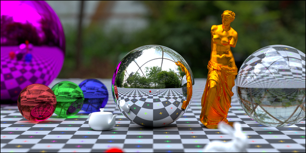

# Computer Graphics

  

## Contents

 - **Fundamentals:**
   - [Basic Concepts](modules/basic-concepts.md)
   - [Light & Vision](modules/light-vision.md)
   - [3D Illusion](modules/3d-illusion.md)
   - [Colors](modules/colors.md)
   - [GPU](modules/gpu.md)
   - [3D](modules/3d.md)
 - **Math for Computer Graphics:**
   - 
 - **Tips & Tricks:**
   - 
 - **Examples:**
   - 

---

Ro**drigo** **L**eite da **S**ilva - **drigols**
