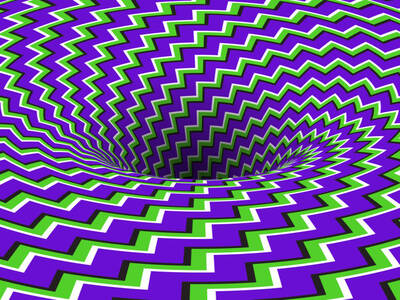
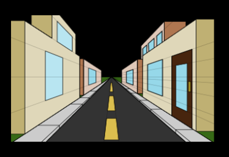
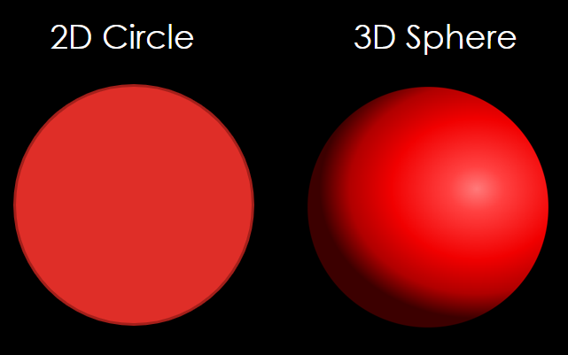
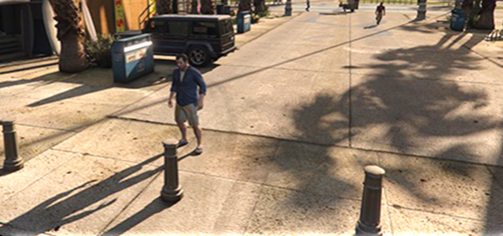

# 3D Illusion

## Contents

 - [Intro to 3D Illusion](#intro)
 - [Shading (Sombreamento) Technique](#shading-technique)
 - [Shadows](#shadows)

---

## Intro to 3D Illusion

> The **computer graphic** presents a *3D world* in a <u>flat screen</u>.

For example:

  

> **NOTE:**  
> See, that's we have some challenges to put a 3D image on a flat screen.

This requires applying techniques to provide the **3D illusion**​, like:

**Parallel lines converge:**  
  

**The size of objects decreases:**  
 

---

## Shading (Sombreamento) Technique

> A popular technique to create a 3D illusion is **Shading (Sombreamento) Technique**.

For example, see the image below to understand more easily:

  

> **NOTE:**  
> See that the **circle (2D)** becomes a **sphere (3D)** with the proper shading​.

---

## Shadows

**Shadows can provide:**

 - The **origin** of the **light** source;
 - The notion of **position**, **size** and **distance**.

See the image below to see how **shadows** provide all this:

  

---

**REFERENCES:**  
[Computação Gráfica | Aula 01 - Conceitos Básicos | Cores | Luz | Visão | Ilusão 3D | Pipeline | APIs](https://www.youtube.com/watch?v=6M5M_UhnXPc)

---

Ro**drigo** **L**eite da **S**ilva - **drigols**
