# 3D

## Contents

 - [3D objects are represented by meshes of triangles](#3d-represent)
 - [Meshes of triangles quantity](#quantity)
 - [Triangles are represented by vertices (Vertex, Edge and Face)](#triangle-repre)
 - [Triangle coordinates](#triangle-coordinates)
 - [Coordinates Systems: Left-handed​ and Right-handed​](#fh-rh)

---

## 3D objects are represented by meshes of triangles

To understand **meshes of triangles** see images below:

**Example 01:**  
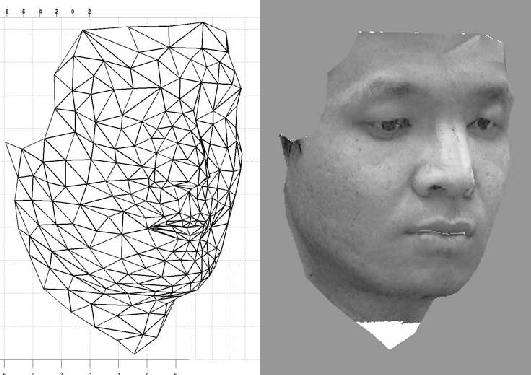  

**Example 02:**  
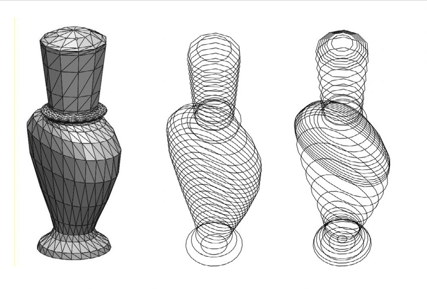  

**Example 03:**  
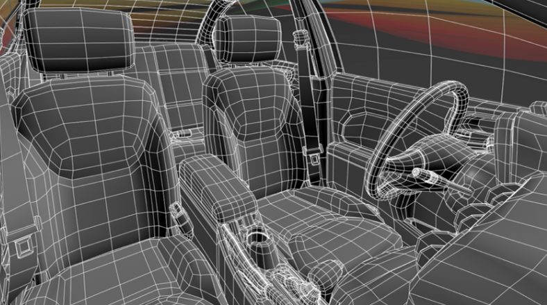  

**NOTE:**  
The image above doesn't represent **meshes of triangles**, represent **quadrilateral**. However, a render program convert quadrilateral to **meshes of triangles** when creates a 3D image.

**Quadrilateral review:**  
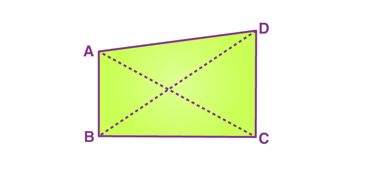  

---

## Meshes of triangles quantity

> The **meshes of triangles** <u>quantity</u> used to create 3D object has impact.

For example, see images below:

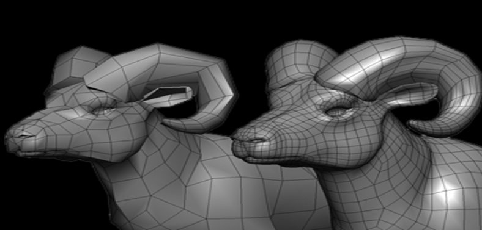  

> **NOTE:**  
> - See that how much more **meshes of triangles** are used, more fidelity has a 3D image.
> - The amount used must be observed according to the Hardware that will be used to generate the image.
>   - The more triangle meshes used, the more computational resources are required.

---

## Triangles are represented by vertices (Vertex, Edge and Face)

Triangles in **meshes of triangles** are represented by **vertices (vertex)**, for example, see the image below:

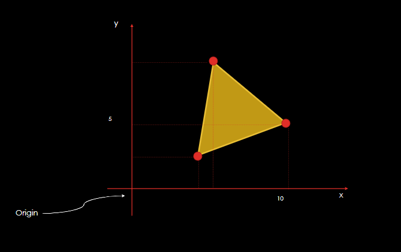  

> **NOTE:**
> The most basic a vertex <u>has</u> is a **position** in a Three-Dimensional space.

A vertex can have others attributes like:

 - Color;
 - Vector;
 - Texture...

**NOTE:**  
For example, I can add an image to the vertex and each point of a vertex has a mapping to the image (Like meshes of triangles).

To finalize:

 - **Two vertex:**
   - Define an edge (aresta).
 - **Three (or more) vertex:**
   - Define a face (or triangle face).
     - Each face has two side (Front and Back)

For example, see the cubes below representing **<u>vertices</u>**, **<u>edges</u>** and **<u>faces</u>**

**Vertices examples:**  
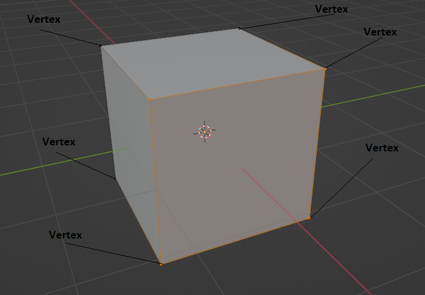  
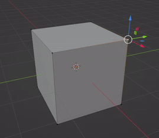  

**Edges examples:**  
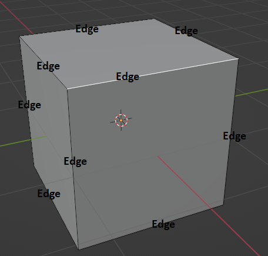  
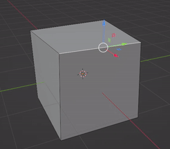  

**Faces examples:**  
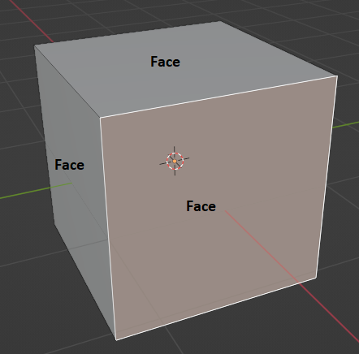  
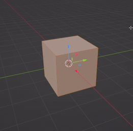  

---

## Triangle coordinates

> A Triangle can be described in **<u>various coordinates</u>**.

 - Local;
 - Global;
 - Camera...

For example, see the image below to understand:

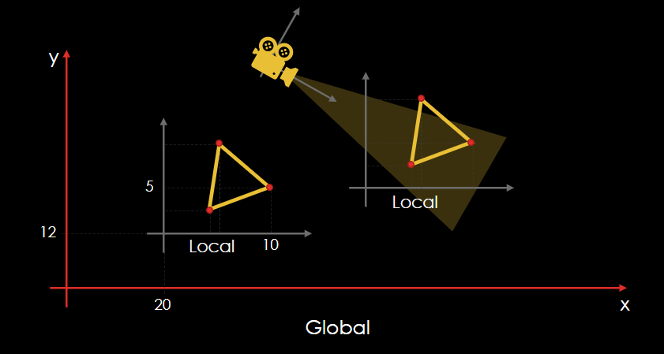  

**NOTE:**  
See that the same triangle has **many coordinates** (Loca, Global and Camera).

---

## Coordinates Systems: Left-handed​ and Right-handed​ 

Exists two most common coordinate systems used in 3D graphics:

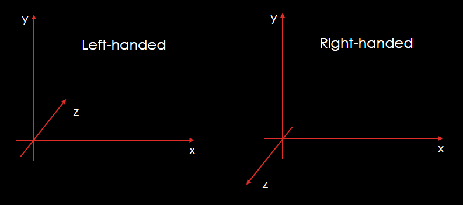  

To understand more easy use you hand to compare:

  

> **NOTE:**  
> - See that <u>your thumb will always indicate the x-axis pointing to the right</u>:
>   - The palm of your right hand will have to face your face.
> - Your index finger will always be the y-axis.
> - Middle finger is the z-axis

---

**REFERENCES:**  
[Computação Gráfica | Aula 01 - Conceitos Básicos | Cores | Luz | Visão | Ilusão 3D | Pipeline | APIs](https://www.youtube.com/watch?v=6M5M_UhnXPc)

---

Ro**drigo** **L**eite da **S**ilva - **drigols**
