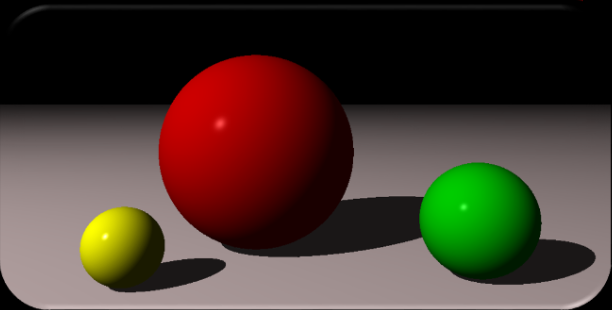

# Basic Concepts

## Contents

 - [Intro to Object model and Light model in Computer Graphics](#models)

---

## Intro to Object model and Light model in Computer Graphics

In a simplified form, a **Computer Graphics** consists in:

 - **Get:**
   - An **object model** <u>in a scene</u>:
     - Geometry description and how he reflects lights.
   - A **light model** <u>emitted by a scene</u>:
     - Light sources descriptions and your directions.
 - **And produce:**
   - A particular scene visualization:
     - The light that hits the camera.

For example, see image below:

  

See that we have:

 - **Object model:**
   - Spheres
 - **Light model:**
   - Light in left top camera.

---

**REFERENCES:**  
[Computação Gráfica | Aula 01 - Conceitos Básicos | Cores | Luz | Visão | Ilusão 3D | Pipeline | APIs](https://www.youtube.com/watch?v=6M5M_UhnXPc)

---

Ro**drigo** **L**eite da **S**ilva - **drigols**
