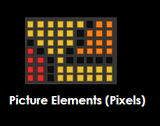
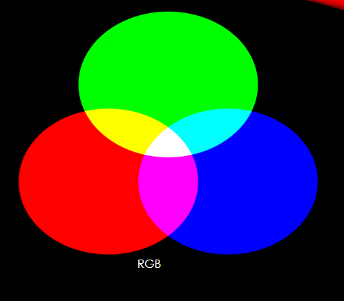

# Colors

## Contents

 - [Color system](#color-system)
 - [Color normalization](#color-normalization)

---

<div id="color-system"></div>

## Color system

Computer monitors emit light through every pixel:

> Pixel comes from **Picture Element**.

  

The emitted light is a mixture of different color intensities:

 - Red
 - Green
 - Blue

See the image below to understand more easily:

  

> **NOTE:**  
> - Each **Picture Element (pixel)** has three colors to emit: Red, Green and Blue.
> - You can manipulate each **Picture Element (pixel)** color (Red, Green, Blue) intensity to generate another different color.

For example:

 - **Green + Red:**
   - generate **Yellow** color
 - **Red + Blue:**
   - generate **Pink** color
 - **Blue + Green:**
   - generate **Cyan (Ciano)** color
 - **Green + Red + Blue:**
   - generate **White** color.

**NOTE:**  
A **Picture Element (pixel)** also can emit no colors, <u>generating **Black** color</u>.

---

<div id="color-normalization"></div>

## Color normalization

> **NOTE:**
> The maximum light intensity emitted varies between monitors.

It is useful to use a **normalized track [0 - 1]**:

 - **0** denotes no light.
 - **1** denotes maximum intensity.

For example:

```
RGB = (0.25, 0.67, 1.0) 
```

It means:

 - 25% **Red** light intensity;
 - 67% **Green** light intensity;
 - 100% **Blue** light intensity.

---

**REFERENCES:**  
[Computação Gráfica | Aula 01 - Conceitos Básicos | Cores | Luz | Visão | Ilusão 3D | Pipeline | APIs](https://www.youtube.com/watch?v=6M5M_UhnXPc)

---

Ro**drigo** **L**eite da **S**ilva - **drigols**
