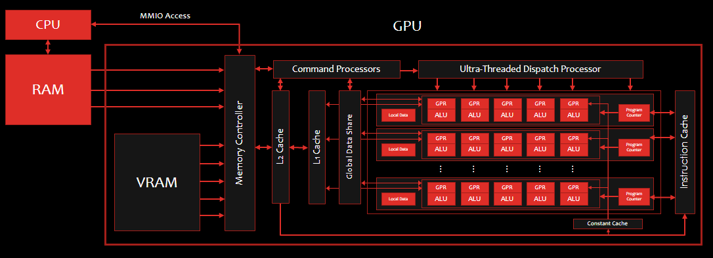

# GPU

## Contents

 - [Intro to GPU](#intro)
 - **Tips & Tricks:**
   - [ALU of CPU vs. ALU of GPU](#cpu-gpu-alu)

---

## Intro to GPU

> A GPU is a **Matrix** <u>of</u> **parallel processors**.

**But, what does a GPU process?**

 - Vertices;
 - Edges;
 - Faces;
 - Pixels...

For example, see the image below represents **GPU schema** (that schema can be different depending on GPU mark):

  

**NOTE:**  
See that the **GPU** is formed by many **ALU (arithmetic logic unit)**.

**What is the advantage?**

> **NOTE:**  
> This allows **parallel processing**.

For example, you can use each **ALU of GPU** to work with different pixels in parallel.

---

## ALU of CPU vs. ALU of GPU

 - **ALU of <u>CPU</u>:**
   - Created to works with differents types of operations (generic form/approach):
     - Add;
     - Sub;
     - Multi;
     - Div;
     - Bitwise;
     - Comparation;
     - Bit Shifting...
 - **ALU of <u>GPU</u>:**
   - Have less operations compared with ALU of CPU.
   - Created to work with specific tasks (specific form/approach).

---

**REFERENCES:**  
[Computação Gráfica | Aula 01 - Conceitos Básicos | Cores | Luz | Visão | Ilusão 3D | Pipeline | APIs](https://www.youtube.com/watch?v=6M5M_UhnXPc)

---

Ro**drigo** **L**eite da **S**ilva - **drigols**
