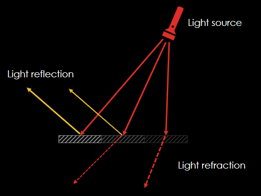
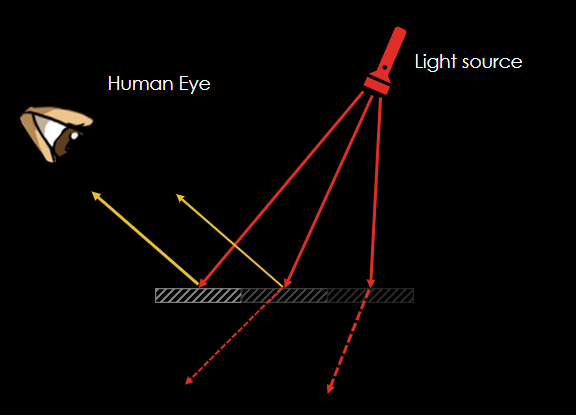

# Light & Vision

## Contents

 - [Light Behavior](#light-behavior)
 - [Light source](#light-source)
 - [Light intensity & Vision](#light-intensity)
 - [Eye & Camera sensor](#eye-camera-sensor)

---

## Light Behavior

> **Light behaves** <u>like a wave</u> and <u>like a particle</u>.

 - **Initially there was a big discussion among scientists about whether the "light" was a <u>wave</u> or a <u>particle</u>:**
   - Some experiments showed that **light** was made up of <u>waves</u>;
   - And other experiments showed that **light** was made of <u>particles</u>.

> **NOTE:**  
> To solve this problem, scientist **Albert Einstein** showed that light is a <u>wave of particles</u>, called **photons**.

---

## Light source

> As we know light is a <u>wave of particles</u> called **photons**. 

These photons:

 - Move in a <u>straight line</u>;
 - Are <u>reflected</u> off mirrored surfaces;
 - They are <u>refracted</u> on translucent surfaces.

For example, see the image below to understand more easily:

  

**See that the light (photons):**

 - Move straight;
 - Depending on the surface:
   - Mirrored surfaces:
     - Light (photons) are <u>reflected</u>.
   - Translucent surfaces:
     - Light (photons) are <u>refracted</u>.

> **NOTE:**
> Another observation, is that, <u>a light source emits energy (photons) equally in all directions</u>​.

---

## Light intensity & Vision

> All light has an **intensity**, which is <u>the number of photons emitted per second</u>.

**NOTE:**
Our vision is based on the photons of light that hit our eyes. That is, the more photons emitted, the more light we receive.

**For example, imagine you are going exit from your house and see a blue car:**  
  

> **Why you can see the car?**

**NOTE:**  
You can see the car because the **light (photons)** hit the *car* and are <u>reflected</u> to your eye.

**For example, see the image below to understand more easily:**  

 - The **more light (photons) intensity** the *better* you see the car;
 - The **less light (photons) intensity** the *worse* you see the car.

> **NOTE:**  
> Therefore, at night we see less, because less light (photons) is being reflected in our eyes.

**Another example, do you know why some people knock on glass doors without seeing properly?**  
  

> **NOTE:**  
> That's because the glass door is <u>translucent surfaces</u> and **the light (photons) is less reflected in your eyes**.

---

## Eye & Camera sensor

> The Eye and the camera sensor respond to light in a similar way. Both sum (integrate) the received photons over a period of time.

 - **Eye:**
   - The cell sends a signal when the accumulated **light (photons)** reaches a certain level.
 - **Camera:**
   - The time is set by the shutter aperture.

---

**REFERENCES:**  
[Computação Gráfica | Aula 01 - Conceitos Básicos | Cores | Luz | Visão | Ilusão 3D | Pipeline | APIs](https://www.youtube.com/watch?v=6M5M_UhnXPc)

---

Ro**drigo** **L**eite da **S**ilva - **drigols**
