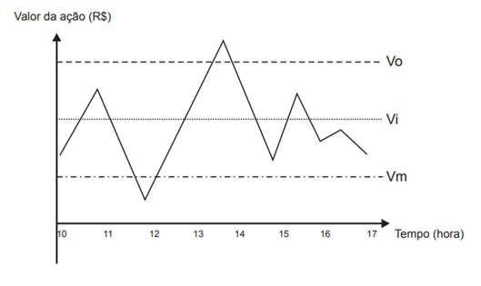
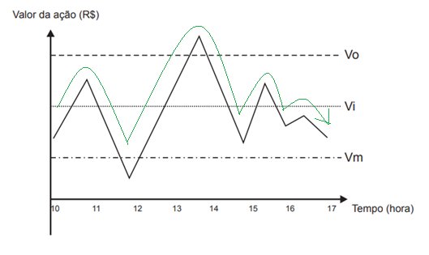
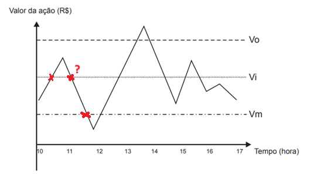
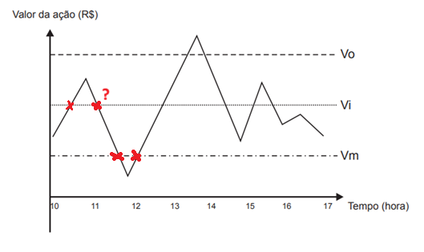

# ENEM (Matemática)

> Resolução das questões de **Matemática** do *ENEM* por ano.

## Conteúdo

 - **2015:**
   - [`QUESTÃO 136`](#2015-q136)
<!---
[WHITESPACE RULES]
- "100" ANO DA PROVA
- "10" MESMO ANO
--->

<!--- ( 2015 ) --->

---

## `QUESTÃO 136`

Um investidor inicia um dia com x ações de uma empresa. No decorrer desse dia, ele efetua apenas dois tipos de operações, comprar ou vender ações. Para realizar essas operações, ele segue estes critérios:

- I. vende metade das ações que possui, assim que seu valor fica acima do valor ideal (Vi);
- II. compra a mesma quantidade de ações que possui, assim que seu valor fica abaixo do valor mínimo (Vm);
- III. vende todas as ações que possui, quando seu valor fica acima do valor ótimo (Vo).

O gráfico apresenta o período de operações e a variação do valor de cada ação, em reais, no decorrer daquele dia e a indicação dos valores ideal, mínimo e ótimo.

Quantas operações o investidor fez naquele dia?

- **A** 3
- **B** 4
- **C** 5
- **D** 6
- **E** 7

RESPOSTA

 

Para resolver essa questão nós precisamos analisar a linha temporal desse gráfico, andando da esquerda para a direita:

  

**NOTE:**  
Sempre que o gráfico passar (cruzar) por uma dessas linhas temporais (Vo, Vi, Vm), podemos contar uma operação (dependendo da regra).

 - **No início o nosso investidor terá `x ações`.**

> **"vende metade das ações que possui, assim que seu valor fica acima do valor ideal (Vi);"**

  

No ponto acima nós já vendemos a metade das ações:

 - **Ou seja, nosso investidor terá `x/2` ações no momento.**
 - **E foi feita a primeira operação.**

  

**NOTE:**  
Nesse novo ponto nenhuma regra se aplica porque ainda estamos na regra anterior:

> **"vende metade das ações que possui, assim que seu valor fica acima do valor ideal (Vi);"**  
> `"assim" que seu valor fica acima do valor ideal (Vi)`, ou seja, ainda estamos na regra anterior.

Continuando....

  

> **compra a mesma quantidade de ações que possui, assim que seu valor fica abaixo do valor mínimo (Vm);**

Como a nossa linha temporal cruzou (Vm) agora nós vamos ter a seguinte situação:

 - **O investidor terá `x ações` novamente:**
   - Isso porque ele comprou + `x/2` e ficou com `x`.
 - **Foram feitas 2 operações, até o momento.**

  

Na linha temporal acima nenhuma regra se aplica e continuamos na nossa linha temporal....

  

Agora, novamente nós passamos pelo a regra:

> **vende metade das ações que possui, assim que seu valor fica acima do valor ideal (Vi);**

Ou seja:

 - **O investidor terá `x/2 ações`, novamente;**
 - **Foram feitas 3 operações, até o momento.**

Continuando...

  

Agora, nós entramos na seguinte regra:

> **vende todas as ações que possui, quando seu valor fica acima do valor ótimo (Vo).**

Ficaremos na seguinte situação:

 - **O investidor venderá `x/2 ações` (tudo o que tinha);**
 - **Foram feitas 4 operações, até o momento.**

Mais tarde, o gráfico volta a ultrapassar `Vi`, mas ele já não possui ações. Não existe metade positiva para vender, então não ocorre nova operação:

  

Logo, como não temos mais ações para vender foram feitas no total: `4 operações`

**RESPOSTA:**  
Letra `B`.

---

**Rodrigo** **L**eite da **S**ilva - **rodrigols89**

 

RESPOSTA

  

