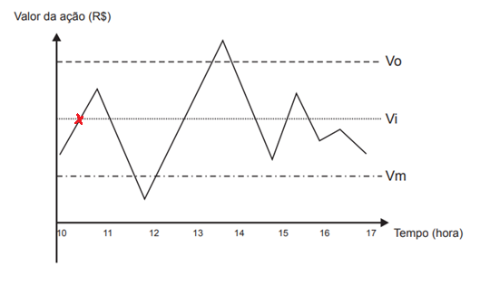
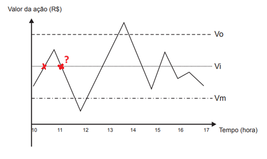
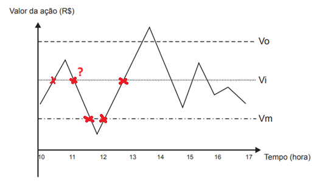
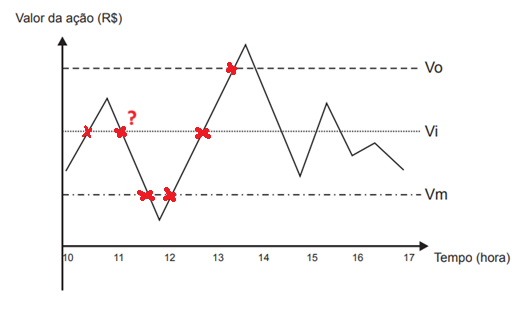
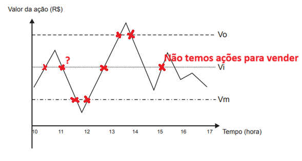
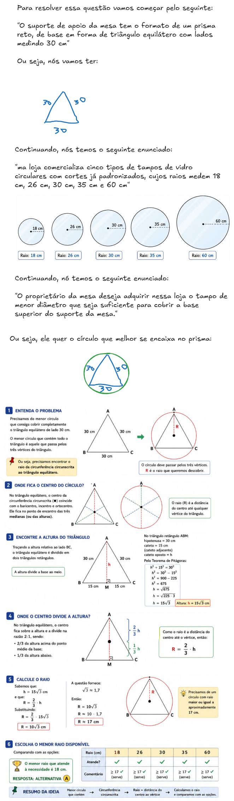

# ENEM 2015

> Resolução das questões de **Matemática** do *ENEM* de 2015.

## Conteúdo

- [`QUESTÃO 136`](#2015-q136)
- [`QUESTÃO 137`](#2015-q137)
- [`QUESTÃO 138`](#2015-q138)
- [`QUESTÃO 139`](#2015-q139)
- [`QUESTÃO 140`](#2015-q140)
- [`QUESTÃO 141`](#2015-q141)
- [`QUESTÃO 142`](#2015-q142)
- [`QUESTÃO 143`](#2015-q143)
- [`QUESTÃO 144`](#2015-q144)
- [`QUESTÃO 145`](#2015-q145)
- [`QUESTÃO 146`](#2015-q146)
- [`QUESTÃO 147`](#2015-q147)
- [`QUESTÃO 148`](#2015-q148)
- [`QUESTÃO 149`](#2015-q149)
- [`QUESTÃO 150`](#2015-q150)
- [`QUESTÃO 151`](#2015-q151)
- [`QUESTÃO 152`](#2015-q152)
- [`QUESTÃO 153`](#2015-q153)
- [`QUESTÃO 154`](#2015-q154)
- [`QUESTÃO 155`](#2015-q155)
- [`QUESTÃO 156`](#2015-q156)
- [`QUESTÃO 157`](#2015-q157)
- [`QUESTÃO 158`](#2015-q158)
- [`QUESTÃO 159`](#2015-q159)
- [`QUESTÃO 160`](#2015-q160)
- [`QUESTÃO 161`](#2015-q161)
- [`QUESTÃO 162`](#2015-q162)
- [`QUESTÃO 163`](#2015-q163)
- [`QUESTÃO 164`](#2015-q164)
- [`QUESTÃO 165`](#2015-q165)
- [`QUESTÃO 166`](#2015-q166)
- [`QUESTÃO 167`](#2015-q167)
- [`QUESTÃO 168`](#2015-q168)
- [`QUESTÃO 169`](#2015-q169)
- [`QUESTÃO 170`](#2015-q170)
- [`QUESTÃO 171`](#2015-q171)
- [`QUESTÃO 172`](#2015-q172)
- [`QUESTÃO 173`](#2015-q173)
- [`QUESTÃO 174`](#2015-q174)
- [`QUESTÃO 175`](#2015-q175)
- [`QUESTÃO 176`](#2015-q176)
- [`QUESTÃO 177`](#2015-q177)
- [`QUESTÃO 178`](#2015-q178)
- [`QUESTÃO 179`](#2015-q179)
- [`QUESTÃO 180`](#2015-q180)
<!---
[WHITESPACE RULES]
- "20" MESMO ANO
--->

---

## `QUESTÃO 136`

Um investidor inicia um dia com x ações de uma empresa. No decorrer desse dia, ele efetua apenas dois tipos de operações, comprar ou vender ações. Para realizar essas operações, ele segue estes critérios:

- I. vende metade das ações que possui, assim que seu valor fica acima do valor ideal (Vi);
- II. compra a mesma quantidade de ações que possui, assim que seu valor fica abaixo do valor mínimo (Vm);
- III. vende todas as ações que possui, quando seu valor fica acima do valor ótimo (Vo).

O gráfico apresenta o período de operações e a variação do valor de cada ação, em reais, no decorrer daquele dia e a indicação dos valores ideal, mínimo e ótimo.

Quantas operações o investidor fez naquele dia?

- **A** 3
- **B** 4
- **C** 5
- **D** 6
- **E** 7

RESPOSTA

 

Para resolver essa questão nós precisamos analisar a linha temporal desse gráfico, andando da esquerda para a direita:

  

**NOTE:**  
Sempre que o gráfico passar (cruzar) por uma dessas linhas temporais (Vo, Vi, Vm), podemos contar uma operação (dependendo da regra).

 - **No início o nosso investidor terá `x ações`.**

> **"vende metade das ações que possui, assim que seu valor fica acima do valor ideal (Vi);"**

  

No ponto acima nós já vendemos a metade das ações:

 - **Ou seja, nosso investidor terá `x/2` ações no momento.**
 - **E foi feita a primeira operação.**

  

**NOTE:**  
Nesse novo ponto nenhuma regra se aplica porque ainda estamos na regra anterior:

> **"vende metade das ações que possui, assim que seu valor fica acima do valor ideal (Vi);"**  
> `"assim" que seu valor fica acima do valor ideal (Vi)`, ou seja, ainda estamos na regra anterior.

Continuando....

  

> **compra a mesma quantidade de ações que possui, assim que seu valor fica abaixo do valor mínimo (Vm);**

Como a nossa linha temporal cruzou (Vm) agora nós vamos ter a seguinte situação:

 - **O investidor terá `x ações` novamente:**
   - Isso porque ele comprou + `x/2` e ficou com `x`.
 - **Foram feitas 2 operações, até o momento.**

  

Na linha temporal acima nenhuma regra se aplica e continuamos na nossa linha temporal....

  

Agora, novamente nós passamos pelo a regra:

> **vende metade das ações que possui, assim que seu valor fica acima do valor ideal (Vi);**

Ou seja:

 - **O investidor terá `x/2 ações`, novamente;**
 - **Foram feitas 3 operações, até o momento.**

Continuando...

  

Agora, nós entramos na seguinte regra:

> **vende todas as ações que possui, quando seu valor fica acima do valor ótimo (Vo).**

Ficaremos na seguinte situação:

 - **O investidor venderá `x/2 ações` (tudo o que tinha);**
 - **Foram feitas 4 operações, até o momento.**

Mais tarde, o gráfico volta a ultrapassar `Vi`, mas ele já não possui ações. Não existe metade positiva para vender, então não ocorre nova operação:

  

Logo, como não temos mais ações para vender foram feitas no total: `4 operações`

**RESPOSTA:**  
Letra `B`.

**TÓPICO:**  
`Leitura de gráfico` e `Raciocínio sequencial`

---

## `QUESTÃO 137`

O tampo de vidro de uma mesa quebrou-se e deverá ser substituído por outro que tenha a forma de círculo. O suporte de apoio da mesa tem o formato de um prisma reto, de base em forma de triângulo equilátero com lados medindo 30 cm.

Uma loja comercializa cinco tipos de tampos de vidro circulares com cortes já padronizados, cujos raios medem 18 cm, 26 cm, 30 cm, 35 cm e 60 cm. O proprietário da mesa deseja adquirir nessa loja o tampo de menor diâmetro que seja suficiente para cobrir a base superior do suporte da mesa.

Considere 1,7 como aproximação para √3.

O tampo a ser escolhido será aquele cujo raio, em centímetros, é igual a

- A 18.
- B 26.
- C 30.
- D 35.
- E 60.

RESPOSTA

 

  

**TÓPICO:**  
`Geometria plana` - `Triângulo equilátero` e `Circunferência circunscrita`.

---

**Rodrigo** **L**eite da **S**ilva - **rodrigols89**

 

**RESPOSTA:**  
...

**TÓPICO:**  
...

