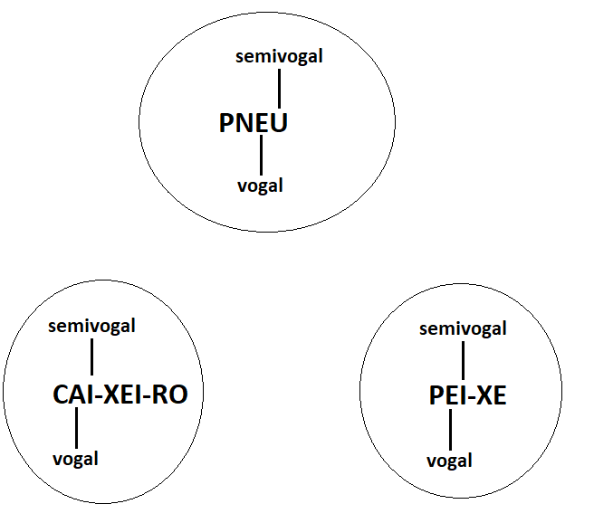

# Fonologia (Fonética)

## Conteúdo

 - **Teoria:**
   - **Fonemas:**
     - 
 - **Questões de Concurso:**
   - **Muito Fáceis:**
     - [FGV - 2017 - Auxiliar (Pref Salvador)/Desenvolvimento Infantil](#mf-q01)
     - [FGV - 2014 - Agente de Defesa Civil (Osasco)](#mf-q02)
     - [FGV - 2014 - Motorista (Osasco)/Transportes Leves](#mf-q03)
   - **Fáceis:**
   - **Médias:**
   - **Dificeis:**
<!--- 
[WHITESPACE RULES]
- Same topic = "10" Whitespace character.
- Different topic = "50" Whitespace character.
--->

<!--- (  Teoria ) --->

---

## O que é um Fonema?

> Fonema é o som de cada letra ou dígrafo ().

Por exemplo:

| Palavra | nº de Letras | nº de Fonemas |
| -------- | --- | --- |
| Cachorro | 8 | 7 | 

---

## Vogal vs. Semivogal

 - **Vogal:**
   - Uma **"vogal"** é a *"base da sílaba"* e *"soa mais forte nas palavras"*.
 - **Semivogal:**
   - Já uma **"semivogal"** *"soa mais fraca"* e é *"pronunciada mais rapidamente"*.
   - Uma **"semivogal"** sempre se apoia em uma **"vogal"**.

Por exemplo:

  

---

     - [O que é um Fonema?](#oqueeumfonema)
     - [Vogal vs. Semivogal](#vogal-vs-semivogal)
       - DICA: A letra "A" sempre é vogal
     - 

<!--- (  QdQ/Muito Fáceis ) --->

---

## FGV - 2017 - Auxiliar (Pref Salvador)/Desenvolvimento Infantil

Assinale a opção que indica a separação silábica errada.

 - **(A)** Meados = me-a-dos.
 - **(B)** Passado = pas-sa-do.
 - **(C)** Desesperadamente = des-es-pe-ra-da-men-te.
 - **(D)** Fantasma = fan-tas-ma.

**RESPOSTA:** ACEITEI!  
A resposta é a letra **"D"**.

 - **Dígrafo:**
   - Um dígrafo é a união de duas letras que representam um único som na língua portuguesa, como "ch" ou "lh".
 - O **"s"** da segunda sílaba só ficaria na primeira se houvesse o dígrafo **"ss"**, como ocorre na palavra **"passado": pas-sa-do**:

**REFERÊNCIA:**  
[FGV - 2017 - Auxiliar (Pref Salvador)/Desenvolvimento Infantil](https://www.tecconcursos.com.br/questoes/639863)

---

## FGV - 2014 - Agente de Defesa Civil (Osasco)

Na palavra “fluxo”, a pronúncia da letra X é a mesma que ocorre em:

 - **(A)** - vexame;
 - **(B)** - coxinha;
 - **(C)** - tóxico;
 - **(D)** - exame;
 - **(E)** - puxar.

**RESPOSTA:** ACEITEI!  
A resposta é a letra **"C"**.

 - **fluxo::**
   - Na palavra “fluxo”, a letra “x” tem som de ks: f-l-u-k-s-o.
   - Nesse caso, temos 5 letras (f, l, u, x, o), mas 6 fonemas (f, l, u, k, s, o).
 - **tóxico:**
   - Na palavra “tóxico”, a letra X tem som de ks: t-ó-k-s-i-c-o.
   - Nesse caso, temos 6 letras (t, o, x, i, c, o), mas 7 fonemas (t, o, k, s, i, c, o).

**REFERÊNCIA:**  
[FGV - 2014 - Agente de Defesa Civil (Osasco)](https://www.tecconcursos.com.br/questoes/281928)

---

## FGV - 2014 - Motorista (Osasco)/Transportes Leves

A palavra abaixo cuja separação silábica está correta é:

 - **(A)** - his-tó-ria;
 - **(B)** - té-cni-cas;
 - **(C)** - pes-soas;
 - **(D)** - se-gu-ra-nça;
 - **(E)** - de-ter-mi-na-sse.

**RESPOSTA:** ACEITEI!  
Em "história", o acento tônico recai na penúltima sílaba, sendo quanto à tonicidade um vocábulo paroxítono. Silabicamente, "história" distribui-se da seguinte maneira: his - tó - ria.

**REFERÊNCIA:**  
[FGV - 2014 - Motorista (Osasco)/Transportes Leves](https://www.tecconcursos.com.br/questoes/282369)

---

## FGV - 2014 - Agente Funerário (Osasco)

No vocábulo “exigências”, a pronúncia da letra **"X"** corresponde a **"Z"**; a palavra com essa letra que tem sua pronúncia identificada corretamente é:

 - **(A)** - tóxico (=CH);
 - **(B)** - sexual (=SS);
 - **(C)** - texto (=CS);
 - **(D)** - externo (=CS);
 - **(E)** - vexame (CH).

**RESPOSTA:** ERREI!  
Não prestei atenção na questão, onde cada resposta tinha uma pronuncia relacionada. Por exemplo:

 - **tóxico (=CH):** ERRADO!
   - Número de letras: 5 (t-e-x-t-o)
   - Número de fonemas: 6 (/t-e-k-s-t-o/)
 - **sexual (=SS):** ERRADO!
   - Número de letras: 7 (s-e-x-u-a-l)
   - Número de fonemas: 6 (/s-e-k-s-u-aʊ̯/

 - **:** Não tem som de **"SS"**, mas sim de **"k"** e **"s"**.
 - **texto (=CS):** Tem som de **""**.

 - **(B)** - sexual (=SS);
 - **(C)** - texto (=CS);
 - **(D)** - externo (=CS);
 - **(E)** - vexame (CH).

vexame (CH). == Correta.

**REFERÊNCIA:**  
[FGV - 2014 - Agente Funerário (Osasco)](https://www.tecconcursos.com.br/questoes/282866)

<!---

---

## x

**RESPOSTA:**  
???

**REFERÊNCIA:**  

--->

---

**Rodrigo** **L**eite da **S**ilva
