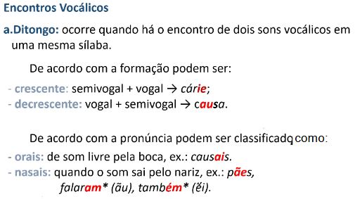
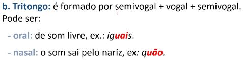
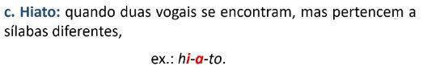

# Fonética (Fonemas, Dígrafos, Encontros Consonantais, Vocálicos). Separação Silábica

## Conteúdo

 - **Fonemas:**
   - [`O que é um Fonema, Letra ou Grafema?`](#oqeuflog)
   - [`Qual a diferença de "vogal" e "semivogal"?`](#qddves)
 - **Ditongo:**
   - [`O que é um "ditondo" e com se classifica?`](#oqeudecsc)
 - **Tritongo:**
   - [`O que é um "tritongo" e com se classifica?`](#oqeutecsc)
 - **Hiato:**
   - [`O que é um "hiato" e com se classifica?`](#oqeuhecsc)
 - **Encontro Consonantal:**
   - [`O que é um "Encontro consonantal"?`](#oqeuec)
 - **Dígrafo:**
   - [`O que é um "dígrafo"?`](#oqeu-digrafo)
 - **Dífono:**
   - [`O que é um "dífono"?`](#oqeu-difono)
   - [`Quais os sons (fonemas) da letra "x"?`](#qosfdlx)
 - **Separação Silábica:**
   - [`Regras de separação silábica`](#regras-de-separacao)
 - **prosódia:**
   - [`O que é "prosódia"?`](#intro-to-prosodia)
 - **Ortoépia:**
   - [`O que é "ortoépia"?`](#intro-to-ortoepia)
<!---
[WHITESPACE RULES]
- "20" Tópicos diferentes.
- "5" Mesmo tópico.
--->

---

## `O que é um Fonema, Letra ou Grafema?`

 - **1. Fonema:** É o elemento sonoro mais simples da língua, **o que se ouve**.
   - Ex.: **mala** — 4 fonemas: /m/ /a/ /l/ /a/
 - **2. Letra ou Grafema:** Não pode ser confundida com fonema, pois ela é só uma representação gráfica de um som e o fonema é aquilo que se ouve.
   - Ex.: **carro** apresenta:
     - 5 letras: c-a-r-r-o (o que se vê) e
     - 4 fonemas: /K/ /a/ /r/ /ô/ (o que se ouve).

---

## `Qual a diferença de "vogal" e "semivogal"?`

- **Vogal:**
    - Uma **"vogal"** é a *"base da sílaba"* e “*soa mais forte nas palavras"*.
- **Semivogal:**
    - Uma **"semivogal"** *"soa mais fraca"* e é *"pronunciada mais rapidamente"*.
    - Uma **"semivogal"** sempre se apoia em uma **"vogal"**.

---

## `O que é um "ditondo" e com se classifica?`

  

---

## `O que é um "tritongo" e com se classifica?`

  

---

## `O que é um "hiato" e com se classifica?`

  

|                            |                             |                           |
| -------------------------- | --------------------------- | ------------------------- |
| **cair:** ca-ir            | **sair:** sa-ir             | **juiz:** ju-iz           |
| **ruim:** ru-im            | **raiz:** ra-iz             | **rainha:** ra-i-nha      |
| **bainha:** ba-i-nha       | **gratuito:** gra-tu-i-to   | **fluido:** flu-i-do      |
| **construir:** cons-tru-ir | **destruir:** des-tru-ir    | **possuir:** pos-su-ir    |
| **reunir:** re-u-nir       | **coordenar:** co-or-de-nar | **cooperar:** co-o-pe-rar |

---

## `O que é um "Encontro consonantal"?`

> Encontro consonantal é o **encontro de sons consonantais dentro da palavra**.

Podem ser:

- Pertencem à mesma sílaba, ex.: pro — ble — ma.
- Pertencem a sílabas diferentes: dig — no.

> **ATENÇÃO!**  
> Encontro consonantal **não é** o encontro de duas letras consoantes, mas de **dois sons consonantais.**

---

## `O que é um "dígrafo"?`

**Dígrafo: duas letras → um fonema**  
Ca**ch**o**rr**o, **Que**ijo, **Gue**to, **Qui**tanda, E**xc**e**ss**o.

Os **dígrafos** podem ser classificado em:

 - **CONSONANTAL:**
   - ch, lh, nh, rr, ss, sc, sç, xc, xs, qu, gu
 - **VOCÁLICO:**
   - am, an, em, en, im, in, om, on, um, un

**ATENÇÃO!**  
Os **grupos GU e QU geralmente formam dígrafos quando o U não é pronunciado.**

Por exemplo:

 - **QUITANDA:**
   - Por exemplo, em “quitanda”, ao pronunciar a palavra, percebe-se que o som do U do grupo QU não aparece.
   - O som que se ouve é apenas o do K, portanto, “QU” representa um único fonema, configurando um dígrafo.
   - Se a palavra fosse escrita de forma fonética, seria algo como “kitãda”, eliminando o U, já que ele não tem som.
 - **TRANQUILO:**
   - Já em “tranquilo”, a situação é diferente. Ao pronunciar a palavra com atenção, nota-se que o U tem som.
   - Fala-se claramente “trãkuilo”.
   - Aqui, tanto o U quanto o I são audíveis.

---

## `O que é um "dífono"?`

**Dífono: uma letra → dois fonemas**  
Tá**x**i, E**x**ato, Tóra**x**, Sexo, Fi**x**o

 - **CONSONANTAL:**
   - x → /ks/, /gz/, /ss/
 - **EXEMPLOS:**
   - táxi → /k/ + /s/
   - exato → /g/ + /z/
   - sexo → /k/ + /s/
   - tórax → /k/ + /s/
   - fixo → /k/ + /s/

---

## `Quais os sons (fonemas) da letra "x"?`

Costuma-se atribuir ao "x" os seguintes sons/fonemas (considerando também as palavras em que o "x" não tem som algum):

- (1) representa duas consoantes (/ks/): **táxi, conexão, maxilar**.
- (2) representa o dígrafo /ss/: **máximo, sintaxe, próximo**.
- (3) representa a consoante /z/: **inexorável, exame, êxito**.
- (4) representa o dígrafo /ch/: **abacaxi, paixão, xarope**.
- (5) representa a consonante /s/: **exposição, êxtase, excluído.**
- (6) tem apenas valor etimológico; não representa fonema algum: **exsudação** (/esu…/), **exceção** (/ese…/), **exsicar** (/esi…).

---

## `Regras de separação silábica`

> Aqui estão algumas regras de **"separação silábica"**.

### `SEPARAM-SE`

- **HIATO:**
    - co-o-pe-rar;
- **ENCONTRO CONSONANTAL IMPERFEITO:**
    - dig-no
    - ca-rac-te-ri-za-do
- **DÍGRAFOS:**
    - rr, ss, sc, sç, xc, xs

### `NÃO SE SEPARAM`

- **DITONGO:**
    - coi-sa
- **TRITONGO**
    - i-guais
- **ENCONTRO CONSONANTAL PERFEITO:**
    - pro-va
- **DÍGRAFOS:**
    - ch, lh, nh, gu, qu, am, em, im, om, an, en, in, on, um

---

## `O que é "prosódia"?`

A **prosódia** é a parte da gramática que `estuda a acentuação tônica correta das palavras`.

| **Prosódia (sílaba tônica correta → errada)** |
| --- |
| ru-**bri**-ca → *NÃO* **rú**-bri-ca |
| re-**cor**-de → *NÃO* **ré**-cor-de |
| fi-lan-**tró**-po → *NÃO* fi-**lân**-tro-po |

---

## `O que é "ortoépia"?`

A **ortoépia** é a parte da gramática que `estuda a pronúncia correta das palavras`.

| **Ortoépia (pronúncia correta)** |
| --- |
| **mortadela** → *NÃO* “mortandela” |
| **beneficente** → *NÃO* “beneficiente” |
| **privilégio** → *NÃO* “previlégio” |
| **lagartixa** → *NÃO* “largatixa” |
| **estupro** → *NÃO* “estrupo” |
| **prazeroso** → *NÃO* “prazeiroso” |
| **paralelepípedo** → *NÃO* “paralepípedo” |
| **frustrado** → *NÃO* “frustado” |

---

**Rodrigo L**eite da **S**ilva - **rodrigols89**
