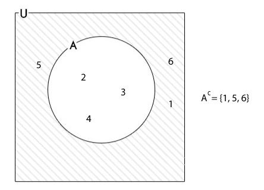

# Teoria dos Conjuntos

## Conteúdo

 - **Fundamentos:**
   - [`Complementar de um conjunto`](#complement-of-sets)
 - **Interseção de Conjuntos:**
   - [`Como resolver um problema de "Intersecções de Conjuntos"`](#crupdic)
 - [**REFERÊNCIA**](#ref)
<!---
[WHITESPACE RULES]
- Same topic = "10" Whitespace character.
- Different topic = "200" Whitespace character.
--->


<!--- ( Fundamentos ) --->

---

<div id="complement-of-sets"></div>

## `Complementar de um conjunto`

O complementar de um conjunto **"A"** em *relação a um conjunto universal U* é o conjunto de todos os elementos em **"U"** que não estão em **"A"**.

> **NOTAÇÃO:**  
> É denotado por `A’`.

Por exemplo:

  


<!--- ( Interseção de Conjuntos ) --->

---

<div id="crupdic"></div>

## `Como resolver um problema de "Intersecções de Conjuntos"`

Para resolver um problema de `Intersecções de Conjuntos` nós seguimos os seguintes passos:

- Encontrar os elementos que não aparecem em nenhum grupo (se tiver);
- Aplicar o *"Princípio da Inclusão"*;
- Aplicar o *"Princípio da Exclusão"*;
- Por fim, precisamos adicionar de volta os elementos que foram removidos mais de uma vez no *"Princípio da Exclusão"*.

## `EXEMPLO-01: (UFBA) Enquete sobre preferências esportivas`

Em uma enquete, várias pessoas foram entrevistadas acerca de suas preferências em relação a três esportes:

 - Volei (V);
 - Basquete (B);
 - Tênis (T).

Cujos dados estão indicados na tabela a seguir:

 - **ESPORTE / N DE PESSOAS:**
   - V / 300
   - B / 260
   - T / 200
   - V e B / 180
   - V e T / 130
   - B e T / 100
   - V, B e T / 50
   - Nenhum / 40

De acordo com esses dados, é correto afirmar que, nessa enquete, o número de pessoas entrevistadas foi:

 - a) 400
 - b) 440 
 - c) 490
 - d) 530
 - e) 570

Seguindo o que foi descrito na introdução, vamos `encontrar os elementos que não aparecem em nenhum grupo (se tiver);`:

```bash
NENHUM(40)
```

Agora, nós vamos apliar o **Princípio da Inclusão** que nada mais do que a `somar todos os grupos (categorias) individuais`:

```bash
NENHUM(40) + Volei(300) + Basquete(260) + Tênis(200)
```

> **PROBLEMA:**  
> Elementos que estão em mais de um conjunto foram *contados várias vezes*.

Para resolver esse problema de *contar várias vezes o mesmo elemento* vamos aplicar o **Princípio da Exclusão**, `subtraindo as interseções (removendo a contagens duplicadas)`:

```bash
NENHUM(40) + Volei(300) + Basquete(260) + Tênis(200) - V/B(180) - V/T(130) - B/T(100)
```

> **PROBLEMA:**  
> Elementos que estão nos três conjuntos foram subtraídos duas vezes além da conta, então devem ser somados de volta.

Para resolver esse problema, basta `adicionar a intersecção de todos os conjuntos (categorias)`:

```bash
NENHUM(40) + Volei(300) + Basquete(260) + Tênis(200) - V/B(180) - V/T(130) - B/T(100) + V/B/T(50)
```

Logo, o resultado será:

```bash
40 + 300 + 260 + 200 - 180 - 130 - 100 + 50 = 440
```

Uma maneira inteligente de resolver é somar todos os positivos e subtrair dos negativos:

```bash
(40 + 300 + 260 + 200 + 50) - (-180 - 130 - 100)
             850            -       410

 850
-410
 ---
 440
```

Logo, o número de pessoas entrevista foi **"440"**.

**RESPOSTA:**  
Opção `b`


<!--- ( REFERÊNCIA ) --->

---

<div id="ref"></div>

## REFERÊNCIA

 - **Cursos:**
   - [Licenciatura - Matemática](https://www.faculdadeunica.com.br/graduacao/ead/matematica-3080)
 - **Livros:**
   - [Fundamentos Matemáticos Para a Ciência da Computação](https://www.amazon.com.br/Fundamentos-Matem%C3%A1ticos-Para-Ci%C3%AAncia-Computa%C3%A7%C3%A3o/dp/8521614225)

---

**Rodrigo** **L**eite da **S**ilva - **rodrigols89**

<details>

<summary></summary>

<br/>

RESPOSTA

```bash

```

  

</details>
