# Sistemas de Numeração e Operações Fundamentais

## Conteúdo

- **Adição:**
  - [Como fazer adição com números que tem vírgula?](#add-w-comma)
- **Subtração:**
  - [Como aplicar o conceito de pegar emprestado na subtração?](#sub-with-borrow)
- **Divisão:**
  - [Quais são os compoenentes de uma divisão?](#div-components)
  - [Como terminar uma divisão que não terminou em zero?](#comma-rule)
  - [Divisão onde o dividendo tem mais de uma casa decimal](#div-more-units-01)
  - [Divisões que não são possíveis pegando apenas um digito do dividendo](#div-more-units-2)
  - [Divisão onde multiplicar qualquer número pelo divisor ultrapassar o dividendo](#elevator-rule)
  - [Como fazer divisão com números decimais?](#div-w-decimals)
- **Multiplicação:**
  - [Como fazer Multiplicação de números com vírgulas?](#cfmdncv)
<!---
[WHITESPACE RULES]
- Same topic = "20" Whitespace character.
- Different topic = "100" Whitespace character.
--->

<!--- ( Adição ) --->

---

## Como fazer adição com números que tem vírgula?

Por exemplo:

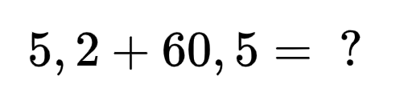  

RESPOSTA

 

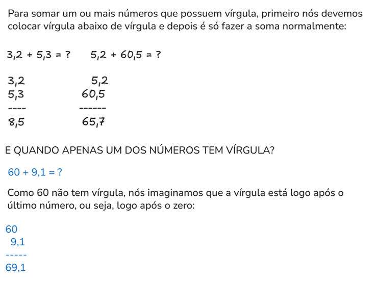  

<!--- ( Subtração ) --->

---

## Como aplicar o conceito de pegar emprestado na subtração?

> Como faz quando em uma subtração não é possível diminuir uma unidade, pois ela é menor do que o que queremos diminuir?

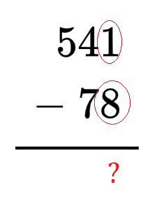  
<!---
\begin{array}{r}
  541 \\
- \ 78 \\
\hline
\end{array}
--->

RESPOSTA

 

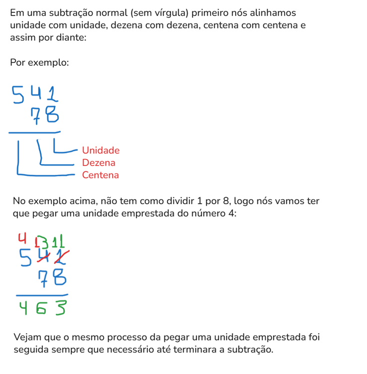  

<!--- ( Divisão ) --->

---

## Quais são os compoenentes de uma divisão?

RESPOSTA

 

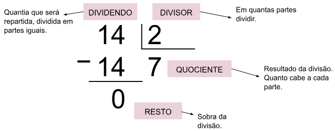  

---

## Como terminar uma divisão que não terminou em zero?

  

RESPOSTA

 

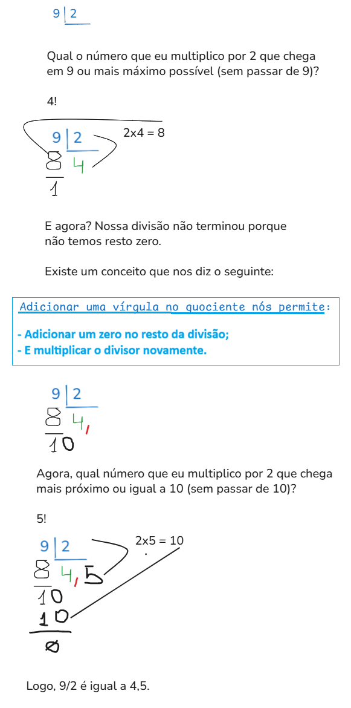  

---

## Divisão onde o dividendo tem mais de uma casa decimal

> **Como fazemos uma divisão, onde o dividendo tem mais de uma casa decimal?**

Por exemplo:

$438 \div 2$

RESPOSTA

 

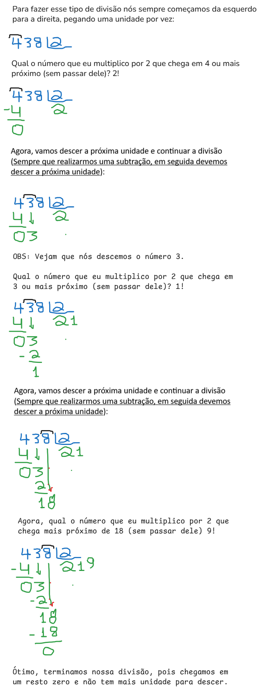  

---

## Divisões que não são possíveis pegando apenas um digito do dividendo

$5674 \div 20$

RESPOSTA

 

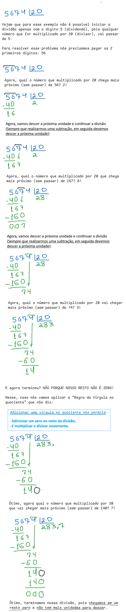  

---

## Divisão onde multiplicar qualquer número pelo divisor ultrapassar o dividendo

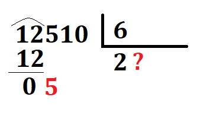  

**E agora?**  
Se nós multiplicarmos por 1 vai dá 6 que é maior do que 5.

RESPOSTA

 

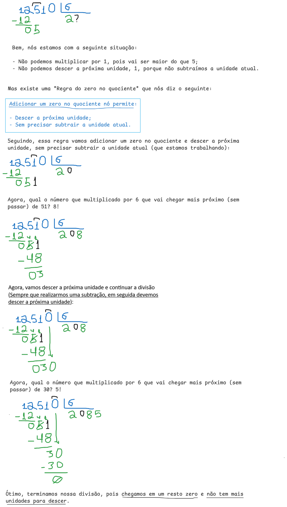  

---

## Como fazer divisão com números decimais?

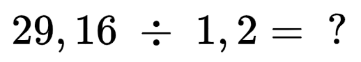  

RESPOSTA

 

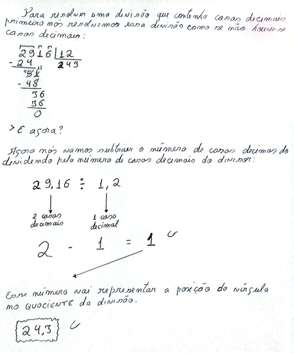  

<!--- ( Multiplicação ) --->

---

## Como fazer Multiplicação de números com vírgulas?

$3,18 \times 1,3$

e

$2,21 \times 5$

RESPOSTA

 

---

**Rodrigo** **L**eite da **S**ilva - **rodrigols89**
