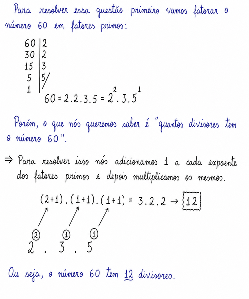
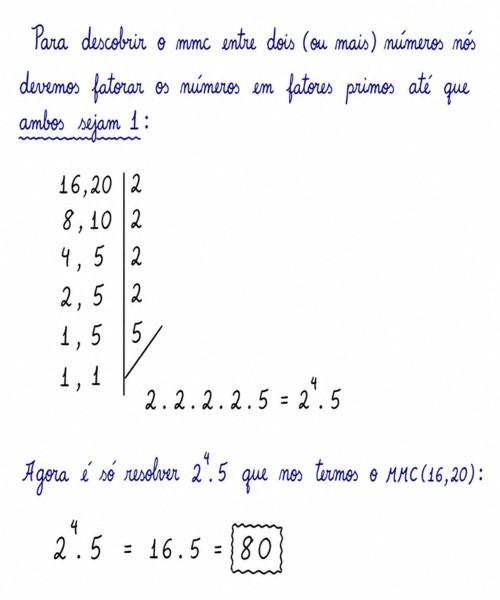
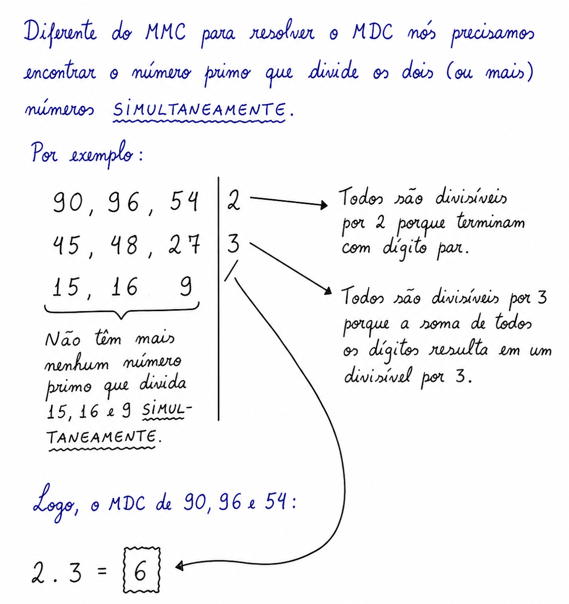

# Teoria dos Números

## Conteúdo

- **Fatoração "numérica"**
  - [`O que é uma "fatoração numérica" e quais problemas ela resolve?`](#numerical-factorization)
- **MMC (Mínimo Multiplo Comum):**
  - [`O que é "MMC (Mínimo Multiplo Comum)" e quais problemas ele resolve?`](#intro-to-mmc)
    - **Questões:**
      - [`Qual o mínimo múltiplo comum entre 16 e 20?`](#mmc-16-20)
      - [`(OBMEP – Adaptado) Encontro de dois ciclistas`](#obmep-encontro-de-dois-ciclistas)
      - [`Menor número inteiro de três algarismos divisível por 4, 8 e 10`](#mnidtadp-4-8-e-10)
 - **MDC (Máximo Divisor Comum):**
    - [`O que é "MDC (Máximo Divisor Comum)" e quais problemas ele resolve?`](#intro-to-mdc)
    - **Questões Abertas:**
      - [Qual o máximo divisor comum entre 90, 96 e 54?](#mdc-90-96-54)
      - [(OBMEP – Adaptado) Divisão de pedaços de rolos de arame](#obmep-rolos-de-arame)
- [**REFERÊNCIA**](#ref)
<!---
[WHITESPACE RULES]
- Same topic = "10" Whitespace character.
- Different topic = "100" Whitespace character.
--->


<!--- ( Fatoração "numérica" ) --->

---

<div id="numerical-factorization"></div>

## `O que é uma "fatoração numérica" e quais problemas ela resolve?`

Uma **Fatoração Numérica** é o processo de escrever um número como *produto (multiplicação)* de fatores menores, ou seja, quebrar algo em "peças multiplicativas".

Por exemplo:

```bash
36 = 2 × 2 × 3 × 3 = 2² × 3²
```

> **NOTE:**  
> Lembrando que essa fatoração é sempre utilizando números primos.

Por exemplo, vamos decompor o número **60** em fatores primos:

```bash
60 | 2
30 | 2
15 | 3
 5 | 5
 1
```

Ou seja, 60 também pode ser escrito como:

```bash
60 = 2 × 2 × 3 × 5
60 = 2² × 3¹ × 5¹
```

### `Quais problemas "fatoração numérica" pode resolver?`

Os problemas que podem ser resolvidos por fatoração são os seguintes:

 - Descobrir quantos (número total, não quais são) divisores um número tem;

### `Exemplo-01: Quantos divisores tem o número 60?`

<details>

<summary>RESPOSTA</summary>

<br/>

  

</details>


<!--- ( MMC ) --->

---

<div id="intro-to-mmc"></div>

## `O que é "MMC (Mínimo Multiplo Comum)" e quais problemas ele resolve?`

> O **MMC (Mínimo Múltiplo Comum)** de dois ou mais números é o menor número, diferente de zero, que é múltiplo comum de todos eles ao mesmo tempo.

Por exemplo:

 - **Múltiplos de 4:**
   - 4, 8, 12, 16, **20**, 24, ...
 - **Múltiplos de 5:**
   - 5, 10, 15, **20**, 25, 30, ...

Aqui o nesse exemplo o *mínimo (menor) múltiplo comum* entre **4** e **5** é o número **20**.

### `Quais tipos de problemas são resolvidos com MMC?`

> Usamos MMC entre números quando tiver problemas de *encontro (sincronização)*.

Por exemplo:

 - **DOIS SEMÁFOROS:**
   - Um semáforo pisca a cada 15 segundos, e o outro a cada 20 segundos.
   - *Pergunta:* Depois de quanto tempo eles vão piscar juntos novamente?
   - → MMC(15, 20) = **60 segundos**
 - **ALUNOS PULANDO CORDA:**
   - Ana pula corda a cada 6 segundos e João a cada 8.
   - *Pergunta:* Quando pularão juntos pela primeira vez?
   - → MMC(6, 8) = **24 segundos**
 - **TORNEIRAS GOTEJANDO:**
   - Três torneiras gotejam a cada 9, 12 e 15 minutos.
   - *Pergunta:* Qual o intervalo para todas gotejarem juntas?
   - → MMC(9, 12, 15) = **180 minutos**

### `Frações com denominadores diferentes`

Outro caso comum de utilização de MMC é quando temos frações com denominadores diferentes.

Por exemplo:

$\frac{1}{3} + \frac{1}{4}$

No exemplo acima nós precisamos encontrar o MMC entre 3 e 4 e igualar os denominadores.

```bash
MMC(3, 4) = 12
```

$\frac{1}{12} + \frac{1}{12}$


---

<div id="mmc-16-20"></div>

## `Qual o mínimo múltiplo comum entre 16 e 20?`

<details>

<summary>RESPOSTA</summary>

  

</details>


---

<div id="obmep-encontro-de-dois-ciclistas"></div>

## `(OBMEP – Adaptado) Encontro de dois ciclistas`

(OBMEP – Adaptado) Dois ciclistas correm numa pista circular e gastam, respectivamente, 30 segundos e 35 segundos para completar uma volta na pista. Eles partem do mesmo local e no mesmo instante. Após algum tempo os dois atletas se encontram, pela primeira vez, no local de largada. Depois de quanto tempo da largada ocorrerá o encontro?

 - a) 60 segundos
 - b) 70 segundos
 - c) 90 segundos
 - d) 210 segundos
 - e) 420 segundos

<details>

<summary>RESPOSTA</summary>

<br/>

A primeira coisa que nós precisamos fazer é idenfiticar as **variáveis/constantes do problema** e **o que o problemar quer (solução)**:

 - **Variáveis/Constantes:**
   - *O ciclista A dando uma volta em 30 segundos:*
     - A = 30 segundos
   - *O ciclista B dando uma volta em 35 segundos:*
     - B = 35
 - **Problema:**
   - *Depois de quanto tempo da largada ocorrerá o encontro?*
     - Problema de encontro/sincronização: MMC(30, 35)

```bash
30, 35 | 2
15, 35 | 3
 5, 35 | 5
 1,  7 | 7
 1,  1 | / 2 × 3 × 5 × 7 = 210 segundos
```

Logo, os ciclista se encontraram depois de *210* segundos da largada.

**RESPOSTA:**  
Opção **"E"**.

</details>


---

<div id="mnidtadp-4-8-e-10"></div>

## `Menor número inteiro de três algarismos divisível por 4, 8 e 10`

Determine o menor número inteiro positivo de três algarismos que é divisível, ao mesmo tempo, por 4, 8 e 10.

 - a) 80
 - b) 100
 - c) 110
 - d) 120
 - e) 160

<details>

<summary>RESPOSTA</summary>

<br/>

A primeira coisa que nós precisamos fazer é idenfiticar as **variáveis/constantes do problema** e **o que o problemar quer (solução)**:

 - **Variáveis/Constantes:**
   - A = 4
   - B = 8
   - C = 10
 - **Problema:**
   - *Menor número inteiro de três algarismos divisível por 4, 8 e 10?*

Aqui a primeira coisa que nós vamos fazer é tirar de **4**, **8** e **10**:

```bash
4   8   10 | 2
2   4   5  | 2
1   2   5  | 2
1   1   5  | 5
1   1   1  | / 2 x 2 x 2 x 5 = 2³ x 5 = 40
```

Mas, lembre-se que a questão quer:

> **O menor número inteiro de três algarismos divisível por 4, 8 e 10**.

Quando você calcula o MMC de alguns números, como no caso:

```bash
MMC(4, 8, 10) = 40
```

> **NOTE:**  
> Isso significa que **"todos os múltiplos de 40 também serão múltiplos de 4, 8 e 10 ao mesmo tempo"**.

Ou seja:

> Qual é o menor múltiplo de 40 (porque 40 é o MMC) que tem três algarismos?

 - 40 × 1 = 40  ❌(Só tem dois algarismos)
 - 40 × 2 = 80  ❌(Só tem dois algarismos)
 - 40 × 3 = 120 ✅(**Primeiro** múltiplo com 3 algarismos)
 - 40 × 4 = 160 ✅(*Seundo* múltiplo com 3 algarismos) 

Seguindo o que a nossa questão deseja, *Menor número inteiro de três algarismos divisível por 4, 8 e 10 é **120***.

**RESPOSTA:**  
Opção **"D"**.

</details>


<!--- ( MDC ) --->

---

<div id="intro-to-mdc"></div>

## `O que é "MDC (Máximo Divisor Comum)" e quais problemas ele resolve?`

> O MDC entre dois ou mais números é o maior número inteiro positivo que divide todos eles ao mesmo tempo, ou seja, o maior divisor comum.

Por exemplo:

 - **Divisores de 12:**
   - 1, 2, 3, 4, **6**, 12
 - **Divisores de 18:**
   - 1, 2, 3, **6**, 9, 18

Aqui o nesse exemplo o *máximo divisor comum* entre **12** e **18** é o número **6**.

### `Quais tipos de problemas são resolvidos com MDC?`

> Usamos MDC quando desejamos **dividir algo em partes iguais (sem sobras)**.

Por exemplo:

 - **DIVISÃO DE BOMBONS:**
   - Temos 24 bombons de morango e 36 de chocolate.
   - *Pergunta:* `Qual o maior número de pacotes idênticos que podemos montar, sem sobras?`
   - ✔️ MDC(24, 36) = 12 pacotes.
   - Cada pacote terá:
     - 24 ÷ 12 = 2 bombons de morango.
     - 36 ÷ 12 = 3 bombons de chocolate.
 - **DIVISÃO DE CAIXAS COM PEÇAS:**
   - Temos 40 parafusos e 60 porcas.
   - *Pergunta:* `Qual o maior número de caixas idênticas que podemos montar?`
   - ✔️ MDC(40, 60) = 20 caixas.
   - Cada caixa terá:
     - 40 ÷ 20 = 2 parafusos.
     - 60 ÷ 20 = 3 porcas.
 - **FORMAR TIMES:**
   - Uma escola tem 50 meninas e 65 meninos para um torneio.
   - *Pergunta:* `Qual o maior número de times mistos idênticos que podem ser formados sem sobrar alunos?`
   - ✔️ MDC(50, 65) = 5 times.
   - Cada time terá:
     - 50 ÷ 5 = 10 meninas.
     - 65 ÷ 5 = 13 meninos.
 - **KITS ESCOLARES:**
   - Temos 48 lápis e 36 canetas.
   - *Pergunta:* `Quantos kits iguais podemos montar com todos os materiais, sem sobras?`
   - ✔️ MDC(48, 36) = 12 kits.
   - Cada kit terá:
     - 48 ÷ 12 = 4 lápis.
     - 36 ÷ 12 = 3 canetas.

### `Redução de frações com MDC`

> Outro caso comum de utilização de **MDC** é quando temos que reduzir (simplificar) uma fração em sua forma mais simples.

Por exemplo:

$\frac{18}{24}$

```bash
MDC(18, 24) = 6
```

Aplicando o MDC de **18** e **24**, que é **6**, nós temos que podemos reduzir (simplificar) a fração para:

$\frac{18 \div 6}{24 \div 6} = \frac{3}{4}$

</details>


---

<div id="mdc-90-96-54"></div>

## Qual o máximo divisor comum entre 90, 96 e 54

<details>

<summary>RESPOSTA</summary>

<br/>

  

</details>


---

<div id="obmep-rolos-de-arame"></div>

## (OBMEP – Adaptado) Divisão de pedaços de rolos de arame


Dois rolos de arame, um de 210 metros e outro de 330 metros, devem ser cortados em pedaços de mesmo comprimento. Quantos pedaços podem ser feitos se desejamos que cada um destes pedaços tenha o maior comprimento possível?

 - a) 7 pedaços
 - b) 11 pedaços
 - c) 35 pedaços
 - d) 18 pedaços
 - e) 55 pedaços

<details>

<summary>RESPOSTA</summary>

<br/>

A primeira coisa que nós precisamos fazer é idenfiticar as **variáveis/constantes do problema** e **o que o problemar quer (solução)**:

 - **Variáveis/Constantes:**
   - *Rolo com 210 metros de arame:*
     - A = 210
   - *Rolo com 330 metros de arame:*
     - B = 330
 - **Problema:**
   - *Os arames devem ser cortados em pedaços de mesmo comprimento:*
     - Problema de divisão: MDC(210, 330)
   - *Quantos pedaços podem ser feitos?*

De início, vamos tirar o **MÁXIMO DIVISOR COMUM (MDC)** de **210** e **330** para descobrir o maior comprimento que podemos cortar (dividir) igualmente os dois rolos de arames:

```bash
210, 330 | 2
105, 165 | 3
 35,  55 | 5
  7,  11 | /  2 x 3 x 5 = 30 metros
```

Sabendo que em que cada rolo nós vamos dividir em pedaços de 30 metros:

```bash
210 ÷ 30 = 7 pedaços
330 ÷ 30 = 11 pedaços
```

Ou seja, nós vamos ter 7 + 11 pedaços, 7 + 11 = 18 pedaços.

**RESPOSTA:**  
Opção **"D"**.

</details>


<!--- ( REFERÊNCIA ) --->

---

<div id="ref"></div>

## REFERÊNCIA

 - **Cursos:**
   - [Licenciatura - Matemática](https://www.faculdadeunica.com.br/graduacao/ead/matematica-3080)

---

**Rodrigo** **L**eite da **S**ilva - **rodrigols89**

<details>

<summary></summary>

<br/>

RESPOSTA

```bash

```

  

</details>
