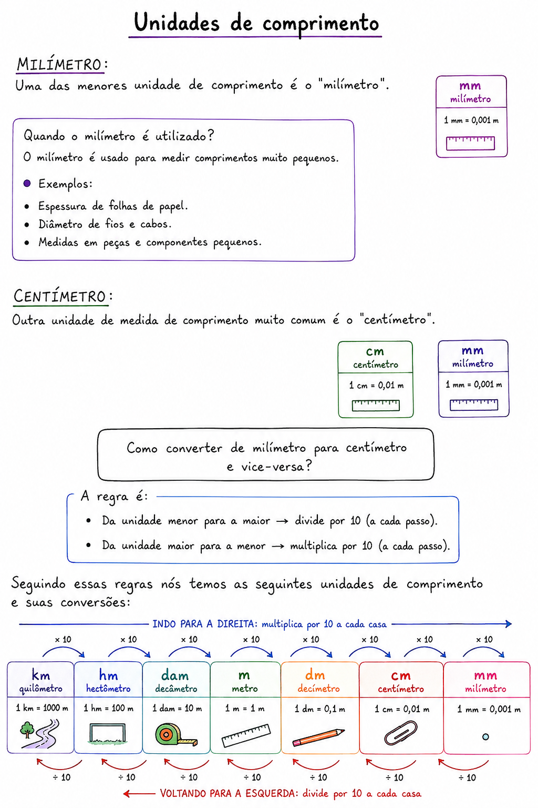
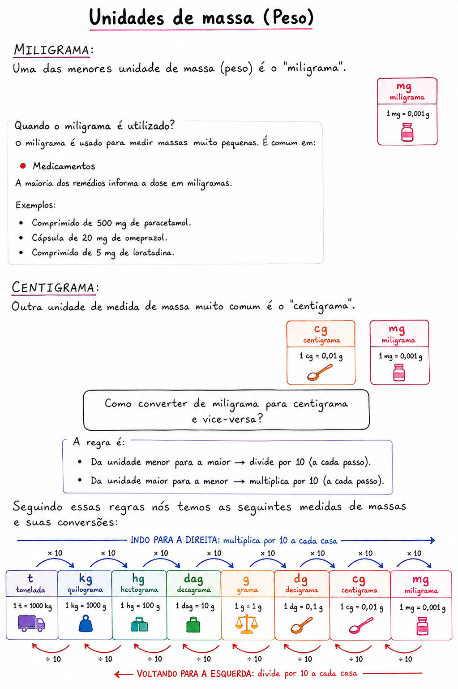
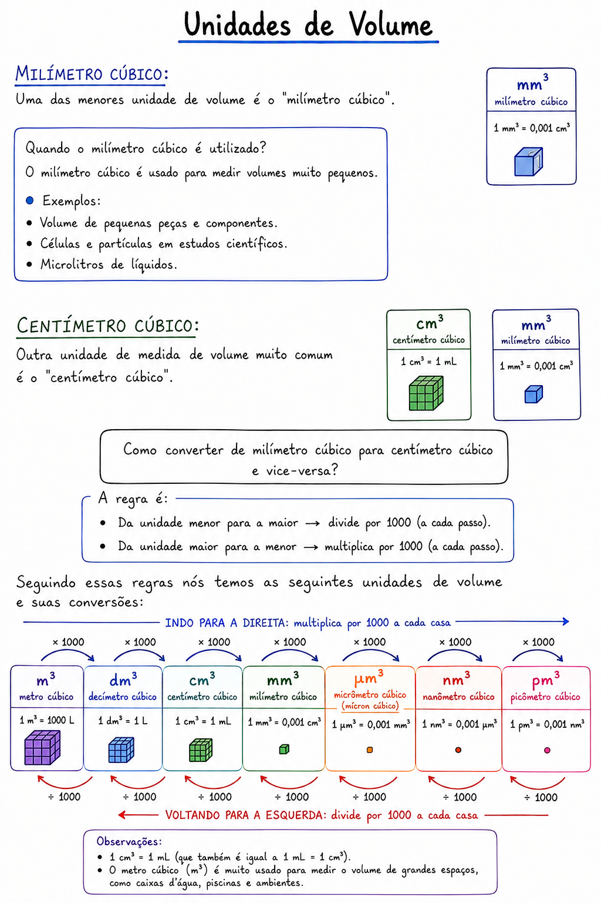
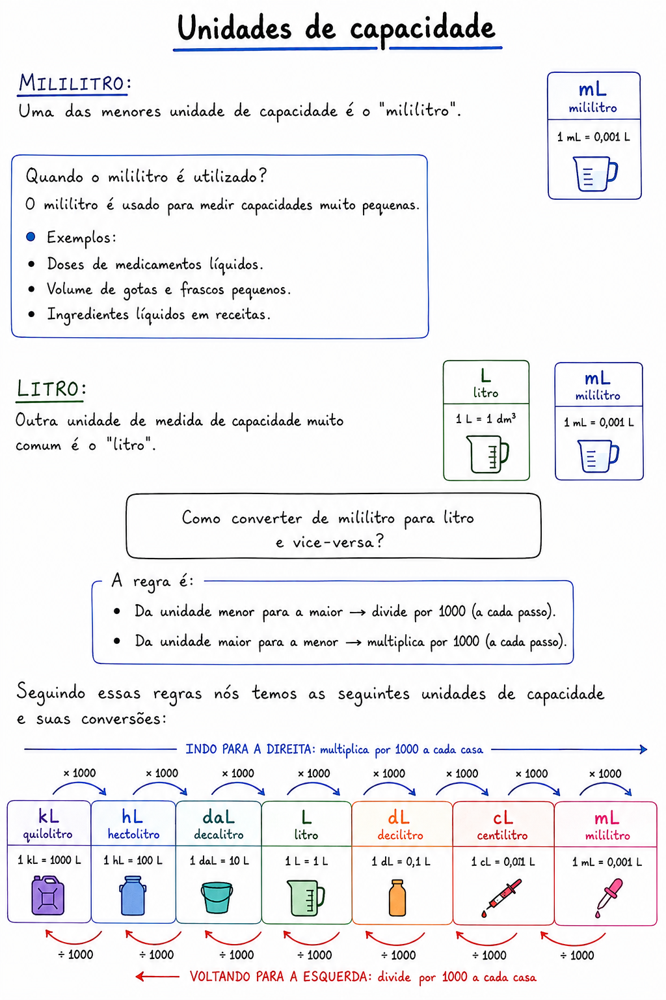
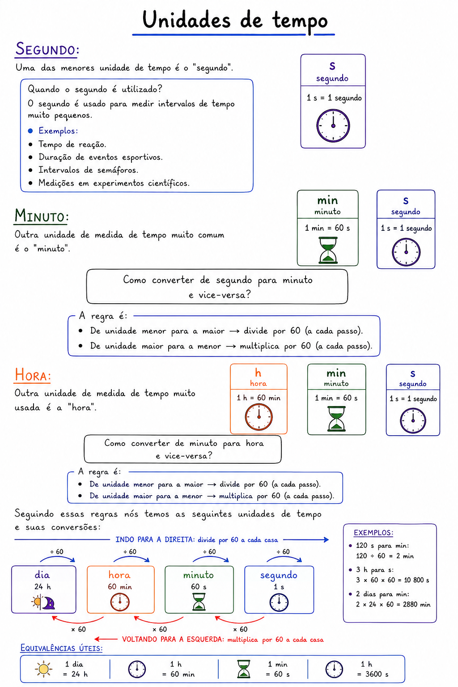
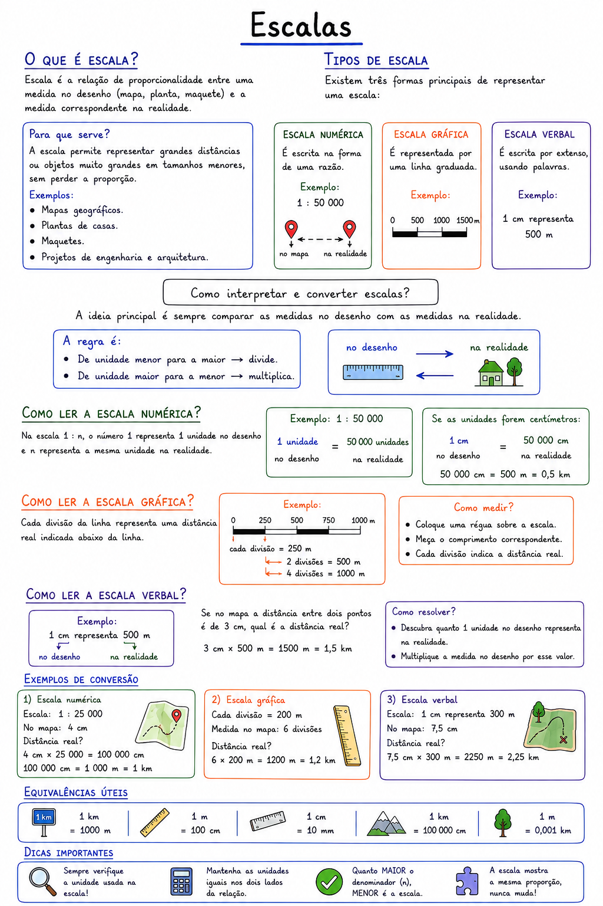
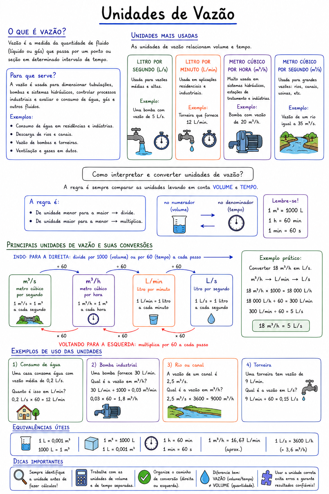
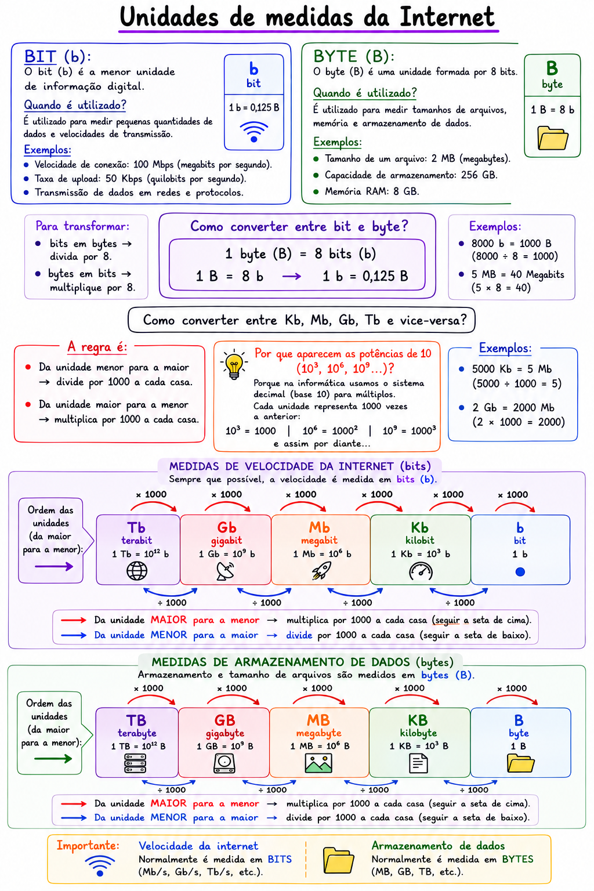

# Sistema de Unidade de Medidas

## Conteúdo

- [**Unidades de comprimento:**](#unidades-de-comprimento)
  - [`Como memorizar as medias de comprimento (mais comuns)?`](#how-to-memorize-comprimento)
  - [`(Planejamento e Execução IESES) Dez decâmetros correspondem a`](#comprimento-q01)
- [**Unidades de massa (Peso):**](#unidades-de-massa-peso)
  - [`Convertendo de kg para g`](#massa-q01)
- [**Unidades de capacidade:**](#unidades-capacidade)
- **Unidades de área:**
- [**Unidades de volume:**](#unidades-de-volume)
  - [`Um setor de armazenagem precisa registrar o volume de 2,75 m...`](#volume-q01)
- **Unidades de tempo:**
  - [`A metade da quarta parte de 1 dia, mais o triplo de 2 horas...`](#tempo-q01)
- **Escalas:**
  - [`A distância, em linha reta, entre as cidades de Viamão e Flo...`](#escalas-q01)
- **Unidades de velocidade:**
- **Unidades de vazão:**
  - [`Uma torneira despeja água a uma vazão constante de 3,6 L/mi...`](#vazao-q01)
- **Unidades de temperatura:**
- **Unidades de pressão:**
- **Unidades de energia (calor):**
- **Unidades de potência:**
- [**Unidades de Internet (bits e bytes):**](#unidades-de-internet)
  - [`Uma operadora de internet oferecia uma conexão com velocidad...`](#internet-q01)
- **Unidades de frequência:**
- **Unidades de força:**
- **Unidades de densidade:**
- **Quantidade de matéria (mol):**
- **Grandezas elétricas (volt, ampère, ohm e coulomb):**
- **Unidades de luminosidade:**
<!---
[WHITESPACE RULES]
- Same topic = "10" Whitespace character.
- Different topic = "100" Whitespace character.
--->


<!--- ( Unidades de comprimento ) --->

---

<div id="unidades-de-comprimento"></div>

## Unidades de comprimento

  


---

<div id="how-to-memorize-comprimento"></div>

## `Como memorizar as medias de comprimento (mais comuns)?`

<details>

<summary>RESPOSTA</summary>

<br/>

## `Quilômetro = km (1000 m)`

Para memorizar as medias de comprimento (mais comuns) nós começamos com **quilômetro (km)** que equivale a **1000 metros (m)**:

**km (m1000)**

---

## `Hectômetro = hm (100 m)`

Depos nós temos o **hectômetro (hm)** que equivale a **100 metros (m)**:

**1 km (1000m) ➔ 1 hm(100m)**

> Como eu converto **100 hectômetro (hm)** para **quilômetro (km)**?

Observe que estamos indo **uma casa para a esquerda**.

**Na tabela:**

- **➡️ Andou para a direita:** multiplique por 10 a cada casa.
- **⬅️ Andou para a esquerda:** divida por 10 a cada casa.

Então:

$100 \div 10 = 10$

Logo,

$100\ \text{hm} = 10\ \text{km}$

> E como eu converto **500 quilômetro (km)** para **hectômetro (hm)**?

Observe que agora estamos indo **uma casa para a direita**.

- **➡️ Andou para a direita:** multiplique por 10 a cada casa.
- **⬅️ Andou para a esquerda:** divida por 10 a cada casa.

Então:

$500 \times 10 = 5000$

Logo,

$500\ \text{km} = 5000\ \text{hm}$

---

## `Decámetro = dam (10 m)`

Continuando, agora nós temos o **decámetro (dam)** que equivale a **10 metros (m)**:

**1 km (1000m) ➔ 1 hm(100m) ➔ dam(10m)**

---

## `Metro = m (1 m)`

Agora, nós temos a unidade mais famosa de comprimento, o **metro (m)** que equivale a **1 metros (m)**:

**1 km (1000m) ➔ 1 hm(100m) ➔ dam(10m) ➔ m(1m)**

---

## `Decímetro = dm (0,1 m)`

**NOTE:**  
Agora, nós vamos para as unidades que medem menos de 1 metro (mais ainda usamos metros para medilas).

Depois do **metro (m)** a próxima unidade é o **decímetro (dm)** que equivale a **0,1 metros (m)**:

**1 km (1000m) ➔ 1 hm(100m) ➔ dam(10m) ➔ m(1m) ➔ dm(0,1m)**

---

## `Centímetro = cm (0,01 m)`

A próxima unidade é o **centímetro (cm)** que equivale a **0,01 metros (m)**:

**1 km (1000m) ➔ 1 hm(100m) ➔ dam(10m) ➔ m(1m) ➔ dm(0,1m) ➔ cm(0,01m)**

---

## `Milímetro = mm (0,001 m)`

Por fim (não é a menor, mas vamos para por aqui), nós vamos ter o  **milímetro (mm)** que equivale a **0,001 metros (m)**:

**1 km (1000m) ➔ 1 hm(100m) ➔ dam(10m) ➔ m(1m) ➔ dm(0,1m) ➔ cm(0,01m) ➔ mm(0,001m)**

---

## Sistema Internacional de Unidades (SI) e potências de 10

No **Sistema Internacional de Unidades (SI)**, cada prefixo representa uma potência de 10:

| Prefixo   | Símbolo | Significa           |
| --------- | ------- | ------------------- |
| quilo     | k       | $(10^3 = 1000) $    |
| hecto     | h       | $(10^2 = 100)$      |
| deca      | da      | $(10^1 = 10) $      |
| (unidade) | —       | $(10^0 = 1)$        |
| deci      | d       | $(10^{-1} = 0,1)$   |
| centi     | c       | $(10^{-2} = 0,01)$  |
| mili      | m       | $(10^{-3} = 0,001)$ |

</details>


---

<div id="comprimento-q01"></div>

## `(Planejamento e Execução IESES) Dez decâmetros correspondem a`

**(Planejamento e Execução IESES) Dez decâmetros correspondem a:**

- A) 10 metros.
- B) 0,01 quilômetro.
- C) 0,1 quilômetro.
- D) 1000 centímetros.

<details>

<summary>RESPOSTA</summary>

<br/>

## 🧠 Ideia Principal

Esta questão cobra a **conversão entre unidades de comprimento do Sistema Métrico Decimal**.

O conceito fundamental é que cada unidade consecutiva da escala difere por um fator de **10**.

**Escala métrica:**

**km (quilômetro) → hm (hectômetro) → dam (decâmetro) → m (metro) → dm (decímetro) → cm (centímetro) → mm (milímetro)**

Regras:

- Descer uma casa → **multiplicar por 10**.
- Subir uma casa → **dividir por 10**.

Nesta questão, basta converter **10 decâmetros (dam)** para as demais unidades e comparar com as alternativas.

## 🔍 Resolução Passo a Passo

### Passo 1 — Converter decâmetros para metros

Sabemos que:

$1\ \text{dam}=10\ \text{m}$

Logo:

$10\ \text{dam}=10\times10=100\ \text{m}$

Até aqui sabemos que:

**10 dam = 100 m**

### Passo 2 — Comparar com as alternativas

- A) 10 metros:
  - Errado, pois 10 dam = 100m
- B) 0,01 quilômetro.
  - Sabemos que $1\ \text{km}=1000\ \text{m}$
  - Assim:
    - $100\ \text{m}=\frac{100}{1000}=0,1\ \text{km}$
  - Logo, **0,01 km corresponde a apenas 10 m**.
  - ❌ Alternativa incorreta.
- C) 0,1 quilômetro.
  - $100\ \text{m}=0,1\ \text{km}$
  - ✅ Alternativa correta.
- D) 1000 centímetros.
  - Sabemos que:
    - $100\ \text{m}=100\times100=10000\ \text{cm}$
  - Portanto, **1000 cm equivalem apenas a 10 m**.
  - ❌ Alternativa incorreta.

## ✅ Resposta Correta

**Alternativa C) 0,1 quilômetro.**

Dez decâmetros correspondem a **100 metros**, que equivalem a:

- **0,1 quilômetro**
- **10.000 centímetros**

## ⚠️ Pegadinha da Questão

As bancas costumam explorar dois erros frequentes:

- Esquecer que **1 dam = 10 m**, e não 1 metro.
- Deslocar a vírgula incorretamente ao converter metros para quilômetros, confundindo:
  - **100 m = 0,1 km**
  - **10 m = 0,01 km**

## 💡 Macete de Prova

Memorize a escada das unidades:

**km (quilômetro) → hm (hectômetro) → dam (decâmetro) → m (metro) → dm (decímetro) → cm (centímetro) → mm (milímetro)**

Regras rápidas:

- Desceu uma casa → **×10**
- Subiu uma casa → **÷10**

Nesta questão:

**10 dam → 100 m → 0,1 km**

## 📌 Resumo para Revisão

- **1 dam = 10 m**
- **10 dam = 100 m**
- **100 m = 0,1 km**
- **100 m = 10.000 cm**
- Descer na escala → multiplica por 10.
- Subir na escala → divide por 10.

## 🎯 Nível da Questão

**🟢 Fácil.**  
A questão exige apenas conhecer a escala das unidades de comprimento e realizar conversões simples entre decâmetro, metro, quilômetro e centímetro. O maior risco é deslocar a vírgula incorretamente.

## 📚 Assuntos Relacionados

- Sistema Métrico Decimal
- Unidades de comprimento
- Conversão de unidades de comprimento
- Escala métrica (km, hm, dam, m, dm, cm, mm)
- Potências de 10 aplicadas às conversões
- Grandezas e medidas
- Problemas de conversão de unidades

</details>


<!--- ( Unidades de massa (Peso) ) --->

---

<div id="unidades-de-massa-peso"></div>

## Unidades de massa (Peso)

  


---

<div id="massa-q01"></div>

## `Convertendo de kg para g`

Considere que, em um restaurante de barbecue americano, 90 kg de costela suína crua vão para o defumador. Após cocção lenta, perde-se em média 30% do peso (desidratação + gordura). Cada porção consiste de 350 g pronta. Nesse cenário, quantas porções completas o restaurante consegue suprir?

- `A)` 171.
- `B)` 181.
- `C)` 180.
- `D)` 190.
- `E)` 191.

<details>

<summary>RESPOSTA</summary>

<br/>

Para essa questão vamos começar descobrindo quanto é 30% de 90kg:

$0,30 x 90$

```bash
      90
×   0,30
────────
```

**⚠️ NOTE:**  
Você pode ignorar o zero antes da vírgula quando ele estiver apenas indicando que o número é menor que 1.

```bash
      90
×     30
────────
      00
   +2700
   ─────
    2700
```

O número `0,30` possui 2 casas decimais, logo vamos ter que adicionar a vírgula de volta pulando 2 casas decimais:

 - 27,00
 - Ou simplesmente, 27

Ou seja, 30% de 90kg é 27kg, subtraindo esse valor nós teremos: **63 kg**.

Mas a questão que saber o seguinte:

> **Cada porção consiste de 350 g pronta. Nesse cenário, quantas porções completas o restaurante consegue suprir?**

Primeiro, vamos converter nossas **63kg** em **gramas**:

- **1 kg = 1.000 g (ou 1 x 10³)**
- **63 × 1.000 = 63.000 g**

Agora, sabendo que nós temos **63,000g** e cada porção vai ter **350g** é só `dividir o total que nós temos pelo a quantidade por porção`:

Se o restaurante tem **63.000 g** de alimento disponível e cada porção pronta pesa **350 g**, basta dividir:

$\frac{63.000}{350} = 180$

**RESPOSTA:**  
O restaurante consegue servir **180 porções completas**.

### `Resolvendo com regra de três`

  

</details>


<!--- ( Unidades de volume ) --->

---

<div id="unidades-de-volume"></div>

## Unidades de volume

  


---

<div id="volume-q01"></div>

## `Um setor de armazenagem precisa registrar o volume de 2,75 m...`

Um setor de armazenagem precisa registrar o volume de 2,75 metros cúbicos de um fluido usando apenas marcações em litros. Classifique as assertivas como verdadeira (V) ou falsa (F):

- `(__)` O volume total corresponde a 2.750 litros.
- `(__)` Cada 0,25 metro cúbico equivale a 250 litros.
- `(__)` O volume solicitado ultrapassa 3.000 litros.
- `(__)` A conversão exige multiplicar o valor em metros cúbicos por 1.000.

A sequência CORRETA, de cima para baixo, é:

- `A)` V, V, F, V.
- `B)` V, F, V, F.
- `C)` F, V, F, V.
- `D)` V, V, V, F.
- `E)` F, F, V, V.


<details>

<summary>RESPOSTA</summary>

<br/>

Vamos começar entendendo a questão...

Primeiro ele diz **"metros cúbicos"** que é o mesmo que:

$1\ \text{m}^3 = 1.000\ \text{L}$

Logo:

$2,75\ \text{m}^3 = 2,75 \times 1.000 = 2.750\ \text{L}$

Agora analisemos cada assertiva.

### `1ª assertiva`

> **O volume total corresponde a 2.750 litros.**

✅ Verdadeira.

### `2ª assertiva`

> **Cada 0,25 metro cúbico equivale a 250 litros.**

Como:

$0,25 \times 1.000 = 250\ \text{L}$

✅ Verdadeira.

### `3ª assertiva`

> **O volume solicitado ultrapassa 3.000 litros.**

O volume é de **2.750 litros**, que é **menor** que 3.000 litros.

❌ Falsa.

### `4ª assertiva`

> **A conversão exige multiplicar o valor em metros cúbicos por 1.000.**

Essa é exatamente a regra:

$\text{Litros} = \text{m}^3 \times 1.000$

✅ Verdadeira.

**SEQUÊNCIA CORRETA (DE CIMA PARA BAIXO):**  
V, V, F, V.

**✅ Gabarito:**

- `A)` V, V, F, V.

</details>


<!--- ( Unidades de capacidade ) --->

---

<div id="unidades-capacidade"></div>

## Unidades de capacidade

  


<!--- ( Unidades de tempo ) --->

---

<div id="unidades-de-tempo"></div>

## `Unidades de tempo`

  


---

<div id="tempo-q01"></div>

## `A metade da quarta parte de 1 dia, mais o triplo de 2 horas...`

A metade da quarta parte de 1 dia, mais o triplo de 2 horas é igual a:

- A) 10 horas
- B) 9 horas
- C) 10 horas e 50 minutos
- D) 9 horas e 50 minutos

<details>

<summary>RESPOSTA</summary>

<br/>

- Vamos começar identificando que **1 dia tem 24 horas**;
- E **um quarto dessas 24h são 6h**;
- Continuando, **a metade desse um quarto (6h) são 3h**;
- Mais **o triplo de 2h**.

Logo, nós vamos ter a seguinte equação:

$3h + (3 x 2h) = 3h + 6h = 9h$

Ou seha, **alternativa (B)**.

</details>


<!--- ( Escalas ) --->

---

<div id="escalas"></div>

## `Escalas`




---

<div id="escalas-q01"></div>

## `A distância, em linha reta, entre as cidades de Viamão e Flo...`

**A distância, em linha reta, entre as cidades de Viamão e Florianópolis é de aproximadamente 400 km. Um estudante, ao analisar um mapa, mediu essa mesma distância com sua régua e encontrou 8 cm. Com base nessas informações, pode-se concluir que a escala utilizada nesse mapa é de:**

 - A) 1 : 5.000.  
 - B) 1 : 50.000.  
 - C) 1 : 500.000.  
 - D) 1 : 5.000.000.  
 - E) 1 : 50.000.000.


<details>

<summary>RESPOSTA</summary>

<br/>

## 🧠 Ideia Principal

A questão cobra o conceito de **escala cartográfica**, que representa a relação entre uma medida feita no mapa e a medida correspondente na realidade.

A banca deseja avaliar se o candidato sabe:

- Converter unidades corretamente;
- Interpretar a proporção entre representação gráfica e distância real.

A escala indica quantas vezes a realidade foi reduzida para caber no mapa.

Na escala **1 : 5.000.000**, cada **1 cm no mapa representa 5.000.000 cm na realidade**.

## 🔍 Resolução Passo a Passo

### ① Interpretar o problema

A distância real entre as cidades é **400 km** e, no mapa, essa distância mede **8 cm**.

A escala será dada por:

> **Escala = distância no mapa ÷ distância real**

### ② Identificar os dados

- Distância no mapa: **8 cm**
- Distância real: **400 km**

### ③ Converter a distância real para centímetros

Como a medida do mapa está em centímetros, devemos transformar quilômetros em centímetros.

Sabemos que:

$1\ \text{km}=1000\ \text{m}$

e

$1\ \text{m}=100\ \text{cm}$

Logo:

$400\ \text{km}=400\times1000\times100=40.000.000\ \text{cm}$

### ④ Aplicar a fórmula da escala

$\text{Escala}=\frac{8}{40.000.000}$

## ⑤ Simplificando a razão

Dividindo numerador e denominador por 8:

$\frac{8}{40.000.000}=\frac{1}{5.000.000}$

### ⑥ Resultado final

$\boxed{\text{Escala}=1:5.000.000}$

### ⑦ Interpretar o resultado

Cada **1 cm** medido no mapa representa **5.000.000 cm** na realidade.

Isso significa que a distância real foi reduzida **cinco milhões de vezes**.

## ✅ Resposta Correta

**Alternativa D) 1 : 5.000.000.**

A escala é encontrada comparando a distância representada no mapa com a distância real, **mantendo ambas na mesma unidade de medida**.

## ⚠️ Pegadinha da Questão

A principal pegadinha é esquecer que **a escala exige que as duas medidas estejam na mesma unidade**.

Muitos candidatos fazem:

$400 \div 8 = 50$

e tentam transformar esse resultado em uma escala, chegando a uma alternativa incorreta.

## 💡 Macete de Prova

Sempre faça esta sequência:

```text
Mapa e realidade
      ↓
Mesma unidade
      ↓
Monte a razão
      ↓
Simplifique
```

Lembre-se também de que:

$1\ \text{km}=100.000\ \text{cm}$

## 📌 Resumo para Revisão

- Escala é a relação entre distância no mapa e distância real.
- As duas medidas devem estar na mesma unidade.
- **1 km = 100.000 cm.**
- Escala **1 : 5.000.000** significa que **1 cm no mapa corresponde a 5.000.000 cm na realidade**.

# 📚 Assuntos Relacionados

- Escala cartográfica
- Conversão de unidades de comprimento
- Razão e proporção
- Cartografia

</details>


<!--- ( Unidades de vazão ) --->

---

<div id="unidades-de-vazao"></div>

## `Unidades de vazão`

  


---

<div id="vazao-q01"></div>

## `Uma torneira despeja água a uma vazão constante de 3,6 L/mi...`

Uma torneira despeja água a uma vazão constante de 3,6 L/min. Quantos metros cúbicos de água são despejados em 10 horas?

- A) 0,0216 m³
- B) 0,216 m³
- C) 2,16 m³
- D) 21,6 m³

## 🧠 Ideia Principal

Esta questão cobra dois conceitos fundamentais:

- **Cálculo do volume a partir da vazão**, utilizando a relação:

$\text{Volume}=\text{Vazão}\times\text{Tempo}$

- **Conversão de unidades de capacidade para volume**, lembrando que:

$1\ m^3=1000\ L$

- Para converter litros em metros cúbicos, basta **dividir por 1000**.
- Antes de iniciar qualquer cálculo, verifique sempre se a unidade de tempo da vazão é a mesma utilizada no problema.

## 🔍 Resolução Passo a Passo

### Passo 1 — Converter o tempo para minutos

A vazão está em litros por minuto (L/min), portanto o tempo também deve estar em minutos.

$10\ \text{horas}=10\times60=600\ \text{minutos}$

### Passo 2 — Calcular o volume em litros

$V=\text{Vazão}\times\text{Tempo}$

Substituindo os valores:

$V=3,6\times600$

Efetuando o cálculo:

$V=2160\ L$

Até aqui temos **2160 litros**.

### Passo 3 — Converter litros para metros cúbicos

Sabemos que:

$1000\ L=1\ m^3$

Então:

$2160\div1000=2,16\ m^3$

Logo, o volume despejado é:

$\boxed{2,16\ m^3}$

## ✅ Resposta Correta

**Alternativa C) 2,16 m³.**

A torneira despeja **3,6 litros por minuto** durante **600 minutos**, totalizando:

$2160\ L$

Como:

$1000\ L=1\ m^3$

temos:

$2160\div1000=2,16\ m^3$

## ⚠️ Pegadinha da Questão

As bancas costumam explorar dois erros frequentes:

### 1. Esquecer de converter horas para minutos

A vazão está em **litros por minuto**, portanto o tempo precisa estar em minutos.

Erro comum:

$3,6\times10=36\ L$

Esse resultado está incorreto porque mistura horas com minutos.

### 2. Errar a conversão entre litros e metros cúbicos

Regra:

- **Litros → m³:** dividir por 1000.
- **m³ → Litros:** multiplicar por 1000.

## 💡 Macete de Prova

Sempre siga esta sequência:

$\boxed{\text{Vazão}\times\text{Tempo}=\text{Volume}}$

Depois confira a unidade final:

- Litros → m³: **÷1000**
- m³ → Litros: **×1000**

```text
Horas → Minutos
       ↓
Vazão × Tempo
       ↓
     Litros
       ↓
     ÷1000
       ↓
       m³
```

## 📌 Resumo para Revisão

- Vazão representa uma quantidade por unidade de tempo.
- Volume pode ser encontrado pela fórmula:

$V=\text{Vazão}\times\text{Tempo}$

- Antes de calcular, iguale as unidades de tempo.
- **1 m³ = 1000 L.**
- Litros → m³: dividir por 1000.
- m³ → litros: multiplicar por 1000.

## 📚 Assuntos Relacionados

- Sistema de Unidades de Medida
- Conversão entre unidades de capacidade
- Conversão entre capacidade e volume
- Vazão (Volume = Vazão × Tempo)
- Conversão de tempo (horas, minutos e segundos)
- Grandezas e medidas
- Regra de três simples aplicada à vazão
- Problemas envolvendo reservatórios, torneiras e tubulações


<!--- ( Unidades de Internet (bits e bytes) ) --->

---

<div id="unidades-de-internet"></div>

## Unidades de Internet (bits e bytes)

  


---

<div id="internet-q01"></div>

## `Uma operadora de internet oferecia uma conexão com velocidad...`

Uma operadora de internet oferecia uma conexão com velocidade média de download de 60 megabits por segundo (Mb/s). Com a implantação de uma nova tecnologia, a operadora passou a oferecer esse tipo de conexão com velocidade média de 3 gigabits por segundo (Gb/s). Sabendo que 1 Gb = 10⁹ bits e que 1 Mb = 10⁶ bits, a velocidade média da nova tecnologia supera a da anterior em número de vezes igual a:

- A) 50.
- B) 20.
- C) 30.
- D) 60.


<details>

<summary>RESPOSTA</summary>

<br/>


## 🧠 Ideia Principal

Esta questão cobra **conversão de unidades de medida de informação digital**, especificamente a relação entre **megabits (Mb)** e **gigabits (Gb)**.

O ponto principal é perceber que as unidades seguem uma escala baseada em **potências de 10**:

* **1 Gb = 10⁹ bits**
* **1 Mb = 10⁶ bits**

Portanto, para descobrir quantos megabits existem em um gigabit, basta comparar as potências:

$\frac{10^9}{10^6}=10^3=1000$

Logo:

$1\ Gb=1000\ Mb$

A nova velocidade precisa ser convertida para a mesma unidade da antiga antes da comparação.

## 🔍 Resolução Passo a Passo

### Passo 1 — Converter a nova velocidade para megabits

A nova tecnologia oferece:

$3\ Gb/s$

Sabemos que:

$1\ Gb=1000\ Mb$

Então:

$3\ Gb/s=3\times1000\ Mb/s$

$=3000\ Mb/s$

### Passo 2 — Comparar as velocidades

Velocidade antiga:

$60\ Mb/s$

Velocidade nova:

$3000\ Mb/s$

Agora calculamos quantas vezes a nova velocidade é maior:

$\frac{3000}{60}$

Dividindo:

$3000\div60=50$

Portanto, a nova tecnologia é **50 vezes mais rápida**.

## ✅ Resposta Correta

**Alternativa A) 50.**

A velocidade passou de:

$60\ Mb/s$

para:

$3\ Gb/s=3000\ Mb/s$

Então:

$\frac{3000}{60}=50$

A nova conexão supera a anterior em **50 vezes**.

## ⚠️ Pegadinha da Questão

A principal armadilha é comparar diretamente:

$3\ Gb/s \quad \text{com} \quad 60\ Mb/s$

sem converter as unidades.

Outro erro comum é pensar que:

$1\ Gb=100\ Mb$

ou usar a conversão comercial de armazenamento (base 2), como:

$1\ GB=1024\ MB$

Porém, a questão informa explicitamente:

$1\ Gb=10^9\ bits$

e

$1\ Mb=10^6\ bits$

Portanto, deve ser usada a base decimal:

$1\ Gb=1000\ Mb$

## 💡 Macete de Prova

Quando aparecerem unidades com prefixos:

* **quilo (k)** → (10^3)
* **mega (M)** → (10^6)
* **giga (G)** → (10^9)

Para converter:

$\text{unidade maior} \rightarrow \text{unidade menor}$

aumenta a quantidade.

Exemplo:

$1\ Gb=\frac{10^9}{10^6}Mb$

Corta as potências:

$10^{9-6}=10^3=1000$

Então:

$1Gb=1000Mb$

## 📌 Resumo para Revisão

* Unidades de internet normalmente usam **bits**:

  * Mb/s = megabits por segundo
  * Gb/s = gigabits por segundo

* Relação:

$1Gb=1000Mb$

* Para comparar velocidades, transforme tudo para a mesma unidade.

Nesta questão:

$3Gb/s=3000Mb/s$

$3000\div60=50$

Resposta: **50 vezes**.

# 📚 Assuntos Relacionados

* Sistema Internacional de Unidades (SI)
* Prefixos métricos (kilo, mega, giga)
* Potências de 10
* Notação científica
* Conversão de unidades
* Velocidade de transmissão de dados
* Bits e bytes
* Grandezas e medidas
* Razão e comparação entre grandezas

</details>

---

**Rodrigo** **L**eite da **S**ilva - **rodrigols89**

<details>

<summary></summary>

<br/>

RESPOSTA

</details>
