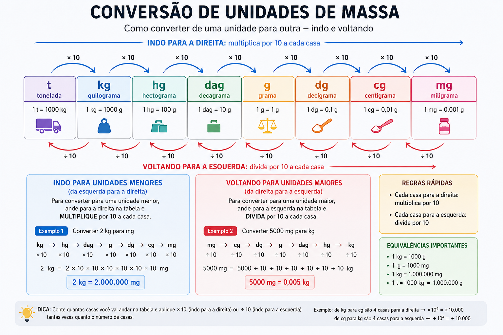
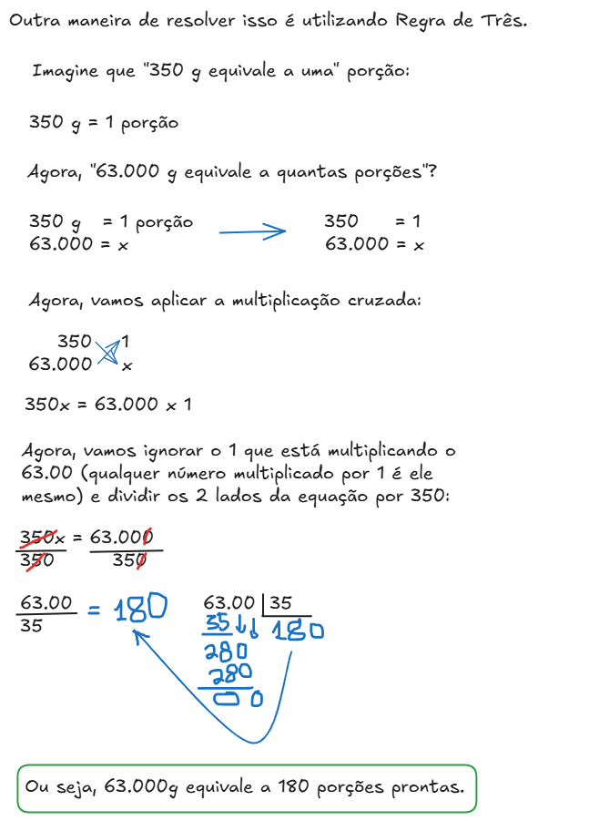

# Sistema de Unidade de Medidas

## Conteúdo

- **Introdução ao Sistema de Unidades de Medida:**
  - Sistema Internacional de Unidades (SI)
  - Grandezas e unidades de medida
  - Unidades fundamentais e derivadas
  - Múltiplos e submúltiplos (prefixos do SI)
- **Unidades de comprimento:**
  - Conversões de unidades de comprimento
  - Operações com medidas de comprimento
- **Unidades de massa:**
  - [`Conversões de unidades de massa (peso)`](#conversoes-de-massa)
  - [`Convertendo de kg para g`](#convertendo-de-kg-para-g)
  - Operações com medidas de massa
- **Unidades de capacidade:**
  - [`Conversão entre volume (m³, dm³, cm³) e capacidade (L, mL)`](#cevmdmcmec)
  - Conversões de unidades de capacidade
  - Convertendo entre L, mL, cL, dL, daL, hL e kL
  - Conversão entre volume (m³, dm³, cm³) e capacidade (L, mL)
- **Unidades de área:**
  - Conversões de unidades de área
  - Conversão entre km², hm², dam², m², dm², cm² e mm²
- **Unidades de volume:**
  - Conversões de unidades de volume
  - Conversão entre km³, hm³, dam³, m³, dm³, cm³ e mm³
  - Relação entre volume e capacidade
- **Unidades de tempo:**
  - Conversões de unidades de tempo
  - Operações com horas, minutos e segundos
- **Unidades de temperatura:**
  - Escalas termométricas
  - Conversão entre Celsius, Fahrenheit e Kelvin
- **Unidades de pressão:**
  - Conversões de unidades de pressão
  - Pascal (Pa), atm, bar e mmHg
- **Unidades de energia (calor):**
  - Joule (J)
  - Caloria (cal)
  - Conversão entre J e cal
- **Quantidade de matéria (mol):**
  - Conceito de mol
  - Número de Avogadro
  - Conversões envolvendo mol
- **Escalas:**
  - Escala numérica
  - **Cálculo da escala:**
  - Distância no mapa × distância real
  - Ampliação e redução
  - Conversão de unidades em problemas de escala
<!---
[WHITESPACE RULES]
- Same topic = "10" Whitespace character.
- Different topic = "100" Whitespace character.
--->


<!--- ( Unidades de massa ) --->

---

<div id="conversoes-de-massa"></div>

## `Conversões de unidades de massa (peso)`

Para converter uma unidade em outra, basta seguir estas relações:

  

Vejam que:

* **Cada casa para a direita** → multiplica por **10**.
* Se andar **n** casas para a direita → multiplica por **10ⁿ**.

Por exemplo, de **kg → g**:

```
kg → hg → dag → g
 |    |    |   / \
 >>>>>>>>>>>>>>>>
     (1)  (2)  (3)
```

Nesse caso nós andamos **3 casas** para a direita.

Logo:

$1\ \text{kg} = 1 \times 10^3\ \text{g} = 1000\ \text{g}$

Outros exemplos:

* **2 kg → g**
  * $2 \times 10^3 = 2000 g$
* **7,5 kg → g**
  * $7,5 \times 10^3 = 7500 g$
* **0,8 kg → g**
  * $0,8 \times 10^3 = 800 g$

Da mesma forma, para voltar:

```
kg → hg → dag → g
 |    |    |    |
 <<<<<<<<<<<<<<<<
(3)  (2)  (1)
```

São **3 casas para a esquerda**, então:

$\text{gramas} \div 10^3$


Por exemplo:

* **3500 g → kg**

$3500 \div 10^3 = 3,5\ \text{kg}$

### `Regra que serve para todas as unidades`

Se houver **n casas** entre a unidade de origem e a unidade de destino:

* **Para uma unidade menor (direita):** multiplique por (10^n).
* **Para uma unidade maior (esquerda):** divida por (10^n).

**⚠️ NOTE:**  
Essa é a forma mais rápida de resolver conversões em concursos, pois evita fazer uma multiplicação ou divisão por 10 repetidas vezes.


---

<div id="convertendo-de-kg-para-g"></div>

## `Convertendo de kg para g`

> **Para praticar conversão de kg para g vamos seguir a seguinte questão.**

Considere que, em um restaurante de barbecue americano, 90 kg de costela suína crua vão para o defumador. Após cocção lenta, perde-se em média 30% do peso (desidratação + gordura). Cada porção consiste de 350 g pronta. Nesse cenário, quantas porções completas o restaurante consegue suprir?

- `A)` 171.
- `B)` 181.
- `C)` 180.
- `D)` 190.
- `E)` 191.


<details>

<summary>RESPOSTA</summary>

<br/>

Para essa questão vamos começar descobrindo quanto é 30% de 90kg:

$0,30 x 90$

```bash
      90
×   0,30
────────
```

**⚠️ NOTE:**  
Você pode ignorar o zero antes da vírgula quando ele estiver apenas indicando que o número é menor que 1.

```bash
      90
×     30
────────
      00
   +2700
   ─────
    2700
```

O número `0,30` possui 2 casas decimais, logo vamos ter que adicionar a vírgula de volta pulando 2 casas decimais:

 - 27,00
 - Ou simplesmente, 27

Ou seja, 30% de 90kg é 27kg, subtraindo esse valor nós teremos: **63 kg**.

Mas a questão que saber o seguinte:

> **Cada porção consiste de 350 g pronta. Nesse cenário, quantas porções completas o restaurante consegue suprir?**

Primeiro, vamos converter nossas **63kg** em **gramas**:

- **1 kg = 1.000 g (ou 1 x 10³)**
- **63 × 1.000 = 63.000 g**

Agora, sabendo que nós temos **63,000g** e cada porção vai ter **350g** é só `dividir o total que nós temos pelo a quantidade por porção`:

Se o restaurante tem **63.000 g** de alimento disponível e cada porção pronta pesa **350 g**, basta dividir:

$\frac{63.000}{350} = 180$

**RESPOSTA:**  
O restaurante consegue servir **180 porções completas**.

### `Resolvendo com regra de três`

  

</details>


<!--- ( Unidades de capacidade ) --->

---

<div id="cevmdmcmec"></div>

## `Conversão entre volume (m³, dm³, cm³) e capacidade (L, mL)`

> Para entender (aprender) a conversão entre volume (m³, dm³, cm³) e capacidade (L, mL) vamos analisar a seguinte questão.

Um setor de armazenagem precisa registrar o volume de 2,75 metros cúbicos de um fluido usando apenas marcações em litros. Classifique as assertivas como verdadeira (V) ou falsa (F):

- `(__)` O volume total corresponde a 2.750 litros.
- `(__)` Cada 0,25 metro cúbico equivale a 250 litros.
- `(__)` O volume solicitado ultrapassa 3.000 litros.
- `(__)` A conversão exige multiplicar o valor em metros cúbicos por 1.000.

A sequência CORRETA, de cima para baixo, é:

- `A)` V, V, F, V.
- `B)` V, F, V, F.
- `C)` F, V, F, V.
- `D)` V, V, V, F.
- `E)` F, F, V, V.


<details>

<summary>RESPOSTA</summary>

<br/>

Vamos começar entendendo a questão...

Primeiro ele diz **"metros cúbicos"** que é o mesmo que:

$1\ \text{m}^3 = 1.000\ \text{L}$

Logo:

$2,75\ \text{m}^3 = 2,75 \times 1.000 = 2.750\ \text{L}$

Agora analisemos cada assertiva.

### `1ª assertiva`

> **O volume total corresponde a 2.750 litros.**

✅ Verdadeira.

### `2ª assertiva`

> **Cada 0,25 metro cúbico equivale a 250 litros.**

Como:

$0,25 \times 1.000 = 250\ \text{L}$

✅ Verdadeira.

### `3ª assertiva`

> **O volume solicitado ultrapassa 3.000 litros.**

O volume é de **2.750 litros**, que é **menor** que 3.000 litros.

❌ Falsa.

### `4ª assertiva`

> **A conversão exige multiplicar o valor em metros cúbicos por 1.000.**

Essa é exatamente a regra:

$\text{Litros} = \text{m}^3 \times 1.000$

✅ Verdadeira.

**SEQUÊNCIA CORRETA (DE CIMA PARA BAIXO):**  
V, V, F, V.

**✅ Gabarito:**

- `A)` V, V, F, V.

</details>


---

**Rodrigo** **L**eite da **S**ilva - **rodrigols89**

<details>

<summary></summary>

<br/>

RESPOSTA

</details>
