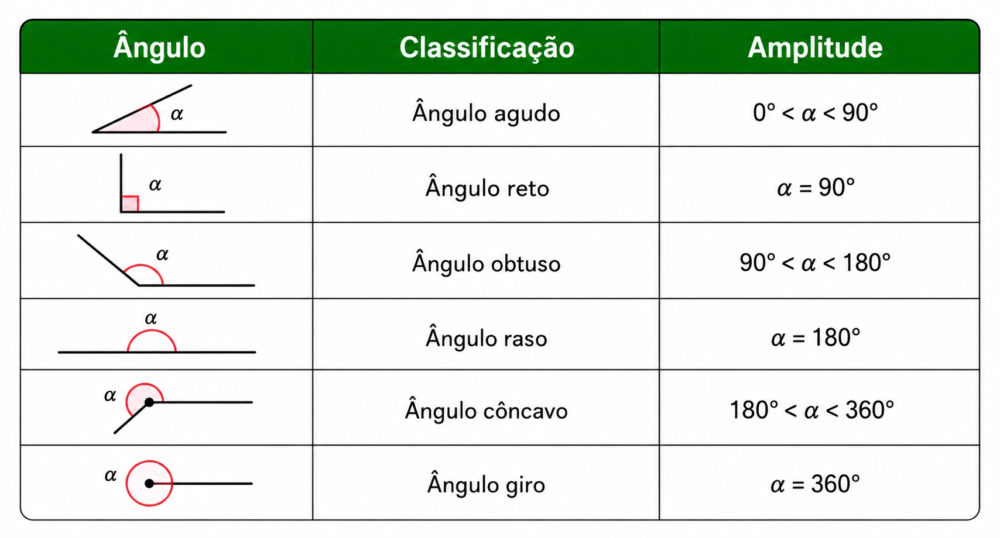
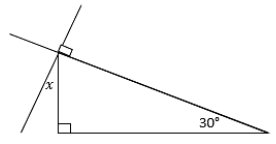
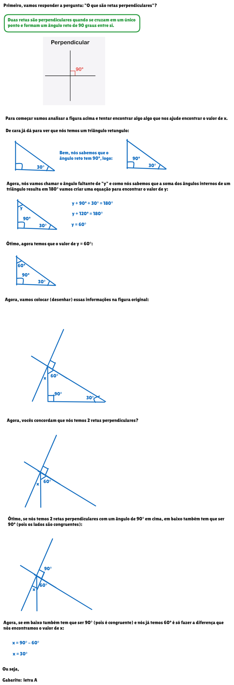
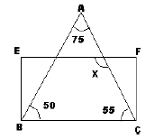
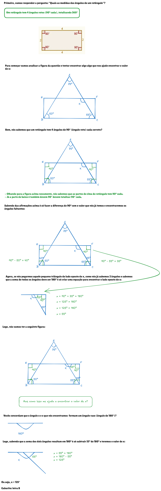
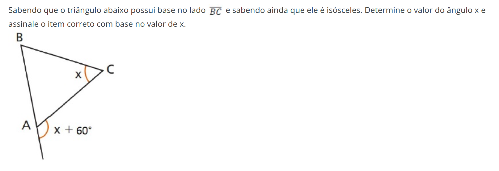
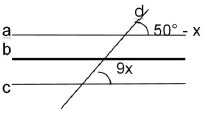
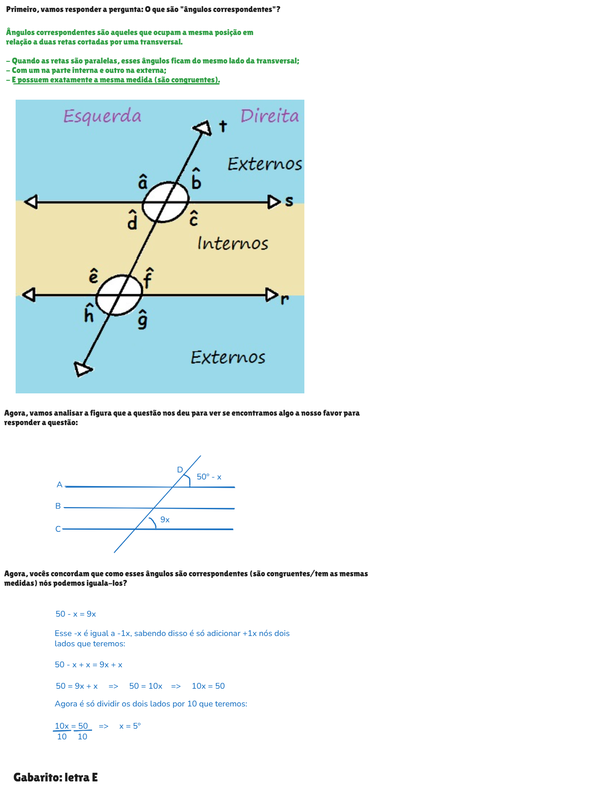
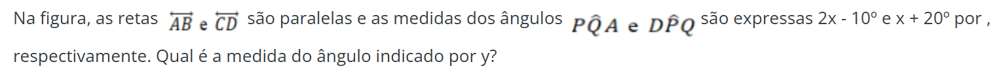
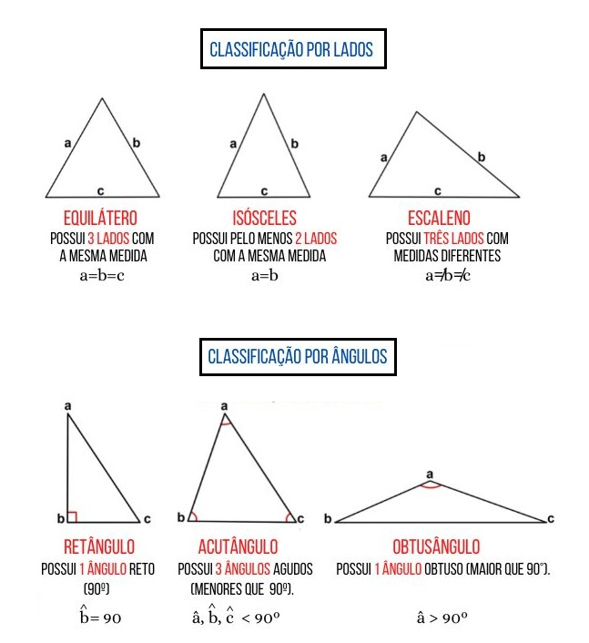

# Geometria Plana

- **Ângulos - Lei Angular de Thales:**
  - [Quais os ângulos mais famosos (de acordo com o tamanho do seu grau°)?](#qoamfdacotdsg)
  - [O que são retas perpendiculares e como usa-las para encontrar ângulos?](#oqsrpeculpea)
  - [Quais as medidas dos ângulos de um retângulo e como usar a medidas de ângulos conhecidos (ou parte deles) para encontrar a parte que faltante?](#qamdadurecuamdacpeapqf)
  - [O que são "ângulos correspondentes"?](#oquesao-angulos-correspondentes)
  - [O que são "ângulos alternos internos"?](#oquesao-angulos-alternos-internos-raso)


- **Polígonos:**
- **Polígonos Regulares:**
- **Triângulos:**
  - [Quais os triângulos mais famosos (de acordo com o tamanho dos seus lados ou ângulos)?](#qotmfdacotdsloa)
- **Semelhança de Triângulo:**
- **Relações Métricas no Triângulo Retângulo:**
- **Relações Trigonométricas no Triângulo Retângulo, Leis dos Senos e Cossenos:**
- **Quadriláteros:**
- **Circunferências e Círculos:**
- **Áreas e Perímetros:**
<!---
[WHITESPACE RULES]
- Same topic = "20" Whitespace character.
- Different topic = "100" Whitespace character.
--->


<!--- ( Ângulos - Lei Angular de Thales ) --->

---

<div id="qoamfdacotdsg"></div>

## Quais os ângulos mais famosos (de acordo com o tamanho do seu grau°)?

<details>

<summary>RESPOSTA</summary>

<br/>

  

</details>


---

<div id="oqsrpeculpea"></div>

## O que são retas perpendiculares e como usa-las para encontrar ângulos?

> **O que são retas perpendiculares e como usa-las para resolver o problema abaixo?**

Na figura a seguir os retângulos indicam ângulos retos.

  

Qual é o valor de x?

- **A)** 30°.
- **B)** 35°.
- **C)** 45°.
- **D)** 90°.

<details>

<summary>RESPOSTA</summary>

<br/>

   

</details>


---

<div id="qamdadurecuamdacpeapqf"></div>

## Quais as medidas dos ângulos de um retângulo e como usar a medidas de ângulos conhecidos (ou parte deles) para encontrar a parte que faltante?

> **Quais as medidas dos ângulos de um retângulo e como usar a medidas de ângulos conhecidos (ou parte deles) para encontrar a parte que faltante para resolver o problema abaixo?**

Na figura a seguir temos um retângulo sobre um triângulo.

  

A medida do ângulo X é:

- **A)** 115°.
- **B)** 125°.
- **C)** 135°.
- **D)** 145°.


<details>

<summary>RESPOSTA</summary>

<br/>

  

</details>


---

<div id="oqeutiuteecduaedut"></div>

## O que é um triângulo isosceles, um triangulo equilatero e como descobrir um ângulo externo de um triângulo?

> **O que é `um triângulo isosceles`, `um triangulo equilatero` e `como descobrir um ângulo externo de um triângulo`?**

Use esse conceitos para responder a questão abaixo...

  

- **A)** O triângulo é retângulo.
- **B)** O triângulo é equilátero.
- **C)** O valor de x é 45°. 
- **D)** O triângulo é escaleno. 
- **E)** O valor de x é 30°. 

<details>

<summary>RESPOSTA</summary>

<br/>

  

</details>


---

<div id="oquesao-angulos-correspondentes"></div>

## O que são "ângulos correspondentes"?

> **O que são "ângulos correspondentes" e como usar esse conceito para responder a questão abaixo?**

Se **a**, **b**, **c** são retas paralelas e **d** uma `reta transversal`, então o valor de **x**, é:

  

- **A)** 9°
- **B)** 10°
- **C)** 45º
- **D)** 7°
- **E)** 5°

<details>

<summary>RESPOSTA</summary>

<br/>

  

</details>


---

<div id="oquesao-angulos-alternos-internos-raso"></div>

## O que são "ângulos alternos internos"?

> **O que são "ângulos alternos internos" e como usa-los para resolver o problema abaixo?**

  

- **A)** 105º
- **B)** 120º
- **C)** 130º
- **D)** 125º
- **E)** 145º

<details>

<summary>RESPOSTA</summary>

<br/>

  

</details>


<!--- ( Triângulos ) --->

---

<div id="qotmfdacotdsloa"></div>

## Quais os triângulos mais famosos (de acordo com o tamanho dos seus lados ou ângulos)?

<details>

<summary>RESPOSTA</summary>

<br/>

  

</details>


---

**Rodrigo** **L**eite da **S**ilva - **rodrigols89**

<details>

<summary></summary>

<br/>

RESPOSTA

```bash

```

  

</details>
