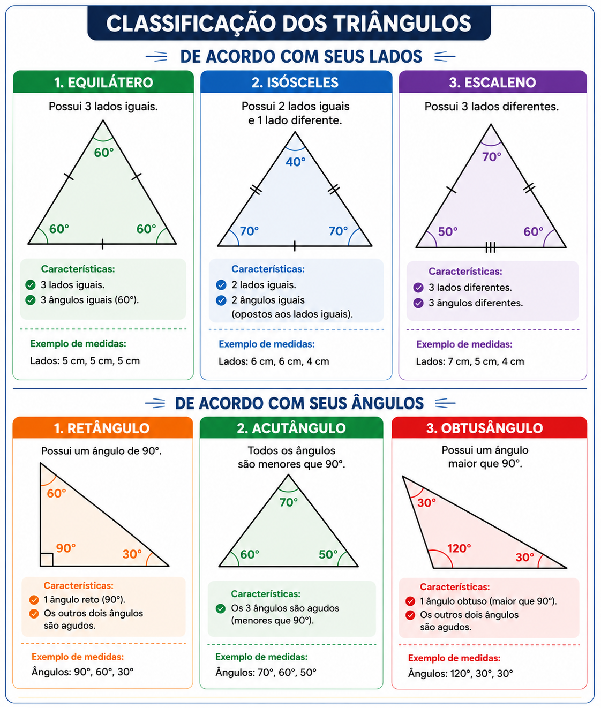
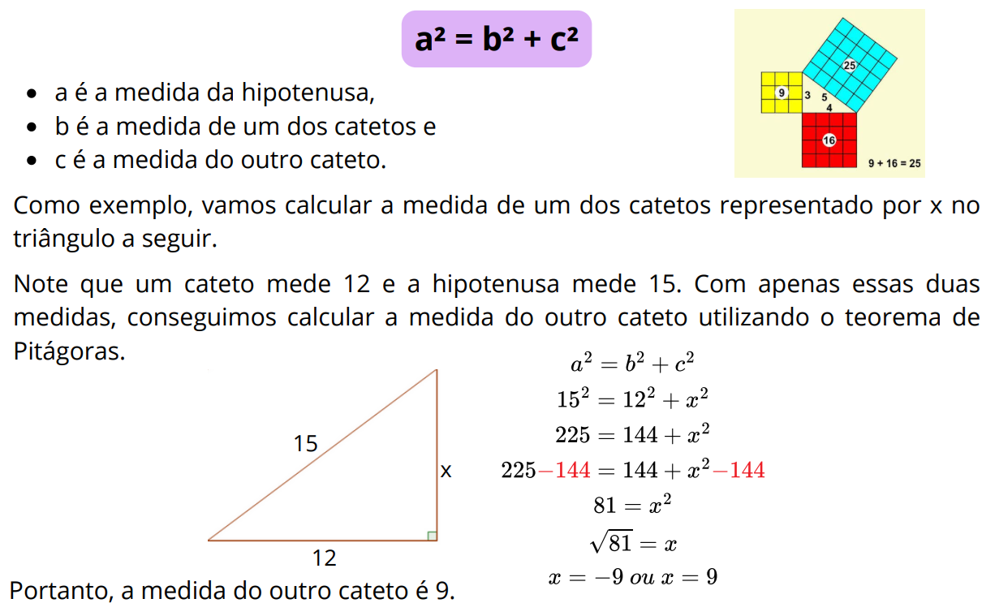
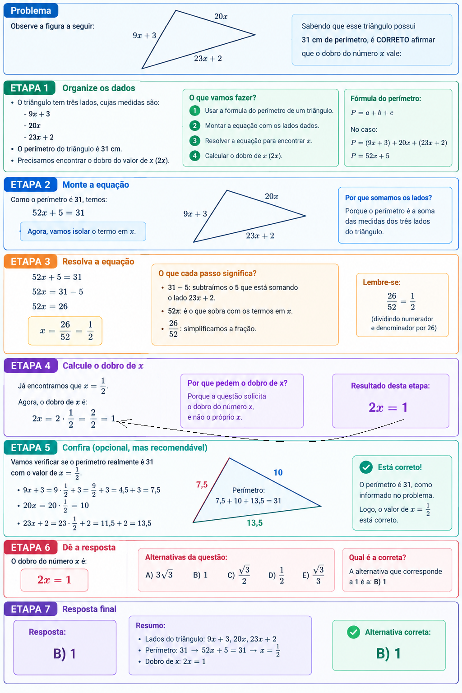

# Geometria Plana

- **Resumos passivos:**
  - [Classificação de Ângulos](#classificacao-de-angulos)
  - [Classificação de Triângulos](#classificacao-de-triangulos)
  - [Teorema de Pitágoras](#teorema-de-pitagoras)
  - [Relações Métricas no Triângulo Retângulo](#relacoes-metricas-no-triangulo-retangulo)
- [Ângulos - Lei Angular de Thales](#angulos-lei-angular-de-thales)
- [Polígonos e Polígonos Regulares](#poligonos-e-poligonos-regulares)
- [Triângulos](#triangulos)
- Semelhança de Triângulo
- Relações Métricas no Triângulo Retângulo
- Relações Trigonométricas no Triângulo Retângulo, Leis dos Senos e Cossenos
- Quadriláteros
- Circunferências e Círculos
- Áreas e Perímetros
<!---
[WHITESPACE RULES]
- Same topic = "10" Whitespace character.
- Different topic = "200" Whitespace character.
--->

<!--- ( Resumos passivos ) --->

---

## Classificação de Ângulos

  

---

## Classificação de Triângulos

  

---

## Teorema de Pitágoras

Em todo triângulo retângulo, o quadrado da medida da hipotenusa é igual à soma dos quadrados das medidas dos catetos. Isso pode ser representado da seguinte forma:

  

<!--- ( Ângulos - Lei Angular de Thales ) --->

---

## Ângulos - Lei Angular de Thales

> A **Lei Angular de Tales** estabelece que a soma das medidas dos três ângulos internos de QUALQUER triângulo é sempre igual a `180°`.

**TÍTULO:** Q1383147 | Ano: 2015 Banca: CPCON Órgão: Prefeitura de Santa Luzia - PB Prova: CPCON - 2015 - Prefeitura de Santa Luzia - PB - Nível Fundamental  
**LINK:** https://www.qconcursos.com/questoes-de-concursos/questoes/55264cfd-ed  
**TÓPICO:** Ângulos - Lei Angular de Thales  
**STATUS:** 0/1  

DICAS

 

- O que são "ângulos correspondentes" e como usar esse conceito para responder a questão abaixo?

RESPOSTA

 

  

 
 

**TÍTULO:** Q2125174 | Ano: 2023 Banca: CPCON Órgão: Prefeitura de Catolé do Rocha - PB Prova: CPCON - 2023 - Prefeitura de Catolé do Rocha - PB - Auxiliar de Serviços Gerais  
**LINK:** https://www.qconcursos.com/questoes-de-concursos/questoes/7686c41e-df  
**TÓPICO:** Ângulos - Lei Angular de Thales  
**STATUS:** 0/1  

DICAS

 

- O que são "ângulos alternos internos"?

RESPOSTA

 

  

 
 

**TÍTULO:** Q916410 | Ano: 2015 Banca: IDECAN Órgão: Colégio Pedro II Prova: IDECAN - 2015 - Colégio Pedro II - Professor - Matemática  
**LINK:** https://www.qconcursos.com/questoes-de-concursos/questoes/e5976486-8c  
**TÓPICO:** Ângulos - Lei Angular de Thales  
**STATUS:** 0/1  

DICAS

 

- As partes quebradas dos x podem ser somadas, x + x + x + x = 4x
- Gabarito

 
 

**TÍTULO:** Q1113068 | Ano: 2017 Banca: IDECAN Órgão: Câmara de Coronel Fabriciano - MG Prova: IDECAN - 2017 - Câmara de Coronel Fabriciano - MG - Auxiliar Administrativo  
**LINK:** https://www.qconcursos.com/questoes-de-concursos/questoes/8f1e9c30-3f  
**TÓPICO:** Ângulos - Lei Angular de Thales  
**STATUS:** 0/1  

DICAS

 

- Retas perpendiculares.

RESPOSTA

 

   

 
 

**TÍTULO:** Q1368501 | Ano: 2017 Banca: IDECAN Órgão: Prefeitura de Manhumirim - MG Provas: IDECAN - 2017 - Prefeitura de Manhumirim - MG - Gestor Municipal de Contrato  
**LINK:** https://www.qconcursos.com/questoes-de-concursos/questoes/3b3058fc-e5  
**TÓPICO:** Ângulos - Lei Angular de Thales  
**STATUS:** 0/1  

DICAS

 

- Quais as medidas dos ângulos de um retângulo e como usar a medidas de ângulos conhecidos (ou parte deles) para encontrar a parte que faltante para resolver o problema abaixo?

RESPOSTA

 

  

 
 

**TÍTULO:** Q2168624 | Ano: 2022 Banca: IDECAN Órgão: IBGE Prova: IDECAN - 2022 - IBGE - Agente Censitário de Pesquisas por Telefone  
**LINK:** https://www.qconcursos.com/questoes-de-concursos/questoes/67bf11f1-f5  
**TÓPICO:** Ângulos - Lei Angular de Thales  
**STATUS:** 0/1  

DICAS

 

- O que é `um triângulo isosceles`?
- O que é `um triangulo equilatero`?
- `Como descobrir um ângulo externo de um triângulo`?**

RESPOSTA

 

  

<!--- ( Polígonos e Polígonos Regulares ) --->

---

## Polígonos e Polígonos Regulares

- **Segmento de Reta:**
  - Um **Segmento de Reta** é uma parte limitada de uma `reta que possui um ponto inicial e um ponto final bem definidos`, chamados de extremidades.
- **Polígonos:**
  - Polígonos são figuras geométricas planas e fechadas formadas por segmentos de reta que se encontram nas extremidades.
- **Polígonos Regulares:**
Os polígonos regulares são aqueles que têm todos os lados com medidas congruentes, ou seja, lados que têm as mesmas medidas. O quadrado é um exemplo de polígono regular.

<!--- ( Triângulos ) --->

---

## Triângulos

> Um **triângulo** é um *polígono* geométrico que possui `três lados`, `três ângulos` e três `vértices`.

**TÍTULO:** Q4262441 | Ano: 2026 Banca: CPCON Órgão: UEPB Prova: CPCON - 2026 - UEPB - Auxiliar de Laboratório de Fotografia  
**LINK:** https://www.qconcursos.com/questoes-de-concursos/questoes/7fb4f122-a2  
**TÓPICO:** Geometria Plana , Ângulos - Lei Angular de Thales , Triângulos  
**STATUS:** 0/1  

DICAS

 

- Qual triângulo possui todos os lados diferentes? (x, 2x, 3x)

 
 

**TÍTULO:** Q3090700 | Ano: 2024 Banca: CPCON Órgão: Prefeitura de São José de Piranhas - PB Prova: CPCON - 2024 - Prefeitura de São José de Piranhas - PB - Nível Fundamental Incompleto  
**LINK:** https://www.qconcursos.com/questoes-de-concursos/questoes/21796b97-ae  
**TÓPICO:** Geometria Plana , Triângulos  
**STATUS:** 0/1  

DICAS

 

- Coloque esses dados na fórmula do perímetro de um triângulo:
  - P = a + b + c
- Encontre o valor de x.
- Encontre o dobro do valor de x:
  - 2x

RESPOSTA

 

  

 
 

**TÍTULO:** Q2540868 | Ano: 2024 Banca: CPCON Órgão: Prefeitura de Soledade - PB Prova: CPCON - 2024 - Prefeitura de Soledade - PB - Professor com Licenciatura em Matemática  
**LINK:** https://www.qconcursos.com/questoes-de-concursos/questoes/a82ccfda-46  
**TÓPICO:** Geometria Plana, Triângulos  
**STATUS:** 0/1  

DICAS

 

- Primeiro, separa todas as informações (dados);
- Calcule a inclinação da reta r e s;
- Use a condição de perpendicidade (aqui você encontra a);
- Calcul a área do triângulo.

RESPOSTA

 

  

 
 

**TÍTULO:** Q2540862 | Ano: 2024 Banca: CPCON Órgão: Prefeitura de Soledade - PB Prova: CPCON - 2024 - Prefeitura de Soledade - PB - Professor com Licenciatura em Matemática  
**LINK:** https://www.qconcursos.com/questoes-de-concursos/questoes/a81ecee2-46  
**TÓPICO:** Geometria Plana , Triângulos  
**STATUS:** 0/1  

DICAS

 

- Relações Métricas no Triângulo Retângulo
- Gabarito

 
 

---

**Rodrigo** **L**eite da **S**ilva - **rodrigols89**
