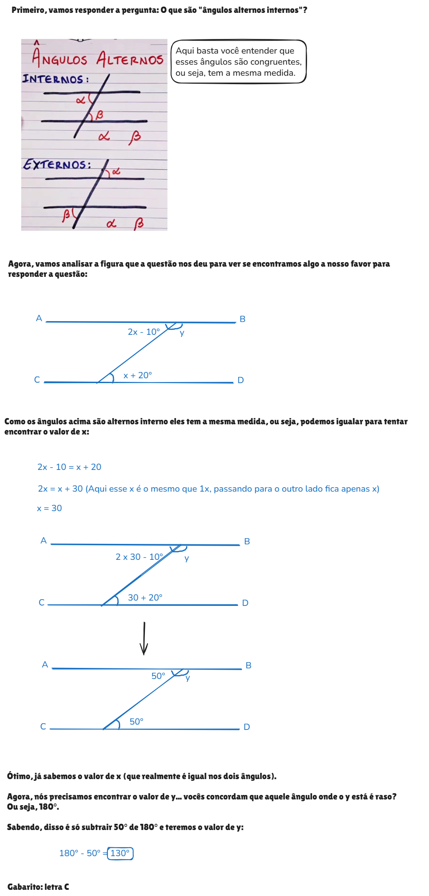
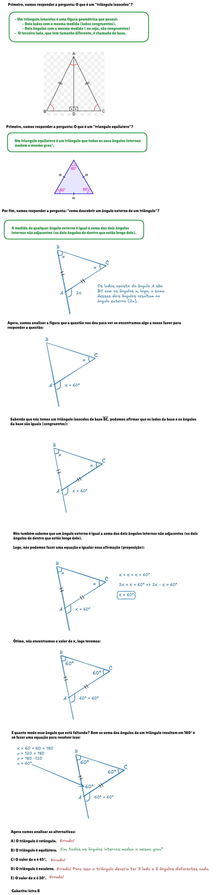

# Ângulos - Lei Angular de Thales

## Conteúdo

- [Questões](#questions)
- **Resumos passivos:**
  - [Classificação de Ângulos](#classificacao-de-angulos)
<!---
[WHITESPACE RULES]
- Same topic = "10" Whitespace character.
- Different topic = "200" Whitespace character.
--->

<!--- ( Questões ) --->

---

## Questões

> A **Lei Angular de Tales** estabelece que a soma das medidas dos três ângulos internos de QUALQUER triângulo é sempre igual a `180°`.

**TÍTULO:** Q1383147 | Ano: 2015 Banca: CPCON Órgão: Prefeitura de Santa Luzia - PB Prova: CPCON - 2015 - Prefeitura de Santa Luzia - PB - Nível Fundamental  
**LINK:** https://www.qconcursos.com/questoes-de-concursos/questoes/55264cfd-ed  
**TÓPICO:** Ângulos - Lei Angular de Thales  
**STATUS:** 0/1  

DICAS

 

- O que são "ângulos correspondentes" e como usar esse conceito para responder a questão abaixo?

RESPOSTA

 

  

 
 

**TÍTULO:** Q2125174 | Ano: 2023 Banca: CPCON Órgão: Prefeitura de Catolé do Rocha - PB Prova: CPCON - 2023 - Prefeitura de Catolé do Rocha - PB - Auxiliar de Serviços Gerais  
**LINK:** https://www.qconcursos.com/questoes-de-concursos/questoes/7686c41e-df  
**TÓPICO:** Ângulos - Lei Angular de Thales  
**STATUS:** 0/1  

DICAS

 

- O que são "ângulos alternos internos"?

RESPOSTA

 

  

 
 

**TÍTULO:** Q916410 | Ano: 2015 Banca: IDECAN Órgão: Colégio Pedro II Prova: IDECAN - 2015 - Colégio Pedro II - Professor - Matemática  
**LINK:** https://www.qconcursos.com/questoes-de-concursos/questoes/e5976486-8c  
**TÓPICO:** Ângulos - Lei Angular de Thales  
**STATUS:** 0/1  

DICAS

 

- As partes quebradas dos x podem ser somadas, x + x + x + x = 4x
- Gabarito

 
 

**TÍTULO:** Q1113068 | Ano: 2017 Banca: IDECAN Órgão: Câmara de Coronel Fabriciano - MG Prova: IDECAN - 2017 - Câmara de Coronel Fabriciano - MG - Auxiliar Administrativo  
**LINK:** https://www.qconcursos.com/questoes-de-concursos/questoes/8f1e9c30-3f  
**TÓPICO:** Ângulos - Lei Angular de Thales  
**STATUS:** 0/1  

DICAS

 

- Retas perpendiculares.

RESPOSTA

 

   

 
 

**TÍTULO:** Q1368501 | Ano: 2017 Banca: IDECAN Órgão: Prefeitura de Manhumirim - MG Provas: IDECAN - 2017 - Prefeitura de Manhumirim - MG - Gestor Municipal de Contrato  
**LINK:** https://www.qconcursos.com/questoes-de-concursos/questoes/3b3058fc-e5  
**TÓPICO:** Ângulos - Lei Angular de Thales  
**STATUS:** 0/1  

DICAS

 

- Quais as medidas dos ângulos de um retângulo e como usar a medidas de ângulos conhecidos (ou parte deles) para encontrar a parte que faltante para resolver o problema abaixo?

RESPOSTA

 

  

 
 

**TÍTULO:** Q2168624 | Ano: 2022 Banca: IDECAN Órgão: IBGE Prova: IDECAN - 2022 - IBGE - Agente Censitário de Pesquisas por Telefone  
**LINK:** https://www.qconcursos.com/questoes-de-concursos/questoes/67bf11f1-f5  
**TÓPICO:** Ângulos - Lei Angular de Thales  
**STATUS:** 0/1  

DICAS

 

- O que é `um triângulo isosceles`?
- O que é `um triangulo equilatero`?
- `Como descobrir um ângulo externo de um triângulo`?**

RESPOSTA

 

  

<!--- ( Resumos passivos ) --->

---

## Classificação de Ângulos

  

---

**Rodrigo** **L**eite da **S**ilva - **rodrigols89**
