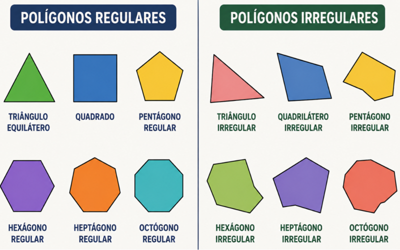

# Polígonos e Polígonos Regulares

- **Segmento de Reta:**
  - Um **Segmento de Reta** é uma parte limitada de uma `reta que possui um ponto inicial e um ponto final bem definidos`;
  - Chamados de extremidades.
- **Polígonos:**
  - Polígonos são figuras geométricas planas e fechadas formadas por segmentos de reta que se encontram nas extremidades.
- **Polígonos Regulares:**
  - Os polígonos regulares são aqueles que têm todos os lados com medidas congruentes, ou seja, lados que têm as mesmas medidas.
  - O quadrado é um exemplo de polígono regular.

## Conteúdo

- [Questões](#questions)
- **Resumos passivos:**
<!---
[WHITESPACE RULES]
- Same topic = "10" Whitespace character.
- Different topic = "200" Whitespace character.
--->

<!--- ( Questões ) --->

---

## Questões

> Em breve...

---

**Rodrigo** **L**eite da **S**ilva - **rodrigols89**
