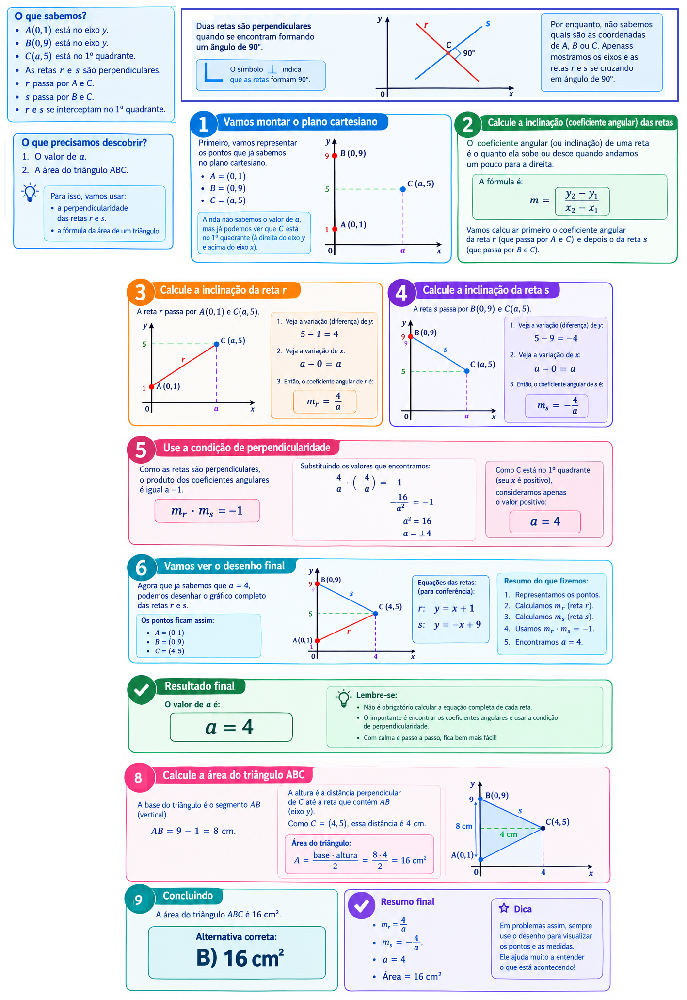
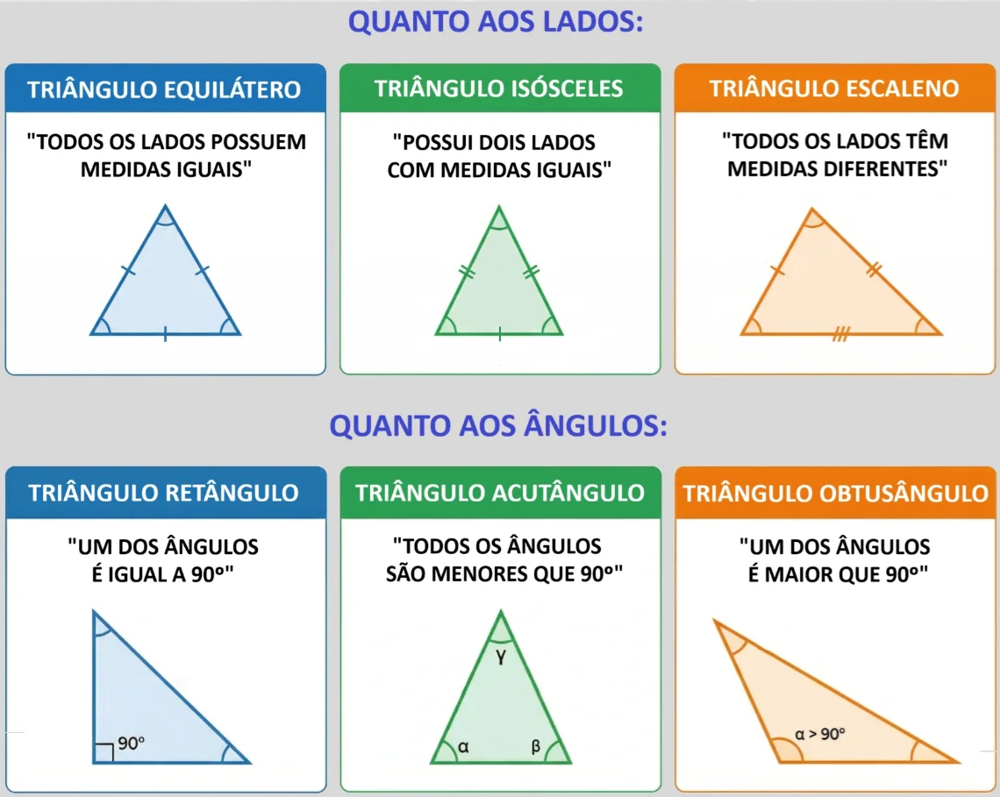

# Triângulos

## Conteúdo

- [Questões](#questions)
- **Resumos passivos:**
  - [Classificação de Triângulos](#classificacao-de-triangulos)
  - [Teorema de Pitágoras](#teorema-de-pitagoras)
<!---
[WHITESPACE RULES]
- Same topic = "10" Whitespace character.
- Different topic = "200" Whitespace character.
--->

<!--- ( Questões ) --->

---

## Questões

**TÍTULO:** Q4262441 | Ano: 2026 Banca: CPCON Órgão: UEPB Prova: CPCON - 2026 - UEPB - Auxiliar de Laboratório de Fotografia  
**LINK:** https://www.qconcursos.com/questoes-de-concursos/questoes/7fb4f122-a2  
**TÓPICO:** Geometria Plana , Ângulos - Lei Angular de Thales , Triângulos  
**STATUS:** 0/1  

DICAS

 

- Qual triângulo possui todos os lados diferentes? (x, 2x, 3x)

 
 

**TÍTULO:** Q3090700 | Ano: 2024 Banca: CPCON Órgão: Prefeitura de São José de Piranhas - PB Prova: CPCON - 2024 - Prefeitura de São José de Piranhas - PB - Nível Fundamental Incompleto  
**LINK:** https://www.qconcursos.com/questoes-de-concursos/questoes/21796b97-ae  
**TÓPICO:** Geometria Plana , Triângulos  
**STATUS:** 0/1  

DICAS

 

- Coloque esses dados na fórmula do perímetro de um triângulo:
  - P = a + b + c
- Encontre o valor de x.
- Encontre o dobro do valor de x:
  - 2x

RESPOSTA

 

  

 
 

**TÍTULO:** Q2540868 | Ano: 2024 Banca: CPCON Órgão: Prefeitura de Soledade - PB Prova: CPCON - 2024 - Prefeitura de Soledade - PB - Professor com Licenciatura em Matemática  
**LINK:** https://www.qconcursos.com/questoes-de-concursos/questoes/a82ccfda-46  
**TÓPICO:** Geometria Plana, Triângulos  
**STATUS:** 0/1  

DICAS

 

- Primeiro, separa todas as informações (dados);
- Calcule a inclinação da reta r e s;
- Use a condição de perpendicidade (aqui você encontra a);
- Calcul a área do triângulo.

RESPOSTA

 

  

 
 

**TÍTULO:** Q2540862 | Ano: 2024 Banca: CPCON Órgão: Prefeitura de Soledade - PB Prova: CPCON - 2024 - Prefeitura de Soledade - PB - Professor com Licenciatura em Matemática  
**LINK:** https://www.qconcursos.com/questoes-de-concursos/questoes/a81ecee2-46  
**TÓPICO:** Geometria Plana , Triângulos  
**STATUS:** 0/1  

DICAS

 

- Relações Métricas no Triângulo Retângulo
- Gabarito

<!--- ( Resumos passivos ) --->

---

## Classificação de Triângulos

  

---

## Teorema de Pitágoras

Em todo triângulo retângulo, o quadrado da medida da hipotenusa é igual à soma dos quadrados das medidas dos catetos. Isso pode ser representado da seguinte forma:

  

---

**Rodrigo** **L**eite da **S**ilva - **rodrigols89**
