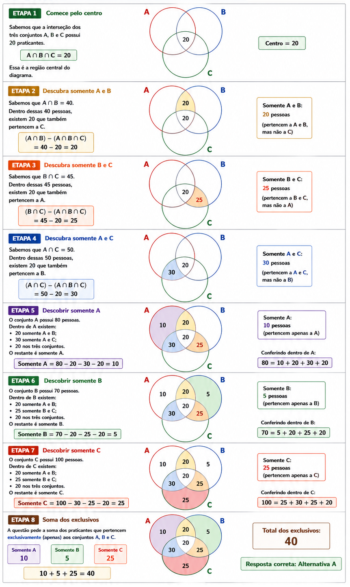
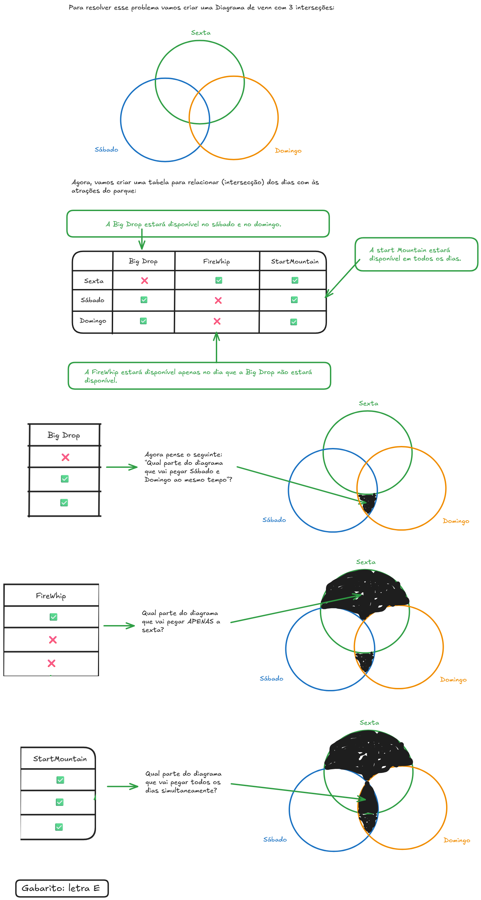

# Diagramas de Venn (Conjuntos)

## Conteúdo

- [CPCon](#cpcon)
- [IDECAN](#idecan)
<!---
[WHITESPACE RULES]
- Same topic = "10" Whitespace character.
- Different topic = "200" Whitespace character.
--->

<!--- ( CPCon ) --->

---

## CPCon

**TÍTULO:** Q3936423 | Ano: 2026 Banca: CPCON Órgão: Prefeitura de Cuité - PB Provas: CPCON - 2026 - Prefeitura de Cuité  
**LINK:** https://www.qconcursos.com/questoes-de-concursos/questoes/925e61ad-21  

DICAS

 

- Como usar uma equação para encontrar uma interseção de 3 conjuntos: (13 - x) + x + (15 - x) = 36 (A)
- OBS.: Lembre-se de subtrair as interseção de dois conjuntos (por exemplo, A e B) com a inserseção central antes de somar tudo.
- **Gabarito**

 
 

**TÍTULO:** Q4089317 | Ano: 2026 Banca: CPCON Órgão: UEPB Provas: CPCON - 2026 - UEPB - Contador Proad  
**LINK:** https://www.qconcursos.com/questoes-de-concursos/questoes/6d543bfd-5e  

DICAS

 

 - Como descobrir os exclusivos (somente A, somente B, somente C) de conjuntos;
 - Partindo de dentro interseção central para fora;
 - Sempre subtraindo de dentro para fora.

RESPOSTA

 

 
 

**TÍTULO:** Q4208375 | Ano: 2026 Banca: CPCON Órgão: Prefeitura de Zabelê - PB Provas: CPCON - 2026 - Prefeitura de Zabelê - PB - Assistente Social  
**LINK:** https://www.qconcursos.com/questoes-de-concursos/questoes/4dd96134-8c  

DICAS

 

- Como relacionar uma *Tabela de Interseção* com um *Diagrama de Venn*.

RESPOSTA

 

 
 

<!--- ( IDECAN ) --->

---

## IDECAN

**TÍTULO:** #3696523 | IDECAN - 2025 - Agente (DEGASE)/Segurança Socioeducativa/Masculino e Feminino  
**LINK:** https://www.tecconcursos.com.br/questoes/3696523  

DICAS

 

- Como criar um conjunto por compreensão?

RESPOSTA

 

Para resolver um problema de conjunto onde é dada uma regra (o conjunto é feito por compreensão), nós devemos montar esse conjunto a partir dessa regra:

- **A = { x ∣ x é par }**
  - A = {2, 4, 6, 8, 10, 12, 14, 16, 18, …}
- **B = { x ∣ x é múltiplo de 3 }**
  - B = { 3x1=3, 3x2=6, 3x3=9, 3x4=12, 3x5=15,  3x6=18,... }
  - B = {3, 6, 9, 12, 15, 18}
- **C = { x ∣ x é múltiplo de 6 }**
  - C = { 6x1=6, 6x2=12,  6x3=18,...}
  - C = {6, 12, 18}

> **NOTE:**  
> Como o intuito aqui não é apenas entender como montar um conjunto por compreensão (que segue uma regra), vamos resolver apenas a questão verdadeira.

Vejamos a alternativa **B**: $A ∩ B = C$

- A ∩ B = {6, 12, 18}  
- C = {6, 12, 18}
- A ∩ B = C (VERDADEIRO)

**Gabarito:** Letra B

 
 

**TÍTULO:** Q3494023 | Ano: 2025 Banca: IDECAN Órgão: SME de João Pessoa - PB Prova: IDECAN - 2025 - SME de João Pessoa - PB - Bibliotecário  
**LINK:** https://www.qconcursos.com/questoes-de-concursos/questoes/24587a5f-62  

DICAS

 

 - Como resolver um problema de “diferença de conjuntos”?

RESPOSTA

 

Antes de resolvermos essa operação, precisamos lembrar de algumas coisas (conceitos): 

 - A `união entre os conjuntos` **P** e **Q** é o conjunto formado por todos os elementos que pertencem a pelo menos um desses conjuntos;
 - A `interseção entre os conjuntos` **P** e **Q** é o conjunto formado por todos os elementos que pertencem simultaneamente a esses conjuntos;
 - A `diferença (P−Q)` **entre dois conjuntos**, nessa ordem, é o conjunto formado por:
   - Todos os elementos que pertencem ao primeiro (P) conjunto e não pertencem ao segundo conjunto (Q);

Ótimo, agora vamos identificar os conjunto que nós temos:

- A = {−2, 0, 4, 5}
- B = {−4, −3, 1, 5}
- C = {−1, 0, 3, 7}

Agora, a partir dos conjuntos acima nós devemos resolver a expressão lógica abaixo:

${ A – [ (A − B) \cap (C − A) ] } \cup (B – A)$

Vamos começar criando as `diferenças` necessárias:
 
- (A−B) = {−2,0,4}
- (C−A) = {−1,3,7}
- (B−A) = {−4,−3,1}

Substituindo, na expressão lógica nós teremos:

$\{ \{−2,0,4,5\} – [ \{−2,0,4\} \cap \{−1,3,7\} ] \} \cup \{−4,−3,1\}$

Resolvendo a interseção dos colchetes, ficaremos com:

$\{ {−2, 0, 4, 5} – ∅\} \cup \{−4, −3, 1\}$

Agora, resolvendo a diferença das chaves, vamos obter:

$\{−2, 0, 4, 5\} \cup \{−4, −3, 1\}$

Por último, fazendo a união dos conjuntos resultantes, ficaremos com o seguinte conjunto: 

$\{−4, −3, −2, 0, 1, 4, 5\}$
 
Notem que esse conjunto tem 7 elementos...
 
**Gabarito:** Letra B

 
 

**TÍTULO:** Q4011651 | Ano: 2026 Banca: IDECAN Órgão: UNILAB Provas: IDECAN - 2026 - UNILAB - Assistente Social  
**LINK:** https://www.qconcursos.com/questoes-de-concursos/questoes/ed6382a7-3f  

DICAS

 

 - Como resolver um problema de “complementar de conjuntos”?

RESPOSTA

 

- **O conjunto universo é:**
  - U = {1,2,3,4,5}
- **Os subconjuntos dados são:**
  - A = {1,2}
  - B = {2,4}

Primeiro, calculamos os complementares em relação ao conjunto universo.

- **O complementar de A é formado pelos elementos de U que não pertencem a A:**
  - $A^{C} = \{3,4,5\}$
- **O complementar de B é formado pelos elementos de U que não pertencem a B:**
  - $B^{C} = \{1,3,5\}$

Agora fazemos a união desses conjuntos:

$A^{C} \cup B^{C} = \{3,4,5\} \cup \{1,3,5\}$
 
A união de dois conjuntos é feita reunindo todos os elementos de ambos os conjuntos **sem repetir**:

$A^{C} \cup B^{C} = \{1,3,4,5\}$
 
Portanto, o conjunto obtido é **{1,3,4,5}**.

**Gabarito:** Letra D.

---

**Rodrigo** **L**eite da **S**ilva - **rodrigols89**

 

DICAS/RESPOSTA

- **TÍTULO:** .
- **LINK:** .

