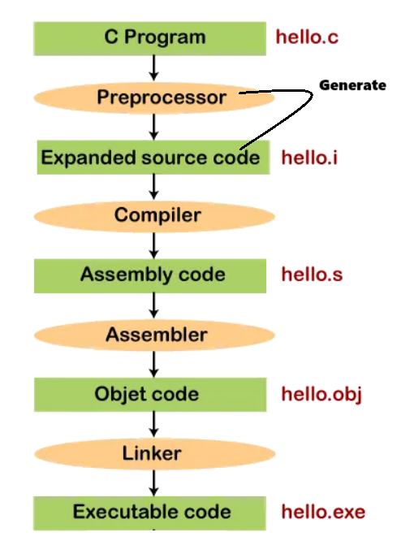
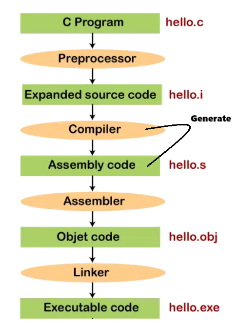
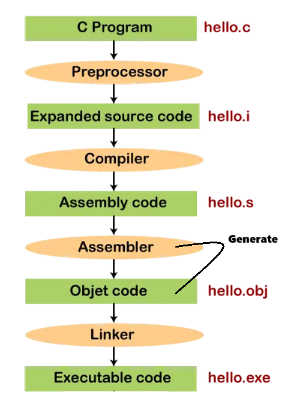
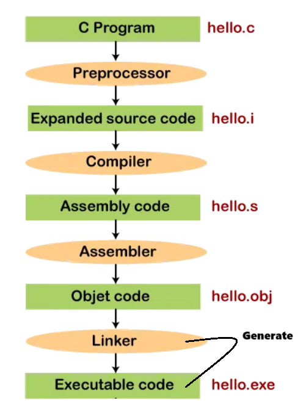
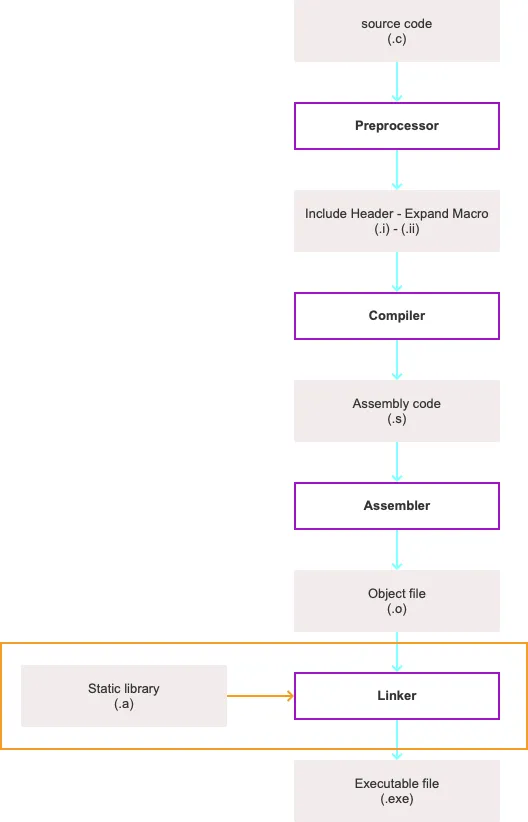
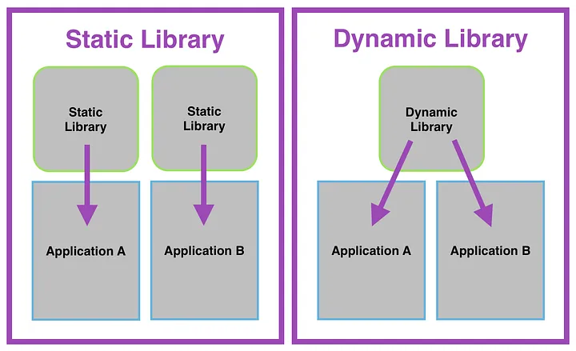

# Project Structure & Compilation Process

## Contents

 - [**Project Structure**](#intro-to-project-structure)
 - **Compilation Process:**
   - [Pre-processing (-E)](#intro-to-preprocessing)
   - [Compiling (-S)](#intro-to-compiling)
   - [Assembling (-c)](#intro-to-assembling)
   - [Linking (-o)](#intro-to-linking)
     - [Static Library (Compile Time)](#intro-to-static-libraries)
     - [Dynamic Library (Runtime)](#intro-to-dynamic-libraries)
 - [**Dependencies (External libraries)**](#intro-to-dependencies)
    - [Global Installation](#intro-to-global-installation)
    - [Local Installation](#intro-to-local-installation)
    - **Package Managers:**
      - **Conan:**
 - **Tools:**
   - **GNU Make:**
      - [Makefile (targets:prerequisites/command(s), variables, and wildcard functions)](#intro-to-makefile)
 - [**References**](#ref)


<!--- ( Project Structure ) --->

---

<div id="intro-to-project-structure"></div>

## Project Structure

 - **lib:**
   - Any libs that get compiled by the project, *third party (terceiros)* or any needed in development.
 - **src:**
   - The application and only the application’s source files.
 - **include:**
   - All project header files.
   - All necessary *third-party (terceiros)* header files that do not exist under `/usr/local/include` are also placed here.
   - A folder that contains the publicly distributed `.h (header files)` for a library to be included in another application, required to use a library or DLL.
 - **test:**
   - All test code files.
 - **build:**
   - This folder contains all *object files*, and is removed on a *clean*.
 - **bin:**
   - The **"bin/"** folder contains the compiled `.DLL` file or (sometimes) `.lib` or the executable application or `.exe` file — the *“binary”*.
 - **doc:**
   - All documentation files.


<!--- ( Compilation Process ) --->

---

<div id="intro-to-preprocessing"></div>

## Pre-processing (-E)

In the **Pre-processing** stage of compiling a C++ program, several tasks are performed.

For example:

 - **Header inclusion:**
   - The contents of header files (specified using `#include` directives) are copied into the source code.
 - **Macro expansion:**
   - Macros defined using `#define` are replaced with their corresponding code.
 - **Conditional compilation:**
   - Directives like `#ifdef`, `#ifndef`, `#else`, `#elif`, and `#endif` are processed to *include* or *exclude* code based on certain conditions.
 - **File inclusion:**
   - Files specified with `#include` are processed, including nested includes.
 - **Comments removal:**
   - Comments (both single-line `//` and multi-line `/* */`) are removed from the code.
 - **Whitespace removal:**
   - Extra *whitespaces* and *tabs* are condensed to a single space.
 - **Line continuation:**
   - The backslash `\` at the end of a line is used for line continuation, and it is processed by combining the current line with the next one.
 - **Character set conversion:**
   - Characters are converted to the appropriate character set if needed.
 - **Pragma processing:**
   - Directives like `#pragma` are processed, which provide compiler-specific instructions.
 - **Assertion handling:**
   - `#assert` statements are checked, and if the specified condition is false, an error message is generated.

  

For example, imagine we have the [Calculator](Calculator/) project:

**Project Structure:**
```md
Calculator/
  include/
    - div.h
    - mult.h
    - sub.h
    - sum.h
  src/
    - div.cpp
    - mult.cpp
    - sub.cpp
    - sum.cpp
```

To preprocess the project above, let's use the **"g++"** compiler on the project root folder (`./`) with the following command:

```bash
mkdir -p build && \
g++ -E -I./include src/div.cpp -o build/div_preprocessed.i && \
g++ -E -I./include src/mult.cpp -o build/mult_preprocessed.i && \
g++ -E -I./include src/sub.cpp -o build/sub_preprocessed.i && \
g++ -E -I./include src/sum.cpp -o build/sum_preprocessed.i
```

 - `mkdir -p`
   - The **"mkdir"** command is used to create directories (folders) in a filesystem.
   - The `-p` option (flag) stands for "parents" and is used to create parent directories as needed:
     - It ensures that if the specified directory path doesn't exist, it and all its necessary parent directories are created.
 - `-E`
   - The `-E` option (flag) instructs the compiler to stop after the preprocessing stage.
   - Instead of generating compiled code, it outputs the preprocessed code to the standard output (stdout) or a specified file.
 - `-I./include`
   - The `-I` option (flag) is used with the *gcc/g++* compiler to specify the directories where it should look for header files.
   - When you include header files in your source code using `#include`, the compiler needs to know where to find those files. The `-I` option (flag) allows you to provide one or more directory paths where the compiler should search for included headers.
 - `-o`
   - The `-o` option (flag) is used with the *gcc/g++* compiler to specify the output file name.

**NOTE:**  
See that in the **"buil/"** directory we have the **".i"** files with the preprocessed code.

---

<div id="intro-to-compiling"></div>

## Compiling (-S)

> The second stage of *compilation* is the **"compilation"** too. The code created by **"the preprocessor is translated to assembly instructions specific."** It is an intermediate human readable language.

  

To translate the preprocessed code to assembly instructions, we can use the **"g++"** with the **"-S"** flag:

```bash
g++ -S processed.i -o assembly.s
```

**NOTE:**  
Here, we can also use the **"-o"** flag to save the assembly code in a file.

---

<div id="intro-to-assembling"></div>

## Assembling (-c)

For this third stage, **the assembly code (that we have make in the previous steps) is translated to object code**.

> **NOTE:**  
> An object code, it’s only composed **"0"** and **"1"**.

  

To translate the assembly code to object code, we can use the **"g++"** with the **"-c"** flag:

```bash
g++ -c assembly.s -o objectcode.o
```

**NOTE:**  
Here, we can also use the **"-o"** flag to save the assembly code in a file.

---

<div id="intro-to-linking"></div>

## Linking (-o)

> Finally, the linking stage produce an executable program.

To do an executable:

 - The existing pieces have to be rearranged.
 - And the missing ones filled in (as que faltam, preenchidas).

The linker will arrange the piece of object code. For example, he add pieces containing the instructions for library functions.

  
  


To translate the object code to executable, we can use the **"g++"** with the **"-o"** flag:

For example:

**Translate the assembly code to object code:**
```bash
g++ -c assembly-01.s -o objectcode-01.o
g++ -c assembly-02.s -o objectcode-02.o
```

**Linking all the object codes (in the same folder):**
```bash
g++ *.o -o exe.out

or

g++ objectcode-01.o objectcode-02.o -o exe.out
```

**NOTE:**  
Before the **"-o"** *flag* was used to generate files to specific outputs. Here is used to generate an executable.

As our program has only one file to link we'll generate an executable with only him:

```bash
g++ objectcode.o -o printy.out
```

**Run the executable:**
```bash
./printy.out
```

**OUTPUT:**
```bash
Result: 25
```

---

<div id="intro-to-static-libraries"></div>

## Static Library (Compile Time)

A **"Static Library"** or **"statically-linked library"** or **"archives"** is a collection of object files that are `linked into the program during the linking phase` of compilation *(4th and last phase compilation process)*.

For example, see the image below to understand more easily:

  

**NOTE:**  
See that a Static Library has **".a"** extension.

> **Ok, but how to create a Static Library and how to use them?**

First, we need to specify to the compiler that we want to compile all files `(*.c/cpp)` into object files `(*.o)` **without linking** with the command below:

```bash
g++ -Wall -pedantic -Werror -Wextra -std=c++20 -c *.cpp
```

Flag description:

 - `g++`
   - The compiler used.
 - `-Wall -pedantic -Werror -Wextra`
   - Generate better code.
 - `-std=c++20`
   - Determine the language standard.
 - `-c`
   - *Compile* and *Assemble* **without link**.
 - `*.cpp`
   - Select all the files with `.cpp` extension in the same folder.

For example, imagine we have the following codes:

[sum_library.h](src/static-library-ex01/sum_library.h)
```cpp
#ifndef SUM_LIBRARY_H
#define SUM_LIBRARY_H

class SumLibrary
{
public:
    static int sum(int a, int b);
};

#endif
```

[sum_library.cpp](src/static-library-ex01/sum_library.cpp)
```cpp
#include "sum_library.h"

int SumLibrary::sum(int a, int b)
{
    return a + b;
}
```

Ok, we have a static library to work with, now let's translate it to object code:

```bash
g++ -Wall -pedantic -Werror -Wextra -std=c++20 -c *.cpp
```

Now, let's check:

**INTPUT:**
```bash
ls
```

**OUTPUT:**
```bash
sum_library.cpp  sum_library.h  sum_library.o
```

Now, let's create the **Static Library (".a")** using the **"ar (archive program)"** command:

```bash
ar -rc libsum.a *.o
```

Flag description:

 - `ar`
   - Archive program.
 - `-rc`
   - “r” insert the files into archive but if any file previously existing are deleted before and then added;
   - “c” create the archive if it did not already exist.
 - `libsum`
   - “lib” + name of the library.
 - `.a`
   - Extension of a library.
 - `*.o`
   - Puts copies of the object files in the library.

To check how many *object files (.o)* the Static Library has, we can use the following command:

**INPUT:**
```bash
ar -t libsum.a
```

**OUTPUT:**
```bash
sum_library.o
```

Now, we need to *index the library*. This index is later used by the compiler to speed up symbol_lookup inside the library:

```bash
ranlib libsum.a
```

**ranlib:**  
The command *"ranlib"* that generate an index to an archive.

**NOTE:**  
Ok, now the library is created and to use it in a program we need only add the library in the *link stage.*

For example, imagine we have the following **main.cpp** that use our Static Library:

[main.cpp](src/static-library-ex01/main.cpp)
```cpp
#include <iostream>
#include "sum_library.h"

int main()
{
    int result = MyLibrary::sum(3, 4);
    std::cout << "The sum is: " << result << std::endl;

    return 0;
}
```

Now, let's create an executable that use our Static Library:

```bash
g++ main.cpp -L. -lsum -o sumProgram.out
```

Flag description:

 - `gcc`
   - The compiler.
 - `main.c`
   - Source code whose the function *sum()* is used.
 - `-L.`
   - Tells the linker to use the library in the given directory, the **“.”** means the current directory.
 - `-l`
   - Specify the library.
 - `sum`
   - The name of the library omitted the **“lib”** prefix and the **“.a”** extension.
 - `-o`
   - Rename the program.
 - `sumProgram.out`
   - Name of the executable.

Now, let's run the program (executable):

**INPUT:**
```bash
./sumProgram.out 
```

**OUTPUT:**
```bash
The sum is: 7
```

### Advantages & Disadvantages

 - **Advantage:**
   - **Speed:** Static libraries are linked into the executable file at *compile time*, which can improve performance by eliminating the need to load and unload the library at runtime.
   - **Security:** Static libraries are more secure than dynamic libraries, as they cannot be modified without recompiling the application.
   - **Stability:** Static libraries are more stable than dynamic libraries, as they are not affected by changes to the library itself or to other applications that use the library.
   - **Static Dependency Resolution:** All dependencies are resolved during *compile-time*, avoiding potential conflicts or errors during runtime.
   - **Deployment Ease:** Application deployment is straightforward since the executable contains all necessary dependencies, eliminating the need for additional libraries on the target system.
   - **Precise Version Control:** Developers have precise control over the version of the library used, reducing the risk of incompatibilities.
 - **Disadvantage:**
   - **Complexity:** Static libraries can make it more difficult to debug and troubleshoot applications, as the library code is embedded in the executable file.
   - **Size:** Static libraries can increase the size of the executable file, which can make it more difficult to distribute and deploy the application.
   - **Portability:** Static libraries can reduce the portability of applications, as they are not portable across different platforms.
   - **More Challenging Updates:** Updating the library requires recompilation and redistribution of the entire application, which can be more time-consuming and complex.
   - **Longer Compilation Times:** Compilation times can be longer, especially in large projects, due to the inclusion of library code directly into the executable.
   - **Higher Memory Usage:** If multiple applications use the same static library, memory overhead may be higher as each application has its copy of the library.

---

<div id="intro-to-dynamic-libraries"></div>

## Dynamic Library (Runtime)

> A **Dynamic Library** or **Shared Library** is a collection of `object file` witch are launched only `during program execution (Runtime)`.

 - A link is created between shared library and executable file. It means that a shared library can be used by any program that needs it.
 - If the library code is updated, it’s not necessary to recompile. It’s location doesn’t move. This method permit to make a green code using less memory.

For example, see the image below to understand more easily:

  

> **Ok, but how to create a Dynamic Library (Shared Library) and how to use them?**

First, we need to specify to the compiler that we want to compile all files `(*.c/cpp)` into object files `(*.o)` **without linking** with the command below:

```bash
g++ -Wall -pedantic -Werror -Wextra -std=c++20 -fPIC -c *.cpp
```

Flag description:

 - `g++`
   - The compiler used.
 - `-Wall -pedantic -Werror -Wextra`
   - Generate better code.
 - `-std=c++20`
   - Determine the language standard.
 - `fPIC`
   - Position Independent Code, makes addresses in machine code.
 - `-c`
   - *Compile* and *Assemble* **without link**.
 - `*.cpp`
   - Select all the files with `.cpp` extension in the same folder.

For example, imagine we have the following codes:

[sum_library.h](src/static-library-ex01/sum_library.h)
```cpp
#ifndef SUM_LIBRARY_H
#define SUM_LIBRARY_H

class SumLibrary
{
public:
    static int sum(int a, int b);
};

#endif
```

[sum_library.cpp](src/static-library-ex01/sum_library.cpp)
```cpp
#include "sum_library.h"

int SumLibrary::sum(int a, int b)
{
    return a + b;
}
```

Ok, we have a **Dynamic Library (Shared Library)** to work with, now let's translate it to object code:

```bash
g++ -Wall -pedantic -Werror -Wextra -std=c++20 -fPIC -c *.cpp
```

Now, let's check:

**INTPUT:**
```bash
ls
```

**OUTPUT:**
```bash
sum_library.cpp  sum_library.h  sum_library.o
```

Now, let's create the **Dynamic Library (Shared Library)** using the **"g++"** with the **"-shared"** flag:

```bash
g++ -shared -o libsum.so *.o
```

Flag description:

 - `g++`
   - The compiler.
 - `-shared`
   - Produce a shared object which can then be linked with other objects to form an executable.
 - `-o`
   - Rename the program.
 - `libsum`
   - “lib” + name of the library.
 - `.so`
   - Extension of a Dynamic Library.
 - `*.o`
   - Puts copies of the object files in the library.

To check how many *object files (.so)* the **Dynamic Library (Shared Library)** has, we can use the following command:

**INPUT:**
```bash
nm -D libsum.so
```

**OUTPUT:**
```bash
                 w __cxa_finalize@GLIBC_2.2.5
                 w __gmon_start__
                 w _ITM_deregisterTMCloneTable
                 w _ITM_registerTMCloneTable
00000000000010fa T _ZN10SumLibrary3sumEii
```

**NOTE:**  
Ok, now the library is created and to use it in a program we need only add the library in the *link stage.*

For example, imagine we have the following **main.cpp** that use our **Dynamic Library (Shared Library)**:

[main.cpp](src/static-library-ex01/main.cpp)
```cpp
#include <iostream>
#include "sum_library.h"

int main()
{
    int result = MyLibrary::sum(3, 4);
    std::cout << "The sum is: " << result << std::endl;

    return 0;
}
```

Different of the *Static Library*, the **Dynamic Library (Shared Library)** first, need to add the location of the Dynamic Library into the environment variable:

```bash
export LD_LIBRARY_PATH=.:$LD_LIBRARY_PATH
```

 - `export`
   - Set export attribute for sheel variables.
 - `LD_LIBRARY_PATH`
   - The name of environment variable.
 - `.:`
   - The current directory.
 - `::`
   - The separator
 - `$LD_LIBRARY_PATH`
   - The exit status of the command.

Finally, let's compile the **main.cpp** file with the **Dynamic Library (Shared Library)**:

```bash
g++ main.cpp -L. -lsum -o sumProgram.out
```

Flag description:

 - `gcc`
   - The compiler.
 - `main.c`
   - Source code whose the function *sum()* is used.
 - `-L.`
   - Tells the linker to use the library in the given directory, the **“.”** means the current directory.
 - `-l`
   - Specify the library.
 - `sum`
   - The name of the library omitted the **“lib”** prefix and the **“.a”** extension.
 - `-o`
   - Rename the program.
 - `sumProgram.out`
   - Name of the executable.

Now, let's use the **"ldd"** command to check the dependencies of the **Dynamic Library (Shared Library)**:

> **NOTE:**  
> **ldd (List Dynamic Dependencies)** is a Unix utility that prints the shared libraries required by each program or shared library specified on the command line. 

**INPUT:**
```bash
ldd sumProgram.out
```

**OUTPUT:**
```bash
linux-vdso.so.1 (0x00007ffd52cc1000)
libsum.so => ./libsum.so (0x00007fdc0bc68000)
libstdc++.so.6 => /lib/x86_64-linux-gnu/libstdc++.so.6 (0x00007fdc0ba00000)
libm.so.6 => /lib/x86_64-linux-gnu/libm.so.6 (0x00007fdc0b919000)
libgcc_s.so.1 => /lib/x86_64-linux-gnu/libgcc_s.so.1 (0x00007fdc0bc35000)
libc.so.6 => /lib/x86_64-linux-gnu/libc.so.6 (0x00007fdc0b600000)
/lib64/ld-linux-x86-64.so.2 (0x00007fdc0bc6f000)
```

Now, let's run the program (executable):

**INPUT:**
```bash
./sumProgram.out 
```

**OUTPUT:**
```bash
The sum is: 7
```

### Advantages & Disadvantages

 - **Advantage:**
   - **Smaller Executable Size:** Dynamic libraries are separate from the executable, resulting in smaller executable sizes, especially when multiple applications share the same library.
   - **Portability:** Dynamic libraries are portable across different platforms, as they are not embedded in the executable file.
   - **Complexity:** Dynamic libraries can make it easier to debug and troubleshoot applications, as the library code is not embedded in the executable file.
   - **Easier Updates:** Updating the library is simpler as it can be replaced *without recompiling* the entire application. This facilitates patching and version upgrades.
   - **Memory Efficiency:** Dynamic libraries can be shared among multiple processes, reducing memory usage as the library is loaded into memory only once.
   - **Run-Time Linking:** *Dynamic linking* allows resolving library dependencies at *runtime*, providing flexibility and the ability to load libraries on demand.
   - **Dynamic Loading and Unloading:** Dynamic libraries can be loaded and unloaded at runtime, enabling features like plugin systems and dynamic extensions.
 - **Disadvantage:**
   - **Dependency Management:** Dependency on external libraries introduces the need to manage and distribute additional library files along with the application.
   - **Deployment Complexity:** Deploying applications using dynamic libraries can be more complex as users need to ensure that the required libraries are available on their systems.
   - **Potential Version Conflicts:** Version conflicts may arise if multiple applications require different versions of the same dynamic library, leading to compatibility issues.
   - **Stability:** Dynamic libraries can be less stable than static libraries, as they are affected by changes to the library itself or to other applications that use the library.


<!--- ( Dependencies (External libraries) ) --->

---

<div id="intro-to-dependencies"></div>

## Dependencies (External libraries)

External libraries are a great way to add functionality to your C++ projects. They can provide access to new features, such as *graphics*, *networking*, or *database access*.

There are two main ways to install external libraries in C++:

 - Globally.
 - Locally.


---

<div id="intro-to-global-installation"></div>

## Global Installation

If you install a external library globally, it will be available to any C++ project on your Operating System.

 - **Advantages:**
   - **Easy to use:** Once you install an external library globally, you can use it in any C++ project on your Operating System.
   - **No need to modify project settings:** The compiler will automatically find the library when you compile your project.
   - **Centralized Updates:** Updates to the library can be applied globally, ensuring consistency across all projects using the library.
 - **Disadvantages:**
   - **Can conflict with other libraries:** If you install multiple external libraries globally, they may conflict with each other. This can lead to compile errors or runtime errors.
   - **Can be difficult to uninstall:** Once you install an external library globally, it can be difficult to uninstall it. This is because the library may be used by other applications on your Operating System.
   - **Potential Clashes:** Incompatibility issues may arise if different projects require different versions of the library.

---

<div id="intro-to-local-installation"></div>

## Local Installation

If you install a external library locally, it will only be available to your current C++ project.

 - **Advantages:**
   - **Less likely to conflict with other libraries:** Because local libraries are installed in a specific directory, they are less likely to conflict with other libraries installed globally.
   - **Easier to uninstall:** Local libraries are typically installed in a directory that you can easily access. This makes them easier to uninstall than global libraries.
   - **Version Control:** Each project can use its version of the library, allowing precise control over dependencies.
 - **Disadvantages:**
   - **Can be more difficult to use:** You must manually specify the location of the library when you compile your project.

To use an external library (dependency) we need:

 - The library *header(s)* `(.h)` file(s).
 - If the Library is:
   - *Static:* We nee the `.lib (Windows)` files or the `.a (Linux)` files.
   - *Dynamic:* We need the `DLLs (Windows)` or `.so (Linux)` files.

Normally these files are saved:

 - `header(s) (.h)`
   - Saved in `include` at the same level as `main.cpp`.
 - **Library files:** `.lib`, `.a,` `.dll`, .`.so`
   - Saved in the `lib/` or `bin/` folder.
 - `Object Files (.o)`
   - The object files generated by compilation are frequently saved in the `build/`, `bin/`, or `obj/` folder.

x


g++ main.cpp -o window.out -I./include -L./libs -lSDL2
g++ main.cpp -o window.out -I./include -L./build -lSDL2


---

<div id=""></div>

## x

x


<!--- ( Compilation/Tools/GNU Make ) --->

---

<div id="intro-to-makefile"></div>

## Makefile (targets:prerequisites/command(s), variables, and wildcard functions)

A makefile consist:

 - **targets:prerequisites**
   - command<sub>1</sub>
   - command<sub>2</sub>
   - ...
   - command<sub>n</sub>
 - **variables.**
 - **wildcard functions.**

Let's get started with **targets:prerequisites/command(s)**:

 - **target:**
   - **target** is the name of the ***action*** you want to execute.
   - Or usually the name of the file you want to produce.
 - **prerequisites:**
   - Are files that are used as input to create the *target*.
 - **command(s)**:
   - Are operations run to generate or help the **"prerequisites"**.

For example, imagine we have the following files (program):

**helloWorld.h**
```cpp
#ifndef _H_TESTE
#define _H_TESTE

void helloWorld();
```

**helloWorld.c**
```cpp
#include <stdio.h>
#include <stdlib.h>

void helloWorld(void){
    printf("Hello World!\n");
}
```

**main.c**
```cpp
#include <stdlib.h>
#include "helloWorld.h"

int main(){
    helloWorld();
    return (0);
}
```

Now, imagine we need to compile these files. We can use a makefile to do it:

**makefile**
```makefile
printy: main.o helloWorld.o
    gcc -o printy main.o helloWorld.o

main.o: main.c helloWorld.h
    gcc -o main.o main.c -c -W -Wall -ansi -pedantic

helloWorld.o: helloWorld.c helloWorld.h
    gcc -o helloWorld.o helloWorld.c -c -W -Wall -ansi -pedantic

clean:
    rm -rf *.o *~ printy
```

See that:

 - **printy** depends on → **main.o** and **helloWorld.o**:
   - And run the command **"gcc -o printy main.o helloWorld.o"** to help.
 - **main.o** depends on → **main.c** and **helloWorld.h**:
   - And run the command **"gcc -o main.o main.c -c -W -Wall -ansi -pedantic"** to help.
 - **helloWorld.o** depends on → **helloWorld.c** and **helloWorld.h**:
   - And run the command **"gcc -o helloWorld.o helloWorld.c -c -W -Wall -ansi -pedantic"** to help.
 - Finally, we have a command (target) **"clean"**:
   - How this command (target) has no prerequisites we just run this command (target) with: **"make clean"**.
   - This command is useful to remove unnecessary files.

**NOTE:**  
If you pay attention you can see that we have repeat many times the command **"gcc"**. To solve that, we can create a variable to represent this value.

 - **Variable syntax:**
   - VAR_NAME=value
 - **To use:**
   - $(VAR_NAME)

For example:

**makefile**
```makefile
# Variables
COMPILER=gcc

printy: main.o helloWorld.o
    $(COMPILER) -o printy main.o helloWorld.o

main.o: main.c helloWorld.h
    $(COMPILER) -o main.o main.c -c -W -Wall -ansi -pedantic

helloWorld.o: helloWorld.c helloWorld.h
    $(COMPILER) -o helloWorld.o helloWorld.c -c -W -Wall -ansi -pedantic

clean:
    rm -rf *.o *~ printy
```

Now, if we change the compiler we need just  modify the value in the **"COMPILER"** variable.

**NOTE:**  
See also we have the argument **"-o"** and **"-c -W -Wall -ansi -pedantic"** used in many cases. That's, we can create variables for them:

**makefile**
```makefile
# Variables
COMPILER=gcc
ARGS=-o

# Flags for compiler
CC_FLAGS=-c         \
         -W         \
         -Wall      \
         -ansi      \
         -pedantic

printy: main.o helloWorld.o
    $(COMPILER) $(ARGS) printy main.o helloWorld.o

main.o: main.c helloWorld.h
    $(COMPILER) $(ARGS) main.o main.c $(CC_FLAGS)

helloWorld.o: helloWorld.c helloWorld.h
    $(COMPILER) $(ARGS) helloWorld.o helloWorld.c $(CC_FLAGS)

clean:
    rm -rf *.o *~ printy
```

**NOTE:**  
We can also call these *targets (printy, main.o, helloWorld.o, clean)* separated, for example:

```bash
make printy
make main.o
make helloWorld.o
make clean
```

> **NOTE:**  
> However, if we call **"make printy"** he will call your prerequisites, that will call your prerequisites, and so on (e assim por diante/sucessivamente).

Knowing that, is common to create a *main target (e.g. "all")* e call just him. For example:


```makefile
# Variables
COMPILER=gcc
ARGS=-o

# Flags for compiler
CC_FLAGS=-c         \
         -W         \
         -Wall      \
         -ansi      \
         -pedantic

all:printy

printy: main.o helloWorld.o
    $(COMPILER) $(ARGS) printy main.o helloWorld.o

main.o: main.c helloWorld.h
    $(COMPILER) $(ARGS) main.o main.c $(CC_FLAGS)

helloWorld.o: helloWorld.c helloWorld.h
    $(COMPILER) $(ARGS) helloWorld.o helloWorld.c $(CC_FLAGS)

clean:
    rm -rf *.o *~ printy
```

```bash
make all
```

**NOTE:**
Another problem is that we have many files **"o."**, **".c"**, and **".h"**. How we can call all at once (de uma vez)?

**Using "wildcard functions":**  
To solve that we can use the **wildcard "*"**, for example see the code below:

**NOTE: Esse exemplo não está completo, pois não usa wildcard "%", mas em breve retornare aqui para arrumar, quando eu aprender como utiliza-lo:**
```makefile
# Variables
PROJ_NAME=printy
COMPILER=gcc
ARGS=-o

# .c files.
C_SOURCE=$(wildcard *.c)

# .h files.
H_SOURCE=$(wildcard *.h)

# Object files.
OBJ=$(C_SOURCE:.c=.o)

all:$(PROJ_NAME)

printy: main.o helloWorld.o
    $(COMPILER) $(ARGS) printy main.o helloWorld.o

main.o: main.c helloWorld.h
    $(COMPILER) $(ARGS) main.o main.c $(CC_FLAGS)

helloWorld.o: helloWorld.c helloWorld.h
    $(COMPILER) $(ARGS) helloWorld.o helloWorld.c $(CC_FLAGS)

clean:
    rm -rf *.o $(PROJ_NAME) *~
```

See that, we are grouping by file:

 - **NOTE:** In this example we create a variable (PROJ_NAME) to store the project name.
 - **All ".c":**
   - `C_SOURCE=$(wildcard *.c)`
 - **All ".h":**
   - `H_SOURCE=$(wildcard *.h)`
 - **All ".o":**
   - `OBJ=$(C_SOURCE:.c=.o)`
   - See that here depend on all `".c"=C_SOURCE`.


<!--- ( Compilation/Tools/CMake ) --->

---

<div id="intro-to-cmake"></div>

# Intro to CMake

> **CMake is a compiler generator system.**

**What?**  
For example, CMake can be used to generate a makefile for your project automatically.

 - In truth, the CMake tool generates a makefile and many auxiliary files.
 - We need a file called *CMakeLists.txt* to set up our project in the same folder as our program files. For example:
   - MyProject:
     - calc.h
     - calc.cpp
     - main.cpp
     - CMakeLists.txt
 - As many files are generated by CMake is recommended to create a folder to put these files. For example:
   - MyProject:
     - **Debug/** For debug compilation.
     - **Release/** For release compilation.
     - calc.h
     - calc.cpp
     - main.cpp
     - CMakeLists.txt

To generate these files we need go to the **"Debug/"** or **"Release"** folder and run the following commands:

**Debug:**
```bash
cd Debug/

cmake -DCMAKE_BUILD_TYPE=Debug ../
```

**Release:**
```bash
cd Release/

cmake -DCMAKE_BUILD_TYPE=Release ../
```

---

<div id="cmake-minimum-required"></div>

## cmake_minimum_required()

Any project's top most **CMakeLists.txt** must start by specifying a minimum CMake version using the **cmake_minimum_required()** command.

```c
cmake_minimum_required(VERSION <min>[...<policy_max>] [FATAL_ERROR])
```

**NOTE:**  
> - **ENG -** This establishes policy settings and ensures that the following CMake functions are run with a compatible version of CMake.
> - **PT -** Isso estabelece configurações de política e garante que as seguintes funções do CMake sejam executadas com uma versão compatível do CMake.

**Useful Links:**  
[cmake_minimum_required](https://cmake.org/cmake/help/latest/command/cmake_minimum_required.html#command:cmake_minimum_required)

**Real example:**
```c
cmake_minimum_required(VERSION 3.27.0)
```

---

<div id="project"></div>

## project()

> To start a project, we use the **project()** command to set the project name.

 - This call is required with every project and should be called soon after *cmake_minimum_required()*.
 - As we will see later, this command can also be used to specify other project level information such as the language or version number.

```c
project(<PROJECT-NAME> [<language-name>...])
project(<PROJECT-NAME>
        [VERSION <major>[.<minor>[.<patch>[.<tweak>]]]]
        [DESCRIPTION <project-description-string>]
        [HOMEPAGE_URL <url-string>]
        [LANGUAGES <language-name>...])
```

**Useful Links:**  
[project](https://cmake.org/cmake/help/latest/command/project.html#command:project)

**Real example:**
```c
cmake_minimum_required(VERSION 3.27.0)
project(studies)
```

---

<div id="add-executable"></div>

## add_executable()

> The **add_executable()** command tells CMake to create an *executable* using the specified source code files.

**Normal Executables:**
```c
add_executable(<name> [WIN32] [MACOSX_BUNDLE]
               [EXCLUDE_FROM_ALL]
               [source1] [source2 ...])
```

**Imported Executables:**
```c
add_executable(<name> IMPORTED [GLOBAL])
```

**Alias Executables:**
```c
add_executable(<name> ALIAS <target>)
```

**Useful Links:**  
[add_executable](https://cmake.org/cmake/help/latest/command/add_executable.html#normal-executables)

**Real example:**
```c
cmake_minimum_required(VERSION 3.27.0)
project(studies)
add_executable(studies tutorial.cxx)
```


<!--- ( References ) --->

---

<div id="ref"></div>

## References

 - **Project Structure:**
   - [A Simple C++ Project Structure](https://hiltmon.com/blog/2013/07/03/a-simple-c-plus-plus-project-structure/)
   - [What is a general C++ project structure like?](https://www.linkedin.com/pulse/what-general-c-project-structure-like-herbert-elwood-gilliland-iii/)
 - **Compilation Process:**
   - [The compilation process in C](https://medium.com/@elodieriou/the-compilation-process-in-c-b4325a4dd953)
   - [The Static libraries in C](https://medium.com/@elodieriou/the-static-libraries-in-c-d310dd7086d3)
   - [The Dynamic libraries in C](https://medium.com/@elodieriou/the-dynamic-libraries-in-c-d5cd1a78b937)
 - **GNU Make:**
   - [Introdução ao Makefile](https://embarcados.com.br/introducao-ao-makefile/)

---

Ro**drigo** **L**eite da **S**ilva - **drigols**


cmake /caminho/do/codigo-fonte/da/SDL
make

6. Instalar (opcional):
Se desejar, você pode instalar a biblioteca compilada no sistema. Isso geralmente não é necessário, a menos que você queira compartilhar a biblioteca com outros projetos ou torná-la global no sistema.

sudo make install

Calculator
 - lib
 - include
   - sum.h
   - sub.h
   - mult.h
   - div.h
 - src
   - sum.cpp
   - sub.cpp
   - mult.cpp
   - div.cpp
