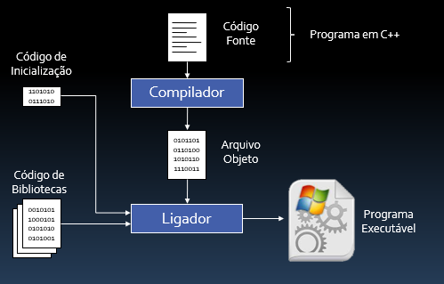

# Fluxo em um programa em C++

## Conteúdo

 - [01 - Fluxo básico de um programa em C++](#intro)

---

## 01 - Fluxo básico de um programa em C++

Bem, resumidamente, **O  fluxo básico de um programa em C++** é o seguinte:

  

Vejam que no fluxo acima nós:

 - 01 - Começamos com o código fonte;
 - 02 - Depois enviamos o código fonte para o **compilador**;
 - 03 - O Compilador gera um *arquivo objeto*;
 - 04 - Depois enviamos esse *arquivo objeto* para o **ligador**;
 - 05 - O **ligador** por sua vez vai juntar todos os arquivos necessários:
   - 05.1 - Arquivo objeto:
     - Que foi resultado da nossa compilação.
   - 05.2 - Código de inicialização:
     - Código que todo programa em c++ necessita.
   - 05.3 - Código de bibliotecas:
     - Código de bibliotecas externas ou internas que o nosso programa vai utilizar.

---

**REFERÊNCIAS:**  
[Curso C++ | Aula 01 | Ambiente de Trabalho | Visual Studio | Compilação, Depuração e Erros](https://www.youtube.com/watch?v=33TBhCOjInc&t=3893s)

---

**Rodrigo Leite -** *drigols*
