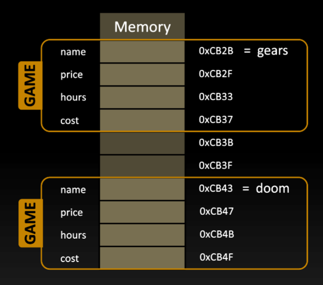
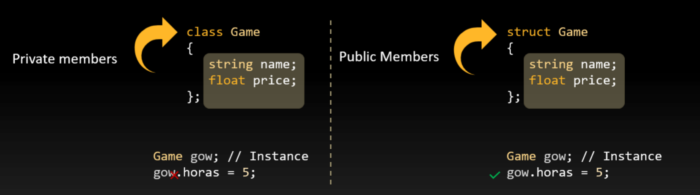
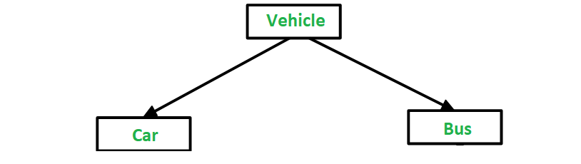
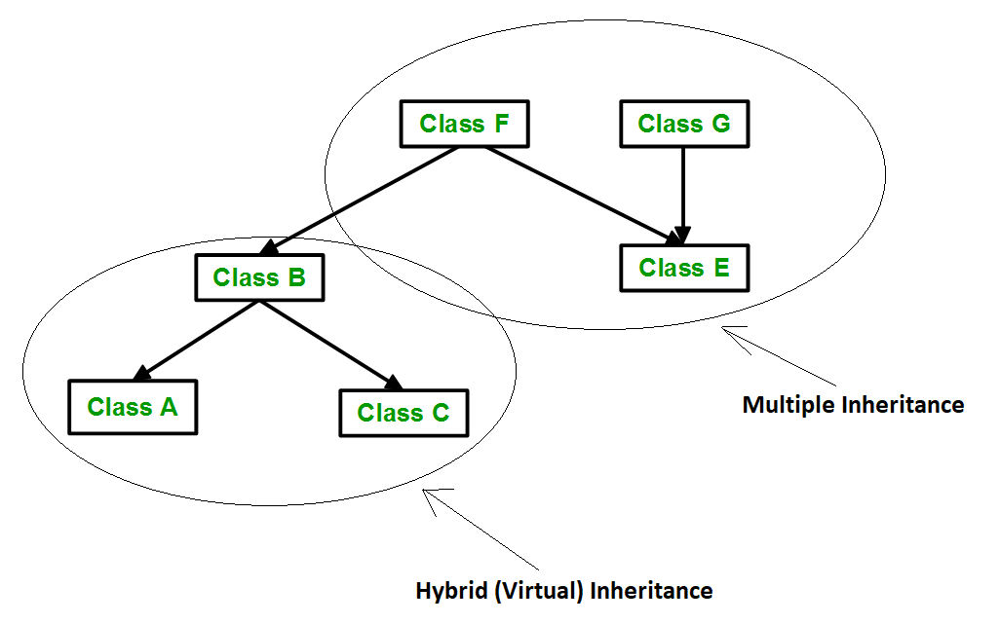
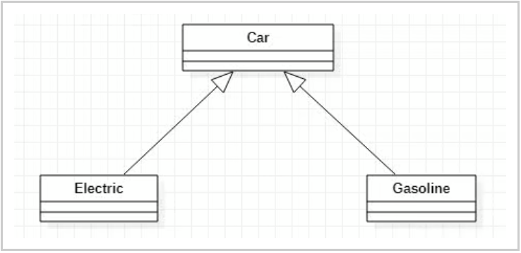
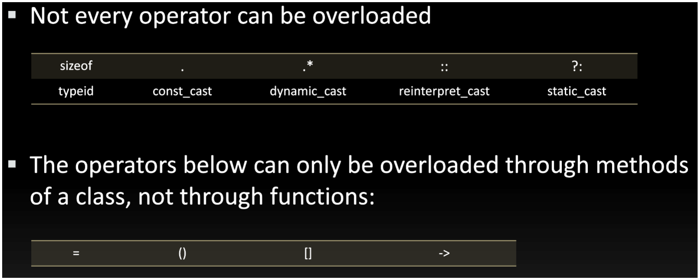
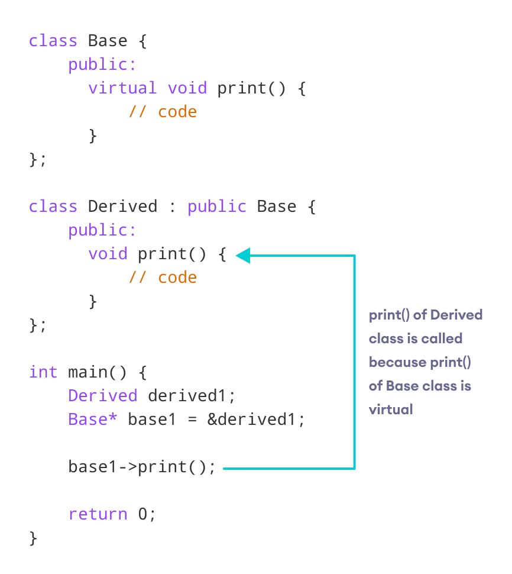

# Object-Oriented Programming

## Contents

 - **Classes:**
   - [Intro to classes (+Game example)](#intro-to-classes)
   - [Objects (instances)](#objects-instances)
   - [Class members are private by default vs. Record (struct) members are public by default](#class-vs-struct)
 - **Access Modifiers & Encapsulation:**
   - **Public:**
     - [Intro to "public" modifier](#intro-public-modifier)
   - **Private:**
     - [Intro to "private" modifier](#intro-private-modifier)
     - **Encapsulation (+Getters & Setters):**
       - [Intro to Encapsulation](#intro-to-encapsulation)
       - [Getters & Setters: Employee](#get-set-employee)
       - [Getters & Setters: Person](#get-set-person)
   - **Protected:**
     - [Intro to "protected" modifier](#intro-protected-modifier)
 - **Constructor & Destructor (+Object Lifecycle):**
   - [Problem and intro to Constructors](#problem-intro)
   - [Initializing constructors](#initializing-constructors)
   - [Default parameters (Good example)](#default-parameters)
   - [Intro to Destructor](#intro-to-des)
   - [Attributes (members) & Constructor parameters conventions](#attributes-constructor-conventions)
   - [Object Lifecycle in C++](#object-lifecycle)
 - **Inheritance:**
   - [Why and when to use inheritance?](#why-when)
   - **Types of Inheritance:**
     - [Single Inheritance](#single-inheritance)
     - [Multiple Inheritance](#multiple-inheritance)
     - [Multilevel Inheritance](#multilevel-inheritance)
     - [Hierarchical Inheritance](#hierarchical-inheritance)
     - [Hybrid (Virtual) Inheritance](#hybrid-inheritance)
   - [The Diamond Problem (Inheritance problem in C++)](#diamond-problem)
 - **Polymorphism:**
   - [Intro to Polymorphism](#intro-to-polymorphism)
   - **Compile-Time Polymorphism:**
     - [Function Overloading](#function-overloading)
     - [Operator Overloading](#operator-overloading)
       - [Operator Overloading: Tips and Tricks](#operator-overloading-tips)
   - **Runtime Polymorphism:**
     - [Function Overriding](#function-overriding)
       - [Access Overridden Function in C++](#aof)
     - [Virtual Function](#virtual-function)
       - [Override Identifier](#override-identifier)
       - [Virtual Function Demonstration (Animal example)](#vfd)
 - **Examples & Commented codes**
 - [**REFERENCES**](#references)


<!--- ( Classes ) --->

---

<div id="intro-to-classes"></div>

## Intro to classes (+Game example)

A class in C++ is defined in two parts:

 - **Declaration:**
   - Describe the attributes.
   - Describe the methods
 - **Definition:**
   - Methods implementations.

> **NOTE:**  
> Like a *record (struct)*, a *class* defines a new type.

For example, the code below represent a **Car class**:

**Class declaration:** [Car.h](src/Car.h)
```cpp
#include <string>

class Car
{
private:
    // Encapsulation.
    int color;
    std::string type;
    float velocity;

public:
    // Interfaces.
    void turnOn();
    void turnOff();
    void speed();
    void brake();
};
```

Now, with this class (Car) we can create many objects (abstractions):

  

> **NOTE:**  
> Another observation is that usually we declared a **class** in **".h"** file.

**Ok, I know that class are declared in ".h" file, but and the implementations?**  
Implementations or definitions of a class are written another file, reference to your class **(same name your ".h", however using .cpp)**.

For example, imagine we have the **Game class**:

**Class declaration:** [Game.h](src/Game.h)
```cpp
#include <string>

class Game
{
private:
    // Encapsulation.
    std::string name; // Game name.
    float price;      // Game price.
    int hours;        // Hours played.
    float cost;       // Cost per hour player.

    // Calculate the cost to played hours (Inline function/Method).
    void calculate()
    {
        if (hours > 0)
            cost = price / hours;
    }

public:
    // Interfaces.
    void purchase(const std::string &title, float value); // Fill the information.
    void update(float value);                             // Update game price.
    void play(int time);                                  // Record (save) the hours played.
    void showInformation();                               // show information.
};
```

**Class definition (implementation):** [Game.cpp](src/Game.cpp)
```cpp
#include <iostream>
#include "Game.h"

void Game::purchase(const std::string &title, float value)
{
    name = title;
    price = value;
    hours = 0;
    cost = price;
}

void Game::update(float value)
{
    price = value;
    calculate();
}

void Game::play(int time)
{
    hours = hours + time;
    calculate();
}

void Game::showInformation()
{
    std::cout << name << " R$"
              << price << " "
              << hours << "h = R$"
              << cost << "/h\n";
}
```

**driver:** [driver_game.cpp](src/driver_game.cpp)
```cpp
#include "Game.h"

int main()
{
    Game gow; // Variable of type "Game".

    // Call methods of Game (gow) object.
    gow.purchase("Gow", 160.0f);
    gow.showInformation();

    // Call methods of Game (gow) object.
    gow.play(5);
    gow.showInformation();

    // Call methods of Game (gow) object.
    gow.play(3);
    gow.showInformation();
}
```

**COMPILATION AND RUN:**  
```cpp
g++ Game.cpp driver_game.cpp -o test.out && ./test.out
```

**OUTPUT:**  
```cpp
Gow R$160 0h = R$160/h
Gow R$160 5h = R$32/h
Gow R$160 8h = R$20/h
```

---

<div id="objects-instances"></div>

## Objects (instances)

> Once (uma vez) you have declared a class, we can create objects (instances).

For example, see how to create two objects (instances) from **Game class** below:

```cpp
int main()
{
   Game gears;​
   Game doom;​
}
```

> An **instance** is the **creation of a type**, reference to our class (Game for our example).

For example, see the image below how objects are created in the memory:

  

 - See we have two **objects (instances)** of the **type Game**.
 - When we create an object (instance) automatically is reserved memory for your attributes *(Game was name, price, ours, cost)*.
 - The **name of the object ("gears" and "doom" for our example)** is a **reference to the memory reserved for the object (instance)**.

---

<div id="class-vs-struct"></div>

## Class members are private by default vs. Record (struct) members are public by default

> What if (e se) the **public** and **private** are omitted?​

 - **Class members** are **private** by *default*.
 - **Record (struct) members** are **public** by *default*. 

For example:

  

**NOTE:**  
See we can *access* and *modify* **record (struct) members** directly, however, **class members** are *private* by *default*, then we can't *access* and *modify* directly, we needed and interface (method) for it.


<!--- ( Access Modifiers & Encapsulation ) --->

---

<div id="intro-public-modifier"></div>

## Intro to "public" modifier

> **All the class members declared under the "public" modifier will be available to everyone.**

 - The data members and member functions declared as public can be accessed by other classes and functions.
 - The public members of a class can be accessed from anywhere in the program using the direct member **access operator (.)** with the object of that class.

For example, see the code below:

**Class declaration:** [publicCircle.h](src/publicCircle.h)
```cpp
class Circle
{
public:
    double radius;

    double compute_area();
};
```

**Class definition (implementation):** [publicCircle.cpp](src/publicCircle.cpp)
```cpp
#include "publicCircle.h"

double Circle::compute_area()
{
    return 3.14 * radius * radius;
}
```

**driver:** [drive_publicCircle.cpp](src/drive_publicCircle.cpp)
```cpp
#include <iostream>
#include "publicCircle.h"

int main()
{
    Circle obj;

    // Accessing public data member outside the class.
    obj.radius = 5.5;

    std::cout << "Radius is: " << obj.radius << "\n";
    std::cout << "Area is: " << obj.compute_area() << "\n";
    return 0;
}
```

**COMPILATION AND RUN:**
```cpp
g++ publicCircle.cpp drive_publicCircle.cpp -o test.out && ./test.out
```

**OUTPUT:**  
```cpp
Radius is: 5.5
Area is: 94.985
```

**NOTE:**  
In the above program, the data **member radius** is declared as public so it could be accessed outside the class and thus was allowed access from inside **main()**.

---

<div id="intro-private-modifier"></div>

## Intro to "private" modifier

> **The class members declared as private can be accessed only by the member functions inside the class.**

 - They are not allowed to be accessed directly by any object or function outside the class.
 - Only the member functions or the friend functions are allowed to access the private data members of the class. 

For example, see the code below:

**Class declaration:** [privateCircle.h](src/privateCircle.h)
```cpp
class Circle
{
private:
    double radius;

public:
    double compute_area();
};
```

**Class definition (implementation):** [privateCircle.cpp](src/privateCircle.cpp)
```cpp
#include "privateCircle.h"

double Circle::compute_area()
{
    return 3.14 * radius * radius;
}
```

**driver:** [drive_privateCircle.cpp](src/drive_privateCircle.cpp)
```cpp
#include <iostream>
#include "privateCircle.h"

int main()
{
    // Creating object of the class
    Circle obj;

    // Trying to access private data member
    // directly outside the class
    obj.radius = 1.5;

    std::cout << "Area is:" << obj.compute_area();
    return 0;
}
```

**COMPILATION AND RUN:**
```cpp
g++ privateCircle.cpp drive_privateCircle.cpp -o test.out && ./test.out
```

**OUTPUT:**  
```cpp
drive_privateCircle.cpp: In function 'int main()':
drive_privateCircle.cpp:11:9: error: 'double Circle::radius' is private within this context
     obj.radius = 1.5;
         ^~~~~~
In file included from drive_privateCircle.cpp:2:
privateCircle.h:4:12: note: declared private here
     double radius;
            ^~~~~~
```

> **NOTE:**  
> - The output of the above program is a compile time error because we are not allowed to access the private data members of a class directly from outside the class. Yet an access to obj.radius is attempted, but radius being a private data member, we obtained the above compilation error.
> - **However, we can access the private data members of a class indirectly using the public member functions of the class.**

For example, see the code below:

**Class declaration:** [privateCircle-v2.h](src/privateCircle-v2.h)
```cpp
class Circle
{
private:
    double radius;

public:
    void compute_area(double r);
};
```

**Class definition (implementation):** [privateCircle-v2.cpp](src/privateCircle-v2.cpp)
```cpp
#include <iostream>
#include "privateCircle-v2.h"

void Circle::compute_area(double r)
{
    radius = r;
    double area = 3.14 * radius * radius;

    std::cout << "Radius is: " << radius << "\n";
    std::cout << "Area is: " << area << "\n";
}
```

**driver:** [drive_privateCircle-v2.cpp](src/drive_privateCircle-v2.cpp)
```cpp
#include <iostream>
#include "privateCircle-v2.h"

int main()
{
    Circle obj;

    obj.compute_area(1.5);
    return 0;
}
```

**COMPILATION AND RUN:**
```cpp
g++ privateCircle-v2.cpp drive_privateCircle-v2.cpp -o test.out && ./test.out
```

**OUTPUT:**  
```cpp
Radius is: 1.5
Area is: 7.065
```

---

<div id="intro-to-encapsulation"></div>

## Intro to Encapsulation

> **The meaning of Encapsulation, is to make sure (garantir) that *"sensitive"* data is hidden from users.**

 - To achieve (conseguir) this, you must declare class variables/attributes as private:
   - Cannot be accessed from outside the class
 - If you want others to read or modify the value of a private member, you can provide public **get** and **set** methods.

  

---

<div id="get-set-employee"></div>

## Getters & Setters: Employee

**Class declaration:** [employee.h](src/employee.h)
```cpp
class Employee
{
private:
    int salary;

public:
    void setSalary(int s);
    int getSalary();
};
```

**Class definition (implementation):** [employee.cpp](src/employee.cpp)
```cpp
#include "employee.h"

void Employee::setSalary(int s)
{
    salary = s;
}

int Employee::getSalary()
{
    return salary;
}
```

**driver:** [drive_employee.cpp](src/drive_employee.cpp)
```cpp
#include <iostream>
#include "employee.h"

int main()
{
    Employee myObj;
    myObj.setSalary(50000);

    std::cout << "The Employee salary is: " << myObj.getSalary() << "\n";

    return 0;
}
```

**COMPILATION AND RUN:**
```cpp
g++ employee.cpp drive_employee.cpp -o test.out && ./test.out
```

**OUTPUT:**  
```cpp
The Employee salary is: 50000
```

 - **Example explained:**
   - The **salary** attribute is private, which have restricted access.
   - The public **setSalary()** method takes a parameter **(s)** and assigns it to the **salary** attribute
     - salary = s.
   - The public **getSalary()** method returns the value of the private **salary** attribute.
   - Inside **main()**, we create an object of the *Employee class*. Now we can use the **setSalary()** method to set the value of the private attribute to **50000**. Then we call the **getSalary()** method on the object to return the value.

---

<div id="get-set-person"></div>

## Getters & Setters: Person

**Class declaration:** [person.h](src/person.h)
```cpp
#include <string>

class Person
{
private:
    std::string name;
    int age;

public:
    Person(std::string name, int age); // Constructor prototype.

    // Setters
    void setName(std::string name);
    void setAge(int age);

    // Getters
    std::string getName();
    int getAge();
};
```

**Class definition (implementation):** [person.cpp](src/person.cpp)
```cpp
#include "person.h"

// Constructor.
Person::Person(std::string name, int age)
{
    this->name = name;
    this->age = age;
}

// ------------------ ( Setters ) ------------------

void Person::setName(std::string name)
{
    this->name = name;
}

void Person::setAge(int age)
{
    this->age = age;
}

// ------------------ ( Getters ) ------------------

std::string Person::getName()
{
    return name;
}

int Person::getAge()
{
    return age;
}
```

**driver:** [drive_person.cpp](src/drive_person.cpp)
```cpp
#include <iostream>
#include "person.h"

int main()
{

    Person person("Rodrigo Leite da Silva", 33);

    std::cout << "Name and Age of Person passed to construct was: "
              << "\n";
    std::cout << "Person name: " << person.getName() << "\n";
    std::cout << "Person age: " << person.getAge() << "\n";

    person.setName("Sir Isaac Newton");
    person.setAge(84);
    std::cout << "\nAfter set name and age:"
              << "\n";

    std::cout << "Name: " << person.getName() << "\n";
    std::cout << "Age: " << person.getAge() << "\n";

    return 0;
}
```

**COMPILATION AND RUN:**
```cpp
g++ person.cpp drive_person.cpp -o test.out && ./test.out
```

**OUTPUT:**  
```cpp
Name and Age of Person passed to construct was: 
Person name: Rodrigo Leite da Silva
Person age: 33

After set name and age:
Name: Sir Isaac Newton
Age: 84
```

---

<div id="intro-protected-modifier"></div>

## Intro to "protected" modifier

The **protected access modifier is similar to the private access modifier** in the sense that it can’t be accessed outside of its class unless (a menos) with the help of a friend class.

> **The difference is that the class members declared as Protected can be accessed by any subclass (derived class).**

**NOTE:**  
This access through inheritance can alter the access modifier of the elements of the base class in the derived class ***depending on the mode of Inheritance***.

For example, see the code below:

**Class declaration:** [parent.h](src/parent.h)
```cpp
class Parent
{
protected:
    int id_protected;
};
```

**Class declaration:** [child.h](src/child.h)
```cpp
#include "parent.h"

class Child : public Parent
{
public:
    void setId(int id);
    void displayId();
};
```

**Class definition (implementation):** [child.cpp](src/child.cpp)
```cpp
#include <iostream>
#include "child.h"

void Child::setId(int id)
{
    id_protected = id;
}

void Child::displayId()
{
    std::cout << "id_protected is: " << id_protected << "\n";
}
```

**driver:** [drive_protected.cpp](src/drive_protected.cpp)
```cpp
#include "child.h"

int main()
{
    Child obj1;

    obj1.setId(81);
    obj1.displayId();

    return 0;
}
```

**COMPILATION AND RUN:**
```cpp
g++ child.cpp  drive_protected.cpp -o test.out && ./test.out
```

**OUTPUT:**  
```cpp
id_protected is: 81
```


<!--- ( Constructor & Destructor ) --->

---

<div id="problem-intro"></div>

## Problem and intro to Constructors

Imagine we have the follow Game class:

**Class declaration:** [Game.h](src/Game.h)
```cpp
#include <string>

class Game
{
private:
    // Encapsulation.
    std::string m_name; // Game name.
    float m_price;      // Game price.
    int m_hours;        // Hours played.
    float m_cost;       // Cost per hour player.

    // Calculate the cost to played hours (Inline function/Method).
    void calculate()
    {
        if (m_hours > 0)
            m_cost = m_price / m_hours;
    }

public:
    // Interfaces.
    void purchase(const std::string &title, float value); // Fill the information.
    void update(float value);                             // Update game price.
    void play(int time);                                  // Record (save) the hours played.
    void showInformation();                               // show information.
};
```

**Class definition (implementation):** [Game.cpp](src/Game.cpp)
```cpp
#include <iostream>
#include "Game.h"

void Game::purchase(const std::string &title, float value)
{
    m_name = title;
    m_price = value;
    m_hours = 0;
    m_cost = m_price;
}

void Game::update(float cost)
{
    m_price = cost;
    calculate();
}

void Game::play(int hours)
{
    hours += hours;
    calculate();
}

void Game::showInformation()
{
    std::cout << m_name << " R$"
              << m_price << " "
              << m_hours << "h = R$"
              << m_cost << "/h\n";
}
```

Here, we have the method **purchase()** to init the attributes. However, imagine we make a Game object and use **play()** and **showInformation()** methods without use **purchase()**:

**driver:** [testing_game_wt_purchase.cpp](src/testing_game_wt_purchase.cpp)
```cpp
#include "Game.h"

int main()
{
    Game gow; // Variable of type "Game".

    // Call methods of Game (gow) object.
    gow.showInformation();

    // Call methods of Game (gow) object.
    gow.play(5);
    gow.showInformation();

    // Call methods of Game (gow) object.
    gow.play(3);
    gow.showInformation();
}
```

**COMPILATION AND RUN:**  
```cpp
g++ Game.cpp testing_game_wt_purchase.cpp -o test.out && ./test.out
```

**OUTPUT:**  
```
R$1.12104e-44 0h = R$8.26766e-44/h
R$1.12104e-44 5h = R$2.8026e-45/h
R$1.12104e-44 8h = R$1.4013e-45/h
```

**What?**  
Well, the problem is that we don't initialize the attribute before play the game.

> That's, **"we have trash in the memory"**.

  

> **Ok, how solve that?**  
> Using *constructor*.

 - The constructor is declared in the class declaration (.h file).
 - The constructor have the same class name:
   - However, has no return.

For example, let's see a constructor for the class Game:

**Class declaration:** [GameWithConstructor.h](src/GameWithConstructor.h)
```cpp
#include <string>

class Game
{
private:
    // Encapsulation.
    std::string m_name; // Game name.
    float m_price;      // Game price.
    int m_hours;        // Hours played.
    float m_cost;       // Cost per hour player.

    // Calculate the cost to played hours (Inline function/Method).
    void calculate()
    {
        if (m_hours > 0)
            m_cost = m_price / m_hours;
    }

public:
    Game(const std::string &name, float cost = 0); // Constructor prototype.

    void update(float cost);                       // Update game price.
    void play(int hours);                          // Record (save) the hours played.
    void showInformation();                        // show information.
};
```

**Class definition (implementation):** [GameWithConstructor.cpp](src/GameWithConstructor.cpp)
```cpp
#include <iostream>
#include "GameWithConstructor.h"

// Class (Game) constructor definition (implementation)
Game::Game(const std::string &name, float cost)
{
    m_name = name;
    m_price = cost;
    m_hours = 0;
    m_cost = cost;
}

void Game::update(float cost)
{
    m_price = cost;
    calculate();
}

void Game::play(int hours)
{
    m_hours += hours;
    calculate();
}

void Game::showInformation()
{
    std::cout << m_name << " R$"
              << m_price << " "
              << m_hours << "h = R$"
              << m_cost << "/h\n";
}
```

**driver:** [testing_constructor.cpp](src/testing_constructor.cpp)
```cpp
#include "GameWithConstructor.h"

int main()
{
    Game gow = Game("Gears", 50.0f);

    // Call methods of Game (gow) object.
    gow.showInformation();

    // Call methods of Game (gow) object.
    gow.play(5);
    gow.showInformation();

    // Call methods of Game (gow) object.
    gow.play(3);
    gow.showInformation();
}
```

**COMPILATION AND RUN:**  
```cpp
g++ GameWithConstructor.cpp testing_constructor.cpp -o test.out && ./test.out
```

**OUTPUT:**  
```cpp
Gears R$50 0h = R$50/h
Gears R$50 5h = R$10/h
Gears R$50 8h = R$6.25/h
```

> **NOTE:**  
> Another advantage of creating a constructor is forcing anyone who instantiates an object to always start its attributes (members).

---

<div id="initializing-constructors"></div>

## Initializing constructors

There are three common approaches to initialize a constructor:

**Explicitly approach:**  
```cpp
Game gow = Game("Gears", 50.0f);
```

**Implicitly approach:**
```cpp
Game gow("Gears", 50.0f);
```

**List approach:**
```cpp
Game gow { "Gears", 50.0f };

or

Game gow = { "Gears", 50.0f };
```

---

<div id="default-parameters"></div>

## Default parameters

> **Default parameters** in a constructor are **defined in the "constructor prototype"** *not in the constructor definition (implementation)*.

For example, see default parameters for Game class below:

**Class declaration:** [default_parameters.h](src/default_parameters.h)
```cpp
#include <string>

class Game
{
private:
    std::string m_name;
    float m_price;
    int m_hours;
    float m_cost;

    // Inline function.
    void calculate()
    {
        if (m_hours > 0)
            m_cost = m_price / m_hours;
    }

public:
    // Constructor prototype (with default parameters).
    Game(const std::string &name = "Gears", float price = 100, int hours = 0, float cost = 0);

    void update(float cost);
    void play(int hours);
    void showInformation();
};
```

**Class definition (implementation):** [default_parameters.cpp](src/default_parameters.cpp)
```cpp
#include <iostream>
#include "default_parameters.h"

// Class (Game) constructor definition (implementation)
Game::Game(const std::string &name, float price, int hours, float cost)
{
    m_name = name;
    m_price = price;
    m_hours = hours;
    m_cost = cost;
}

void Game::update(float cost)
{
    m_price = cost;
    calculate();
}

void Game::play(int hours)
{
    m_hours += hours;
    calculate();
}

void Game::showInformation()
{
    std::cout << "Game name: "       << m_name <<
                 ", Price: R$"       << m_price <<
                 ", Hours played:  " << m_hours <<
                 ", Game Cost: R$"   << m_cost << "/h\n";
}
```

**driver:** [testing_default_parameters.cpp](src/testing_default_parameters.cpp)
```cpp
#include "default_parameters.h"

int main()
{
    Game gow;

    // Call methods of Game (gow) object.
    gow.showInformation();

    // Call methods of Game (gow) object.
    gow.play(5);
    gow.showInformation();

    // Call methods of Game (gow) object.
    gow.play(3);
    gow.showInformation();
}
```

**COMPILATION AND RUN:**  
```cpp
g++ default_parameters.cpp testing_default_parameters.cpp -o test.out && ./test.out
```

**OUTPUT:**  
```
Game name: Gears, Price: R$100, Hours played:  0, Game Cost: R$0/h
Game name: Gears, Price: R$100, Hours played:  5, Game Cost: R$20/h
Game name: Gears, Price: R$100, Hours played:  8, Game Cost: R$12.5/h
```

**NOTE:**  
See that now we have default parameters for our constructor.

---

<div id="intro-to-des"></div>

## Intro to Destructor

> **Destructor** is a **special member function (method)** that has the same class name, however, preceded by **"~"**.

For example, see below the **Destructor** for the Game class:

**Class declaration:** [GameWithDestructor.h](src/GameWithDestructor.h)
```cpp
#include <string>

class Game
{
private:
    // Encapsulation.
    std::string m_name; // Game name.
    float m_price;      // Game price.
    int m_hours;        // Hours played.
    float m_cost;       // Cost per hour player.

    // Calculate the cost to played hours (Inline function/Method).
    void calculate()
    {
        if (m_hours > 0)
            m_cost = m_price / m_hours;
    }

public:
    // Interfaces.
    Game(const std::string &name, float cost = 0); // Constructor prototype.
    ~Game();                                       // Destructor prototype.

    void update(float cost); // Update game price.
    void play(int hours);    // Record (save) the hours played.
    void showInformation();  // show information.
};
```

**Class definition (implementation):** [GameWithDestructor.cpp](src/GameWithDestructor.cpp)
```cpp
#include <iostream>
#include "GameWithDestructor.h"

// Class (Game) constructor definition (implementation)
Game::Game(const std::string &name, float cost)
{
    m_name = name;
    m_price = cost;
    m_hours = 0;
    m_cost = cost;
}

// Class (Game) destructor definition (implementation)
Game::~Game()
{
    // Empty
}

// Other codes...
```

**NOTE:**  
An observation is that a **Destructor** doesn't have parameters.

> **Ok, but what is a destructor for?**

 - The **destructor** is called automatically when the *object's life comes to an end*.
 - Or when you call him before the object's life runs out.

For example, imagine we have the **process()** method that create an object Game:

```cpp
void process()
{
    Game gears; // The Constructor is called here.

} // The Destructor is called here, in the end of the block.
```

**NOTE:**  
See that, the Destructor is called automatically **in the end of the block** (If you don't call him first).

> **Okay, but if destructors are called at the end of each block automatically, why do I need to create mine? (o meu)**

 - The function of the destructor is to **terminate/destroy** things​:
   - Important for working with resources​:
     - Dynamic Memory Allocation.​
     - File reading​.
     - Opening of connections.

For example, imagine we have a **constructor** to create a **set (yes, math set)**:

```cpp
Set::Set(int n)
{
    // Memory alocation.
    vet = new int[n];
}
```

The **destructor** to our example is:

```cpp
Sets::~Sets()
{
    delete [] vet;
}​
```

 - Now, we just need call the destructor to destroy the **Set** object before our destructor is automatically called.
 - The advantage is that we are saving (economizando) memory.

---

<div id="attributes-constructor-conventions"></div>

## Attributes (members) & Constructor parameters conventions

> The **constructor parameters** can't have the same name of the attributes (members) of the class.

There are two common conventions to solve that:

 - **Prefix:**
   - The first is using the prefix **"m_"** before your attribute (member).
     - **"m_"** is abbreviation to **"member"**.
 - **suffix:**
   - The second is using the suffix **"_"** after your attribute (member).

For example, to our Game class we used **prefix "m_"**:

**Class declaration:** [GameWithConstructor.h](src/GameWithConstructor.h)
```cpp
#include <string>

class Game
{
private:
    // Encapsulation.
    std::string m_name; // Game name.
    float m_price;      // Game price.
    int m_hours;        // Hours played.
    float m_cost;       // Cost per hour player.

    // Calculate the cost to played hours (Inline function/Method).
    void calculate()
    {
        if (m_hours > 0)
            m_cost = m_price / m_hours;
    }

public:
    // Interfaces.
    Game(const std::string &name, float cost = 0); // Constructor prototype.
    void update(float cost);                       // Update game price.
    void play(int hours);                          // Record (save) the hours played.
    void showInformation();                        // show information.
};
```

 - See we have the **prefix "m_"** in the **attributes (members)**.
 - And **not having the "m_"** prefix in the **constructor parameters**.

---

<div id="object-lifecycle"></div>

## Object Lifecycle in C++

Let's, getting started with the following question:

> - [EN] - When does an object's life come to an end?
> - [PT] - Quando a vida de um objeto chega ao fim?

 - **Depends where your object was created:**
   - Variable static or global?
   - Variable local ou parameter?
   - Dynamic allocation?
   - Temporary?

**GLOBAL OBJECTS:**  
If you object is global him is destroyed in the end of the program. For example:

```cpp
Game gears { "gears" }; // The Constructor is called here.

int main()
{
    ...
}
// The Destructor is called here, in the end of the program.​
```

**STATIC OBJECTS:**  
Static objects are created in the object instance and destroyed in the end of the program. For example:

```cpp
void process()
{
    // Static object.
    static Game doom { "Doom" }; // The Constructor is called here.
    ...
}

int main()
{
    process();
    ...
}
// The Destructor is called here, in the end of the program.​​
```

**LOCAL OBJECTS:**  
Local objects are created in the object instance and destroyed in the end of the block where was created. For example:

```cpp
void process(Game j) // The Constructor is called here.
{
    ...
} // The Destructor is called here, in the end of the block.

int main()
{
    Game gta ( "GTA" ); // The Constructor is called here.

    process(gta);
    ...
} // The Destructor is called here, in the end of the block.​
```

**OBJECTS CREATED DYNAMICALLY:**  
Objects created dynamically are controlled by the programmer. Created when the programer use keyword *"new"* and destroyed when the programmer use keyword *"delete (or the program finish)"*. For example:

```cpp
int main()
{
    Game * rdr = new Game { "RDR" }; // The Constructor is called here.

    process(rdr);
    ...
}

void process(Game * pJ)
{
    delete pJ;  // The Destructor is called here.
}​
```


<!--- ( Inheritance ) --->

---

<div id="why-when"></div>

## Why and when to use inheritance?

To understand **"Why"** and **"When"** to use `inheritance`, consider a group of **vehicles**, you need to create classes for:

 - Bus
 - Car
 - Truck

The methods:

 - fuelAmount()
 - capacity()
 - applyBrakes()

**NOTE:**  
If we create these classes avoiding **inheritance**, then we have to write all of these functions in each of the three classes as shown below figure:

  

> **NOTE:**  
> - You can clearly see that the above process results in duplication of the same code 3 times.
> - This increases the chances of error and data redundancy.

**To avoid this type of situation, inheritance is used:**  
If we create a **class Vehicle** and write these three functions in it and inherit the rest of the classes from the vehicle class, then we can simply avoid the duplication of data and increase re-usability.

For example, look at the below diagram in which the three classes are inherited from vehicle class:

  

Using inheritance, we have to write the functions only one time instead of three times as we have inherited the rest of the three classes from the base class (Vehicle).

For example, see the codes below:

**Class declaration:** [vehicle.h](src/vehicle.h)
```cpp
#ifndef VEHICLE_CPP
#define VEHICLE_CPP

class Vehicle
{
public:
    void fuelAmount();
    void capacity();
    void applyBrakes();
};

#endif
```

**Class definition (implementation):** [vehicle.cpp](src/vehicle.cpp)
```cpp
#include <iostream>
#include "vehicle.h"

void Vehicle::fuelAmount()
{
    std::cout << "Vehicle 'fuelAmount' method called."
              << "\n";
}

void Vehicle::capacity()
{
    std::cout << "Vehicle 'capacity' method called."
              << "\n";
}

void Vehicle::applyBrakes()
{
    std::cout << "Vehicle 'applyBrakes' method called."
              << "\n";
}
```

**Class declaration:** [bus.h](src/bus.h)
```cpp
#include "vehicle.h"

class Bus : public Vehicle
{
    // Codes...
};
```

**Class declaration:** [car.h](src/car.h)
```cpp
#include "vehicle.h"

class Car : public Vehicle
{
    // Codes...
};
```

**Class declaration:** [truck.h](src/truck.h)
```cpp
#include "vehicle.h"

class Truck : public Vehicle
{
    // Codes...
};
```

**driver:** [driver_vehicle.cpp](src/driver_vehicle.cpp)
```cpp
#include <iostream>
#include "bus.h"
#include "car.h"
#include "truck.h"

int main()
{
    Bus bus;
    std::cout << "'Bus' object examples:"
              << "\n";
    bus.fuelAmount();
    bus.capacity();
    bus.applyBrakes();

    Car car;
    std::cout << "\n'Car' object examples:"
              << "\n";
    car.fuelAmount();
    car.capacity();
    car.applyBrakes();

    Truck truck;
    std::cout << "'\nTruck' object examples:"
              << "\n";
    truck.fuelAmount();
    truck.capacity();
    truck.applyBrakes();

    return 0;
}
```

**COMPILATION AND RUN:**
```cpp
g++ vehicle.cpp driver_vehicle.cpp -o test.out && ./test.out
```

**OUTPUT:**  
```cpp
'Bus' object examples:
Vehicle 'fuelAmount' method called.
Vehicle 'capacity' method called.
Vehicle 'applyBrakes' method called.

'Car' object examples:
Vehicle 'fuelAmount' method called.
Vehicle 'capacity' method called.
Vehicle 'applyBrakes' method called.
'
Truck' object examples:
Vehicle 'fuelAmount' method called.
Vehicle 'capacity' method called.
Vehicle 'applyBrakes' method called.
```

---

<div id="single-inheritance"></div>

## Single Inheritance

> In **Single Inheritance**, a class is allowed to inherit from only one class. i.e. one *subclass* is inherited by one *base class* only.

  

For example, see the codes below:

**Class declaration:** [single_inheritance_vehicle.h](src/single_inheritance_vehicle.h)
```cpp
class Vehicle
{
public:
    Vehicle(); // Constructor prototype.
};
```

**Class definition (implementation):** [single_inheritance_vehicle.cpp](src/single_inheritance_vehicle.cpp)
```cpp
#include <iostream>
#include "single_inheritance_vehicle.h"

// Constructor implementation.
Vehicle::Vehicle()
{
    std::cout << "This is a Vehicle\n";
}
```

**Class declaration:** [single_inheritance_car.h](src/single_inheritance_car.h)
```cpp
#include "single_inheritance_vehicle.h"

class Car : public Vehicle
{
    // Codes...
};
```

**driver:** [driver_single_inheritance.cpp](src/driver_single_inheritance.cpp)
```cpp
#include "single_inheritance_car.h"

int main()
{
    Car obj;

    return 0;
}
```

**COMPILATION AND RUN:**
```cpp
g++ single_inheritance_vehicle.cpp drive_single_inheritance.cpp -o test.out && ./test.out
```

**OUTPUT:**  
```cpp
This is a Vehicle
```

---

<div id="multiple-inheritance"></div>

## Multiple Inheritance

> **Multiple Inheritance** is a feature of C++ where a class can inherit from more than one class. i.e one *subclass* is inherited from more than one *base class*.

  

For example, see the codes below:

**Class declaration:** [multiple_inheritance_vehicle.h](src/multiple_inheritance_vehicle.h)
```cpp
class Vehicle
{
public:
    Vehicle();
};
```

[multiple_inheritance_vehicle.cpp](src/multiple_inheritance_vehicle.cpp)
```cpp
#include <iostream>
#include "multiple_inheritance_vehicle.h"

Vehicle::Vehicle()
{
    std::cout << "This is a Vehicle\n";
}
```

**Class definition (implementation):** [multiple_inheritance_fourwheeler.h](src/multiple_inheritance_fourwheeler.h)
```cpp
class FourWheeler
{
public:
    FourWheeler();
};
```

[multiple_inheritance_fourwheeler.cpp](src/multiple_inheritance_fourwheeler.cpp)
```cpp
#include <iostream>
#include "multiple_inheritance_fourwheeler.h"

FourWheeler::FourWheeler()
{
    std::cout << "This is a 4 Wheeler Vehicle\n";
}
```

**Class declaration:** [multiple_inheritance_car.h](src/multiple_inheritance_car.h)
```cpp
#include "multiple_inheritance_vehicle.h"
#include "multiple_inheritance_fourwheeler.h"

class Car : public Vehicle, public FourWheeler
{
    // Codes...
};
```

**driver:** [driver_multiple_inheritance.cpp](src/driver_multiple_inheritance.cpp)
```cpp
#include "multiple_inheritance_car.h"

int main()
{
    Car obj;

    return 0;
}
```

**COMPILATION AND RUN:**
```cpp
g++ multiple_inheritance_vehicle.cpp multiple_inheritance_fourwheeler.cpp driver_multiple_inheritance.cpp -o test.out && ./test.out
```

**OUTPUT:**  
```cpp
This is a Vehicle
This is a 4 Wheeler Vehicle
```

---

<div id="multilevel-inheritance"></div>

## Multilevel Inheritance

>  In this type of **inheritance**, a *derived class* is created from another *derived class*.

  

For example, see the codes below:

**Class declaration:** [multilevel_inheritance_vehicle.h](src/multilevel_inheritance_vehicle.h)
```cpp
class Vehicle
{
public:
    Vehicle();
};
```

**Class definition (implementation):** [multilevel_inheritance_vehicle.cpp](src/multilevel_inheritance_vehicle.cpp)
```cpp
#include <iostream>
#include "multilevel_inheritance_vehicle.h"

Vehicle::Vehicle()
{
    std::cout << "This is a Vehicle\n";
}
```

**Class declaration:** [multilevel_inheritance_fourwheeler.h](src/multilevel_inheritance_fourwheeler.h)
```cpp
#include "multilevel_inheritance_vehicle.h"

class fourWheeler : public Vehicle
{
public:
    fourWheeler();
};
```

**Class definition (implementation):** [multilevel_inheritance_fourwheeler.cpp](src/multilevel_inheritance_fourwheeler.cpp)
```cpp
#include <iostream>
#include "multilevel_inheritance_fourwheeler.h"

fourWheeler::fourWheeler()
{
    std::cout << "Objects with 4 wheels are vehicles\n";
}
```

**Class declaration:** [multilevel_inheritance_car.h](src/multilevel_inheritance_car.h)
```cpp
#include "multilevel_inheritance_fourwheeler.h"

class Car : public fourWheeler
{
public:
    Car();
};
```

**Class definition (implementation):** [multilevel_inheritance_car.cpp](src/multilevel_inheritance_car.cpp)
```cpp
#include <iostream>
#include "multilevel_inheritance_car.h"

Car::Car()
{
    std::cout << "Car has 4 Wheels\n";
}
```

**driver:** [driver_multilevel_inheritance.cpp](src/driver_multilevel_inheritance.cpp)
```cpp
#include "multilevel_inheritance_car.h"

int main()
{
    Car obj;

    return 0;
}
```

**COMPILATION AND RUN:**
```cpp
g++ multilevel_inheritance_vehicle.cpp  multilevel_inheritance_fourwheeler.cpp multilevel_inheritance_car.cpp driver_multilevel_inheritance.cpp -o test.out && ./test.out
```

**OUTPUT:**  
```cpp
This is a Vehicle
Objects with 4 wheels are vehicles
Car has 4 Wheels
```

---

<div id="hierarchical-inheritance"></div>

## Hierarchical Inheritance

> In this type of **inheritance**, more than one *subclass* is inherited from a *single base class*. i.e. more than one *derived class* is created from a *single base class*.

  
  

For example, see the codes below:

**Class declaration:** [hierarchical_inheritance_vehicle.h](src/hierarchical_inheritance_vehicle.h)
```cpp
#ifndef VEHICLE_CPP
#define VEHICLE_CPP

class Vehicle
{
public:
    Vehicle();
};

#endif
```

**Class definition (implementation):** [hierarchical_inheritance_vehicle.cpp](src/hierarchical_inheritance_vehicle.cpp)
```cpp
#include <iostream>
#include "hierarchical_inheritance_vehicle.h"

Vehicle::Vehicle()
{
    std::cout << "This is a Vehicle\n";
}
```

**Class declaration:** [hierarchical_inheritance_car.h](src/hierarchical_inheritance_car.h)
```cpp
#include "hierarchical_inheritance_vehicle.h"

class Car : public Vehicle
{
    // Codes...
};
```

**Class declaration:** [hierarchical_inheritance_bus.h](src/hierarchical_inheritance_bus.h)
```cpp
#include "hierarchical_inheritance_vehicle.h"

class Bus : public Vehicle
{
    // Codes...
};
```

**driver:** [driver_hierarchical_inheritance.cpp](src/driver_hierarchical_inheritance.cpp)
```cpp
#include "hierarchical_inheritance_car.h"
#include "hierarchical_inheritance_bus.h"

int main()
{
    Car obj1;
    Bus obj2;

    return 0;
}
```

**COMPILATION AND RUN:**
```cpp
g++ hierarchical_inheritance_vehicle.cpp driver_hierarchical_inheritance.cpp -o test.out && ./test.out
```

**OUTPUT:**  
```cpp
This is a Vehicle
This is a Vehicle
```

---

<div id="hybrid-inheritance"></div>

## Hybrid (Virtual) Inheritance

> **Hybrid (Virtual) Inheritance** is implemented by combining more than one type of *inheritance*. i.e. combining Hierarchical inheritance and Multiple Inheritance.

The below image shows the combination of **Hierarchical** and **Multiple Inheritances**:

  

---

<div id="diamond-problem"></div>

## The Diamond Problem

> The **Diamond Problem** occurs when two *superclasses* of a *derived class* have a common base class.

For example, consider the example of a Car:

  

Both **Electric** and **Gasoline** cars inherit the properties of a *Car class*.

Now, there is a special case if there is another class – a **Hybrid class**, for example – that inherits both the *Electric* and *Gasoline class*. We can see in the diagram that it will form a diamond:

  

> **The hybrid car is both an *Electric car* and a *gasoline car*:**  
> These kinds of special cases will result in a **Diamond Problem**.

To understand see the codes below:

**Class declaration:** [diamond_problem_car.h](src/diamond_problem_car.h)
```cpp
#ifndef CAR_CPP
#define CAR_CPP

class Car
{
public:
    Car();
};

#endif
```

**Class definition (implementation):** [diamond_problem_car.cpp](src/diamond_problem_car.cpp)
```cpp
#include <iostream>
#include "diamond_problem_car.h"

Car::Car()
{
    std::cout << "Car Constructor\n";
}
```

**Class declaration:** [diamond_problem_electric.h](src/diamond_problem_electric.h)
```cpp
#include "diamond_problem_car.h"

class Electric : public Car
{
public:
    Electric();
};
```

**Class definition (implementation):** [diamond_problem_electric.cpp](src/diamond_problem_electric.cpp)
```cpp
#include <iostream>
#include "diamond_problem_electric.h"

Electric::Electric()
{
    std::cout << "Electric Constructor\n";
}
```

**Class declaration:** [diamond_problem_gasoline.h](src/diamond_problem_gasoline.h)
```cpp
#include "diamond_problem_car.h"

class Gasoline : public Car
{
public:
    Gasoline();
};
```

**Class definition (implementation):** [diamond_problem_gasoline.cpp](src/diamond_problem_gasoline.cpp)
```cpp
#include <iostream>
#include "diamond_problem_gasoline.h"

Gasoline::Gasoline()
{
    std::cout << "Gasoline Constructor\n";
}
```

**Class declaration:** [diamond_problem_hybrid.h](src/diamond_problem_hybrid.h)
```cpp
#include "diamond_problem_electric.h"
#include "diamond_problem_gasoline.h"

class Hybrid : public Electric, public Gasoline
{
public:
    Hybrid();
};
```

**Class definition (implementation):** [diamond_problem_hybrid.cpp](src/diamond_problem_hybrid.cpp)
```cpp
#include <iostream>
#include "diamond_problem_hybrid.h"

Hybrid::Hybrid()
{
    std::cout << "Hybrid Constructor\n";
}
```

**driver:** [driver_diamond_problem.cpp](src/driver_diamond_problem.cpp)
```cpp
#include "diamond_problem_hybrid.h"

int main()
{
    Hybrid h;

    return 0;
}
```

**COMPILATION AND RUN:**
```cpp
g++ diamond_problem_car.cpp diamond_problem_electric.cpp diamond_problem_gasoline.cpp diamond_problem_hybrid.cpp driver_diamond_problem.cpp -o test.out && ./test.out
```

**OUTPUT:**  
```cpp
Car Constructor
Electric Constructor
Car Constructor
Gasoline Constructor
Hybrid Constructor
```

 - If you make a Hybrid class object in the main, you see that the *Car Constructor is called two times*:
   - This is because of the *diamond problem*.
   - The Hybrid class object has two copies of the Car class for each of its parents, respectively:
     - Electric object call the Car constructor.
     - And Gasoline object call the Car constructor.

**NOTE:**  
This might not appear to be a big issue. For larger programs, however, in which the grandparent also contains tens of classes above it, the overhead of this duplication is tremendous.

> **So, how can this problem be solved?**  
> The above problem can be solved by writing the keyword **virtual**.

**When we use *virtual inheritance*, we are guaranteed to get only a single instance of the common base class:**  
In other words, the hybrid class will have only a single instance of the car class, shared by both the *Electric* and *Gasoline* classes. By having a single instance of car, we’ve resolved the problem.

We will make both the *Electric* and *Gasoline* classes into virtual base classes:

**Class declaration:** [diamond_problem_electric.h](src/diamond_problem_electric.h)
```cpp
#include "diamond_problem_car.h"

class Electric : virtual public Car
{
public:
    Electric();
};
```

**Class declaration:** [diamond_problem_gasoline.h](src/diamond_problem_gasoline.h)
```cpp
#include "diamond_problem_car.h"

class Gasoline : virtual public Car
{
public:
    Gasoline();
};
```

**COMPILATION AND RUN:**
```cpp
g++ diamond_problem_car.cpp diamond_problem_electric.cpp diamond_problem_gasoline.cpp diamond_problem_hybrid.cpp driver_diamond_problem.cpp -o test.out && ./test.out
```

**OUTPUT:**  
```cpp
Car Constructor
Electric Constructor
Gasoline Constructor
Hybrid Constructor
```

**NOTE:**  
After updating the code, we can see that the *hybrid object* only contains one *Car class* copy.


<!--- ( Polymorphism ) --->

---

<div id="intro-to-polymorphism"></div>

## Intro to Polymorphism

> The word **“polymorphism”** means `having many forms`. In simple words, we can define polymorphism as the ability of a message to be *displayed in more than one* form. 

A real-life example of polymorphism is a **person** who at the same time can have different characteristics:

 - A man at the same time is a father;
 - A husband;
 - And an employee...

So the same person exhibits different behavior in different situations. This is called polymorphism. Polymorphism is considered one of the important features of **Object-Oriented Programming**.

There are two types of **Polymorphism** in C++:

  

---

<div id="function-overloading"></div>

## Function Overloading

> When there are multiple functions with the same name but *different parameters (or different primitive types)*, then the functions are said to be *overloaded*, hence this is known as **Function Overloading**.

Functions can be overloaded by changing the number of arguments or/and changing the type of arguments. In simple terms, it is a feature of object-oriented programming providing many functions to have the same name but distinct parameters when numerous tasks are listed under one function name.

For example, below is the C++ program to show **Function Overloading (or Compile-Time polymorphism)**:

[function_overloading_calculator.h](src/function_overloading_calculator.h)
```cpp
class Calculator
{
public:
    int add(int x, int y);
    int add(int x, int y, int z);
    int add(int x, int y, int z, int w);
};
```

[function_overloading_calculator.cpp](src/function_overloading_calculator.cpp)
```cpp
#include "function_overloading_calculator.h"

int Calculator::add(int x, int y)
{
    return x + y;
}

int Calculator::add(int x, int y, int z)
{
    return x + y + z;
}

int Calculator::add(int x, int y, int z, int w)
{
    return x + y + z + w;
}
```

[driver_function_overloading.cpp](src/driver_function_overloading.cpp)
```cpp
#include <iostream>
#include "function_overloading_calculator.h"

int main()
{
    int x = 10;
    int y = 20;
    int z = 30;
    int w = 40;

    Calculator calc;

    std::cout << "x + y: " << calc.add(x, y);
    std::cout << "\nx + y + z: " << calc.add(x, y, z);
    std::cout << "\nx + y + z + w: " << calc.add(x, y, z, w);

    return 0;
}
```

**COMPILATION AND RUN:**
```cpp
g++ function_overloading_calculator.cpp driver_function_overloading.cpp -o test.out && ./test.out
```

**OUTPUT:**  
```cpp
x + y: 30
x + y + z: 60
x + y + z + w: 100
```

**NOTE:**  
See that we have multiple functions with the same name but different parameters. That is, **Function Overloading (or Compile-Time polymorphism)**.

---

<div id="operator-overloading"></div>

## Operator Overloading

To understand **Operator Overloading** imagine we need to sum hours, like it:

[sum_hours.cpp](src/sum_hours.cpp)
```cpp
#include <iostream>

int main()
{
    int time1 = 10;
    int time2 = 10;
    int total_hours;

    total_hours = time1 + time2;
    std::cout << "The total hours is: " << total_hours;

    return 0;
}
```

**COMPILATION AND RUN:**
```cpp
g++ sum_hours.cpp -o test.out && ./test.out
```

**OUTPUT:**  
```cpp
The total hours is: 20
```

**Ok, that's normal for us:**  
Now, imagine we have a class (Time) that receive hours and we need sum all hours of two objects and save in another object (third object), like it:

[time.h](src/time.h)
```cpp
class Time
{
public:
    int hours;

    Time(int hours = 0); // Constructor prototype.
    void showHours();
};
```

[time.cpp](src/time.cpp)
```cpp
#include <iostream>
#include "time.h"

Time::Time(int hours)
{
    this->hours = hours;
};

void Time::showHours()
{
    std::cout << "Object hours is: " << this->hours << "\n";
}
```

[driver_time.cpp](src/driver_time.cpp)
```cpp
#include "time.h"

int main()
{
    Time obj1{10};
    Time obj2{20};
    Time obj3;

    obj3 = obj1 + obj2;

    return 0;
}
```

**COMPILATION AND RUN:**
```cpp
g++ time.cpp driver_time.cpp -o test.out && ./test.out
```

**OUTPUT:**  
```cpp
driver_time.cpp: In function 'int main()':
driver_time.cpp:9:17: error: no match for 'operator+' (operand types are 'Time' and 'Time')
     obj3 = obj1 + obj2;
            ~~~~~^~~~~~
```

> **NOTE:**  
> See that we cannot use the **"operator +"** to sum two object value hours and save in another object.

To solve that we can create a method to sum hours and return the sum of all hours between two objects:

[time.h](src/time.h)
```cpp
class Time
{
public:
    //
    Time sum(const Time &t) const; // Method of type "Time", that's retorn a Time object.
    //
};
```

[time.cpp](src/time.cpp)
```cpp

// Codes...

// Method of type "Time", that's retorn a Time object.
Time Time::sum(const Time & t) const
{
    Time time_obj;
    time_obj.hours = this->hours + t.hours;

    return time_obj;
}

// Codes...

```

[driver_time.cpp](src/driver_time.cpp)
```cpp
#include "time.h"

int main()
{
    Time obj1{10};
    Time obj2{20};
    Time obj3;

    obj3 = obj1.sum(obj2);
    obj3.showHours();

    return 0;
}
```

**COMPILATION AND RUN:**
```cpp
g++ time.cpp driver_time.cpp -o test.out && ./test.out
```

**OUTPUT:**  
```cpp
Object hours is: 30
```

**Nice, we solve the problem!**  
Now, imagine we would like working with objects like primitive data types, like it:

```cpp
obj3 = obj1 + obj2;
```

> **How solve that?**  
> Using `Operator Overloading`

To understand how **Operator Overloading** works, let's modify our method **sum()** to **"+"**, yes **"+"**. However, we need to add the keyword **"operator"** before **"+"**, like it:

[time.h](src/time.h)
```cpp

// Codes..

Time operator+(const Time &t) const; // Method of type "Time", that's retorn a Time object.

// Codes..

```

[time.cpp](src/time.cpp)
```cpp

// Codes..

// Method of type "Time", that's retorn a Time object.
Time Time::operator+(const Time & t) const
{
    Time time_obj;
    time_obj.hours = this->hours + t.hours;

    return time_obj;
}

// Codes..

```

[driver_time.cpp](src/driver_time.cpp)
```cpp

// Codes..

obj3 = obj1.operator+(obj2);
obj3.showHours();

// Codes..

```

**COMPILATION AND RUN:**
```cpp
g++ time.cpp driver_time.cpp -o test.out && ./test.out
```

**OUTPUT:**  
```cpp
Object hours is: 30
```

> Ok, we changed the method **"sum()"** to **"operator+"**, but what changed?

Try now using the following approach:

[driver_time.cpp](src/driver_time.cpp)
```cpp

// Codes..

obj3 = obj1 + (obj2);
obj3.showHours();

// Codes..

```

**COMPILATION AND RUN:**
```cpp
g++ time.cpp driver_time.cpp -o test.out && ./test.out
```

**OUTPUT:**  
```cpp
Object hours is: 30
```

> **What?**  
> - Yes, we **Overloading** our **"+" operator**:
>   - Internally, the compiler converts the **"+" operator** to a *function call*.
> - That's, now our **"+" operator** have many forms (Polymorphism).

<div id="operator-overloading-tips"></div>

### Operator Overloading: Tips and Tricks

Now, let's see some Tips and Tricks for **Operator Overloading**:

 - Functions also can Overloading an Operator:
   - Here, we working with class methods, but function also can Overloading an Operator.
 - The first operand always will be an object:
   - t = a + b; // OK
   - t = a + 2; // OK
   - t = 2 + a; // ERROR!
 - You can only overwrite (overloading) existing operators​.

  
  

---

<div id="function-overriding"></div>

## Function Overriding

 - Suppose, the same function is defined in both the **derived class** and the **based class** *(For example, print() function)*.
 - Now if we call this function using the object of the *derived class*, *the function of the derived class is executed*.
 - This is known as **Function Overriding** in C++:
   - The function in derived class overrides the function in base class.

For example, see the codes below:

[base.h](src/base.h)
```cpp
class Base
{
public:
    void print();
};
```

[base.cpp](src/base.cpp)
```cpp
#include <iostream>
#include "base.h"

void Base::print()
{
    std::cout << "Base function called\n";
}
```

[derived.h](src/derived.h)
```cpp
#include "base.h"

class Derived : public Base
{
public:
    void print();
};
```

[derived.cpp](src/derived.cpp)
```cpp
#include <iostream>
#include "derived.h"

void Derived::print()
{
    std::cout << "Derived function called\n";
}
```

[driver_function_overriding.cpp](src/driver_function_overriding.cpp)
```cpp
#include "derived.h"

int main()
{
    Derived derived_obj;
    derived_obj.print();

    return 0;
}
```

**COMPILATION AND RUN:**
```cpp
g++ base.cpp derived.cpp driver_function_overriding.cpp -o test.out && ./test.out
```

**OUTPUT:**  
```cpp
Derived function called
```

**Here, the same function print() is defined in both *Base* and *Derived classes*.**  
So, when we call **print()** from the Derived *object derived_obj*, the **print()** from Derived is executed by overriding the function in *Base class*.

> **NOTE:**  
> If we called the **print()** function from an object of the *Base class*, the function would not have been overridden.

For example, see the codes below:

[driver_base.cpp](src/driver_base.cpp)
```cpp
#include "base.h"

int main()
{
    Base base_obj;
    base_obj.print();

    return 0;
}
```

**COMPILATION AND RUN:**
```cpp
g++ base.cpp driver_base.cpp -o test.out && ./test.out
```

**OUTPUT:**  
```cpp
Base function called
```

<div id="aof"></div>

### Access Overridden Function in C++

> To access the overridden function of the base class, we use the `"scope resolution operator ::"`.

Now, let's access the print() method in *Base class* from *Derived class* using `"scope resolution operator ::"`:

[driver_access_overridden_function.cpp](src/driver_access_overridden_function.cpp)
```cpp
#include "derived.h"

int main()
{
    Derived derived_obj;
    derived_obj.print();       // Access print() method in derived class.

    derived_obj.Base::print(); // Access print() method in base class.

    return 0;
}
```

**COMPILATION AND RUN:**
```cpp
g++ base.cpp derived.cpp driver_access_overridden_function.cpp -o test.out && ./test.out
```

**OUTPUT:**  
```cpp
Derived function called
Base function called
```

---

<div id="virtual-function"></div>

## Virtual Function

 - In C++, we may not be able to override functions if we use *a pointer of the base class* to *point to an object of the derived class*:
   - Using virtual functions in the base class ensures that the function can be overridden in these cases.
 - A **Virtual Function** is a member function in the *base class* that we expect (esperamos) to redefine in *derived classes*.
 - Basically, a **Virtual Function** is used in the *base class* `in order to ensure that the function is overridden (para garantir que a função seja substituída)`.
 - This especially applies to cases where a pointer of base class points to an object of a derived class.

For example, consider the code below:

[virtual_function-v1.cpp](src/virtual_function-v1.cpp)
```cpp
#include <iostream>

class Base
{
public:
    void print()
    {
        std::cout << "Base function called\n";
    }
};

class Derived : public Base
{
public:
    void print()
    {
        std::cout << "Derived function called\n";
    }
};

int main()
{
    Derived derived_obj;
    Base *base_obj_pointer = &derived_obj;

    base_obj_pointer->print();

    return 0;
}
```

**COMPILATION AND RUN:**
```cpp
g++ virtual_function-v1.cpp -o test.out && ./test.out
```

**OUTPUT:**  
```cpp
Base function called
```

 - See that we have a pointer Base *"base_obj_pointer"* point to a derived object (derived_obj):
   - That's, we should (deveríamos) have the memory address of the derived object (derived_obj) in the pointer *"base_obj_pointer"*.
 - However, we have a problem here:
   - When we call the **print()** method in *"base_obj_pointer"* pointer him call the **print()** method in the Base class, not in the derived class.
   - And how the pointer has the memory address to derived class should (deveria) call the **print()** method in the derived class. However, him call the **print()** method in the Base class.

> **Ok, but how solve that?**

**NOTE:**  
In order to avoid this (para evitar isso), we declare the **print()** method of the *Base class* as **virtual** by using the **virtual** keyword. For example, see the codes below:

[virtual_function-v2.cpp](src/virtual_function-v2.cpp)
```cpp
#include <iostream>

class Base
{
public:
    virtual void print()
    {
        std::cout << "Base function called\n";
    }
};

class Derived : public Base
{
public:
    void print()
    {
        std::cout << "Derived function called\n";
    }
};

int main()
{
    Derived derived_obj;
    Base *base_obj_pointer = &derived_obj;

    base_obj_pointer->print();

    return 0;
}
```

**COMPILATION AND RUN:**
```cpp
g++ virtual_function-v2.cpp -o test.out && ./test.out
```

**OUTPUT:**  
```cpp
Derived function called
```

> **Here, we have declared the print() method of Base class as virtual.**  
> So, this method is overridden even when we use a pointer of Base type that points to the Derived object "derived_obj".

  

<div id="override-identifier"></div>

### Override Identifier

> C++ 11 has given us a new identifier **override** that is very useful to avoid bugs while using virtual functions.

**NOTE:**  
This identifier specifies the member functions of the derived classes that override the member function of the base class.

For example, see the codes below:

```cpp
class Base {
public:
    virtual void print() {
        // code
    }
};

class Derived : public Base {
public:
    void print() override {
        // code
    }
};
```

If we use a function prototype in Derived class and define that function outside of the class, then we use the following code:

```cpp
class Derived : public Base {
public:
    // function prototype
    void print() override;
};

// function definition
void Derived::print() {
    // code
}
```

<div id="vfd"></div>

### Virtual Function Demonstration (Animal example)

Imagine we have the following situation:

 - A base class **Animal**;
 - Derived classes **Dog** and **Cat**;
 - Each *class (Animal, Dog, Cat)* has a data member named **type**:
   - Suppose these variables are initialized through their respective *constructors*.
 - Our program requires us to create two public functions for each class:
   - **getType():** To return the value of type (type of animal).
   - **print():** To print the value of type (type of animal).
   - We could create both these functions in each class separately and override them, which will be long and tedious.
   - Or we could make **getType()** virtual in the Animal class, then create a single, separate print() function that accepts a pointer of Animal type as its argument.

See the codes below how was our program:

[animal.h](src/animal.h)
```cpp
#ifndef ANIMAL_CPP
#define ANIMAL_CPP

#include <iostream>

class Animal
{
private:
    std::string type;

public:
    // Constructor to initialize type
    Animal();

    // Declare virtual function
    virtual std::string getType();
};

#endif
```

[animal.cpp](src/animal.cpp)
```cpp
#include "animal.h"

// Constructor implementation.
Animal::Animal()
{
    type = "Animal";
}

std::string Animal::getType()
{
    return this->type;
}
```

[dog.h](src/dog.h)
```cpp
#include "animal.h"

class Dog : public Animal
{
private:
    std::string type;

public:
    // Constructor to initialize type
    Dog();

    // Override getType() method.
    std::string getType() override;
};
```

[dog.cpp](src/dog.cpp)
```cpp
#include "dog.h"

// Constructor implementation.
Dog::Dog()
{
    type = "Dog";
}

// Override getType() method.
std::string Dog::getType()
{
    return type;
}
```

[cat.h](src/cat.h)
```cpp
#include "animal.h"

class Cat : public Animal
{
private:
    std::string type;

public:
    // Constructor to initialize type
    Cat();

    // Override getType() method.
    std::string getType() override;
};
```

[cat.cpp](src/cat.cpp)
```cpp
#include "cat.h"

// Constructor implementation.
Cat::Cat()
{
    type = "Cat";
}

// Override getType() method.
std::string Cat::getType()
{
    return type;
}
```

[print.h](src/print.h)
```cpp
#include "animal.h"

void print_type(Animal* ani);
```

[print.cpp](src/print.cpp)
```cpp
#include <iostream>
#include "print.h"

void print_type(Animal* ani) {
    std::cout << "Animal: " << ani->getType() << "\n";
}
```

[driver_virtual_function.cpp](src/driver_virtual_function.cpp)
```cpp
#include <iostream>

#include "animal.h"
#include "dog.h"
#include "cat.h"
#include "print.h"

int main()
{
    Animal *animal_obj = new Animal();
    Animal *dog_obj = new Dog();
    Animal *cat_obj = new Cat();

    print_type(animal_obj);
    print_type(dog_obj);
    print_type(cat_obj);

    return 0;
}
```

**COMPILATION AND RUN:**
```cpp
g++ animal.cpp dog.cpp cat.cpp print.cpp driver_virtual_function.cpp -o test.out && ./test.out
```

**OUTPUT:**  
```cpp
Animal: Animal
Animal: Dog
Animal: Cat
```

> **NOTE:**  
Here, we have used the **virtual function getType()** and an Animal pointer **"ani"** in order to avoid repeating the **print()** function in every class:

[animal.h](src/animal.h)
```cpp

// Codes...

// Declare virtual function
virtual std::string getType();

// Codes...

```

[print.cpp](src/print.cpp)
```cpp

// Codes...

void print_type(Animal* ani) {
    std::cout << "Animal: " << ani->getType() << "\n";
}

// Codes...

```

In main(), we have created **3 Animal pointers** to *dynamically (new)* create objects of **Animal**, **Dog** and **Cat** classes:

[driver_virtual_function.cpp](src/driver_virtual_function.cpp)
```cpp

// Codes...

Animal *animal_obj = new Animal();
Animal *dog_obj = new Dog();
Animal *cat_obj = new Cat();

// Codes...

```

> **NOTE:**  
> See that here we have ***Polymorphism - That is, many forms***.

 - When **print_type(animal_obj)** is called, the pointer points to an **Animal object**. So, the virtual function in *Animal* class is executed inside (dentro) of **print()**.
 - When **print_type(dog_obj)** is called, the pointer points to a **Dog object**. So, the virtual function is overridden and the function of *Dog* is executed inside (dentro) of **print()**.
 - When **print_type(cat_obj)** is called, the pointer points to a **Cat object**. So, the virtual function is overridden and the function of *Cat* is executed inside (dentro) of **print()**.


<!--- ( REFERENCES ) --->

---

<div id="references"></div>

## REFERENCES

 - [Aula 02 - Classes / Encapsulamento / Curso de C++](https://www.youtube.com/watch?v=pONnilIFY64&list=PLX6Nyaq0ebfhlKSTKlADladUNBHNBXxHg&index=5)  
[Lab02 - Exercícios de Classes / Encapsulamento / Curso de C++](https://www.youtube.com/watch?v=XP91FuJjicM&list=PLX6Nyaq0ebfhlKSTKlADladUNBHNBXxHg&index=6)
- [Aula 03 - Objetos / Instâncias / Curso de C++](https://www.youtube.com/watch?v=wO9IKAjZYyg&list=PLX6Nyaq0ebfhlKSTKlADladUNBHNBXxHg&index=8)
 - [Aula 05 - Construtores / Construtor Padrão / Curso de C++](https://www.youtube.com/watch?v=ziFZul0HCyU&list=PLX6Nyaq0ebfhlKSTKlADladUNBHNBXxHg&index=12)
 - [Access Modifiers in C++](https://www.geeksforgeeks.org/access-modifiers-in-c/)
 - [Encapsulation in C++](https://www.geeksforgeeks.org/encapsulation-in-cpp/)
 - [C++ Encapsulation](https://www.w3schools.com/cpp/cpp_encapsulation.asp)
 - [Inheritance in C++](https://www.geeksforgeeks.org/inheritance-in-c/)
 - [What is a diamond problem in Object-Oriented Programming?](https://www.educative.io/answers/what-is-a-diamond-problem-in-object-oriented-programming)
 - [C++ Polymorphism](https://www.geeksforgeeks.org/cpp-polymorphism/)
 - [Aula 09 - Sobrecarga de Operadores / Curso de C++](https://www.youtube.com/watch?v=_jTEXu_EqaE)
 - [C++ Function Overriding](https://www.programiz.com/cpp-programming/function-overriding)
 - [C++ Polymorphism](https://www.programiz.com/cpp-programming/polymorphism)
 - [C++ Virtual Functions](https://www.programiz.com/cpp-programming/virtual-functions)

---

Ro**drigo** **L**eite da **S**ilva - **drigols**
