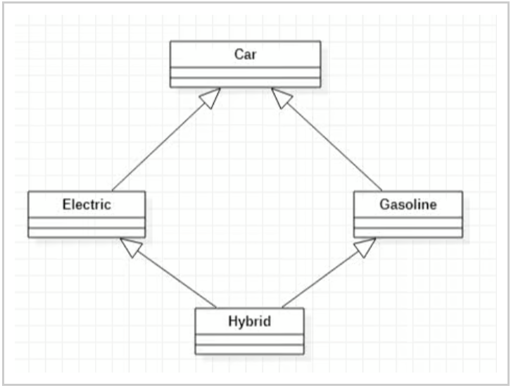

# Inheritance

## Contents

 - [Intro to Inheritance](#intro-to-inheritance)
 - [Why and when to use inheritance?](#why-when)
 - [Modes of Inheritance (Public, Private, Protected)](#modes-of-inheritance)
 - **Types of Inheritance:**
   - [Single Inheritance](#single-inheritance)
   - [Multiple Inheritance](#multiple-inheritance)
   - [Multilevel Inheritance](#multilevel-inheritance)
   - [Hierarchical Inheritance](#hierarchical-inheritance)
   - [Hybrid (Virtual) Inheritance](#hybrid-inheritance)
 - **Tips & Tricks:**
   - [The Diamond Problem](#diamond-problem)

---

<div id="intro-to-inheritance"></div>

## Intro to Inheritance

 - The capability of a *class* to **derive properties** and **characteristics** from another class is called `Inheritance`.
 - Inheritance is a feature or a process in which, new classes are created from the existing classes.
 - **Base class (parent class) vs. Derived class (child class):**
   - The existing class is known as the **“base class”** or **“parent class”**.
   - The new class created is called **“derived class”** or **“child class”**:
     - The derived class now is said to be **inherited** from the **base class**.
     - A **derived class doesn’t inherit access to private data members**. However, it does inherit a full parent object, which contains any private members which that class declares.
 - **Super Class vs. Sub Class:**
   - **Super Class:** The class whose properties are inherited by a subclass is called **Base Class** or **Superclass**.
   - **Sub Class:** The class that inherits properties from another class is called **Subclass** or **Derived Class**.

---

<div id="why-when"></div>

## Why and when to use inheritance?

To understand **"Why"** and **"When"** to use `inheritance`, consider a group of **vehicles**, you need to create classes for:

 - Bus
 - Car
 - Truck

The methods:

 - fuelAmount()
 - capacity()
 - applyBrakes()

**NOTE:**  
If we create these classes avoiding `inheritance` then we have to write all of these functions in each of the three classes as shown below figure:

  

> **NOTE:**  
> - You can clearly see that the above process results in duplication of the same code 3 times.
> - This increases the chances of error and data redundancy.

**To avoid this type of situation, inheritance is used:**  
If we create a **class Vehicle** and write these three functions in it and inherit the rest of the classes from the vehicle class, then we can simply avoid the duplication of data and increase re-usability.

For example, look at the below diagram in which the three classes are inherited from vehicle class:

  

Using inheritance, we have to write the functions only one time instead of three times as we have inherited the rest of the three classes from the base class (Vehicle).

For example, see the codes below:

[vehicle.h](src/vehicle.h)
```cpp
#ifndef VEHICLE_CPP
#define VEHICLE_CPP

class Vehicle
{
public:
    void fuelAmount();
    void capacity();
    void applyBrakes();
};

#endif
```

[vehicle.cpp](src/vehicle.cpp)
```cpp
#include <iostream>
#include "vehicle.h"

void Vehicle::fuelAmount()
{
    std::cout << "Vehicle 'fuelAmount' method called."
              << "\n";
}

void Vehicle::capacity()
{
    std::cout << "Vehicle 'capacity' method called."
              << "\n";
}

void Vehicle::applyBrakes()
{
    std::cout << "Vehicle 'applyBrakes' method called."
              << "\n";
}
```

[bus.h](src/bus.h)
```cpp
#include "vehicle.h"

class Bus : public Vehicle
{
    // Codes...
};
```

[car.h](src/car.h)
```cpp
#include "vehicle.h"

class Car : public Vehicle
{
    // Codes...
};
```

[truck.h](src/truck.h)
```cpp
#include "vehicle.h"

class Truck : public Vehicle
{
    // Codes...
};
```

[driver_vehicle.cpp](src/driver_vehicle.cpp)
```cpp
#include <iostream>
#include "bus.h"
#include "car.h"
#include "truck.h"

int main()
{
    Bus bus;
    std::cout << "'Bus' object examples:"
              << "\n";
    bus.fuelAmount();
    bus.capacity();
    bus.applyBrakes();

    Car car;
    std::cout << "\n'Car' object examples:"
              << "\n";
    car.fuelAmount();
    car.capacity();
    car.applyBrakes();

    Truck truck;
    std::cout << "'\nTruck' object examples:"
              << "\n";
    truck.fuelAmount();
    truck.capacity();
    truck.applyBrakes();

    return 0;
}
```

**COMPILATION AND RUN:**
```cpp
g++ vehicle.cpp driver_vehicle.cpp -o test.out && ./test.out
```

**OUTPUT:**  
```cpp
'Bus' object examples:
Vehicle 'fuelAmount' method called.
Vehicle 'capacity' method called.
Vehicle 'applyBrakes' method called.

'Car' object examples:
Vehicle 'fuelAmount' method called.
Vehicle 'capacity' method called.
Vehicle 'applyBrakes' method called.
'
Truck' object examples:
Vehicle 'fuelAmount' method called.
Vehicle 'capacity' method called.
Vehicle 'applyBrakes' method called.
```

---

<div id="modes-of-inheritance"></div>

## Modes of Inheritance (Public, Private, Protected)

There are 3 modes of inheritance:

 - **Public Mode:**
   - If we derive a subclass from a public base class:
     - Then the public member of the base class will become (se tornará) public in the derived class.
     - And protected members of the base class will become (se tornará) protected in the derived class.
     - *The private members in the base class cannot be directly accessed in the derived class.*
 - **Private Mode:**
   - If we derive a subclass from a Private base class:
     - Then both public members and protected members of the base class will become (se tornará) Private in the derived class.
     - *The private members in the base class cannot be directly accessed in the derived class.*
 - **Protected Mode:**
   - If we derive a subclass from a Protected base class:
     - Then both public members and protected members of the base class will become (se tornará) protected in the derived class.
     - *The private members in the base class cannot be directly accessed in the derived class.*

> **NOTE:**  
> - The private members in the base class cannot be directly accessed in the derived class.
> - While protected members can be directly accessed.

See the code below to understand more easily:

```cpp
class A {
public:
    int x;

private:
    int y;

protected:
    int z;
};

class B : public A {
    // x is public
    // y is not accessible from B
    // z is protected
};

class C : private A // 'private' is default for classes
{
    // x is private
    // y is not accessible from C
    // z is private
};

class D : protected A {
    // x is protected
    // y is not accessible from D
    // z is protected
};
```

The below table summarizes the above three modes and shows the access specifier of the members of the **base class** in the **subclass** when derived in **public**, **private** and **protected** modes:

  

---

<div id="single-inheritance"></div>

## Single Inheritance

> In **Single Inheritance**, a class is allowed to inherit from only one class. i.e. one *subclass* is inherited by one *base class* only.

  

For example, see the codes below:

[single_inheritance_vehicle.h](src/single_inheritance_vehicle.h)
```cpp
class Vehicle
{
public:
    Vehicle(); // Constructor prototype.
};
```

[single_inheritance_vehicle.cpp](src/single_inheritance_vehicle.cpp)
```cpp
#include <iostream>
#include "single_inheritance_vehicle.h"

// Constructor implementation.
Vehicle::Vehicle()
{
    std::cout << "This is a Vehicle\n";
}
```

[single_inheritance_car.h](src/single_inheritance_car.h)
```cpp
#include "single_inheritance_vehicle.h"

class Car : public Vehicle
{
    // Codes...
};
```

[driver_single_inheritance.cpp](src/driver_single_inheritance.cpp)
```cpp
#include "single_inheritance_car.h"

int main()
{
    Car obj;

    return 0;
}
```

**COMPILATION AND RUN:**
```cpp
g++ single_inheritance_vehicle.cpp drive_single_inheritance.cpp -o test.out && ./test.out
```

**OUTPUT:**  
```cpp
This is a Vehicle
```

---

<div id="multiple-inheritance"></div>

## Multiple Inheritance

> **Multiple Inheritance** is a feature of C++ where a class can inherit from more than one class. i.e one *subclass* is inherited from more than one *base class*.

  

For example, see the codes below:

[multiple_inheritance_vehicle.h](src/multiple_inheritance_vehicle.h)
```cpp
class Vehicle
{
public:
    Vehicle();
};
```

[multiple_inheritance_vehicle.cpp](src/multiple_inheritance_vehicle.cpp)
```cpp
#include <iostream>
#include "multiple_inheritance_vehicle.h"

Vehicle::Vehicle()
{
    std::cout << "This is a Vehicle\n";
}
```

[multiple_inheritance_fourwheeler.h](src/multiple_inheritance_fourwheeler.h)
```cpp
class FourWheeler
{
public:
    FourWheeler();
};
```

[multiple_inheritance_fourwheeler.cpp](src/multiple_inheritance_fourwheeler.cpp)
```cpp
#include <iostream>
#include "multiple_inheritance_fourwheeler.h"

FourWheeler::FourWheeler()
{
    std::cout << "This is a 4 Wheeler Vehicle\n";
}
```

[multiple_inheritance_car.h](src/multiple_inheritance_car.h)
```cpp
#include "multiple_inheritance_vehicle.h"
#include "multiple_inheritance_fourwheeler.h"

class Car : public Vehicle, public FourWheeler
{
    // Codes...
};
```

[driver_multiple_inheritance.cpp](src/driver_multiple_inheritance.cpp)
```cpp
#include "multiple_inheritance_car.h"

int main()
{
    Car obj;

    return 0;
}
```

**COMPILATION AND RUN:**
```cpp
g++ multiple_inheritance_vehicle.cpp multiple_inheritance_fourwheeler.cpp driver_multiple_inheritance.cpp -o test.out && ./test.out
```

**OUTPUT:**  
```cpp
This is a Vehicle
This is a 4 Wheeler Vehicle
```

---

<div id="multilevel-inheritance"></div>

## Multilevel Inheritance

>  In this type of **inheritance**, a *derived class* is created from another *derived class*.

  

For example, see the codes below:

[multilevel_inheritance_vehicle.h](src/multilevel_inheritance_vehicle.h)
```cpp
class Vehicle
{
public:
    Vehicle();
};
```

[multilevel_inheritance_vehicle.cpp](src/multilevel_inheritance_vehicle.cpp)
```cpp
#include <iostream>
#include "multilevel_inheritance_vehicle.h"

Vehicle::Vehicle()
{
    std::cout << "This is a Vehicle\n";
}
```

[multilevel_inheritance_fourwheeler.h](src/multilevel_inheritance_fourwheeler.h)
```cpp
#include "multilevel_inheritance_vehicle.h"

class fourWheeler : public Vehicle
{
public:
    fourWheeler();
};
```

[multilevel_inheritance_fourwheeler.cpp](src/multilevel_inheritance_fourwheeler.cpp)
```cpp
#include <iostream>
#include "multilevel_inheritance_fourwheeler.h"

fourWheeler::fourWheeler()
{
    std::cout << "Objects with 4 wheels are vehicles\n";
}
```

[multilevel_inheritance_car.h](src/multilevel_inheritance_car.h)
```cpp
#include "multilevel_inheritance_fourwheeler.h"

class Car : public fourWheeler
{
public:
    Car();
};
```

[multilevel_inheritance_car.cpp](src/multilevel_inheritance_car.cpp)
```cpp
#include <iostream>
#include "multilevel_inheritance_car.h"

Car::Car()
{
    std::cout << "Car has 4 Wheels\n";
}
```

[driver_multilevel_inheritance.cpp](src/driver_multilevel_inheritance.cpp)
```cpp
#include "multilevel_inheritance_car.h"

int main()
{
    Car obj;

    return 0;
}
```

**COMPILATION AND RUN:**
```cpp
g++ multilevel_inheritance_vehicle.cpp  multilevel_inheritance_fourwheeler.cpp multilevel_inheritance_car.cpp driver_multilevel_inheritance.cpp -o test.out && ./test.out
```

**OUTPUT:**  
```cpp
This is a Vehicle
Objects with 4 wheels are vehicles
Car has 4 Wheels
```

---

<div id="hierarchical-inheritance"></div>

## Hierarchical Inheritance

> In this type of **inheritance**, more than one *subclass* is inherited from a *single base class*. i.e. more than one *derived class* is created from a *single base class*.

  
  

For example, see the codes below:

[hierarchical_inheritance_vehicle.h](src/hierarchical_inheritance_vehicle.h)
```cpp
#ifndef VEHICLE_CPP
#define VEHICLE_CPP

class Vehicle
{
public:
    Vehicle();
};

#endif
```

[hierarchical_inheritance_vehicle.cpp](src/hierarchical_inheritance_vehicle.cpp)
```cpp
#include <iostream>
#include "hierarchical_inheritance_vehicle.h"

Vehicle::Vehicle()
{
    std::cout << "This is a Vehicle\n";
}
```

[hierarchical_inheritance_car.h](src/hierarchical_inheritance_car.h)
```cpp
#include "hierarchical_inheritance_vehicle.h"

class Car : public Vehicle
{
    // Codes...
};
```

[hierarchical_inheritance_bus.h](src/hierarchical_inheritance_bus.h)
```cpp
#include "hierarchical_inheritance_vehicle.h"

class Bus : public Vehicle
{
    // Codes...
};
```

[driver_hierarchical_inheritance.cpp](src/driver_hierarchical_inheritance.cpp)
```cpp
#include "hierarchical_inheritance_car.h"
#include "hierarchical_inheritance_bus.h"

int main()
{
    Car obj1;
    Bus obj2;

    return 0;
}
```

**COMPILATION AND RUN:**
```cpp
g++ hierarchical_inheritance_vehicle.cpp driver_hierarchical_inheritance.cpp -o test.out && ./test.out
```

**OUTPUT:**  
```cpp
This is a Vehicle
This is a Vehicle
```

---

<div id="hybrid-inheritance"></div>

## Hybrid (Virtual) Inheritance

> **Hybrid (Virtual) Inheritance** is implemented by combining more than one type of *inheritance*. i.e. combining Hierarchical inheritance and Multiple Inheritance.

The below image shows the combination of **Hierarchical** and **Multiple Inheritances**:

  

---

<div id="diamond-problem"></div>

## The Diamond Problem

> The **Diamond Problem** occurs when two *superclasses* of a *derived class* have a common base class.

For example, consider the example of a Car:

  

Both **Electric** and **Gasoline** cars inherit the properties of a *Car class*.

Now, there is a special case if there is another class – a **Hybrid class**, for example – that inherits both the *Electric* and *Gasoline class*. We can see in the diagram that it will form a diamond:

  

**The hybrid car is both an *Electric car* and a *gasoline car*:**  
These kinds of special cases will result in a **Diamond Problem**.

To understand see the codes below:

[diamond_problem_car.h](src/diamond_problem_car.h)
```cpp
#ifndef CAR_CPP
#define CAR_CPP

class Car
{
public:
    Car();
};

#endif
```

[diamond_problem_car.cpp](src/diamond_problem_car.cpp)
```cpp
#include <iostream>
#include "diamond_problem_car.h"

Car::Car()
{
    std::cout << "Car Constructor\n";
}
```

[diamond_problem_electric.h](src/diamond_problem_electric.h)
```cpp
#include "diamond_problem_car.h"

class Electric : public Car
{
public:
    Electric();
};
```

[diamond_problem_electric.cpp](src/diamond_problem_electric.cpp)
```cpp
#include <iostream>
#include "diamond_problem_electric.h"

Electric::Electric()
{
    std::cout << "Electric Constructor\n";
}
```

[diamond_problem_gasoline.h](src/diamond_problem_gasoline.h)
```cpp
#include "diamond_problem_car.h"

class Gasoline : public Car
{
public:
    Gasoline();
};
```

[diamond_problem_gasoline.cpp](src/diamond_problem_gasoline.cpp)
```cpp
#include <iostream>
#include "diamond_problem_gasoline.h"

Gasoline::Gasoline()
{
    std::cout << "Gasoline Constructor\n";
}
```

[diamond_problem_hybrid.h](src/diamond_problem_hybrid.h)
```cpp
#include "diamond_problem_electric.h"
#include "diamond_problem_gasoline.h"

class Hybrid : public Electric, public Gasoline
{
public:
    Hybrid();
};
```

[diamond_problem_hybrid.cpp](src/diamond_problem_hybrid.cpp)
```cpp
#include <iostream>
#include "diamond_problem_hybrid.h"

Hybrid::Hybrid()
{
    std::cout << "Hybrid Constructor\n";
}
```

[driver_diamond_problem.cpp](src/driver_diamond_problem.cpp)
```cpp
#include "diamond_problem_hybrid.h"

int main()
{
    Hybrid h;

    return 0;
}
```

**COMPILATION AND RUN:**
```cpp
g++ diamond_problem_car.cpp diamond_problem_electric.cpp diamond_problem_gasoline.cpp diamond_problem_hybrid.cpp driver_diamond_problem.cpp -o test.out && ./test.out
```

**OUTPUT:**  
```cpp
Car Constructor
Electric Constructor
Car Constructor
Gasoline Constructor
Hybrid Constructor
```

 - If you make a Hybrid class object in the main, you see that the *Car Constructor is called two times*:
   - This is because of the *diamond problem*.
   - The Hybrid class object has two copies of the Car class for each of its parents, respectively:
     - Electric object call the Car constructor.
     - And Gasoline object call the Car constructor.

**NOTE:**  
This might not appear to be a big issue. For larger programs, however, in which the grandparent also contains tens of classes above it, the overhead of this duplication is tremendous.

> **So, how can this problem be solved?**  
> The above problem can be solved by writing the keyword **virtual**.

**When we use *virtual inheritance*, we are guaranteed to get only a single instance of the common base class:**  
In other words, the hybrid class will have only a single instance of the car class, shared by both the Electric and Gasoline classes. By having a single instance of car, we’ve resolved the problem.

We will make both the Electric and Gasoline classes into virtual base classes:

[diamond_problem_electric.h](src/diamond_problem_electric.h)
```cpp
#include "diamond_problem_car.h"

class Electric : virtual public Car
{
public:
    Electric();
};
```

[diamond_problem_gasoline.h](src/diamond_problem_gasoline.h)
```cpp
#include "diamond_problem_car.h"

class Gasoline : virtual public Car
{
public:
    Gasoline();
};
```

**COMPILATION AND RUN:**
```cpp
g++ diamond_problem_car.cpp diamond_problem_electric.cpp diamond_problem_gasoline.cpp diamond_problem_hybrid.cpp driver_diamond_problem.cpp -o test.out && ./test.out
```

**OUTPUT:**  
```cpp
Car Constructor
Electric Constructor
Gasoline Constructor
Hybrid Constructor
```

**NOTE:**  
After updating the code, we can see that the *hybrid object* only contains one *Car class* copy.

---

[Inheritance in C++](https://www.geeksforgeeks.org/inheritance-in-c/)  
[What is a diamond problem in Object-Oriented Programming?](https://www.educative.io/answers/what-is-a-diamond-problem-in-object-oriented-programming)  

---

Ro**drigo** **L**eite da **S**ilva - **drigols**
