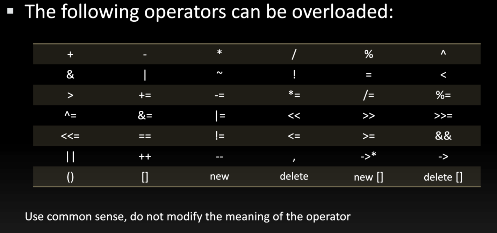

# Polymorphism

## Contents

 - [Intro to Polymorphism](#intro-to-polymorphism)
 - **Compile-Time Polymorphism:**
   - [Function Overloading](#function-overloading)
   - [Operator Overloading](#operator-overloading)
     - [Operator Overloading: Tips and Tricks](#operator-overloading-tips)
 - **Runtime Polymorphism:**
   - [Function Overriding](#function-overriding)
     - [Access Overridden Function in C++](#aof)
   - [Virtual Function](#virtual-function)
     - [Override Identifier](#override-identifier)
     - [Virtual Function Demonstration (Animal example)](#vfd)

---

<div id="intro-to-polymorphism"></div>

## Intro to Polymorphism

> The word **“polymorphism”** means `having many forms`. In simple words, we can define polymorphism as the ability of a message to be *displayed in more than one* form. 

A real-life example of polymorphism is a **person** who at the same time can have different characteristics:

 - A man at the same time is a father;
 - A husband;
 - And an employee...

So the same person exhibits different behavior in different situations. This is called polymorphism. Polymorphism is considered one of the important features of **Object-Oriented Programming**.

There are two types of **Polymorphism** in C++:

  

---

<div id="function-overloading"></div>

## Function Overloading

> When there are multiple functions with the same name but *different parameters (or different primitive types)*, then the functions are said to be *overloaded*, hence this is known as **Function Overloading**.

Functions can be overloaded by changing the number of arguments or/and changing the type of arguments. In simple terms, it is a feature of object-oriented programming providing many functions to have the same name but distinct parameters when numerous tasks are listed under one function name.

For example, below is the C++ program to show **Function Overloading (or Compile-Time polymorphism)**:

[function_overloading_calculator.h](src/function_overloading_calculator.h)
```cpp
class Calculator
{
public:
    int add(int x, int y);
    int add(int x, int y, int z);
    int add(int x, int y, int z, int w);
};
```

[function_overloading_calculator.cpp](src/function_overloading_calculator.cpp)
```cpp
#include "function_overloading_calculator.h"

int Calculator::add(int x, int y)
{
    return x + y;
}

int Calculator::add(int x, int y, int z)
{
    return x + y + z;
}

int Calculator::add(int x, int y, int z, int w)
{
    return x + y + z + w;
}
```

[driver_function_overloading.cpp](src/driver_function_overloading.cpp)
```cpp
#include <iostream>
#include "function_overloading_calculator.h"

int main()
{
    int x = 10;
    int y = 20;
    int z = 30;
    int w = 40;

    Calculator calc;

    std::cout << "x + y: " << calc.add(x, y);
    std::cout << "\nx + y + z: " << calc.add(x, y, z);
    std::cout << "\nx + y + z + w: " << calc.add(x, y, z, w);

    return 0;
}
```

**COMPILATION AND RUN:**
```cpp
g++ function_overloading_calculator.cpp driver_function_overloading.cpp -o test.out && ./test.out
```

**OUTPUT:**  
```cpp
x + y: 30
x + y + z: 60
x + y + z + w: 100
```

**NOTE:**  
See that we have multiple functions with the same name but different parameters. That is, **Function Overloading (or Compile-Time polymorphism)**.

---

<div id="operator-overloading"></div>

## Operator Overloading

To understand **Operator Overloading** imagine we need to sum hours, like it:

[sum_hours.cpp](src/sum_hours.cpp)
```cpp
#include <iostream>

int main()
{
    int time1 = 10;
    int time2 = 10;
    int total_hours;

    total_hours = time1 + time2;
    std::cout << "The total hours is: " << total_hours;

    return 0;
}
```

**COMPILATION AND RUN:**
```cpp
g++ sum_hours.cpp -o test.out && ./test.out
```

**OUTPUT:**  
```cpp
The total hours is: 20
```

**Ok, that's normal for us:**  
Now, imagine we have a class (Time) that receive hours and we need sum all hours of two objects and save in another object (third object), like it:

[time.h](src/time.h)
```cpp
class Time
{
public:
    int hours;

    Time(int hours = 0); // Constructor prototype.
    void showHours();
};
```

[time.cpp](src/time.cpp)
```cpp
#include <iostream>
#include "time.h"

Time::Time(int hours)
{
    this->hours = hours;
};

void Time::showHours()
{
    std::cout << "Object hours is: " << this->hours << "\n";
}
```

[driver_time.cpp](src/driver_time.cpp)
```cpp
#include "time.h"

int main()
{
    Time obj1{10};
    Time obj2{20};
    Time obj3;

    obj3 = obj1 + obj2;

    return 0;
}
```

**COMPILATION AND RUN:**
```cpp
g++ time.cpp driver_time.cpp -o test.out && ./test.out
```

**OUTPUT:**  
```cpp
driver_time.cpp: In function 'int main()':
driver_time.cpp:9:17: error: no match for 'operator+' (operand types are 'Time' and 'Time')
     obj3 = obj1 + obj2;
            ~~~~~^~~~~~
```

> **NOTE:**  
> See that we cannot use the **"operator +"** to sum two object value hours and save in another object.

To solve that we can create a method to sum hours and return the sum of all hours between two objects:

[time.h](src/time.h)
```cpp
class Time
{
public:
    //
    Time sum(const Time &t) const; // Method of type "Time", that's retorn a Time object.
    //
};
```

[time.cpp](src/time.cpp)
```cpp

// Codes...

// Method of type "Time", that's retorn a Time object.
Time Time::sum(const Time & t) const
{
    Time time_obj;
    time_obj.hours = this->hours + t.hours;

    return time_obj;
}

// Codes...

```

[driver_time.cpp](src/driver_time.cpp)
```cpp
#include "time.h"

int main()
{
    Time obj1{10};
    Time obj2{20};
    Time obj3;

    obj3 = obj1.sum(obj2);
    obj3.showHours();

    return 0;
}
```

**COMPILATION AND RUN:**
```cpp
g++ time.cpp driver_time.cpp -o test.out && ./test.out
```

**OUTPUT:**  
```cpp
Object hours is: 30
```

**Nice, we solve the problem!**  
Now, imagine we would like working with objects like primitive data types, like it:

```cpp
obj3 = obj1 + obj2;
```

> **How solve that?**  
> Using `Operator Overloading`

To understand how **Operator Overloading** works, let's modify our method **sum()** to **"+"**, yes **"+"**. However, we need to add the keyword **"operator"** before **"+"**, like it:

[time.h](src/time.h)
```cpp

// Codes..

Time operator+(const Time &t) const; // Method of type "Time", that's retorn a Time object.

// Codes..

```

[time.cpp](src/time.cpp)
```cpp

// Codes..

// Method of type "Time", that's retorn a Time object.
Time Time::operator+(const Time & t) const
{
    Time time_obj;
    time_obj.hours = this->hours + t.hours;

    return time_obj;
}

// Codes..

```

[driver_time.cpp](src/driver_time.cpp)
```cpp

// Codes..

obj3 = obj1.operator+(obj2);
obj3.showHours();

// Codes..

```

**COMPILATION AND RUN:**
```cpp
g++ time.cpp driver_time.cpp -o test.out && ./test.out
```

**OUTPUT:**  
```cpp
Object hours is: 30
```

> Ok, we changed the method **"sum()"** to **"operator+"**, but what changed?

Try now using the following approach:

[driver_time.cpp](src/driver_time.cpp)
```cpp

// Codes..

obj3 = obj1 + (obj2);
obj3.showHours();

// Codes..

```

**COMPILATION AND RUN:**
```cpp
g++ time.cpp driver_time.cpp -o test.out && ./test.out
```

**OUTPUT:**  
```cpp
Object hours is: 30
```

> **What?**  
> - Yes, we **Overloading** our **"+" operator**:
>   - Internally, the compiler converts the **"+" operator** to a *function call*.
> - That's, now our **"+" operator** have many forms (Polymorphism).

<div id="operator-overloading-tips"></div>

### Operator Overloading: Tips and Tricks

Now, let's see some Tips and Tricks for **Operator Overloading**:

 - Functions also can Overloading an Operator:
   - Here, we working with class methods, but function also can Overloading an Operator.
 - The first operand always will be an object:
   - t = a + b; // OK
   - t = a + 2; // OK
   - t = 2 + a; // ERROR!
 - You can only overwrite (overloading) existing operators​.

  
  

---

<div id="function-overriding"></div>

## Function Overriding

 - Suppose, the same function is defined in both the **derived class** and the **based class** *(For example, print() function)*.
 - Now if we call this function using the object of the *derived class*, *the function of the derived class is executed*.
 - This is known as **Function Overriding** in C++:
   - The function in derived class overrides the function in base class.

For example, see the codes below:

[base.h](src/base.h)
```cpp
class Base
{
public:
    void print();
};
```

[base.cpp](src/base.cpp)
```cpp
#include <iostream>
#include "base.h"

void Base::print()
{
    std::cout << "Base function called\n";
}
```

[derived.h](src/derived.h)
```cpp
#include "base.h"

class Derived : public Base
{
public:
    void print();
};
```

[derived.cpp](src/derived.cpp)
```cpp
#include <iostream>
#include "derived.h"

void Derived::print()
{
    std::cout << "Derived function called\n";
}
```

[driver_function_overriding.cpp](src/driver_function_overriding.cpp)
```cpp
#include "derived.h"

int main()
{
    Derived derived_obj;
    derived_obj.print();

    return 0;
}
```

**COMPILATION AND RUN:**
```cpp
g++ base.cpp derived.cpp driver_function_overriding.cpp -o test.out && ./test.out
```

**OUTPUT:**  
```cpp
Derived function called
```

**Here, the same function print() is defined in both *Base* and *Derived classes*.**  
So, when we call **print()** from the Derived *object derived_obj*, the **print()** from Derived is executed by overriding the function in *Base class*.

> **NOTE:**  
> If we called the **print()** function from an object of the *Base class*, the function would not have been overridden.

For example, see the codes below:

[driver_base.cpp](src/driver_base.cpp)
```cpp
#include "base.h"

int main()
{
    Base base_obj;
    base_obj.print();

    return 0;
}
```

**COMPILATION AND RUN:**
```cpp
g++ base.cpp driver_base.cpp -o test.out && ./test.out
```

**OUTPUT:**  
```cpp
Base function called
```

<div id="aof"></div>

### Access Overridden Function in C++

> To access the overridden function of the base class, we use the `"scope resolution operator ::"`.

Now, let's access the print() method in *Base class* from *Derived class* using `"scope resolution operator ::"`:

[driver_access_overridden_function.cpp](src/driver_access_overridden_function.cpp)
```cpp
#include "derived.h"

int main()
{
    Derived derived_obj;
    derived_obj.print();       // Access print() method in derived class.

    derived_obj.Base::print(); // Access print() method in base class.

    return 0;
}
```

**COMPILATION AND RUN:**
```cpp
g++ base.cpp derived.cpp driver_access_overridden_function.cpp -o test.out && ./test.out
```

**OUTPUT:**  
```cpp
Derived function called
Base function called
```

---

<div id="virtual-function"></div>

## Virtual Function

 - In C++, we may not be able to override functions if we use *a pointer of the base class* to *point to an object of the derived class*:
   - Using virtual functions in the base class ensures that the function can be overridden in these cases.
 - A **Virtual Function** is a member function in the *base class* that we expect (esperamos) to redefine in *derived classes*.
 - Basically, a **Virtual Function** is used in the *base class* `in order to ensure that the function is overridden (para garantir que a função seja substituída)`.
 - This especially applies to cases where a pointer of base class points to an object of a derived class.

For example, consider the code below:

[virtual_function-v1.cpp](src/virtual_function-v1.cpp)
```cpp
#include <iostream>

class Base
{
public:
    void print()
    {
        std::cout << "Base function called\n";
    }
};

class Derived : public Base
{
public:
    void print()
    {
        std::cout << "Derived function called\n";
    }
};

int main()
{
    Derived derived_obj;
    Base *base_obj_pointer = &derived_obj;

    base_obj_pointer->print();

    return 0;
}
```

**COMPILATION AND RUN:**
```cpp
g++ virtual_function-v1.cpp -o test.out && ./test.out
```

**OUTPUT:**  
```cpp
Base function called
```

 - See that we have a pointer Base *"base_obj_pointer"* point to a derived object (derived_obj):
   - That's, we should (deveríamos) have the memory address of the derived object (derived_obj) in the pointer *"base_obj_pointer"*.
 - However, we have a problem here:
   - When we call the **print()** method in *"base_obj_pointer"* pointer him call the **print()** method in the Base class, not in the derived class.
   - And how the pointer has the memory address to derived class should (deveria) call the **print()** method in the derived class. However, him call the **print()** method in the Base class.

> **Ok, but how solve that?**

**NOTE:**  
In order to avoid this (para evitar isso), we declare the **print()** method of the *Base class* as **virtual** by using the **virtual** keyword. For example, see the codes below:

[virtual_function-v2.cpp](src/virtual_function-v2.cpp)
```cpp
#include <iostream>

class Base
{
public:
    virtual void print()
    {
        std::cout << "Base function called\n";
    }
};

class Derived : public Base
{
public:
    void print()
    {
        std::cout << "Derived function called\n";
    }
};

int main()
{
    Derived derived_obj;
    Base *base_obj_pointer = &derived_obj;

    base_obj_pointer->print();

    return 0;
}
```

**COMPILATION AND RUN:**
```cpp
g++ virtual_function-v2.cpp -o test.out && ./test.out
```

**OUTPUT:**  
```cpp
Derived function called
```

> **Here, we have declared the print() method of Base class as virtual.**  
> So, this method is overridden even when we use a pointer of Base type that points to the Derived object "derived_obj".

  

<div id="override-identifier"></div>

### Override Identifier

> C++ 11 has given us a new identifier **override** that is very useful to avoid bugs while using virtual functions.

**NOTE:**  
This identifier specifies the member functions of the derived classes that override the member function of the base class.

For example, see the codes below:

```cpp
class Base {
public:
    virtual void print() {
        // code
    }
};

class Derived : public Base {
public:
    void print() override {
        // code
    }
};
```

If we use a function prototype in Derived class and define that function outside of the class, then we use the following code:

```cpp
class Derived : public Base {
public:
    // function prototype
    void print() override;
};

// function definition
void Derived::print() {
    // code
}
```

<div id="vfd"></div>

### Virtual Function Demonstration (Animal example)

Imagine we have the following situation:

 - A base class **Animal**;
 - Derived classes **Dog** and **Cat**;
 - Each *class (Animal, Dog, Cat)* has a data member named **type**:
   - Suppose these variables are initialized through their respective *constructors*.
 - Our program requires us to create two public functions for each class:
   - **getType():** To return the value of type (type of animal).
   - **print():** To print the value of type (type of animal).
   - We could create both these functions in each class separately and override them, which will be long and tedious.
   - Or we could make **getType()** virtual in the Animal class, then create a single, separate print() function that accepts a pointer of Animal type as its argument.

See the codes below how was our program:

[animal.h](src/animal.h)
```cpp
#ifndef ANIMAL_CPP
#define ANIMAL_CPP

#include <iostream>

class Animal
{
private:
    std::string type;

public:
    // Constructor to initialize type
    Animal();

    // Declare virtual function
    virtual std::string getType();
};

#endif
```

[animal.cpp](src/animal.cpp)
```cpp
#include "animal.h"

// Constructor implementation.
Animal::Animal()
{
    type = "Animal";
}

std::string Animal::getType()
{
    return this->type;
}
```

[dog.h](src/dog.h)
```cpp
#include "animal.h"

class Dog : public Animal
{
private:
    std::string type;

public:
    // Constructor to initialize type
    Dog();

    // Override getType() method.
    std::string getType() override;
};
```

[dog.cpp](src/dog.cpp)
```cpp
#include "dog.h"

// Constructor implementation.
Dog::Dog()
{
    type = "Dog";
}

// Override getType() method.
std::string Dog::getType()
{
    return type;
}
```

[cat.h](src/cat.h)
```cpp
#include "animal.h"

class Cat : public Animal
{
private:
    std::string type;

public:
    // Constructor to initialize type
    Cat();

    // Override getType() method.
    std::string getType() override;
};
```

[cat.cpp](src/cat.cpp)
```cpp
#include "cat.h"

// Constructor implementation.
Cat::Cat()
{
    type = "Cat";
}

// Override getType() method.
std::string Cat::getType()
{
    return type;
}
```

[print.h](src/print.h)
```cpp
#include "animal.h"

void print_type(Animal* ani);
```

[print.cpp](src/print.cpp)
```cpp
#include <iostream>
#include "print.h"

void print_type(Animal* ani) {
    std::cout << "Animal: " << ani->getType() << "\n";
}
```

[driver_virtual_function.cpp](src/driver_virtual_function.cpp)
```cpp
#include <iostream>

#include "animal.h"
#include "dog.h"
#include "cat.h"
#include "print.h"

int main()
{
    Animal *animal_obj = new Animal();
    Animal *dog_obj = new Dog();
    Animal *cat_obj = new Cat();

    print_type(animal_obj);
    print_type(dog_obj);
    print_type(cat_obj);

    return 0;
}
```

```

**COMPILATION AND RUN:**
```cpp
g++ animal.cpp dog.cpp cat.cpp print.cpp driver_virtual_function.cpp -o test.out && ./test.out
```

**OUTPUT:**  
```cpp
Animal: Animal
Animal: Dog
Animal: Cat
```

> **NOTE:**  
Here, we have used the **virtual function getType()** and an Animal pointer **"ani"** in order to avoid repeating the **print()** function in every class:

[animal.h](src/animal.h)
```cpp

// Codes...

// Declare virtual function
virtual std::string getType();

// Codes...

```

[print.cpp](src/print.cpp)
```cpp

// Codes...

void print_type(Animal* ani) {
    std::cout << "Animal: " << ani->getType() << "\n";
}

// Codes...

```

In main(), we have created **3 Animal pointers** to *dynamically (new)* create objects of **Animal**, **Dog** and **Cat** classes:

[driver_virtual_function.cpp](src/driver_virtual_function.cpp)
```cpp

// Codes...

Animal *animal_obj = new Animal();
Animal *dog_obj = new Dog();
Animal *cat_obj = new Cat();

// Codes...

```

> **NOTE:**  
> See that here we have ***Polymorphism - That is, many forms***.

 - When **print_type(animal_obj)** is called, the pointer points to an **Animal object**. So, the virtual function in *Animal* class is executed inside (dentro) of **print()**.
 - When **print_type(dog_obj)** is called, the pointer points to a **Dog object**. So, the virtual function is overridden and the function of *Dog* is executed inside (dentro) of **print()**.
 - When **print_type(cat_obj)** is called, the pointer points to a **Cat object**. So, the virtual function is overridden and the function of *Cat* is executed inside (dentro) of **print()**.

---

[C++ Polymorphism](https://www.geeksforgeeks.org/cpp-polymorphism/)  
[Aula 09 - Sobrecarga de Operadores / Curso de C++](https://www.youtube.com/watch?v=_jTEXu_EqaE)  
[C++ Function Overriding](https://www.programiz.com/cpp-programming/function-overriding)  
[C++ Polymorphism](https://www.programiz.com/cpp-programming/polymorphism)  
[C++ Virtual Functions](https://www.programiz.com/cpp-programming/virtual-functions)  

---

Ro**drigo** **L**eite da **S**ilva - **drigols**
